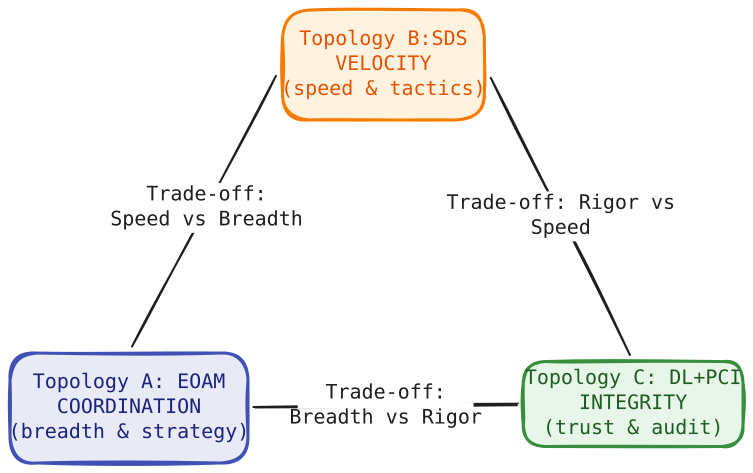

# Frequently Asked Questions (FAQ)

This document addresses common engineering questions and architectural concerns regarding the Decision Intelligence Runtime (DIR) and Responsibility-Oriented Agents (ROA) architecture.

## I. The Problem

### 1. What exactly are "Day Two" problems in the context of AI agents?
"Day One" is when the demo dazzles stakeholders. "Day Two" is production. Three failure classes emerge consistently:
- **Hallucination loops:** The agent receives a rejection (e.g., insufficient funds), interprets it as a signal to try harder, and generates increasingly creative - and dangerous - workarounds, burning tokens with each cycle. (See Q14 for the *Intent Retry Governor*)
- **State drift (TOCTOU):** Time-of-Check to Time-of-Use race conditions. A decision based on data from 10 seconds ago executes on a world that has already moved - stock price, inventory level, account balance. (See Q11 for *JIT State Verification*)
- **Execution chaos:** Without exactly-once semantics, a network timeout causes the same irreversible action - a trade, a payment - to execute twice. (See Q13 for *Idempotency Keys*)
DIR provides the deterministic infrastructure required to prevent all three.

### 2. What is the semantic "Comma Catastrophe", and why is "being careful" insufficient?
An LLM trained on US-formatted data reads "15,500" (Polish locale: 15.5) as fifteen thousand five hundred. It emits a buy order for 15,500 SOL (~\$2.3M) instead of 15.5 SOL (~\$2,300). Instructions like "be careful" in the system prompt are statistically ignored when the model is confident in its misinterpretation. 

DIR protects against this by treating the agent's output as an untrusted **Claim**, not a command. The Policy Proposal hits the DIM, which deterministically checks the proposed value against the `max_order_usd` hard limit in the Responsibility Contract. The transaction is rejected at the Kernel boundary before any external API is touched, converting a potential $2.3M loss into a harmless validation error log.

### 3. How does DIR compare to frameworks like LangChain, CrewAI, or AutoGen?
Complementary, not competing. These frameworks operate in **User Space** - they orchestrate reasoning, chain prompts, and coordinate multiple models. DIR operates in **Kernel Space** - it governs what gets executed.

In the "Boxed Intelligence" pattern, a LangChain or CrewAI workflow is wrapped inside a DIR runtime. The framework loses its direct API keys and can only emit a structured "Policy Proposal." DIR acts as the deterministic gatekeeper: it validates the proposal against business logic, RBAC, and risk limits before any side effect is triggered.

### 4. CQRS, Sagas, idempotency keys - these patterns aren't new. Where is the novelty?
The patterns are indeed standard distributed systems engineering. The novelty lies in their rigorous application to the probabilistic domain of LLMs, which has largely ignored them in favor of direct API access. Treating an LLM output as a direct executable command is the architectural equivalent of granting an untrusted public user process direct write access to a production database. DIR is the "missing middleware" that closes that gap.

## II. What DIR Is (and Isn't)

### 5. How should I use this repository alongside AI coding agents?
Instead of manually writing boilerplate, use this repository as **Context as Code**. Point your AI coding agent (Copilot, Cursor, Devin) at the `docs/` folder or the single-file `DIR-minified.md`. These files serve as a comprehensive "system prompt" that teaches the AI the architectural physics of your system: how to structure a Responsibility Contract, how to generate a valid Idempotency Key, and how to handle Saga compensations. 

In this workflow, the repository is not just a library you import, but a set of architectural constraints you feed to the AI to ensure the code it generates is safe, compliant, and architecturally sound by default.

### 6. Is DIR a library I install, a SaaS product, or an architectural pattern?
It is an architectural pattern - the same category as CQRS, microservices, or the Saga pattern. You do not install it or subscribe to it. The `src/` directory is a **reference implementation**: a minimal Python package demonstrating core interfaces (`DecisionIntegrityModule`, `AgentRegistry`) that you read, adapt, and own entirely. Production deployments use different infrastructure stacks (Kafka vs. RabbitMQ, PostgreSQL vs. Redis, on-prem vs. cloud) and different contract schemas. DIR's minimal core is designed to be adapted, not imported as a dependency. No lock-in; you own every line.

## III. Engineering Concerns

### 7. Is DIR overkill for most agent use cases?
For low-stakes tasks - email categorization, text summarization, basic RAG - yes. The correct threshold is asymmetric consequence: if the worst-case outcome of an unconstrained agent action involves financial loss, regulatory exposure, patient safety risk, or reputational damage that outweighs implementation cost, DIR's overhead is not optional - it is the minimum viable safety layer.

### 8. Won't separating reasoning from execution slow development and time-to-market?
Short-term: slightly. Designing Responsibility Contracts, validation schemas, and execution intents upfront takes more thought than wiring an LLM directly to an API. Long-term: it reduces Mean Time To Recovery significantly. When a production incident occurs, the DFID (DecisionFlow ID) audit trail lets engineers immediately determine whether the failure originated in LLM reasoning (User Space), was correctly blocked at the DIM, or was a network-layer execution issue - without reconstructing intent from free-text logs.

### 9. Can DIR scale in real distributed systems?
DIR is built on the same primitives that underpin cloud-native production systems: event buses, distributed state stores, API gateways, and policy enforcement points. Moving from the reference implementation to production means swapping in-memory queues for Kafka or NATS, and local state for Redis or a distributed SQL store. Those are I/O layer substitutions, not architectural changes. The samples use SQLite to keep the mechanics visible; the state machine transitions, JIT drift checks, and validation pipeline are identical regardless of the persistence backend.

### 10. Do rigid contracts and execution gates limit the creativity and reasoning quality of the LLM?
No - and this distinction is central to the design. DIR enforces a strict separation between **reasoning** and **execution authority**. The agent in User Space retains full creative latitude: it can analyze ambiguous signals, generate novel strategies, and formulate any reasoning chain it sees fit. Nothing in DIR constrains the quality or scope of the model's thinking.

What DIR restricts is exclusively what the system *executes* in the real world. The agent's "mind" is unconstrained; the "hands" are gated by deterministic system physics. A useful analogy: a senior trader at a bank can think whatever strategy they want, but a trade above a certain size requires a second signature. The signing requirement does not impair thinking - it governs action.

Furthermore, adding a second LLM to "evaluate" the first one is not a safe alternative: it adds another probabilistic layer without providing verifiable guarantees. If a probabilistic model validates another probabilistic model, the question remains who validates the validator.

## IV. Core Mechanics

### 11. What is the difference between a Responsibility-Oriented Agent (ROA) and a standard capability-based agent? Why does DIR treat agent output as a "Claim" rather than a command?
A capability-based agent is defined by what tools it can access. An ROA is defined by what it is **accountable for** - a formal Mission and Responsibility Contract specifying its optimization target, authority limits, and escalation conditions.

This distinction drives the execution model. In a Zero Trust architecture, no output from a probabilistic LLM is treated as an executable command. It is a **Claim** - an assertion about what the agent believes should happen. It becomes an executable fact only after the DIM validates it against the contract schema, RBAC rules, and current live state. This also neutralizes prompt injection: even if an attacker hijacks the agent's reasoning, the Claim must still pass deterministic Kernel-Space validation before touching any API.

### 12. What is Just-In-Time (JIT) State Verification, and why is it necessary?
LLM inference takes 5–15 seconds. During that window, real-world state - prices, inventory, balances - can change. JIT State Verification is a direct counter to TOCTOU races. Immediately before executing a side effect, the DIR Kernel re-checks the live state against the snapshot the agent reasoned from, verifying it has not drifted outside the declared `drift_envelope` (e.g., price movement ≤ 2%). If drift is exceeded, the intent is aborted and the agent is notified with a fresh context snapshot - the Kernel does not re-ask the LLM to decide.

### 13. Why is the model's natural language explanation structurally excluded from execution logic?
The execution path reads only rigidly structured JSON fields (`policy_kind`, `params`). The natural language `explain` field is metadata for human auditors only - the Kernel never parses it for commands. This is a defense against **prompt injection**: a hidden instruction embedded by an attacker in the `explain` field cannot influence execution, because that field has no execution authority by design.

### 14. How does DIR guarantee idempotency when the world state is changing?
The Idempotency Key is derived from the intent, not from the world state: `IdempotencyKey = SHA256(DFID + Step_ID + Canonical_Params)`. Excluding context (prices, balances) from the hash is intentional. If the world changes and a retry arrives with the same structural intent, the key is identical and the duplicate execution is suppressed. If the new world state should produce a *different* intent, the agent must generate a new Proposal with a new DFID - not resubmit the old one.

### 15. How does DIR prevent infinite error loops and token burn?
The Intent Retry Governor limits how many times an agent can resubmit a proposal within a single DFID. After a configurable maximum (typically 3), the Runtime terminates the flow with `REASONING_EXHAUSTION` and blocks further execution. The agent cannot self-rescue from a rejection it cannot resolve - it is stopped, and the escalation path defined in the Responsibility Contract takes over.

### 16. How are partial failures handled in multi-step transactions?
DIR uses the **Saga pattern**. When a step fails mid-flow, the Runtime marks the state as `DIRTY` and surfaces a set of deterministic compensation options to the parent agent (`REVERT_STATE`, `ALERT_HUMAN`, `RETRY_STEP`). The agent selects from that pre-defined menu - it does not autonomously invent a recovery strategy. Delegating recovery to the same probabilistic reasoning loop that generated the failure is a recognized failure mode.

## V. Compliance & Topologies

### 17. How does DIR support compliance with the EU AI Act, and what are Proof-Carrying Intents (PCI)?
The EU AI Act requires high-risk AI systems to provide transparent, traceable audit trails that cannot be retroactively altered. Standard application logs fail this: they are text records whose authenticity requires trusting the system administrator. A **Proof-Carrying Intent (PCI)** is a cryptographically signed artifact that binds, in a single hash: the agent's structured intent, the world-state snapshot at decision time, and the Responsibility Contract version that governed the decision.

This binding can be verified **offline**: a regulator takes the PCI artifact and recalculates the hash from independently archived inputs. If the hashes match, compliance at decision time is mathematically proven. No access to the live database, active runtime, or LLM is required.

### 18. How do I choose between the three topologies - EOAM, SDS, and DL+PCI?
Each topology places safety at a different architectural locus:
- **EOAM (Event-Oriented Agent Mesh):** Safety enforced *after* generation by the DIM. Use for complex strategic consensus where multiple specialized agents (Risk, Strategy, Sentiment) must evaluate the same signal in parallel.
- **SDS (Sovereign Decision Stream):** Safety enforced *during* generation via Constrained Decoding - a grammar that makes syntactically invalid outputs structurally impossible. Use for high-frequency tactical automation (fraud detection, algorithmic risk stops) where latency is the primary constraint.
- **DL+PCI (Decision Ledger):** Safety carried *within the artifact* itself via cryptographic proof. Use for regulated environments where offline-verifiable auditability is a legal requirement (finance, healthcare, inter-organizational settlements).

### 19. Is DIR specific to finance, or does it generalize to other domains?
The mechanics are domain-agnostic; only the Responsibility Contract content changes. A medical agent proposes a drug dosage; the DIM validates it against the patient's contraindications and maximum daily limits. An industrial automation agent proposes a turbine speed adjustment; the DIM gates it against hard-coded thermal safety thresholds before signaling the PLC. The finance examples appear throughout because that is where the pattern was developed - not because the protections are finance-specific.

## VI. Operations & Reliability

### 20. Isn't the DIR Runtime a single point of failure? What happens if it goes down?
The DIM is stateless middleware - it runs as horizontally scaled replicas. More critically, it defaults to **fail-closed**: if the validation gateway is unreachable, no side effects are permitted. Pausing execution is always preferable to executing unvalidated intents. The persistence layer (Context Store, Decision Ledger) runs on independently deployable, high-availability infrastructure (Redis Cluster, PostgreSQL with replicas, Kafka) that is decoupled from the agent processing layer.

### 21. How do you test Responsibility Contracts before deploying them to production?
This is a critical part of the CI/CD pipeline. Responsibility Contracts are tested using a "Contract Test Suite" in shadow mode. 
1. **Unit Tests:** Validate syntactic correctness of the YAML/JSON contract schema.
2. **Policy Tests:** Feed the DIM a set of mocked Policy Proposals (both valid and invalid) and assert that the contract accepts/rejects them correctly. You specifically test boundary conditions (e.g., $49,999 vs $50,001).
3. **Shadow Mode:** Run the new contract version in production alongside the old one, but disconnected from execution (the "Dark Launch" pattern). Compare the decisions it *would* have made against the live system decisions to detect regression or unintended blocks.

### 22. What is the DecisionFlow ID (DFID) and how do I use it?
The DFID is a unique correlation ID (UUIDv4) generated at the start of a decision cycle (e.g., upon receiving an Event). It is passed through every component: the Context Compiler, the Agent (User Space), the DIM (Kernel Space), and the Execution Engine. 
Its purpose is **distributed reconstruction**. In case of an incident, you don't grep logs for timestamps. You query the Decision Ledger by DFID to retrieve the exact timeline: Trigger -> Context Snapshot -> Agent Reasoning -> Policy Proposal -> Validation Result -> Execution Outcome by DFID. It serves as the primary key for all audit and debugging operations.

### 23. What is the Context Compiler, and how does it differ from standard RAG?
Standard RAG retrieves documents based on semantic similarity - it is a probabilistic search tailored for relevance. The Context Compiler is a deterministic Kernel-Space component. It assembles a **Context Snapshot** from authoritative sources (User Session, Wallet State, Risk Parameters) based on a strict schema defined in the Responsibility Contract. It enforces TTL (Time-to-Live) requirements and validates completeness. Unlike RAG, which answers "what might be helpful?", the Context Compiler answers "what is the certified state of the world right now?" - and crucially, it hashes this state into a `ContextSnapshotID` to enable JIT verification later.

### 24. Won't faster and more capable LLMs eventually make DIR unnecessary?
No, for two structural reasons. First, the failure modes DIR addresses - TOCTOU races, duplicate execution from network retries, and execution of semantically malformed intents - are infrastructure problems, not model quality problems. A 10× faster model still requires idempotency guarantees; a 10× smarter model still executes during a window in which state can drift. Second, as models gain more authority, the blast radius of an unconstrained failure grows. Better models justify *more* rigorous execution governance, not less.

## VII. Human Oversight & Scalability

### 25. How does DIR change the role of human operators - and does it still require approving every action?
Requiring human sign-off on every agent action is the **Human-In-The-Loop (HITL)** trap. It creates a hard scalability bottleneck: the human becomes the rate limiter of the entire system, decision-making degrades to rubber-stamping, and the result is alert fatigue followed by blind approvals. You have not automated anything; you have changed the nature of the manual work.

DIR is designed for **Human-Over-The-Loop (HOTL)**: the Runtime enforces Responsibility Contracts autonomously, and the human is summoned only when the system hits a condition that exceeds those bounds - a transaction above threshold, a confidence score below minimum, a `REASONING_EXHAUSTION` state, or an explicit regulatory escalation requirement. One operator can supervise a fleet of agents because the safety invariants are encoded in the Kernel and enforced automatically.

Note that in this model, a human submitting an action via a dashboard is treated identically to an LLM-generated Proposal - as an untrusted Claim subject to DIM validation. Zero Trust applies uniformly.

### 26. How does "Governance by Exception" prevent both alert fatigue and silent drift?
Alert fatigue is addressed directly: the agent operates autonomously until it breaches a deterministic threshold, not by requesting approval for each step. The **Escalation Budget** adds a second layer: if an agent repeatedly hits near-boundary conditions and escalates frequently, its budget is exhausted and it is automatically demoted to a passive, read-only state pending human review.

Silent drift - where individually valid decisions collectively push the system outside acceptable behavior - is addressed at the audit layer. The Decision Ledger provides a queryable history of every autonomous decision, enabling statistical monitoring for correlated patterns (e.g., an agent consistently proposing orders at 49,999 against a 50,000 limit). Exception triggers are defined deterministically in the contract in advance; they are not evaluated probabilistically at runtime.

## VIII. Business & Adoption

### 27. Does DIR reduce development cost, or does it move the cost from code to contracts?
It moves cost - and this should be stated honestly. In a DIR architecture, code becomes cheaper: AI coding agents generate DIR-compliant boilerplate rapidly from the `docs/` context. The dominant cost shifts to **defining and maintaining Responsibility Contracts**: encoding business rules, risk limits, and compliance constraints correctly; versioning them as policy evolves; and validating pipeline reproducibility across contract versions.

This is the correct trade-off for high-stakes domains. That cost - representing rules, limits, and compliance constraints correctly - is irreducible in any responsible system. DIR makes it explicit, versioned, and auditable rather than hidden in prompt strings or undocumented conventions. The case for DIR is not that it costs less overall. The case is that the cost DIR introduces is the cost of correctness that responsible systems always required but rarely paid.

### 28. We have agents in production. How do we adopt DIR incrementally, and what skills does the team need?
The "Boxed Intelligence" pattern is the entry point: strip the highest-risk existing agent's direct API keys, route its side-effect intents through a minimal DIM gate, and attach a DFID for traceability. Each subsequent agent is built DIR-native. The reference implementation in `src/` is intentionally minimal to support module-by-module adoption.

Required background: CQRS and event-driven architecture, Saga-based compensation, distributed tracing (conceptually analogous to OpenTelemetry), and schema-driven contract validation (analogous to OpenAPI/JSON Schema). Teams with Kafka or Temporal experience will find the patterns immediately familiar. ML-first teams face a steeper curve on systems engineering fundamentals: idempotency, state machine design, and policy enforcement points.
