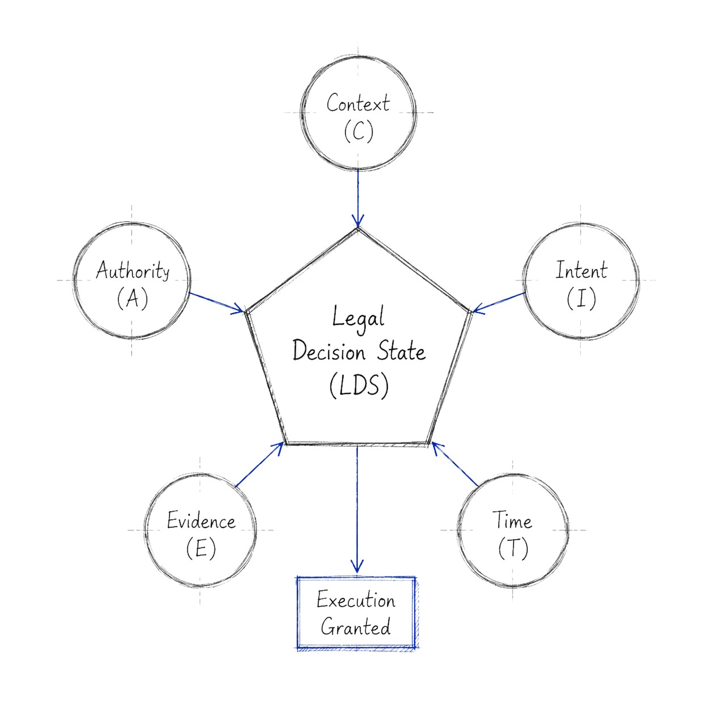

# Decision Intelligence Runtime (DIR)

**An architectural framework for building reliable, accountable, and stateful AI decision systems.**


## Project Goal

Current "agent frameworks" treat Large Language Models (LLMs) as autonomous executors, resulting in non-deterministic behaviors, hallucinations in critical control paths, and insufficient accountability mechanisms.

**Decision Intelligence Runtime** addresses this by enforcing a strict separation between **Reasoning** (LLM-based, semantic, probabilistic) and **Execution** (code-based, deterministic, verifiable). This separation is implemented through a Kernel Space / User Space architectural boundary, inspired by operating system design principles.

Unlike purely theoretical frameworks, DIR provides a concrete, executable implementation of safe delegation patterns.

### Origins

DIR emerged from production constraints in the **AIvestor** automated trading system, where the cost of reasoning failures is measured in capital loss. The patterns documented here are not theoretical-they represent battle-tested solutions to "Day Two" failure modes: state drift, non-idempotent operations, TOCTOU vulnerabilities, and the collapse of accountability in multi-agent systems.

This repository contains the architectural concepts, formal specifications, and reference implementations of the DIR framework.

---

## Why Another Agent Runtime?

The current discussion around Agentic AI is rapidly converging on a common observation: production systems require governance beyond prompt engineering.

Different communities describe different aspects of the problem:

- **Principal Drift** emphasizes authority, delegation, and accountability.
- **Agent Experience (AX)** focuses on exposing the right context and capabilities to autonomous systems.
- **Enterprise AI Governance** emphasizes policy enforcement, auditability, and human oversight.
- **Evaluation frameworks** measure reliability after deployment.
- **Workflow and orchestration platforms** focus on execution and coordination.

Notably, this convergence is confirmed by recent research such as Google DeepMind's *Intelligent AI Delegation* (2026), which formalizes "Responsibility Transfer", "Auditability", and "Permission Handling" as core requirements for agentic systems. We have observed that these theoretical requirements map directly to DIR's architectural primitives (ROA Contracts, DFID tracing, and the DIM gate). **[Read the full framework comparison: Google DeepMind vs. DIR/ROA](./docs/00-introduction/Intelligent_Delegation_Framework_Mapping.md)**

Decision Intelligence Runtime starts from a core question:

> *What are the minimal conditions that must simultaneously hold before an autonomous decision is allowed to execute?*

DIR proposes that many of these discussions can be viewed through a common architectural lens called the **Legal Decision State (LDS)**.

### The Core Philosophy: Legal Decision State (LDS)

DIR is built on the formal premise that an AI agent cannot be trusted to maintain system integrity probabilistically. Instead, the runtime ensures that the system never enters an **Illegal Decision State**.

<p align="center">
	
</p>

A decision is considered execution-safe—and allowed to pass through the runtime—only when five independent dimensions are simultaneously satisfied. We call this the **Legal Decision State (LDS)**:

$$LDS = C \wedge A \wedge I \wedge E \wedge T$$

If any of these components is false ($\neg C \vee \neg A \vee \neg I \vee \neg E \vee \neg T$), the decision is structurally illegal and must be aborted. Every component in the DIR ecosystem exists exclusively to protect one of these invariants:

- **Context (C):** Protected by the **Context Store** & **Context-as-Code (CaC)**. Ensures the agent is not acting on stale, hallucinated, or mission-drifted data.
- **Authority (A):** Protected by **Responsibility-Oriented Agents (ROA)**. Ensures the agent's proposed action does not exceed its explicitly registered contractual limits.
- **Intent (I):** Protected by **SDS Grammars** & **DIM Schema Validation**. Ensures the action is syntactically valid and structurally executable.
- **Evidence (E):** Protected by the **Evidence Governance Layer**. Detects "Compliant Lies" by ensuring the action is backed by deterministically reproducible reasoning.
- **Time (T):** Protected by **JIT State Verification** & **Drift Envelopes**. Prevents Time-of-Check to Time-of-Use (TOCTOU) races by ensuring reality hasn't shifted between LLM reasoning and API execution.

*The Decision Integrity Module (DIM) is the deterministic gatekeeper that mathematically enforces this equation before any side effect occurs.*

Rather than embedding these guarantees inside prompts or increasingly capable language models, DIR externalizes them into deterministic runtime infrastructure.

The goal is not to make language models perfectly intelligent.

The goal is to make imperfect language models economically and operationally safe to deploy.

## Why use DIR today?

Big Tech providers are beginning to theorize about "Agent Runtimes" as proprietary cloud services. **DIR is the first open-source implementation of the Zero Trust Agents philosophy** - agents propose, the runtime verifies; no implicit trust in LLM output.

* **No Vendor Lock-in:** Run your agents on AWS, Azure, GCP, or on-premise. The runtime logic is yours.
* **Ready for Production:** Solves "Day Two" problems (loops, drifts, audit) that simple orchestration libraries ignore.
* **Works with Existing Frameworks:** DIR is not a competitor to LangChain, AutoGen, or LangGraph - it's the execution shell. Wrap task-oriented agents in ROA contracts, inject mission boundaries, and enforce deterministic validation. *(See: [34_langchain_roa_wrapper](samples/34_langchain_roa_wrapper/), [35_crewai_roa_wrapper](samples/35_crewai_roa_wrapper/))*
* **Language Agnostic Architecture:** While the reference implementation is Python, the patterns (Kernel/User separation, DFID) are universal.
* **Context as Code:** Documentation is the new compiler - Markdown files act as system prompts for AI agents. *([Context as Code](./docs/08-conclusion/Context_as_Code.md))*

## Core Concepts

If you are new to DIR/ROA, begin with the **[Introduction Article](./docs/00-introduction/DIR-introduction.md)** to understand the "Day Two" failures in production systems, the Kernel Space vs. User Space architectural boundary, and why traditional agentic loops are insufficient for high-stakes environments. Then, explore the core pillars below:

### 1. Responsibility-Oriented Agents (ROA)
*Current Status: Published*

ROA is the architectural pattern for agents themselves. Instead of open-ended control loops, ROA constrains agents through explicit contracts:
* **Responsibility Contracts:** Formal scope boundaries and authority limits.
* **Missions:** Explicit optimization objectives defining agent purpose.
* **Stateful Existence:** Long-lived memory and persistent identity.
* **Decision Lifecycle:** Explain → Policy → Proposal (strict separation of reasoning from execution).

**[Read the ROA Manifesto](./docs/01-roa-manifesto/ROA_Manifesto.md)**

### 2. The Runtime Architecture
*Current Status: Published*

The execution environment that enforces deterministic guarantees:
* **Decision Integrity Module (DIM):** Kernel-space validation layer (schema enforcement, RBAC, state consistency checks).
* **Context Compilation:** Immutable state snapshots preventing TOCTOU vulnerabilities.
* **DecisionFlow ID (DFID):** Distributed tracing for reasoning chain reconstruction.
* **Safety Invariants:** Idempotency guarantees, TTL enforcement, and escalation protocols.

**[Read the DIR Architectural Pattern](./docs/02-decision-runtime/DIR_Architectural_Pattern.md)**

### 3. Decision Intelligence Topologies
*Current Status: Work in Progress*

A pluralistic approach to agent orchestration. No single execution model satisfies all operational requirements. DIR defines three distinct topologies optimized for different constraint profiles:
* **Topology A (EOAM):** Event-Oriented Agent Mesh for decentralized strategy coordination.
* **Topology B (SDS):** Structural Decision Streams for high-velocity, grammar-constrained execution.
* **Topology C (DL+PCI):** Decision Ledger with Proof-Carrying Intents for cryptographically verifiable audit trails.

**[Read Decision Intelligence Topologies](./docs/03-topologies/DIR_Topologies.md)**

### 4. Post-Execution Governance & Drift
*Current Status: Work in Progress*

An architectural defense against "Day Three" problems, where an agent's individual decisions are technically valid (Kernel Compliance), but its aggregate behavior over time erodes business intent (Business Health).
* **Agent Drift Taxonomy:** Formal classification of Optimization (Reward Hacking), Semantic, and Environmental drift.
* **Rolling Window Monitors:** Asynchronous analysis of execution logs and context snapshots linked via DFID.
* **Circuit Breaking:** Automated mechanism to transition an agent's Registry status to `SUSPENDED` upon detecting statistically significant drift.

**[Read Governance & Agent Drift](./docs/04-governance/DIR_Governance.md)**

### 5. Machine-Optimized Specification

**[DIR-minified.md](./docs/07-dir-minified/DIR-minified.md)** is a **single-file, machine-optimized** version of the framework specification. It is intended **for use as context** by LLMs and code-generation agents (e.g. Cursor, Claude, Devin), not as primary reading for humans. If you are feeding this repo to an AI to implement or extend DIR, attach this file as the main spec; the human-oriented docs remain the narrative and tutorial layer.

For short answers to common engineering questions, see the **[FAQ](./FAQ.md)**.

---

# Getting Started

## Prerequisites
- **Python 3.12+**
- **SQLite3** (optional - only for samples that use persistent storage)
- **Ollama** (optional - for local LLM inference in samples such as `31_finance_trading`; use `USE_MOCK_LLM=1` to run without it)

## Installation

Install the published package:

```bash
pip install dir-core
```

Or clone this repository if you want to run the samples or work with the source code:

```bash
git clone https://github.com/huka81/decision-intelligence-runtime.git
cd decision-intelligence-runtime
pip install -e .
```

*This installs the `dir_core` package (source in `src/dir_core`), making it available to all sample implementations.*

## Quick Start

From the cloned repository, run the Quick Start sample to see the DIR architecture in action:

```bash
python samples/00_quick_start/run.py
```

This sample demonstrates protection against catastrophic actions (e.g. parsing error turning 15.5 ETH into 15,500 ETH) and prompt injection in external data. It gives a high-level overview of the full architecture. See [samples/00_quick_start](samples/00_quick_start/README.md).

## Repository Structure

```text
decision-intelligence-runtime/
├── docs/                     # Architectural documentation
│   ├── 00-introduction/      # DIR intro, framework mapping
│   ├── 01-roa-manifesto/
│   ├── 02-decision-runtime/
│   ├── 03-topologies/
│   ├── 04-governance/
│   ├── 07-dir-minified/      # Machine-optimized single-file spec (DIR-minified.md)
│   └── 08-conclusion/        # Context as Code concept
├── src/
│   └── dir_core/             # Core DIR/ROA components (per docs spec)
│       │                     # DFID, EventBus, DIM, Context Store, models, arbitration, PCI, etc.
│       └── utils/            # Supporting utilities for samples
│                             # logging_utils, config_loader, llm_client (synthetic market: samples/31_finance_trading/mocks/)
├── samples/                  # Reference implementations (01–11 mechanics, 31+ use cases)
│   ├── README.md             # Sample catalog and run instructions
│   ├── 00_quick_start/ … 08_custom_repo_psql/ … 11_topology_c_dl_pci/
│   ├── 31_finance_trading/ … 38_drift_environmental_bidding/
│   └── 88_meta_context_engineering/   # Meta-sample: System Prompt Toolkit
├── README.md
├── FAQ.md                    # Frequently asked questions (architecture, adoption, compliance)
├── pyproject.toml            # pip install -e . installs dir_core (incl. dir_core.utils for samples)
├── requirements.txt          # Shared dependencies
└── assets/                   # Images, diagrams
```

## Samples & Reference Implementations

The project includes a comprehensive set of reference implementations, divided into two categories:
1. **Mechanics & Topologies (00–11)**: Synthetic examples illustrating specific architectural mechanisms (ROA, DIM, Idempotency, DFID, Event Bus, etc.).
2. **Business Use Cases (31+)**: End-to-end scenarios applying DIR patterns to real-world-like business problems (Trading, Fraud Detection, Underwriting, FinOps, Agent Drift).

Execute any sample from the repository root: `python samples/<folder>/run.py`

**[View the full catalog of Samples & Reference Implementations](samples/README.md)**

---

## License

This project is licensed under the Apache License, Version 2.0 – see the [LICENSE](LICENSE) file for details.

---

## Author

**Artur Huk** - [LinkedIn](https://www.linkedin.com/in/arturhuk/)

---
*This repository represents an evolving architectural framework derived from production constraints in high-stakes AI decision systems.*