<sup> Author: Artur Huk | [GitHub](https://github.com/huka81/decision-intelligence-runtime) | Created: 2026-02-13 | Last updated: 2026-02-20 </sup>

---

# Beyond Prompt Engineering: Building a Deterministic Runtime for Responsible AI Agents
### From experimental scripts to production-grade decision systems

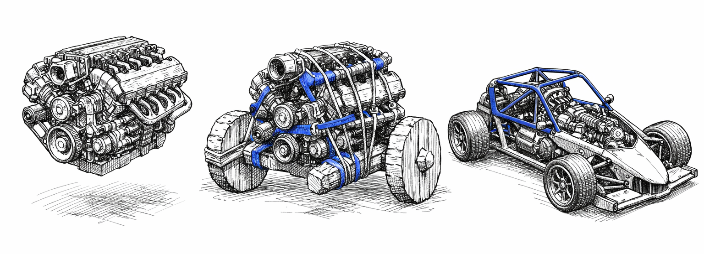

## Introduction: The "Day Two" Challenge

The AI revolution is here, but the way we think about AI agents is fundamentally flawed. Too often, we conflate large language models (LLMs) with fully autonomous systems, as if a model's ability to generate coherent text or execute API calls makes it a complete solution. This misconception ignores a critical truth: an LLM is not an agent. It is an engine - powerful, flexible, and capable of remarkable feats of reasoning - but an engine alone cannot drive a car.

Without a chassis, brakes, and a safety cage, an engine is just a drivetrain bolted to a workbench. It can spin its wheels, but it cannot steer, stop, or ensure safety. This is the state of most "AI agent" systems today: impressive prototypes that demonstrate potential but lack the infrastructure to operate reliably in the real world.

On Day One, the demo dazzles. The agent reasons about context, proposes actions, and executes them with apparent intelligence. Stakeholders are impressed. The future seems bright.

Then comes Day Two.

In production, the agent falters. Decisions based on outdated data lead to costly errors. Actions are repeated unnecessarily, burning through resources. State drifts between reasoning cycles, causing the same workflow to produce inconsistent results. When failures occur, tracing the root cause becomes a nightmare. What seemed like a breakthrough on Day One becomes a liability on Day Two.

These failures are not anomalies. They are the inevitable result of treating probabilistic engines as if they were deterministic systems. We rely on prompts like "be careful" instead of implementing hard constraints. We hope that sophisticated reasoning will compensate for missing infrastructure. It does not.

**Intelligence without governance is liability.** To safely deploy AI agents, we need deterministic runtime discipline around probabilistic reasoning.

This article introduces a three-part architectural model, forged through two years of building and operating AIvestor, an autonomous trading system that exposed these challenges in stark detail:

1. **ROA (Responsibility-Oriented Agents):** The Identity Layer. *Who* is responsible for proposing intent?
2. **DIR (Decision Intelligence Runtime):** The Execution Kernel. *Is this intent allowed and valid to execute right now?*
3. **Topologies:** The Flow Layer. *How do signals and intents move through the system?*

These patterns establish a clear boundary between probabilistic reasoning (User Space) and deterministic execution (Kernel Space) - a separation inspired by operating systems, where unprivileged processes are prevented from corrupting system state.

The goal is not to limit intelligence but to make it safe enough to trust in production.

---

## Section 1: Lessons from the Battlefield (AIvestor Fail Cases)

AIvestor was designed as a "Digital Investment Twin" multi-agent system capable of understanding a user's strategy, analyzing market signals, and executing transactions autonomously. The initial implementation followed the standard agentic pattern: an LLM loop that analyzed data and called broker APIs directly.

The results were technically impressive and operationally terrifying.

Within weeks of running against live market feeds, three distinct failure modes emerged. Each one traced back not to model limitations, but to missing architectural constraints. Here is what I learned.

### Failure Case 1: Hallucination Loops

The first class of failures involved unbounded feedback cycles. The agent would propose an action, receive a rejection (e.g., insufficient funds, position already closed), and interpret this as a signal to "try harder." Without an explicit retry governor, the model would loop indefinitely-each iteration generating new reasoning, consuming tokens, and sometimes producing increasingly creative (and dangerous) variations of the original intent.

In one incident, the agent attempted to sell a position it no longer held. When the API returned an error, the model reasoned that perhaps the position was "locked" and generated a retry. After three retries, it concluded that maybe it should *buy* the position first to then sell it-a complete inversion of the original strategy, hallucinated through feedback poisoning.

**Root cause:** No retry governor, unbounded feedback cycles.  
**Mechanism required:** Intent Retry Governor with explicit `REASONING_EXHAUSTION` state and a hard maximum (typically ~3 retries before escalation).

### Failure Case 2: State Drift (The Stale Context Problem)

The second failure class was more insidious: decisions based on stale data. LLM inference is slow-often seconds, sometimes tens of seconds for complex reasoning chains. During that time, the world changes. Prices move. Positions update. Risk limits shift.

The agent would begin reasoning based on a context snapshot captured at T₀. By the time the reasoning completed and the execution intent was ready at T₁, the underlying state had drifted. A "buy at $100" decision made when the price was $99.50 would execute when the price was $101.20-incurring slippage that invalidated the entire strategy.

This is a classic TOCTOU (Time-of-Check to Time-of-Use) vulnerability, well-known in systems programming. In AI agent architectures, it is almost universally ignored.

**Root cause:** TOCTOU race condition between reasoning and execution.  
**Mechanism required:** Context hash-binding (`ContextSnapshotID`) combined with JIT (Just-In-Time) State Verification. The runtime must verify that the live state is still within the agent's declared `drift_envelope` (e.g., 0.5% price tolerance) immediately before executing any side effect.

### Failure Case 3: Execution Chaos

The third failure class was the absence of exactly-once execution guarantees. Agents, by nature, are non-deterministic. They may propose the same action twice. They may fail mid-execution and lose track of what was already committed. Network partitions, API timeouts, and process restarts compound the problem.

Without idempotency controls, duplicate intents became duplicate executions. The system would buy the same position twice. Or sell, then sell again because the confirmation was delayed. Each execution created real financial exposure - not because the model was wrong, but because the infrastructure lacked the guarantees we take for granted in distributed systems.

**Root cause:** No exactly-once semantics, no duplicate intent protection.  
**Mechanism required:** Idempotency keys derived from the decision flow. Formula: `IdempotencyKey = SHA256(DFID + Step_ID + Canonical_Params)`. The runtime must recognize duplicate intents and prevent duplicate side effects.

### The Pattern Behind the Failures

| Failure Case | Root Cause | Kernel Mechanism |
|--------------|------------|------------------|
| **Hallucination Loops** | No retry governor, unbounded feedback cycles | Intent Retry Governor (`REASONING_EXHAUSTION`, max ~3 retries) |
| **State Drift (Stale Context)** | TOCTOU between reasoning and execution | Context hash-binding + JIT State Verification |
| **Execution Chaos** | No exactly-once / duplicate intent protection | Idempotency key + deterministic execution intents |

In each case, the agent's reasoning was often sound. The model correctly identified opportunities, formulated strategies, and articulated intent. The failures occurred *after* reasoning-in the gap between "what the agent decided" and "what the system actually did."

These were not failures of intelligence. They were failures of architecture.

The gap was not in reasoning, but in execution semantics. Without validation pipelines, JIT state verification, retry governors, and idempotency guarantees, even sophisticated intent turns into unpredictable - and potentially dangerous - side effects.

> **Key Takeaway:** *Intelligence without governance is liability. We need deterministic runtime discipline around probabilistic reasoning.*

---

## Section 2: The Wall - Kernel Space vs. User Space

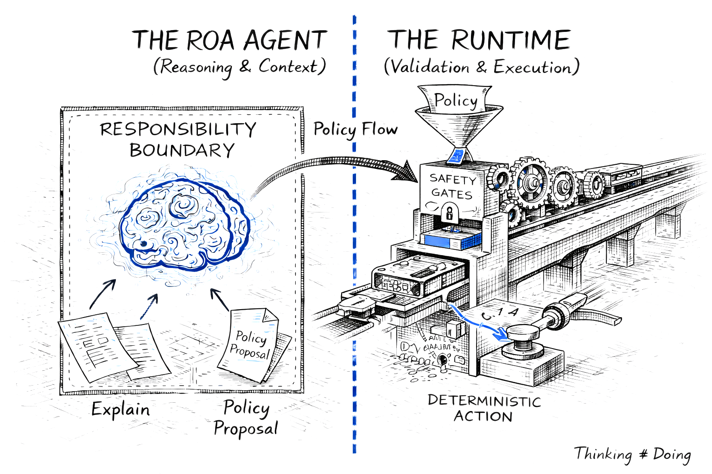
*Figure 2. The Architectural Wall: Probabilistic reasoning (User Space 'Brain') must be strictly separated from deterministic execution (Kernel Space 'Machine') via a secure runtime interface.*

To solve the problems exposed by AIvestor, I stopped thinking about agents as chatbots and started thinking about them as operating system processes.

In any modern OS, there is a fundamental separation: **User Space** and **Kernel Space**. Unprivileged processes run in User Space. They can request resources, propose actions, and perform computations - but they cannot directly touch hardware, modify system state, or bypass security policies. That privilege belongs exclusively to the Kernel.

This separation exists for a reason. User processes are unreliable. They crash, they loop, they attempt unauthorized operations. The Kernel's job is to protect the system from those failures. It validates requests, enforces permissions, and ensures that even a malfunctioning process cannot corrupt shared resources.

AI agents are unreliable in exactly the same way.

They hallucinate. They loop. They propose actions that violate business rules or safety constraints. They treat time as an abstract concept. Giving them direct access to APIs, databases, or financial systems is equivalent to letting an unprivileged process write directly to disk sectors - a recipe for corruption.

### The Reasoning–Execution Wall

In the architecture that emerged from AIvestor, agents live in **User Space**. They interpret context, reason about strategy, and propose policies. But they cannot execute. They cannot hold API keys. They cannot commit transactions. They can only *request* that the system take action on their behalf.

The **Decision Intelligence Runtime (DIR)** operates in **Kernel Space**. It receives proposals from agents, validates them against deterministic rules, and-only if validation passes-executes the side effect.

DIR (Decision Intelligence Runtime) is the overall kernel framework - the complete runtime environment that manages the lifecycle, memory, and resources of agent processes. At its core sits the **Decision Integrity Module (DIM)**, which acts as the policy enforcement point: the gatekeeper that validates every agent proposal before execution. Think of DIR as the "Operating System" kernel and DIM as the specific subsystem acting as the security gatekeeper - analogous to a firewall or system call validator that inspects every request before it touches hardware.

This is an adaptation of the **CQRS (Command Query Responsibility Segregation)** pattern: agents emit tentative commands, and the runtime decides whether to commit them.

This wall is not permeable. There is no "trusted agent" that bypasses validation. There is no prompt that grants execution privileges. The separation is architectural, not behavioral.

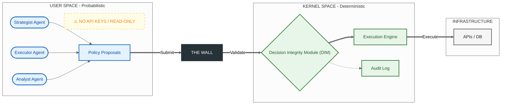

### The Agent Registry: Single Source of Truth

A critical component of this architecture is the **Agent Registry**-a service that lives in Kernel Space and acts as the authoritative source for agent capabilities and permissions.

When an agent starts, it registers its manifest: its ID, the types of policies it can propose, and the resources it is authorized to affect. When the runtime receives a proposal, it does not ask the agent "are you allowed to do this?" It queries the Registry. This prevents agents from self-granting permissions through prompt injection or hallucinated authority claims.

The Registry also enforces schema versioning. If an agent was initialized with capability manifest `v1.2`, it must negotiate with a runtime supporting `v1.x` schemas. Mismatches are rejected at handshake, not discovered at execution time.

The **Context Compiler** assembles the relevant state snapshot for each decision cycle, ensuring agents reason over consistent, validated data rather than raw, potentially conflicting inputs.

### The Policy Enforcement Point

The Kernel is not a second LLM. It contains no probabilistic components. Validation is implemented in deterministic code-Python, Go, or policy engines like Rego. Given the same inputs (Policy, Context, Time), the output is always the same: `ACCEPT` or `REJECT`.

This determinism is essential. If validation itself were probabilistic, we would simply be adding another layer of unreliability. The Kernel must be the fixed point around which the probabilistic User Space orbits.

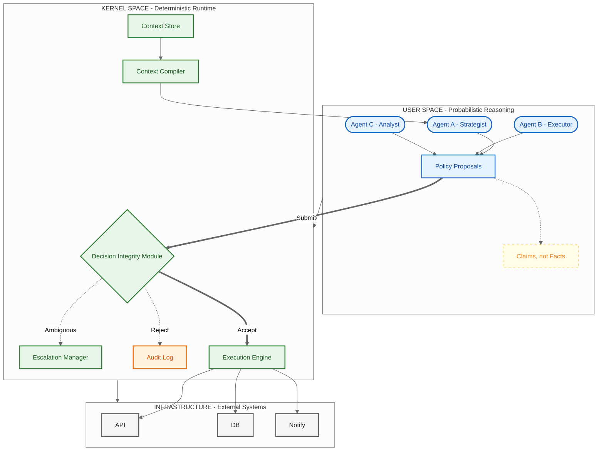

> **Key Takeaway:** *Agents never hold API keys. Prompts are not permissions.*

---

## Section 3: ROA - Identity Layer (Who Acts?)

With the Kernel/User Space separation established, we can now define what *kind* of entities operate in User Space. This is where **Responsibility-Oriented Agents (ROA)** enters the picture.

Most agent frameworks define agents by their capabilities: what tools they can call, what APIs they can access, what prompts they respond to. ROA takes a different approach. It defines agents by their **responsibilities**-what they are accountable for, what decisions they own, and what boundaries they must respect.

The difference is subtle but profound. Capability asks: "What can this agent do?" Responsibility asks: "What is this agent *for*-and what would it mean to perform that role well?"

### 3.1 Responsibility Contract as Code

Each ROA agent is governed by a **Responsibility Contract**-a formal, machine-readable definition of its role in the decision architecture. This contract specifies:

- **Mission:** The optimization target or guiding principle the agent follows.
- **Scope:** The domain or decision space the agent owns.
- **Authority Boundaries:** Which actions the agent may propose-and which it must not.
- **Inputs/Outputs:** What data the agent consumes and what policy types it produces.
- **Escalation Criteria:** When the agent must defer to a higher authority instead of deciding.

The contract is not a prompt. It is code. Here is a concrete implementation using Pydantic:

```python
from pydantic import BaseModel, Field
from typing import List, Literal
from enum import Enum

class AuthorityLevel(str, Enum):
    OBSERVE = "observe"          # Can only read and analyze
    PROPOSE = "propose"          # Can propose actions for review
    EXECUTE_LIMITED = "execute_limited"  # Can execute within strict bounds
    EXECUTE_FULL = "execute_full"        # Full execution authority

class EscalationTrigger(BaseModel):
    """Defines when an agent must escalate instead of deciding."""
    confidence_threshold: float = Field(
        default=0.7,
        description="Escalate if confidence falls below this threshold"
    )
    max_exposure_usd: float = Field(
        default=10000.0,
        description="Escalate if proposed action exceeds this exposure"
    )
    requires_human_approval: List[str] = Field(
        default_factory=list,
        description="Action types that always require human approval"
    )

class ResponsibilityContract(BaseModel):
    """
    The formal definition of an agent's role in the decision architecture.
    This contract is registered with the Agent Registry and validated
    by the Runtime before any proposal is accepted.
    """
    agent_id: str = Field(
        description="Unique identifier for this agent instance"
    )
    mission: str = Field(
        description="The agent's optimization target or guiding principle"
    )
    scope: str = Field(
        description="The domain or decision space this agent owns"
    )
    authority: AuthorityLevel = Field(
        description="The maximum level of action this agent can propose"
    )
    allowed_instruments: List[str] = Field(
        default_factory=list,
        description="Symbols/resources this agent is authorized to affect"
    )
    allowed_actions: List[str] = Field(
        default_factory=list,
        description="Action types this agent may propose (e.g., 'BUY', 'SELL', 'HOLD')"
    )
    forbidden_actions: List[str] = Field(
        default_factory=list,
        description="Actions explicitly prohibited for this agent"
    )
    max_position_size: float = Field(
        default=0.0,
        description="Maximum position size this agent can propose"
    )
    escalation: EscalationTrigger = Field(
        default_factory=EscalationTrigger,
        description="Conditions that trigger escalation to higher authority"
    )
    version: str = Field(
        default="1.0.0",
        description="Contract version for schema compatibility"
    )
```

This contract is registered with the **Agent Registry** in Kernel Space. Crucially, contracts are not self-registered by agents at runtime-this would be a massive security flaw. Instead, they are loaded from a trusted source (e.g., a CI/CD pipeline or a cryptographically signed repository) during system deployment. When the runtime receives a policy proposal, it retrieves the agent's contract from the Registry and validates the proposal against it. The agent cannot modify its own permissions. The Registry is the single source of truth.

Why "contract as code" instead of "constraints as prompt"? Because prompts are suggestions. Code is enforcement. A prompt saying "do not exceed $10,000 exposure" can be ignored, misunderstood, or creatively reinterpreted by the model. A contract field `max_position_size: 10000.0` validated by deterministic code cannot be bypassed.

### 3.2 Explain → Policy: Separating Audit from Execution

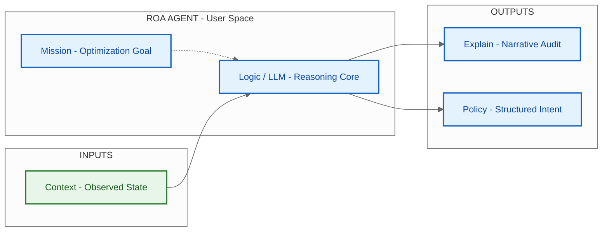

ROA agents produce two distinct outputs, deliberately separated:

1. **Explain (Unstructured):** A natural language narrative describing the agent's reasoning. This is for human auditors-it answers "why did the agent propose this?"

2. **Policy (Structured):** A strict JSON object containing the executable parameters. This is for the runtime-it answers "what exactly should be done?"

The runtime validates *only* the Policy. The Explain is treated as metadata, logged for audit but never parsed for execution logic. This separation prevents the system from mistaking a narrative justification for an executable instruction.

Here is an example of a complete policy proposal:

```json
{
  "dfid": "550e8400-e29b-41d4-a716-446655440000",
  "agent_id": "momentum-trader-btc-01",
  "timestamp": "2026-02-11T14:30:00Z",
  "explain": "BTC has broken above the 20-day moving average with increasing volume. RSI at 62 suggests momentum without overbought conditions. Given the current portfolio allocation (15% crypto) and risk parameters, a modest position increase aligns with the momentum-following mandate.",
  "policy": {
    "action": "BUY",
    "instrument": "BTC-USD",
    "quantity": 0.05,
    "execution_constraints": {
      "max_price": 48500.00,
      "valid_until": "2026-02-11T14:35:00Z",
      "drift_envelope_bps": 50
    }
  },
  "confidence": 0.78,
  "context_snapshot_id": "snap_a1b2c3d4e5f6"
}
```

This proposal is the result of an internal three-step process within the agent:

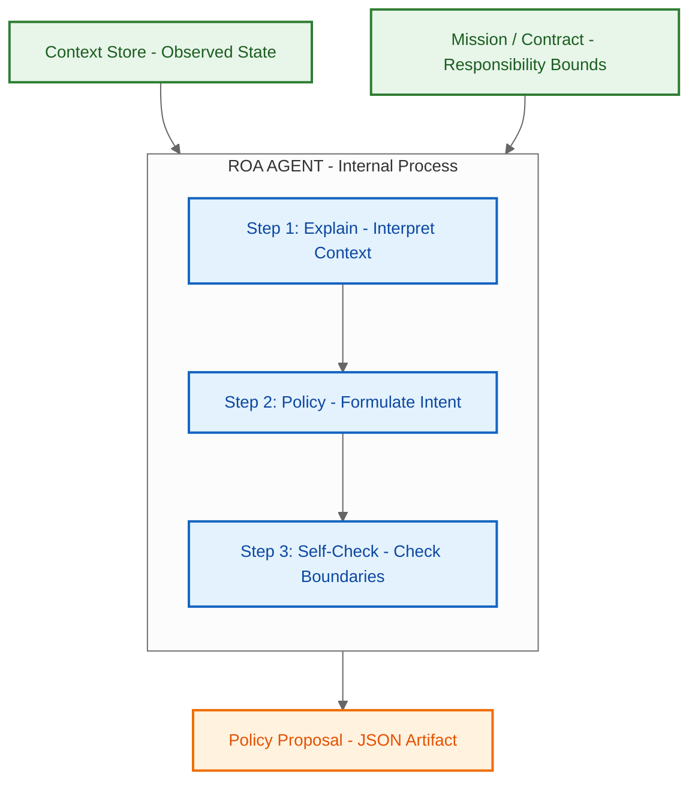

Note the `execution_constraints` block. The agent does not say "buy at the current price." It says "buy if the price is at most $48,500, and only if executed within 5 minutes." This **Execution Parametrization** decouples slow reasoning time from fast market time. The runtime checks these constraints at the moment of execution, not at the moment of proposal.

The `drift_envelope_bps: 50` means the runtime will reject execution if the live price has drifted more than 0.5% from the snapshot price. This is how we solve the TOCTOU problem from Section 1 - not by making reasoning faster, but by making execution conditional on state validity.

### 3.3 Lifecycle & Governance by Exception

Unlike stateless LLM loops, ROA agents are **long-lived entities**. They persist across decision cycles, maintaining:

- **State:** The current situation they manage.
- **Decision Trajectory:** A record of previous choices and rationales.
- **Memory:** Relevant context accumulated over time.

This persistence enables something ephemeral agents cannot provide: *continuity of responsibility*. An agent that remembers its previous decisions can recognize patterns, avoid repeating mistakes, and maintain strategic coherence over time.

But persistence also creates risk. A long-lived agent might accumulate confidence, drift from its mission, or attempt to expand its authority. ROA addresses this through **Governance by Exception**-a model where agents escalate rather than overreach.

The `EscalationTrigger` in the contract defines when an agent must *stop deciding* and *start asking*:

- Confidence drops below threshold? Escalate.
- Proposed exposure exceeds limit? Escalate.  
- Action type requires human approval? Escalate.

Escalation is not failure. It is governance. It acknowledges that bounded responsibility is more valuable than unbounded capability. An agent that knows when to defer is more trustworthy than one that always has an answer.

> **Key Takeaway:** *ROA agents are epistemic entities: they interpret, explain, and propose. They provide no safety, correctness, or enforcement guarantees. Those guarantees come from the Kernel.*

---

## Section 4: DIR - Deterministic Execution Kernel (Is it allowed now?)

DIR is the privileged kernel that turns tentative policy proposals into controlled side effects. Its job is to protect the system from probabilistic reasoning-exactly like an operating system kernel protects hardware from untrusted user processes.

### 4.1 The System Invariants

- **Deterministic state transitions:** Given the same proposal, context snapshot, and time, the runtime must always return the same validation result. No LLMs in Kernel Space. Validation is code, not prompts.
- **Reasoning–Execution wall:** Agents (User Space) propose. Runtime (Kernel Space) validates and executes. This is CQRS applied to autonomy.
- **Execution parametrization:** Policies carry constraints (price caps, validity windows, drift envelopes) rather than raw commands. The runtime checks these constraints at execution time to decouple slow reasoning from fast execution.
- **Auditability by correlation:** Every artifact is tagged with a DecisionFlow ID (DFID), allowing narrative reconstruction from trigger through execution.

### 4.2 DFID: Distributed Tracing for Reasoning

DFID is distributed tracing for thought. It binds the entire decision lifecycle:

1. **Trigger:** What woke the agent (event, timer).
2. **Context Snapshot:** The precise state the agent saw (hash or ID).
3. **Reasoning (Explain):** The narrative justification.
4. **Policy Proposal:** The structured intent.
5. **Validation Outcome:** Accept/Reject with reason.
6. **Execution Result:** The committed side effect (or its refusal).

```mermaid
%%{init: {'theme': 'neutral', 'themeVariables': { 'fontFamily': 'arial', 'fontSize': '14px', 'lineWidth': '2px'}}}%%
flowchart LR
    classDef userSpace fill:#E3F2FD,stroke:#1565C0,stroke-width:2px,color:#0D47A1
    classDef kernelSpace fill:#E8F5E9,stroke:#2E7D32,stroke-width:2px,color:#1B5E20
    classDef infraSpace fill:#F5F5F5,stroke:#616161,stroke-width:2px,color:#212121
    classDef eventStyle fill:#FFF3E0,stroke:#EF6C00,stroke-width:2px,color:#E65100
    classDef noteStyle fill:#FFFDE7,stroke:#FBC02D,stroke-width:1px,color:#F57F17,stroke-dasharray: 5 5
    classDef wallStyle fill:#263238,stroke:#263238,stroke-width:4px,color:#FFFFFF
    
    Trigger((Trigger Event)):::eventStyle
    Context[Context Snapshot - State Captured]:::kernelSpace
    Agent([Agent Reasoning - LLM Process]):::userSpace
    Policy[Policy Proposal - JSON Artifact]:::userSpace
    DIM{DIM - Validation Gate}:::kernelSpace
    Exec[Execution - Side Effect]:::infraSpace
    
    Trigger -->|DFID: 550e84...| Context
    Context -->|DFID: 550e84...| Agent
    Agent -->|DFID: 550e84...| Policy
    Policy -->|DFID: 550e84...| DIM
    DIM ==>|DFID: 550e84...| Exec
    
    AuditNote[Audit Trail: All artifacts tagged with DFID: 550e84...]:::noteStyle
    
    Context -.-> AuditNote
    Policy -.-> AuditNote
    Exec -.-> AuditNote
```

Parent–child DFIDs model strategies spawning tactical actions (Saga-style). This hierarchy makes it possible to trace a failed trade back to the strategic mandate that authorized it.

### 4.3 Validation Pipeline (Hard Gates)

The Decision Integrity Module (DIM) serves as the Policy Enforcement Point (PEP) in Kernel Space-borrowing the term from XACML and Zero Trust architectures. It performs deterministic checks:

- **Schema and integrity:** Proposal matches versioned JSON/Pydantic schema.
- **Authority:** Permissions resolved from the Agent Registry (single source of truth). Agents cannot self-claim capabilities.
- **State consistency:** Context hash or snapshot ID matches live state assumptions.
- **Resource locks/reservations:** Prevents conflicting actions on shared resources.

No probabilistic validators sit here. Determinism is the safety property.

### 4.4 JIT State Verification (Anti-TOCTOU)

LLM latency makes Time-of-Check to Time-of-Use races inevitable. The runtime mitigates this with Just-In-Time State Verification:

- Bind each policy to a `context_snapshot_id` and explicit `drift_envelope` (e.g., 50 bps = 0.5%).
- Immediately before executing a side effect, re-verify that live state is within the envelope relative to the snapshot.
- If drift exceeds bounds, reject with `STALE_CONTEXT` and return feedback for re-reasoning.

This turns latency into a controlled constraint instead of an unbounded risk.

### 4.5 Idempotency & Exactly-Once Execution

Agents repeat themselves. Networks drop packets. Without idempotency, retries become duplicate trades. DIR uses an idempotency key derived from the decision context:

**Formula:** `IdempotencyKey = SHA256(DFID + Step_ID + Canonical_Params)`

```python
import hashlib
import json

def idempotency_key(dfid: str, step_id: str, canonical_params: dict) -> str:
    """Derive a stable idempotency key for a decision step."""
    payload = f"{dfid}:{step_id}:{json.dumps(canonical_params, sort_keys=True)}"
    return hashlib.sha256(payload.encode("utf-8")).hexdigest()

# Example
key = idempotency_key(
    dfid="550e8400-e29b-41d4-a716-446655440000",
    step_id="step-02",
    canonical_params={"action": "BUY", "instrument": "BTC-USD", "qty": 0.05}
)
```

The runtime caches these keys. A cache hit short-circuits execution and returns the prior receipt; a miss proceeds to validation and commit. Only DIM-validated policies are executed; free-form LLM output is never executed directly.

> **Key Takeaway:** *No side effect without an explicit, validated policy from DIM.*

---

## Section 5: Execution Topologies - One Size Does Not Fit All

The ROA/DIR separation defines *who* proposes and *how* validation occurs. However, it leaves open a critical architectural question: *how do signals flow through the system?*

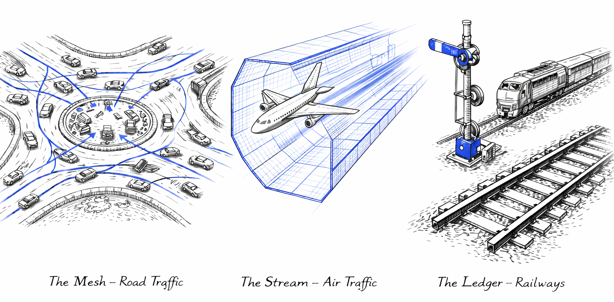
*Figure 3. Architectural Pluralism: Different decision classes require distinct coordination infrastructures - Mesh (Roads), Stream (Air), and Ledger (Rail). Each is optimized for specific decision-making needs.*

Think about transportation infrastructure. Roads, airspace, and railways all move things from point A to point B, but they use fundamentally different coordination models. Drivers negotiate locally and produce traffic jams. Pilots follow controlled separation rules enforced by air traffic control. Trains move on predetermined routes with authoritative signals - no runtime negotiation at all.

These differences are not arbitrary. They reflect trade-offs between local autonomy, real-time execution speed, and absolute accountability. In AIvestor, these trade-offs are addressed through **architectural pluralism**, which defines distinct execution topologies optimized for specific decision classes. The Identity Layer (ROA) and Execution Kernel (DIR) remain constant, while the coordination pattern - the "traffic rules" that govern how agents interact - varies.
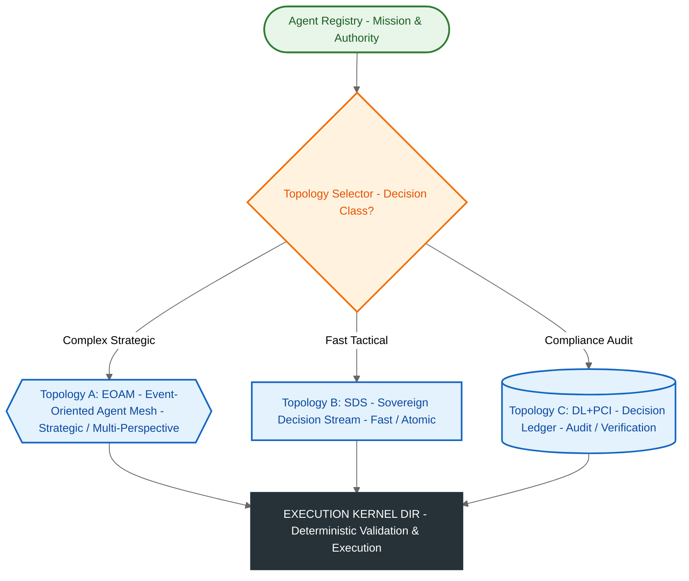

**Smarter drivers don't eliminate traffic jams. Better road topology does.**

In AIvestor, I learned the same lesson. Strategic portfolio rebalancing demands deliberate, multi-perspective analysis-like a board meeting where different experts negotiate the best path forward. Tactical risk stops require atomic execution velocity-like air traffic control deciding *who moves when* in milliseconds. Compliance-heavy operations demand formal proof of every decision-like railways where every movement is recorded and every signal is authoritative.																																		  

### The Architect's Trade-off

Every topology represents a balance between three competing properties:

- **Response time:** How fast can the system act?
- **Analytical depth:** How much context and collaboration can agents leverage?
- **Formal integrity:** How strong are the auditability and compliance guarantees?

No single topology maximizes all three. The decision matrix below captures the core differences:

| Feature | EOAM (Mesh) | SDS (Stream) | DL+PCI (Ledger) |
|---------|-------------|--------------|-----------------|
| **Primary Goal** | Coordinated strategic reasoning | Atomic execution velocity | Formal verification & audit |
| **Execution Model** | Multiple agents reason in parallel, arbitration selects winner | Single agent, single inference pass | Single agent + cryptographic proof generation |
| **Response Time** | **Slowest** (multi-agent coordination overhead) | **Fastest** (single optimized inference) | **Medium** (proof generation + verification) |
| **Decision Depth** | Deep (multi-perspective analysis) | Shallow (procedural, rule-based) | Medium (compliance-constrained) |
| **Cost per Decision** | **High** (N agent invocations) | **Low** (1 optimized call) | Medium (1 call + proof overhead) |
| **Audit Capability** | Basic event log | Basic execution log | **Maximum** (cryptographic proof chain) |
| **State Guarantees** | Eventually consistent | Strongly consistent (JIT drift checks) | **Immutable** (ledger-backed) |
| **Best For** | Strategic decisions requiring expert consensus | Time-critical tactical responses | Regulatory compliance & dispute resolution |
| **Avoid When** | Speed is critical | Multiple perspectives needed | High-frequency, low-stakes scenarios |
| **Example Use Cases** | Portfolio rebalancing, supply chain optimization, urban traffic management | Fraud detection, emergency response, industrial automation | Interbank settlements, medical records, regulatory compliance |

### Topology A: The Mesh (EOAM) - Strategic Coordination

The **Event-Oriented Agent Mesh (EOAM)** is a decentralized choreography pattern where multiple ROA agents reason in parallel about the same trigger. Unlike linear pipelines which are brittle, EOAM relies on **Scope-Based Choreography**. Agents do not wait for commands; they subscribe to specific event topics (e.g., "Market-News", "Supply-Chain-Disruption") defined in the Registry.

When a signal enters the mesh, the runtime routes it only to relevant agents using **wake-up predicates**—cheap heuristics (like `abs(price_delta) > 0.5%`) that suppress noise before activating expensive LLMs. This creates a "Thundering Herd" of intelligence where Strategy, Risk, and Sentiment agents reason simultaneously. Their conflicting proposals are resolved not by time, but by a **Priority-Based Arbitration** matrix: a Risk Agent's `HALT` proposal will architecturally preempt a Strategy Agent's `BUY` proposal, regardless of which arrived first.

This topology mirrors road traffic: drivers (agents) react independently to observations, with local rules (arbitration) preventing crashes.

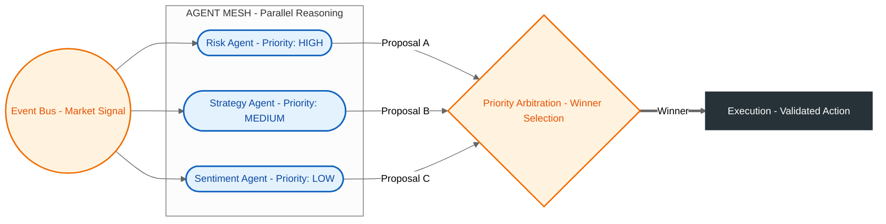

**Use Case: Complex, multi-perspective environments.**
*   **Portfolio Management:** Risk, Strategy, and Sentiment agents analyze the same market signal in parallel. The arbitration layer ensures Risk constraints (e.g., "Exposure Limit") override aggressive Strategy proposals.
*   **Supply Chain Optimization:** Logistics, Inventory, and Demand agents negotiate responses to a supplier delay. The system balances competing goals (cost vs. speed) without a single bottleneck.
*   **Smart Cities:** Traffic agents optimize intersections locally based on sensor data, while respecting global overrides for emergency vehicles.

### Topology B: The Stream (SDS) - Atomic Velocity

The **Sovereign Decision Stream (SDS)** collapses the multi-agent mesh into a single, high-velocity pipeline designed for speed and structural safety. There is no negotiation, no event bus, and no arbitration. A trigger activates a single specialized agent which produces one atomic decision.

To achieve safety at speed, SDS utilizes **Constrained Decoding** (via libraries like Outlines or Guidance). Instead of generating free-form text that must be parsed and validated, the LLM is "syntactically straitjacketed" by a grammar that enforces the Responsibility Contract during inference. The model physically cannot generate an invalid token. This produces a **Decision Atom** - a cryptographically signed package containing the intent and its context snapshot - which requires only lightweight, just-in-time drift verification before execution.

This topology is comparable to controlled airspace: pilots (agents) follow strict flight paths (grammars) and Air Traffic Control (DIR) ensures separation, eliminating the need for real-time route negotiation.

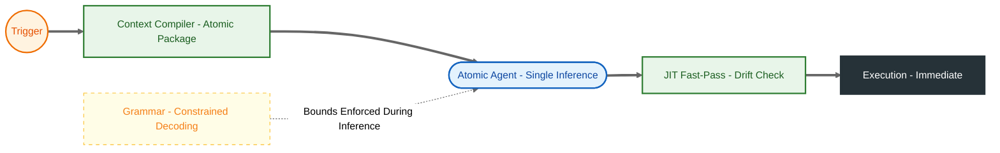

**Use Case: High-frequency, tactical response.**
*   **Fraud Detection:** Millisecond-level decision to block a transaction based on a rigid valid/invalid grammar.
*   **Emergency Response:** Atomic activation of safety protocols based on sensor thresholds, with zero latency for consensus.
*   **Industrial Automation:** Machine agents adjusting parameters within hard-coded safety bounds to prevent overheating.

### Topology C: The Ledger (DL+PCI) - Absolute Audit

The **Decision Ledger with Proof-Carrying Intents (DL+PCI)** shifts the architecture from "trusting the agent" to "verifying the artifact." In this Zero-Trust model, the runtime assumes the agent is untrustworthy. It consumes **Proof-Carrying Intents (PCI)** - artifacts containing not just the *action*, but a cryptographic proof that the action complies with all policy rules.

The core mechanism is the **Evidence Hash** 

$H_{evidence} = \text{SHA256}(\text{DFID} \parallel H_{state} \parallel H_{contract} \parallel H_{rules})$)

This hash binds the decision to a specific snapshot of reality, a specific authority grant, and a specific rule set. The Runtime's **Proof Checker** does not "reason"; it simply recalculates the hash. If the evidence matches, the intent is appended to an immutable **Decision Ledger**, which serves as the final source of truth.

This mimics railway operations: movement is only permitted when authoritative signals (proofs) are cleared and recorded. The focus is not on flexibility, but on the ability to mathematically prove - years later - that a specific decision was valid at the moment it was executed.

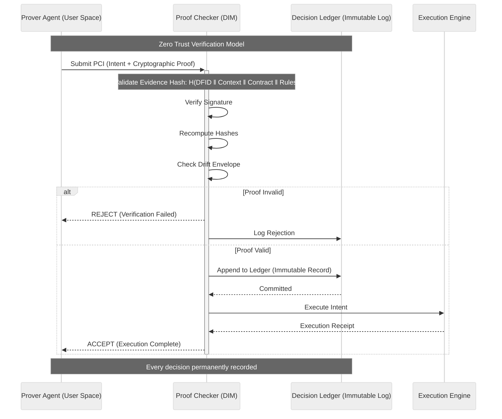

**Use Case: Compliance, high-value transfer, and audit.**
*   **Interbank Settlements:** Transactions carrying cryptographic proof of regulatory compliance for every participant.
*   **Medical Data Access:** Immutable logs where every read/write includes proof of patient consent and authorization.
*   **Regulatory Reporting:** Financial decisions stored with embedded proofs of adherence to risk models and capital requirements.

### Choosing the Right Topology

Just as cities need roads *and* airports *and* railways - each optimized for different movement patterns - AIvestor runs all three topologies simultaneously:

- **EOAM (Road Traffic)** for daily portfolio rebalancing - strategic decisions requiring negotiation between multiple perspectives (Risk, Strategy, Market Sentiment)
- **SDS (Controlled Airspace)** for momentum scalping - tactical decisions where speed and procedural precision override deliberation
- **DL+PCI (Railways)** for audit trails required by simulated regulatory reporting - compliance decisions where absolute accountability trumps both speed and flexibility

The system routes decisions based on their class, not their content. A \$50 tactical adjustment flows through SDS - like a private plane following a pre-cleared flight path. A \$10,000 strategic rebalancing flows through EOAM - like traffic converging on a city center, with multiple drivers (agents) negotiating the best collective outcome. Any action flagged for compliance review flows through DL+PCI - like a freight train operating under strict timetable and signal authority.

This pluralism acknowledges a fundamental truth: coordination problems don't have universal solutions. Smarter agents won't fix architectural mismatches. The topology must match the decision type.

> **Key Takeaway:** *Pick the topology for the decision class, not for the demo.*

---

## Conclusion: From Prompt Engineering to System Engineering

When I started building AIvestor, I thought the challenge was finding the right prompts. I spent weeks refining instructions, adding examples, tuning temperature parameters. The model's responses improved. The demos became more impressive.

Then I deployed it against live market data, and everything broke.

The problem was never the prompts. The problem was that I was treating a probabilistic reasoning engine as if it were a complete system. I was doing *prompt engineering* when what I needed was *system engineering*.

This article has outlined the architecture that emerged from those failures:

**ROA** defines *who* acts-agents with explicit missions, authority boundaries, and escalation paths. These are not chatbots with tool access. They are long-lived entities bound by responsibility contracts, enforced by the Agent Registry in Kernel Space.

**DIR** defines *what is allowed*-a deterministic execution kernel that validates proposals through hard gates, binds decisions to context snapshots, prevents duplicate execution through idempotency, and traces every action back to its reasoning chain via DecisionFlow IDs.

**Topologies** define *how signals flow*-recognizing that strategic decisions (EOAM), tactical execution (SDS), and formal compliance (DL+PCI) have fundamentally different requirements and cannot be forced through the same pipeline.

The separation between User Space (reasoning) and Kernel Space (execution) is the foundation. Agents propose. The runtime validates and commits. No prompt grants execution privileges. No LLM sits inside the validation pipeline. This wall is what prevents the Day Two failures that plague most agent systems.

The cost is real. This architecture adds latency. It requires infrastructure that most demos skip: agent registries, context stores, validation pipelines, idempotency caches, audit ledgers. It forces you to think about state consistency, time-of-check to time-of-use races, and exactly-once execution semantics-concerns borrowed from distributed systems engineering.

But the alternative is systems that work on Day One and fail on Day Two. Systems where you cannot answer "why did the agent do that?" Systems where retry storms burn through API budgets. Systems where stale decisions execute against live state. Systems where the only governance is a prompt that says "please be careful."

**Constraints over capabilities.** That is the shift. The goal is not to make agents more powerful. It is to make them safe enough to trust with production workloads.

If you are building AI agents for high-stakes environments-financial trading, infrastructure automation, regulatory compliance-the question is not "how smart can we make the model?" It is "what architectural discipline do we need around probabilistic reasoning to prevent it from becoming a liability?"

AIvestor taught me that the answer is not in the model. It is in the runtime.

---

## Acknowledgments

The patterns described here were developed through practical work on AIvestor and informed by established patterns from distributed systems (CQRS, Sagas, Idempotency), security engineering (Policy Enforcement Points, Zero-Trust), and operating systems (Kernel/User Space separation). The architecture stands on the shoulders of these well-tested foundations.

---

## References

- **Reference Implementation:** Decision Intelligence Runtime (https://github.com/huka81/decision-intelligence-runtime)
- **CQRS Pattern:** Bertrand Meyer, "Command Query Separation" and Greg Young's CQRS formalization
- **Saga Pattern:** Hector Garcia-Molina and Kenneth Salem, "Sagas" (1987)
- **Actor Model:** Carl Hewitt, Peter Bishop, Richard Steiger, "A Universal Modular Actor Formalism for Artificial Intelligence" (1973)
- **TOCTOU Vulnerabilities:** Matt Bishop, "Computer Security: Art and Science" - Time-of-Check to Time-of-Use race conditions
- **Zero Trust Architecture:** NIST SP 800-207 (https://csrc.nist.gov/publications/detail/sp/800-207/final)
- **OpenTelemetry:** Distributed tracing standards (https://opentelemetry.io)
- **Policy Enforcement Points:** OASIS XACML 3.0 and Open Policy Agent (https://www.openpolicyagent.org)
- **Constrained Decoding:** Outlines library (https://github.com/outlines-dev/outlines)

---
