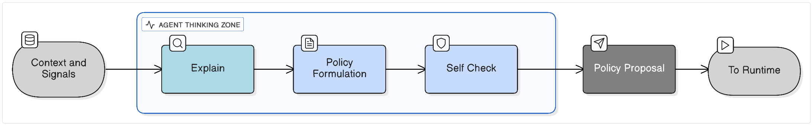
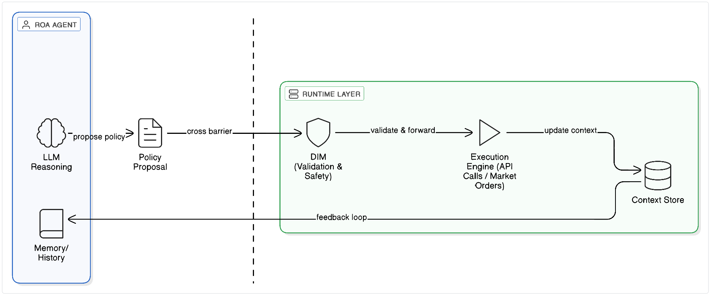
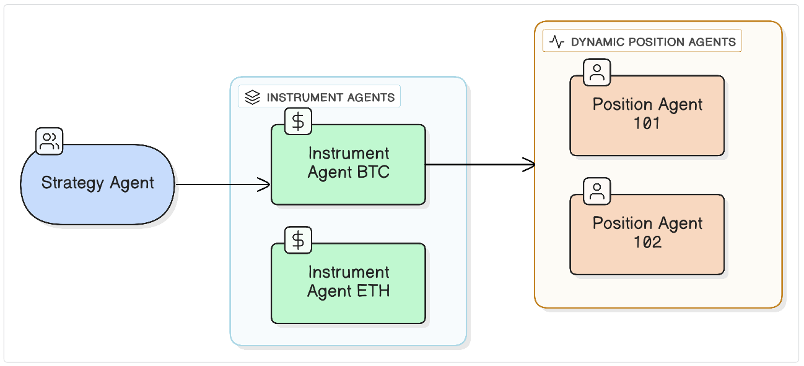

# Responsibility-Oriented Agents (ROA) Manifesto
### An architectural pattern for reliable, accountable AI decision systems

**Author:** Artur Huk  
**Repository:** https://github.com/huka81/decision-intelligence-runtime  
**Created:** 2025-12-11
**Last updated:** 2026-01-05


# **0. Abstract**

Large Language Models have enabled a new generation of AI systems-flexible, expressive, and capable of synthesizing insights across domains. Yet despite this progress, building reliable **decision-making** systems on top of LLMs remains surprisingly fragile. Most current “agent” frameworks wrap LLM calls in orchestration layers, hoping that structure will translate into coherent behavior. In practice, these systems often lack determinism, boundaries, accountability, and a clear separation between *reasoning* and *execution*.

This article introduces **Responsibility-Oriented Agents (ROA)**: a conceptual architecture derived from practical experiments with LLM-driven systems. ROA does not attempt to replace existing tools but to address a fundamental gap: agents today do not have **responsibility**-a defining property of any real decision-making unit. The ROA model introduces explicit responsibility contracts, missions, authority boundaries, stateful long-lived agents, and a clean separation between policy formation and deterministic runtime execution.

The goal is not to present a definitive solution, but to offer a structured perspective on how LLM-based agents might evolve into systems that behave predictably, can be audited, and can be trusted to act-not just generate text.


---

# **1. Introduction - When Powerful Models Are Not Enough**

Over the past few years, advances in Large Language Models have created the impression that AI systems are on the verge of autonomous decision-making. Models can reason, explain, plan, and interact across APIs with surprising fluency. It is tempting to assume that wrapping an LLM in an “agent framework” is enough to turn it into a functional decision-maker.

My experience suggests otherwise.

LLM-based systems are undeniably powerful, but they also exhibit characteristics that make them difficult to use as the foundation for reliable operational decisions: they are slow, non-deterministic, sensitive to prompt phrasing, and lack a stable, well-defined interface. LLMs excel at **interpreting context** and **proposing actions**, but they struggle when used as the sole mechanism for executing, validating, or governing decisions.

Meanwhile, the industry’s response has mostly been to build increasingly elaborate agent frameworks on top of LLMs. These frameworks typically coordinate chains of reasoning, tool calls, or multi-agent dialogues, hoping that emergent structure will produce consistent decision-making. In practice, these systems often behave unpredictably: decisions lack justification, state is ephemeral, boundaries are unclear, and repeated executions of identical workflows may diverge sharply.

This is not a critique of any single tool. Many of these frameworks are impressive engineering efforts, and they solve real problems. But taken together, they reveal a deeper architectural gap:

> **Our agents do not have responsibility. And responsibility-not raw capability-is what makes a system intelligent in a way we can rely on.**

In human organizations, responsibilities are explicit:
someone owns risk, someone owns execution, someone owns strategy.
This separation is not a limitation-it is the foundation of coherent decision-making.

In current AI systems, this structure is largely absent. Agents are treated as generic orchestrators of LLM calls. They do not have a mission, boundaries, or persistent memory of what they decided before. They do not escalate when reaching the limits of their authority. They do not participate in a governance model that regulates how decisions propagate.

The purpose of this article is to explore a different architectural direction-one rooted in **responsibility**, not emergent complexity. Over the last year, while building LLM-driven prototypes such as *AIvestor*, I began shaping an approach that feels more aligned with how decision-making actually works in real systems:

**Responsibility-Oriented Agents (ROA)**.

This article presents the foundational ideas behind ROA-
not as a final answer, but as a structured attempt to address the limitations I repeatedly encountered.

If LLMs are the engine, ROA tries to define the steering, the brakes, and the structure that lets us use that engine responsibly.

---

# **2. The Core Problem: A Lack of Responsibility in Today’s Agents**

The recent wave of “agent frameworks” has created an appealing narrative: if an LLM can reason and call tools, then wrapping it in loops, roles, or workflows should transform it into an autonomous decision-maker. In practice, however, most of these systems struggle with the same underlying issue:

> **they lack a clear notion of responsibility.**

This is not just a missing feature - it is an architectural void.

## **2.1 Agents today are orchestration, not decision-makers**

Most existing agent implementations operate as thin abstractions over LLM inference:

* They generate tasks.
* They call tools.
* They chain thoughts using prompts.
* They sometimes coordinate with other agents through scripted patterns.

But none of these mechanisms provide what real decision-makers require:

* *accountability*,
* *defined authority*,
* *consistency*,
* *stateful reasoning over time*,
* or *the ability to justify and stand behind a decision*.

Instead, agents tend to behave as ephemeral event processors, with each step delegated to a non-deterministic, stateless model. This creates a subtle but important mismatch: we use a system designed for **semantic synthesis** to perform **operational decision-making**, without giving it the structure such work demands.

## **2.2 Missing mission, missing boundaries**

When agents lack:

* a mission (what they optimize),
* boundaries (what they may or may not decide),
* escalation paths (what happens when they reach their limits),
* and authority constraints (which actions they are allowed to take),

they effectively become free-floating processes.
They act *somewhere* between “chatbot,” “workflow engine,” and “assistant,”
without truly being any of these.

The result is systems where:

* outcomes change unpredictably across runs,
* tool use is inconsistent,
* reasoning paths drift,
* unexpected behaviors accumulate over time,
* and no one can answer the question:
  **“Who was responsible for this decision?”**

## **2.3 The cost of non-deterministic decision loops**

LLMs excel at interpreting context on demand, but relying on them inside tight decision loops creates several problems:

* **Latency**: every decision becomes expensive and slow.
* **Non-determinism**: repeated runs diverge, making testing and auditing difficult.
* **State loss**: without explicit memory, agents forget their own reasoning history.
* **Unbounded autonomy**: agents may take actions that make sense locally but violate system-wide constraints.

These issues are not signs of flawed engineering - they are natural consequences of building decision-making systems *around* an LLM rather than *on top of a structured architecture*.

## **2.4 Emergence is not a substitute for structure**

Some agent frameworks rely on emergent behavior: multiple agents communicating, negotiating, or collaborating through LLM-mediated conversation. While interesting for research, this pattern does not scale into predictable enterprise systems. Emergent dynamics can be impressive in demos but are difficult to govern, reproduce, or integrate into safety-critical or compliance-heavy environments.

If agents do not know *what they own*, *what they optimize*, or *what they are accountable for*, then emergent collaboration tends toward instability rather than intelligence.

## **2.5 Responsibility as the missing primitive**

Looking at real organizations, one observation is striking:

> **Intelligence arises not from individuals doing everything,
> but from individuals doing specific things - with clarity.**

Responsibility defines:

* who decides,
* who acts,
* who evaluates,
* who escalates,
* and who learns from the outcome.

Current agent frameworks lack this foundational element.
They treat agents as general-purpose wrappers around LLMs rather than as accountable units of a decision system.

Responsibility is not a constraint - it is what *enables* intelligence to scale.

ROA is an attempt to make this principle explicit.

---


# **3. What Is a Responsibility-Oriented Agent?**

A Responsibility-Oriented Agent (ROA) is not a wrapper around an LLM and not a conversational interface with tool access. It is a *long-lived, bounded decision-making unit* with an explicit mission, authority, memory, and contractual limits on what it may or may not decide.

If most contemporary agents answer the question *“What can the model do next?”*, ROA answers a different, more structural question:

> **“What is this agent responsible for - and what would it mean to perform that responsibility well?”**

The distinction is subtle but profound.
Instead of trying to make LLMs behave like autonomous generalists, ROA organizes the system around clearly defined responsibilities, just as real-world organizations do.

Below are the foundational elements of a Responsibility-Oriented Agent.

---

## **3.1 Responsibility Contract**

Each agent in ROA is defined not by its personality or its toolset, but by a **Responsibility Contract** - a formal description of its role in the decision architecture.

A Responsibility Contract specifies:

* **Scope of responsibility:** What domain or decision space the agent owns.
* **Authority boundaries:** Which actions it is allowed to take - and which actions it must not.
* **Inputs and outputs:** What data the agent consumes and what forms of policy it produces.
* **Escalation criteria:** When the agent must defer to a higher-level agent.

This contract acts as the "job description." To make this concrete, below is a simplified representation of how such a contract might be implemented in code (e.g., using Pydantic):

```python
from pydantic import BaseModel, Field
from typing import List, Literal

class ResponsibilityContract(BaseModel):
    agent_id: str
    role: Literal["STRATEGIST", "EXECUTOR", "MONITOR"]
    mission: str = "Protect capital while seeking alpha in low-volatility regimes."
    
    # Authority Boundaries (What the agent can touch)
    authorized_instruments: List[str] = ["BTC-USD", "ETH-USD"]
    max_drawdown_limit: float = 0.05  # 5%
    
    # Capability Manifest (What the agent can output)
    allowed_policy_types: List[str] = ["ADJUST_POSITION", "EMERGENCY_CLOSE"]
    
    # Escalation Triggers (When the agent must stop)
    escalate_on_uncertainty: float = 0.7  # Confidence threshold < 0.7 triggers escalation

```

This explicit definition allows the system to validate the agent’s behavior *before* any action is taken.

---

## **3.2 Mission (Goal Function)**

Responsibility describes *what* the agent owns.
**Mission describes *why* the agent exists.**

A mission is the optimization target or guiding principle the agent follows. Different agents serve different missions:

* An instrument-level agent may aim to detect opportunities or anomalies.
* A portfolio-level agent may aim to balance risk and reward.
* A position-specific agent may aim to manage exposure according to a particular strategy.

In *AIvestor*, this was explicit: the agent’s mission was to operationalize the user’s strategy on a given financial instrument while respecting risk constraints and contextual signals.

A mission provides continuity, coherence, and direction - elements missing from most contemporary agent patterns, where behavior is dominated by the short-term semantics of a single prompt.

---

## **3.3 Role, Authority, and Boundaries**

In ROA, no agent has unlimited freedom.

Every agent operates within **authority boundaries**:

* It may propose certain actions but not execute them.
* It may interpret context but not alter global state directly.
* It may decide within its domain but escalate when the decision exceeds its mandate.

Boundaries serve two purposes:

1. **Safety** - preventing agents from taking actions beyond their intended scope.
2. **Clarity** - enabling stable collaboration between agents without emergent conflicts.

Boundaries do not weaken the agent; they make it *useful*.
Without explicit authority, every agent becomes a free-floating generalist - and the system becomes ungovernable.

---

## **3.4 Long-Lived Agents with Memory**

Unlike stateless LLM loops, ROA agents are **persistent entities**.
Each agent maintains:

* **State** - the current situation or environment it manages.
* **Decision trajectory** - a record of previous choices and rationales.
* **Policy history** - the evolution of its decision-making logic.
* **Contextual memory** - relevant facts, constraints, or events.

This continuity matters.
Without it, agents lack self-awareness, cannot improve, and cannot reason about the consequences of their past actions. With it, they can function as stable decision participants rather than isolated inference calls.

Persistence also allows agents to be auditable - a critical requirement for systems that must justify their decisions.

---

## **3.5 Relationship to the Actor Model**

Responsibility-Oriented Agents build on top of principles familiar from the actor model: isolation, message passing, and concurrency. But ROA adds something the actor model does not attempt to provide:

* **semantics of responsibility**,
* **missions**,
* **authority boundaries**,
* **policy formation**,
* **governance**,
* **and lifecycle structure**.

The actor model solves **how to execute concurrent behaviors**.
ROA addresses **what these behaviors mean**, **why they exist**, and **how they should be governed within a decision system**.

Where actors are primarily technical constructs, ROA introduces a *semantic layer* that aligns agents with organizational logic - bringing structure, constraints, and accountability to LLM-driven reasoning.

---

# **4. The Decision Lifecycle: From Explain to Policy**

In Responsibility-Oriented Agents, the process of forming a decision is deliberately separated into clear, interpretable stages. This separation is necessary because LLMs are uniquely strong at certain cognitive tasks - contextual interpretation and generative reasoning - and equally unsuited for others, such as deterministic validation or operational execution.

To prevent these roles from blending into a single opaque loop, ROA adopts a structured decision lifecycle:

**Explain → Policy → (Self-Check) → Emit Policy Proposal**

The remaining stages - **Validate** and **Execute** - are handled not by the agent but by the deterministic runtime. This division ensures that the agent remains responsible for *reasoning*, while the system remains responsible for *safety and correctness*.


---

## **4.1 Explain - Interpreting Context and Making Sense of the Situation**

The **Explain** stage is where the agent answers a simple but fundamental question:

> *“What is happening, and why does it matter for my mission?”*

An agent synthesizes signals from its context store, historical state, and external events.
Explain is not just a description - it is interpretation:

* identifying relevant patterns,
* ignoring irrelevant noise,
* articulating risks and opportunities,
* framing the situation in a way that aligns with the agent’s responsibility.

LLMs excel at this task. They translate complex, multi-source data into coherent narratives that can anchor subsequent decision-making.

Explain does **not** prescribe action.
It prepares the ground for it.

---

## **4.2 Policy - Proposing a Course of Action**

Once the agent understands the situation, it formulates a **Policy**:

> *“Given my mission and boundaries, what should be done next?”*

A Policy is not an action.
It is a structured, interpretable recommendation that includes:

* a proposed action or plan,
* justification rooted in the Explain stage,
* confidence or uncertainty indicators,
* required assumptions,
* expected outcomes or risks.

Policies make the reasoning *auditable*.
They provide a clear link between context (“Explain”) and intent (“Policy”), which is essential for trust and governance.

In ROA, the agent’s responsibility ends here.

---

## **4.3 Self-Check - Ensuring Integrity Within Boundaries**

Before producing a Policy Proposal, the agent performs an internal **Self-Check**.

This is not validation of correctness - that belongs to the runtime - but rather:

* ensuring the Policy aligns with the agent’s mission,
* confirming it stays within authority boundaries,
* recognizing when escalation is required,
* detecting if the situation falls outside the agent’s responsibility domain.

Self-checks prevent agents from taking inappropriate or overly ambitious roles. They function as a form of introspective governance: *“Is this still my job?”*

If the answer is no, the agent must escalate instead of producing a Policy.

---

## **4.4 Policy Proposal - Output of the ROA Decision Process**

After Explain → Policy → Self-Check, the agent emits a **Policy Proposal**, which is:

* structured,
* interpretable,
* grounded in mission and responsibility,
* and explicitly scoped.

This proposal is then passed to the deterministic runtime for validation and execution.

At this point, the agent’s work is complete.
This is an intentional boundary:

> **ROA agents think.
> The runtime ensures that thinking results in safe and correct action.**




---

## **4.5 Why This Separation Matters**

In many existing agent architectures, reasoning and execution are intertwined in a single LLM loop. This creates several problems:

* repeated LLM calls within the execution loop introduce non-determinism,
* errors or hallucinations propagate into critical actions,
* auditing becomes nearly impossible,
* system-wide constraints are hard to enforce,
* safety must somehow emerge rather than being designed.

ROA eliminates these issues by assigning responsibility carefully:

* The agent **interprets** and **proposes**.
* The runtime **verifies** and **executes**.

This simple separation mirrors real organizations:
those who analyze and propose decisions are not necessarily those who execute them.

The result is a system that is more predictable, more auditable, and better aligned with how decision-making works in practice.

---


# **5. What ROA Does *Not* Do: The Role of the Runtime**

Responsibility-Oriented Agents are designed to **reason, interpret context, and propose policies**. They do not execute actions, enforce safety, or validate decisions.

This separation is intentional. A system in which the same entity both *proposes* and *validates* actions quickly becomes brittle, ungovernable, and difficult to audit.

The relationship between ROA and its runtime can be best understood through an operating system analogy:

> **User Space vs. Kernel Space**
> Think of ROA as defining the application logic running in **User Space**-where creativity, reasoning, and synthesis happen. This space is powerful but potentially unstable (hallucinations, loops).
> The Runtime, described in the companion **Decision Intelligence Runtime (DIR)** architecture, acts as the **Kernel**. It enforces memory protection, process isolation, and permission boundaries. An Agent crashing or hallucinating in User Space must never bring down the System (Kernel) or violate global safety invariants.

The Runtime exists to provide exactly those guarantees. It is the part of the system that transforms *policy proposals* into *reliable, safe, and consistent actions*.

---

## **5.1 Validation - Ensuring Decision Integrity**

Before any policy is executed, the Runtime performs **Validation**, handled by a dedicated, deterministic component often referred to as the **Decision Integrity Module (DIM)**.

Validation is fundamentally different from the agent’s self-check:

* Self-check ensures *alignment with mission and boundaries*.
* Validation ensures *alignment with system-wide constraints and safety*.

DIM answers questions such as:

* Is this action allowed under current system rules?
* Does it violate risk limits, compliance requirements, or global constraints?
* Is the proposed action internally consistent and executable?
* Does it interfere with responsibilities of other agents?
* Has the environment changed since the policy was proposed?

This module is deliberately **non-LLM**, deterministic, and auditable.
Its purpose is to prevent both accidental and emergent misbehavior - a problem inherent to LLM-based decision flows.

Unless a proposal passes validation, it cannot move to execution.

This is the system’s equivalent of brakes and safety interlocks.

---

## **5.2 Execution - Deterministic Action Handling**

Once a policy is validated, it is handed off to the **Execution layer**.

Execution is:

* deterministic,
* stateful,
* operational,
* predictable,
* loggable,
* and fast.

It is intentionally *not* handled by the agent.
Execution belongs to actors, workers, services, or external systems that carry out real actions in the world.

Examples:

* placing an order on a market,
* adjusting a configuration,
* triggering an alert,
* updating system state.

The agent does not “send orders” directly.
The agent proposes - the runtime executes.

This division ensures that decision-making remains interpretable and explainable, while execution remains safe and controlled.




---

## **5.3 Escalation - What Happens When Limits Are Reached**

Not every policy is safe to execute, and not every situation fits neatly within an agent’s responsibility.
This is why the Runtime must implement **explicit escalation paths**.

Escalation can take several forms:

* **Soft-stop**: return the policy to the agent with a request for revision.
* **Hard-stop**: reject the policy and require manual or supervisory intervention.
* **Delegation**: forward the decision to a higher-level or broader-scope agent.
* **Alerting**: notify a human operator when the system encounters ambiguous or high-risk situations.

Escalation is not a failure mode -
it is an essential part of any architecture where responsibility is taken seriously.

---

## **5.4 DecisionFlow and Correlation - Tracking the Lifecycle of a Decision**

Policies do not exist in isolation.
A single decision may involve several agents, multiple states, and multiple steps of reasoning and execution.

To make this process traceable, the Runtime introduces **DecisionFlow**, identified by a **DecisionFlowId (DFID)**.

A DecisionFlow is the logical container for:

* the initial context,
* all policy proposals,
* validation results,
* escalations,
* execution events,
* and final outcomes.

In earlier prototypes (such as AIvestor), this concept emerged naturally as *recommendation_id*. ROA generalizes it into a system-level abstraction.

DFID allows:

* auditability,
* debugging,
* compliance reporting,
* causal reasoning,
* replaying decisions for analysis or simulation,
* and clean separation of concurrent decision processes.

Without a correlation mechanism, a multi-agent system quickly becomes opaque.

---

## **5.5 Why ROA Needs the Runtime**

This architectural separation reflects a simple principle:

> **Agents think - the Runtime guarantees that thinking leads to correct, safe, and reliable outcomes.**

The Runtime:

* enforces integrity,
* executes deterministically,
* controls side effects,
* maintains global constraints,
* manages lifecycle and identity of agents,
* resolves conflicts between responsibilities,
* ensures immutability and traceability of decisions.

ROA without a Runtime becomes unpredictable.
A Runtime without ROA becomes inflexible.

Together, they form a complete decision architecture -
balancing the creativity and contextual intelligence of LLMs
with the structure, governance, and reliability required in real systems.

---

# **6. Dynamic Agents, Hierarchy, and Registry**

In traditional software architectures, components tend to be static: they are instantiated at startup, configured once, and remain stable throughout the system's lifetime.
Decision-making systems, however, rarely behave this way. Problems emerge dynamically, contexts shift, responsibilities change, and units of work evolve as decisions unfold.

Responsibility-Oriented Agents reflect this reality.
They are not monolithic “super-agents” but **dynamic, context-dependent entities** that arise when a new responsibility emerges-then persist as long as they are needed.

This section introduces three architectural pillars that enable this behavior:

1. **Dynamic instantiation of agents**
2. **Hierarchy and delegation**
3. **The Agent Registry**

Together, these elements allow ROA-based systems to scale, maintain clarity, and operate coherently across complex decision flows.

---

## **6.1 Dynamic Agents - Created When Responsibility Appears**

In ROA, agents are not precompiled lists of roles.
They are **instantiated when a new unit of responsibility is identified**.

This pattern emerged naturally in early experiments such as AIvestor:

* An **InstrumentAgent** existed as a “class-level” agent, responsible for interpreting signals and maintaining an understanding of the instrument.
* A **PositionAgent** was created dynamically when a position was opened.
  Each instance had:

  * its own mission (managing one specific position),
  * its own trajectory of decisions,
  * its own state and history,
  * its own boundary conditions.

This mirrors real-world organizational behavior:
when a new project, risk, or scenario arises, new responsible roles are created-not arbitrarily, but because the system requires them.

Dynamic agents offer several benefits:

* **Local reasoning** - each agent holds only the state relevant to its responsibility.
* **Isolation of risk** - one agent’s failure does not cascade into unrelated domains.
* **Scalability** - thousands of agents can operate concurrently, each focused on a narrow mission.
* **Traceability** - every decision belongs to an identifiable entity with a clear scope.

The opposite approach-embedding all responsibilities into one “general-purpose” agent-quickly becomes unmanageable.



---

## **6.2 Agent Hierarchies - Structure Instead of Emergence**

When agents are dynamic and responsibility-bound, a natural question arises:

**How do they coordinate?
Who supervises whom?
How does escalation work?**

ROA introduces **hierarchies of responsibility**, not unlike those seen in human organizations. Examples include:

* **InstrumentAgent** (broad domain view)
  → supervises
* **PositionAgent** (narrow, instance-specific responsibility)

Or in a more general system:

* **StrategyAgent**
  → supervises → **ExecutionAgent**
  → supervises → **MonitorAgent**

Hierarchies serve three purposes:

### 1. **Delegation**

Higher-level agents delegate specific responsibilities to lower-level agents when the granularity of the problem demands specialization.

### 2. **Escalation**

If a lower-level agent encounters a situation beyond its authority, it escalates the issue upward.

### 3. **Governance**

Higher-level agents can override, revise, or contextualize the policies of subordinate agents-*not arbitrarily, but within the governance model defined by the system*.

This avoids emergent chaos commonly observed in free-form multi-agent conversations.
Agents do not negotiate endlessly or compete for control; instead, they follow structured, predictable relationships grounded in their responsibility contracts.


---

## **6.3 Class Agents vs Instance Agents**

ROA distinguishes between **class-level agents** and **instance-level agents**:

* **Class Agents**
  Represent a general capability or role.
  They exist throughout the system’s lifetime.

* **Instance Agents**
  Represent specific occurrences of responsibility.
  They are created when needed and retired when their lifecycle ends.

This distinction keeps the system both flexible and structured.
It allows a single conceptual role (e.g., “Position Manager”) to spawn many parallel instance agents-each independently managing its own decision context.

---

## **6.4 The Agent Registry - Identity, Lifecycle, Boundaries**

To coordinate a dynamic, hierarchical system, ROA relies on a **Runtime Agent Registry**.

The registry is not merely a directory of names; it serves as the **Capabilities Contract** for the entire system. It is the source of truth for:

* **Which agents exist**
* **What they are responsible for** (their Mission)
* **What they are allowed to do** (their Policies)
* **Their current state**

The Registry allows the Runtime to validate not just *who* the agent is, but whether strictly defined capabilities match the Policy they are trying to emit. Without this, the system cannot effectively enforce RBAC (Role-Based Access Control) on intelligence.

The registry enables:

* **Lifecycle management** - Create, initialize, persist, retire agents.
* **Routing** - Send policies, context updates, or escalations to the correct agent.
* **Governance** - Enforce global rules about who is allowed to act on what.
* **Traceability** - Link every decision to a responsible entity.

Think of the registry as the **organizing principle** that binds the agent ecosystem together.
Without it, a multi-agent system becomes an emergent swarm.
With it, it becomes a structured, governed decision architecture.

---

## **6.5 Why Dynamic Agents and Hierarchy Matter**

Dynamic agents and hierarchies are not aesthetic choices.
They address real architectural needs:

* Decisions occur at different scales and require different scopes of responsibility.
* Not all responsibilities exist at system startup.
* Some responsibilities persist for minutes, others for months.
* Systems need a way to isolate failures and clarify accountability.
* Governance requires predictable relationships between decision-makers.

Responsibility-Oriented Agents embrace these realities rather than abstracting them away.

By combining dynamic instantiation, hierarchical delegation, and a runtime registry, ROA forms a coherent substrate for decision-making-one where responsibilities are explicit, traceable, and manageable.

---

# **7. Context Store - How Agents Understand the World**

For an agent to act responsibly, it must have a clear, structured view of the world it operates in.
Not a hallucinated one.
Not an improvised one built from a single prompt window.
But a **shared, persistent, system-governed representation of relevant facts and signals**.

This is the purpose of the **Context Store**.

The Context Store is not a prompt buffer and not a memory log.
It is the **source of truth** from which agents derive meaning, constraints, and situational awareness.
It separates *semantic interpretation* (where LLMs excel) from *state management* (where determinism, reliability, and auditability matter).

In ROA, an agent does not “just know things.”
It reads them from context.

---

## **7.1 Why LLMs Cannot Be the System’s Memory**

LLMs are powerful at explaining patterns and proposing actions, but they are unsuitable for storing or recalling consistent state:

* They forget their own reasoning across calls.
* Their internal representations are non-addressable and non-auditable.
* They cannot reliably recall specific facts.
* Their outputs drift with temperature, phrasing, or system updates.
* They cannot guarantee immutability or compliance.

Treating an LLM as durable memory leads to inconsistency and untraceable decision paths.

To anchor decisions in something stable, **state must live in a deterministic store**, not in transient model context.

---

## **7.2 What the Context Store Contains**

While the exact schema depends on the domain, ROA aligns context into four distinct layers. This structure ensures that agents differentiate between transient signals, authoritative facts, and long-term history.

### **1. Session Context (Ephemeral)**

The "now." A short-lived, append-only record of the current decision loop. It captures the immediate stream of consciousness and stimuli that triggered the agent. It resets when the DecisionFlow closes.

* **Events and Observations:** The specific trigger (e.g., "Price crossed MA-50") or user action that woke the agent.
* **Intermediate Reasoning:** Scratchpad thoughts, "Explain" outputs, and temporary calculations generated during the current analysis.
* **Immediate History:** The prompt chain relevant only to this specific interaction.

### **2. State Context (Authoritative)**

The system's "truth." This is the live, deterministic view of the world, synced from external systems or read-replicas. It acts as the ground truth against which validation occurs.

* **Live Data:** Real-time signals from the environment (e.g., market quotes, order book depth).
* **Derived Metrics:** Pre-calculated analytical signals (e.g., RSI, Volatility Index) or behavioral patterns provided by instrument-level agents.
* **Resource State:** The hard facts of the system (e.g., current wallet balance, open positions, active locks).
* **Agent Metadata:** The current operational status and boundaries of the agent, fetched dynamically from the **Agent Registry**.

### **3. Memory Context (Long-term)**

The agent's "experience." Curated, persistent insights that survive across sessions. This layer ensures continuity and prevents the agent from repeating past mistakes.

* **Decision Trajectory:** A log of *Prior Decisions and Policies*, including rationales for why previous proposals were accepted or rejected.
* **Policy Versions:** How the agent's strategy has evolved over time (e.g., "Shifted to defensive mode after drawdown").
* **Escalation History:** Records of past authority breaches or manual interventions.

### **4. Artifacts Context (Reference)**

The "library." Large, static, or reference data that is too voluminous to fit in a prompt but can be retrieved via tools or RAG mechanisms.

* **Global Rules and Constraints:** Static business logic, compliance rulebooks, and safety definitions (e.g., "Wash Trading Prohibition").
* **Reference Datasets:** Historical backtest data, strategy whitepapers, or large unstructured documents.

This structured approach ensures that agents always operate on a coherent slice of reality, rather than a noisy stream of raw events.
---

## **7.3 How Agents Use the Context Store**

Agents do not “query the world” arbitrarily.
Instead, they use the Context Store as the lens through which they interpret their environment.

### Agents read from the context to:

* perform Explain,
* interpret their situation,
* ground their policies in actual data,
* maintain continuity of reasoning,
* validate whether their mission or boundaries are still applicable.

### Agents write to the context to:

* update state after reflection,
* append decision rationales,
* store explanations,
* mark policy progress or completion,
* extend their memory trajectory.

This allows the system to remain consistent even when the agent’s internal reasoning is non-deterministic.

---

## **7.4 The Context Store as Shared Reality**

In multi-agent systems, one of the biggest challenges is ensuring that agents do not diverge into incompatible interpretations of the same situation.

ROA addresses this by giving all agents access to a **shared, structured, authoritative reality** rather than allowing each to build its own model.

This avoids:

* conflicting states,
* race conditions in reasoning,
* emergent inconsistencies,
* “echo chambers” formed by agent dialogue,
* and duplicated or misaligned decision chains.

Instead of emergent synchronization, the Context Store provides **explicit synchronization**.

---

## **7.5 How the Context Store Enables Auditing and Explainability**

Because every decision traces back to:

* explicit context inputs,
* versioned policy proposals,
* state transitions,
* and agent responsibilities,

the entire decision process can be reconstructed:

* Why did the agent act this way?
* Which signals triggered the decision?
* What was its mission at the time?
* Which constraints were active?
* How did the context evolve before execution?

This is critical for:

* compliance,
* safety,
* debugging,
* post-incident analysis,
* scientific reproducibility.

Without a Context Store, decisions are ephemeral and untraceable.

With it, decisions form a coherent, inspectable narrative.

---

## **7.6 Context Store vs Memory vs Knowledge**

To reduce ambiguity:

* **Context Store** → structured, mutable state specific to the decision environment.
* **Memory** → agent-specific trajectory of responsibilities and past decisions.
* **Knowledge** → static, domain-general information (could be external or embedded in the model).

These layers serve different purposes; ROA deliberately keeps them distinct.

---

## **7.7 Summary: Why Context Matters**

Responsibility without context is blind.
Policy without state is unstable.
LLM reasoning without a shared reality is unpredictable.

The Context Store provides the grounding, continuity, and determinism required for ROA agents to behave coherently across time.

It is not an optional component -
it is the substrate against which responsibility becomes actionable.

---

# **8. Case Study: AIvestor as an Early ROA Prototype**

The ideas behind Responsibility-Oriented Agents did not emerge from theory alone.
They grew out of practical experimentation with a system designed to support real-time decision-making in financial contexts: **AIvestor**.

AIvestor was not intended to be a full ROA implementation.
Instead, it served as a proving ground - a place where the strengths and limitations of LLM-driven agents could be observed under realistic constraints.
Many of the ROA principles described in this article surfaced organically as responses to concrete engineering challenges.

Below is a structured summary of what AIvestor revealed and how those insights shaped ROA.

---

## **8.1 The Setting: Decisions Under Uncertainty**

AIvestor’s goal was conceptually simple:

> **Operationalize a user-defined trading strategy on a specific instrument,
> while interpreting signals, managing risk, and acting consistently.**

This required:

* context interpretation,
* policy generation,
* managing dynamic entities (positions),
* ensuring continuity across time,
* deterministic execution,
* and safety constraints.

Very quickly, it became clear that simply looping an LLM over price updates or tool calls was not sufficient.
The system needed *structure*.

---

## **8.2 Explain and Policy - Natural Separation of Concerns**

AIvestor’s first architectural insight was the emergence of a stable two-step reasoning pattern:

1. **Explain:** interpret the current market conditions, signals, and anomalies.
2. **Policy:** propose the next course of action based on the user’s strategy.

This separation occurred because trying to collapse interpretation + decision into a single LLM call produced:

* inconsistent outcomes,
* loss of traceability,
* mixing of concerns,
* and increased sensitivity to prompts.

Explain + Policy became the conceptual backbone of ROA’s decision lifecycle.

---

## **8.3 Runtime Validation - The Need for Deterministic Safety**

When AIvestor attempted to rely solely on LLM-based reasoning inside the execution loop, several practical problems surfaced:

* inconsistent triggers for actions,
* invalid orders due to edge-case market conditions,
* difficulty enforcing risk constraints,
* divergence in reasoning across repeated runs.

This led to the introduction of a deterministic **validation layer** - effectively the early form of what ROA now calls the **Decision Integrity Module (DIM)**.

DIM ensured:

* compliance with system-wide rules,
* respect for boundaries,
* deterministic gating of actions before execution.

This reinforced a key ROA principle:
**LLMs should not be responsible for validating or executing decisions.**

---

## **8.4 Dynamic Agents - InstrumentAgent and PositionAgent**

One of the most important lessons came from managing trading positions.

AIvestor initially attempted to have a single agent manage:

* the instrument context,
* the strategy interpretation,
* position lifecycle,
* and all related decisions.

This became unmanageable.

Instead, the architecture evolved into:

* **InstrumentAgent**

  * long-lived, domain-oriented, responsible for interpreting market conditions.

* **PositionAgent** (dynamically instantiated)

  * created when a new position is opened,
  * carries its own mission (managing this specific position),
  * maintains its unique state,
  * persists until the position closes.

This structure solved several issues:

* responsibilities became clear,
* decisions were isolated per position,
* agents gained meaningful boundaries,
* historical reasoning became traceable.

This experience directly influenced ROA’s notion of **class agents** and **instance agents**.

---

## **8.5 DecisionFlow - The Necessity of Correlation**

AIvestor introduced the concept of a **recommendation_id**, which later evolved into the more general **DecisionFlowId (DFID)**.

This ID linked together:

* observations,
* Explain outputs,
* Policy recommendations,
* position lifecycle events,
* validation outcomes,
* and execution results.

Without this correlation mechanism, the system became opaque and difficult to debug.
With it, every decision had a traceable narrative.

This is now a foundational element of ROA runtime design.

---

## **8.6 Memory and Trajectory - Why Agents Must Be Long-Lived**

In AIvestor, PositionAgents maintained:

* a history of previous decisions,
* rationale for each move,
* evolving assessments of risk,
* versioned policies,
* and context transitions.

This continuity was critical to avoiding:

* contradictory decisions,
* flip-flopping behavior,
* or inconsistent risk management.

This reinforced the idea that ROA agents must be **persistent, stateful, and historically aware** - not ephemeral LLM calls.

---

## **8.7 The Limitations - Lessons Learned Honestly**

AIvestor was not perfect, and several limitations informed ROA design:

* relying on LLMs in tight real-time loops was too slow and too expensive,
* complex strategies required consistent long-horizon state tracking,
* prompt-based orchestration became brittle,
* the absence of explicit missions caused incoherent decisions,
* lack of boundaries led to unintended overreach by reasoning loops.

These issues were not “bugs” but architectural indicators.
They pointed toward a deeper idea:

> **Decision-making requires structure.
> And structure requires responsibility.**

---

## **8.8 What AIvestor Demonstrated**

Most importantly, AIvestor demonstrated that:

* LLMs are excellent at *explaining* and *proposing*.
* Deterministic runtimes are essential for *validating* and *executing*.
* Agents must be *responsibility-bound*.
* Dynamic instantiation is not optional.
* Memory and governance are prerequisites for consistency.
* Traceability requires correlation.

AIvestor was not ROA.
But it was the **first empirical argument** that ROA could work.

---

# **9. Comparison to Current Industry Approaches (Respectfully)**

The goal of Responsibility-Oriented Agents is not to criticize existing frameworks or to dismiss the significant progress made in the field. Agent tooling has advanced rapidly, and many of these systems solve real engineering problems. Instead, the intention here is to highlight where current approaches succeed, where they fall short, and why ROA proposes a different architectural path.

LLMs are still relatively new as decision-making components, and our collective understanding of how to integrate them into reliable systems is evolving. ROA is one contribution to that conversation - informed by practical experience and grounded in the need for structure, responsibility, and governance.

Below is a high-level comparison of the most common patterns in current agent frameworks.

---

## **9.1 Tool-Oriented Agents - Strength in Execution, Weakness in Coherence**

Many frameworks organize agents as entities that:

* receive a prompt,
* call a series of tools,
* and return a result.

This pattern is excellent for:

* lightweight automation,
* API orchestration,
* extending LLM capabilities with external actions.

However, these agents often lack:

* a persistent identity,
* a mission,
* boundaries on behavior,
* long-term memory,
* or responsibility for outcomes.

They function as stateless orchestrators rather than accountable decision-makers.
In ROA terms, these agents resemble *executors* more than *reasoners*.

---

## **9.2 Multi-Agent Conversations - Emergence Without Governance**

Another trend is to let multiple agents communicate via LLM-mediated dialogue. This can produce interesting behaviors, and in research settings, emergent cooperation can be a desirable phenomenon.

But without:

* explicit responsibilities,
* authority hierarchies,
* consistent memory,
* and constraints on decision space,

the interactions can become unstable or unpredictable.

Dialogue does not guarantee alignment.
Emergence does not guarantee correctness.
And conversation is not the same as governance.

ROA approaches this differently by enforcing clear boundaries and structured escalation paths rather than relying on negotiation as the primary coordination mechanism.

---

## **9.3 Workflow-Driven Agents - Structure Without Semantics**

Some frameworks focus on deterministic workflow graphs (DAGs or state machines), with LLMs filling in steps along the path. This provides:

* excellent reproducibility,
* clear control flow,
* strong engineering ergonomics.

But workflows often assume:

* all responsibilities are static,
* decision-makers do not evolve,
* state is centralized,
* reasoning is ephemeral.

Such systems excel at executing predefined processes but struggle when reasoning must adapt dynamically, persist over time, or operate under changing missions.

ROA complements structured workflow execution but adds a layer of semantic responsibility that workflows alone cannot express.

---

## **9.4 Persona-Based Agents - Useful for Interaction, Limited for Decision-Making**

Assigning a persona to an agent (“act as an analyst”, “act as a strategist”) can improve conversational grounding and style consistency. But a persona is not the same as responsibility.

Persona-based agents typically lack:

* a mission they optimize,
* a bounded authority domain,
* deterministic behavior across time,
* long-lived state tied to decisions,
* auditability and traceable commitments.

They are valuable in user-facing contexts but insufficient for systems that need to *act* rather than simply *converse*.

---

## **9.5 Why These Patterns Struggle With Decision Systems**

Across the industry, a recurring theme emerges:

> **Most agent frameworks assume that adding structure *around* an LLM
> will produce coherent decision-making behavior.**

But without responsibility:

* agents do not know what they own,
* decisions do not accumulate into trajectories,
* boundaries do not constrain behavior,
* governance becomes emergent instead of explicit,
* and systems cannot reliably be audited or trusted.

This is not a failure of framework design - it is a reflection of the fact that LLMs are fundamentally **semantic engines**, not decision engines.

They are excellent at:

* explaining,
* interpreting,
* suggesting,
* synthesizing.

But they need a structured environment - missions, boundaries, context, state, escalation, governance - to behave as part of a stable decision ecosystem.

---

## **9.6 Where ROA Fits In**

ROA does not replace these tools.
It provides the **architecture** within which they can be used safely and coherently.

Tool-based execution modules still matter.
Workflows still matter.
LLM reasoning still matters.
Even multi-agent patterns can exist within boundaries.

But ROA introduces what most frameworks lack:

* **clear responsibility contracts**,
* **missions defined at the level of agents**,
* **stateful long-lived decision-makers**,
* **semantic hierarchies**,
* **boundaries and authority constraints**,
* **deterministic validation before action**,
* **DecisionFlow correlation for traceability**,
* **an architecture where reasoning and execution are explicitly separated**.

These are not optional features.
They are prerequisites for building systems we can trust.

---

## **9.7 An Architectural Rather Than Competitive Perspective**

The intent is not to propose ROA as “better” or a competitor to existing frameworks.
Rather, ROA reframes the problem:

* Not *“How do we give LLMs more tools?”*
* but *“How do we give decisions more structure?”*

This reframing clarifies where LLMs excel and where deterministic systems must take over.
It aligns with how real organizations operate: through distributed but accountable responsibilities, not unstructured collaboration.

ROA is simply one step toward making LLM-driven systems more coherent, governed, and dependable.

---

# **10. Limitations and Open Questions**

No architectural model is complete, and ROA is no exception.
It is an evolving perspective shaped by real-world experiments, personal exploration, and gaps observed in current agent systems.
What follows is a candid look at ROA’s limitations and the open questions that remain.

These are not flaws as much as areas where further work, research, or shared experimentation is needed.
An architecture intended for decision-making must not pretend to be finished.

---

## **10.1 The Boundaries of LLM Reasoning Are Still Unsettled**

ROA leans heavily on LLMs for *Explain* and *Policy* generation.
This raises open questions:

* How well can LLMs generalize reasoning across long time horizons?
* How stable are policies across model versions and updates?
* What constraints are necessary to prevent reasoning drift?
* How should LLM reasoning be governed when missions evolve?

ROA does not solve these questions; it mitigates them by placing LLM reasoning inside clear boundaries.
But understanding the long-term behavior of LLMs remains an open research area.

---

## **10.2 Designing Responsibility Contracts Is Non-Trivial**

Responsibility sounds simple in theory.
In practice, defining:

* the exact boundaries of authority,
* the right level of granularity,
* the scope of each domain,
* and escalation triggers

is difficult and domain-specific.

If contracts are too broad, agents become unfocused.
If too narrow, the system becomes fragmented.

Methodologies for designing and validating good responsibility contracts are still emerging.

---

## **10.3 Mission Alignment Is Not Fully Solved**

Having a mission is essential, but several questions remain:

* How do we encode missions so they are interpretable yet precise?
* Should missions themselves evolve over time?
* How do we detect mission conflicts between agents?
* Can an LLM interpret a mission consistently across context shifts?

ROA provides a conceptual structure, but mission alignment is an area where rigorous formalism and empirical work are still needed.

---

## **10.4 Memory and State Management Need More Research**

Long-lived agents require long-lived memory - but:

* How much memory should be stored?
* Which elements should be persisted versus computed on demand?
* How do we avoid agents becoming “state-heavy” and slow?
* How should memory be versioned when models or strategies evolve?

AIvestor provided early lessons, but systematic approaches are still required.

---

## **10.5 Validation and Governance Are Difficult to Generalize**

Validation (DIM) and governance logic are highly domain-specific:

* financial risk systems look very different from medical decision systems,
* safety constraints vary drastically across industries,
* escalation policies depend on organizational norms.

ROA provides a template for separating validation from reasoning,
but not a universal validation mechanism.

Building reusable governance modules remains an open challenge.

---

## **10.6 Runtime Complexity May Grow Rapidly**

Dynamic instantiation, hierarchical agents, and persistent state introduce operational overhead:

* How do we scale large numbers of agents?
* How do we handle failures gracefully?
* How should agents be distributed across compute resources?
* What level of monitoring is required for agent lifecycles?

These are engineering questions that deserve dedicated exploration beyond conceptual modeling.

---

## **10.7 Debugging LLM-Driven Systems Is Still Hard**

Even with responsibility, boundaries, and DecisionFlow correlation, systems that rely on generative reasoning face intrinsic debugging challenges:

* reasoning steps may vary slightly across runs,
* textual explanations can be descriptive rather than causal,
* subtle prompt interactions may influence policy generation.

ROA improves traceability, but robust debugging practices for LLM-based systems still need to mature.

---

## **10.8 Formal Guarantees Are Limited**

ROA brings structure and governance, but:

* it does not provide formal verification of policies,
* does not guarantee global consistency of decisions,
* and does not resolve fundamental model uncertainty.

Future work could explore hybrid approaches combining ROA with formal methods, symbolic reasoning, or constraint solvers.

---

## **10.9 ROA Requires a Cultural Shift in How We Think About Agents**

Many existing agent frameworks focus on emergent behavior, autonomy, or conversational collaboration.
ROA shifts the focus to responsibility, structure, and governance.

This raises questions:

* Will developers adopt a more architectural, constraint-driven mindset?
* How should ROA integrate with existing ecosystems without replacing them entirely?
* Can ROA coexist with more experimental or creative agent paradigms?

These questions will only be answered as more implementations emerge.

---

## **10.10 ROA Is Early - and That Is Its Strength and Its Limitation**

ROA is not a finished blueprint.
It is a proposal for how LLM-driven systems *might* mature into something more robust, accountable, and operationally trustworthy.

Its limitations reflect the reality that we are still collectively figuring out:

* how LLMs behave in long-lived systems,
* how responsibility structures map onto artificial agents,
* and what architectures will allow AI to act reliably, not just speak fluently.

The hope is that ROA offers a conceptual foundation that others can refine, extend, and challenge.

---

## **Summary**

ROA is not presented as *the solution*.
It is a step - one that acknowledges both the promise of LLMs and the architectural gaps that prevent them from functioning as true decision-makers today.

Its limitations are an invitation:

* for experimentation,
* for critique,
* for refinement,
* and for collaboration.

The open questions are significant.
But they are the right questions - the questions any system must confront if we expect AI to participate in decisions that carry real consequences.

---

# **11. Conclusion - Toward Decision-Making Systems We Can Trust**

Large Language Models have transformed what software can understand and express.
They interpret context, generalize across domains, and produce reasoning that often feels surprisingly human. But turning these capabilities into **reliable decision-making systems** requires more than chaining prompts or orchestrating tool calls.

It requires structure.
It requires boundaries.
It requires responsibility.

Responsibility-Oriented Agents (ROA) are an attempt to move in that direction - not by overpowering LLMs with more complexity, but by giving them **a role** within a broader architecture. Instead of treating the model as a free-form problem solver, ROA treats it as a participant in a governed decision process: one that explains, proposes, and reasons within clearly defined limits.

Throughout this article, several principles emerged:

* **Responsibility** is a first-class architectural concept.
* **Missions and boundaries** give agents purpose and prevent overreach.
* **Long-lived, stateful agents** create continuity and reduce drift.
* **Context Stores** ground reasoning in a shared, deterministic reality.
* **Validation and execution** belong to a runtime designed for safety, not to the agent.
* **Dynamic instantiation and hierarchy** reflect the way real systems organize work.
* **DecisionFlow correlation** makes decisions traceable and auditable.

None of these ideas are radical on their own.
What is new is the combination - the shift from “let the agent figure it out” to “define what the agent is responsible for, and let architecture do the rest.”

ROA is far from complete.
It has limitations, open questions, and areas where stronger theoretical or empirical grounding is needed. But it offers a direction - a way to bring the creativity of LLM reasoning into structured, predictable, and trustworthy systems.

If we expect AI to participate in decisions that matter, we cannot rely on emergence or improvisation.
We need systems where reasoning is interpretable, actions are validated, responsibilities are explicit, and outcomes are governable.

ROA does not claim to provide the final answer.
It simply proposes that **responsibility** - the same concept that underpins human organizations - may also be the missing foundation for AI systems that must not only converse, but act.

The hope is that this article contributes to a broader conversation about how to design such systems.
Feedback, critique, and alternative perspectives are welcome.
No one will solve decision-making AI in isolation.

What we can do, however, is take the next step - together - toward architectures that make intelligence not only possible, but trustworthy.

---


