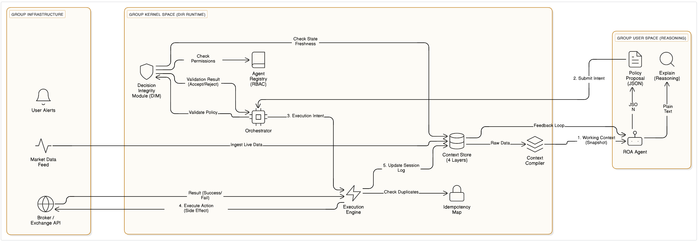

# Decision Intelligence Runtime (DIR): An Architectural Pattern for Safe AI Execution
### Bridging the gap between probabilistic reasoning and deterministic action

**Author:** Artur Huk  
**Repository:** https://github.com/huka81/decision-intelligence-runtime  
**Last updated:** 2026-01-05


## 0. Abstract

Most contemporary AI agent frameworks operate on a simple loop: observe, reason, and act. While effective for conversational tasks, this model fails in high-stakes environments where actions have financial or physical consequences. The core issue is architectural: Large Language Models (LLMs) are probabilistic engines, yet they are often given direct control over deterministic interfaces (APIs, databases).

This paper introduces the **Decision Intelligence Runtime (DIR)**, an architectural pattern derived from two years of prototyping **AIvestor**, an autonomous algorithmic trading system. DIR applies principles from distributed systems orchestration (sagas, idempotency) and security (policy enforcement points) to the domain of AI agents. It proposes a strict separation of concerns where agents are responsible for **Reasoning** (proposing strategies) and a deterministic runtime is responsible for **Execution** (validating and applying those strategies).

By decoupling intent from action, DIR solves common stability issues such as race conditions, hallucinations in function calls, and execution of stale decisions. This document outlines the pattern's core components, including the DecisionFlow ID (an adaptation of distributed tracing for reasoning chains) and the Decision Integrity Module, offering a blueprint for moving agents from experimental scripts to reliable production systems.

## 1. Motivation: Why Agents Need a Runtime

Over the last two years, I built and operated AIvestor, an autonomous system designed to manage a virtual trading portfolio. The initial implementation followed the standard "agentic" pattern popular in the industry: an LLM loop that analyzed market data and directly called broker APIs.

The results were technically impressive but operationally terrifying.

The system was capable of sophisticated reasoning but lacked execution discipline. It would occasionally attempt to sell positions it no longer held because of a state update lag. It would sometimes "hallucinate" a trade retry loop, ignoring API rate limits. Most critically, it treated time as an abstract concept; a "buy" decision made based on a price from 10 seconds ago would be executed 30 seconds later, often incurring slippage that invalidated the original strategy.

These were not failures of intelligence. They were failures of architecture.

### 1.1 The "Probabilistic to Deterministic" Gap

The fundamental problem in modern agent design is the collapse of two distinct concerns into a single loop:

1. **Reasoning (Probabilistic):** The agent interpreting context. This is messy, creative, and non-deterministic.
2. **Execution (Deterministic):** The system changing state (e.g., sending money, updating a record). This requires strict guarantees.

In standard software engineering, we solve similar problems using patterns like **CQRS** (Command Query Responsibility Segregation). We separate the *intent* to change data from the *process* of changing it. Yet, in most AI frameworks, we allow the probabilistic model to write directly to the "database" of the real world.

When reasoning and execution are interleaved, non-determinism leaks into operational behavior. Safety mechanisms become prompts ("Please do not trade if volatility is high") rather than hard constraints. As any security engineer knows, prompts are not permissions.

### 1.2 Moving Beyond "Prompt Engineering" to "System Engineering"

To stabilize AIvestor, I had to stop treating it as a chatbot and start treating it as a distributed system. I realized that reliable agents require the same infrastructure we use for microservices, adapted for the unpredictability of LLMs:

* **Orchestration:** Just as we use tools like Temporal or Cadence to manage long-running workflows, agents need a runtime to manage the lifecycle of a decision.
* **Idempotency:** Agents will repeat themselves. The system must recognize duplicate intents and prevent duplicate side effects (e.g., executing the same trade twice).
* **Traceability:** In a microservice, we use a **Trace ID** (OpenTelemetry) to follow a request. In an agent system, we need to trace the *reasoning chain* that led to an action. This concept evolved into what I call the **DecisionFlow ID (DFID)**.
* **Time-to-Live (TTL):** Data expires. An agent's intent must have a strict validity window. If the runtime cannot execute the decision within that window, it must be discarded, not delayed.

### 1.3 From Experiment to Pattern

The Decision Intelligence Runtime (DIR) is not a software product. It is a set of architectural constraints and patterns designed to make AI systems auditable and safe.

It shifts the design philosophy from **Agent-Centric** (how smart is the model?) to **System-Centric** (how robust is the execution?).

* Agents answer: "What should we do and why?"
* The Runtime answers: "Is this action allowed, valid, and safe to execute right now?"

A note on terminology: Throughout this document, 'ROA' refers to **Responsibility-Oriented Agents**, a pattern for bounding AI autonomy, unrelated to the older Resource-Oriented Architecture definition.

The following sections define the components of this runtime, illustrating how to wrap "fuzzy" agent logic in a "hard" engineering shell.


## 2. Defining the Scope: The Runtime as Middleware

In the early iterations of AIvestor, the agent code was monolithic. The same Python script was responsible for parsing news, deciding on a strategy, and sending HTTP requests to the broker. This tightly coupled design meant that a bug in the reasoning logic (e.g., a loop caused by a misunderstood prompt) resulted in direct operational hazards.

To fix this, I adopted a pattern familiar to OS developers: **Kernel Space vs. User Space separation**.

In this architecture, the **Decision Intelligence Runtime (DIR)** acts as the Kernel. It manages resources, enforcing permissions and time constraints. The Agents operate in User Space; they can request actions, but they cannot execute them directly.

### 2.1 The Architectural Layering

DIR sits strictly between the probabilistic agents and the deterministic infrastructure.



Its responsibilities are scoped to:

1. **Orchestration:** Receiving unvalidated proposals from agents and processing them through a deterministic pipeline.
2. **Validation:** Functioning as a **Policy Enforcement Point (PEP)**, similar to OPA (Open Policy Agent) in cloud-native security.
3. **Translation:** Converting "soft" agent intents (policies) into "hard" execution commands (API calls) with idempotency guarantees.

### 2.2 What It Is Not (Scope Exclusion)

Crucially, the Runtime is **not** an Agent. It contains no LLMs and performs no semantic reasoning. If the system needs to "think" or "interpret," that belongs to the agent layer. The Runtime is purely a state machine designed to govern the side effects of that thinking.

### 2.3 The Agent Registry: System of Record for Responsibilities

In a static system, hard-coding agent permissions works. In AIvestor, as specialized agents (e.g., "Momentum Trader", "Hedge Manager") were added and removed dynamically, hard-coding failed.

DIR introduces an **Agent Registry**-a service discovery mechanism for intelligence.

* **Registration:** On startup, an agent registers its `Manifest`: its ID, its subscribed inputs (Context), and its authorized outputs (Policy Types).
* **Capability Contract:** The Registry acts as the source of truth for ROA constraints. When the Validation Layer asks "Can Agent X trade Asset Y?", it queries the Registry, not the Agent. This prevents agents from self-granting permissions via prompt injection.

**Note on Schema Evolution:**
This dynamism requires that Agents do not "memorize" the policy schema indefinitely. Instead, the Agent Registry serves the current version of the JSON schema dynamically during the Context compilation step. This ensures that even as capabilities evolve, the Agent always reasons against a valid, up-to-date interface contract.

## 3. System Invariants

Instead of a "manifesto," DIR relies on a set of architectural invariants. These are the constraints that must hold true for the system to be considered safe, regardless of how "creative" the LLM becomes.

### 3.1 Invariant 1: Deterministic State Transitions

While the inputs to the system (market data, agent prompts) are non-deterministic, the transition from a **Validated Policy** to an **Execution** must be deterministic.
Given the same Policy Proposal, the same Context Snapshot, and the same Time, the Runtime must always produce the exact same Validation Result. This requires that validation logic be implemented in standard code (Python/Go/Rust) or a policy engine (Rego), never via another LLM call.

### 3.2 Invariant 2: The "Reasoning-Execution" Wall

This is an adaptation of the **Command Query Responsibility Segregation (CQRS)** pattern.

* **Agents (Write Model via Proposal):** Agents perform the reasoning and emit a `PolicyProposal`. This is equivalent to a Command in CQRS, but with a critical distinction: it is *tentative*.
* **Runtime (Execution):** The Runtime validates the proposal. Only if validation passes does it trigger a side effect.
* **Constraint:** No agent is ever permitted to hold API keys or database write credentials. Agents only have permission to "submit proposals" to the Runtime's internal bus.

### 3.3 Invariant 3: Temporal Validity (Deadline Propagation)

In distributed systems like gRPC, we use "Deadline Propagation" to ensure calls don't hang forever. In AI decision systems, we need a similar concept for *information freshness*.
A decision proposed by an agent is only valid for a specific window of time. I call this the **Decision Validity Window (DVW)**.

* *Example:* If an agent proposes "Buy Asset X" based on a price snapshot from `T=0`, and the Runtime processes this at `T+10s`, the validity might have expired.
* *Mechanism:* The Runtime enforces a hard TTL (Time-To-Live) on every proposal. Expired proposals are rejected immediately, preventing "stale" logic from executing in a changed environment.

### 3.4 Invariant 4: Auditability by Correlation

To debug a distributed system, we use Trace IDs. To debug an AI system, we need to trace the *causality*.
Every artifact in the system (from the initial observation to the final API response) is tagged with a **DecisionFlow ID (DFID)**. This allows us to reconstruct the entire narrative: *Context -> Prompt -> Reasoning -> Proposal -> Validation -> Execution*. Without this correlation, explaining *why* the system lost money (or crashed) is impossible.


## 4. DecisionFlow: Distributed Tracing for Reasoning

In microservices, we use **Distributed Tracing** (e.g., OpenTelemetry) to follow a request across service boundaries. We assign a `TraceID` at the ingress and propagate it everywhere.

In AI agents, the complexity lies not just in *where* the request went, but *how* the decision was formed. Standard application logs show "Database Updated," but they don't show the prompt, the context snapshot, or the LLM's rationale that led to that update.

### 4.1 The DFID (DecisionFlow ID)

To solve this in AIvestor, I introduced the **DecisionFlow ID (DFID)**. Conceptually, this is a Correlation ID, but it spans a wider scope than a typical HTTP request. A DFID acts as a container for the entire lifecycle of a single intent.

It binds together:

1. **The Trigger:** The market event or timer that woke the agent up.
2. **The Context Snapshot:** A hash or link to the exact data the agent "saw" (crucial for replayability).
3. **The Reasoning:** The raw LLM output explaining *why*.
4. **The Policy Proposal:** The structured JSON intent.
5. **The Validation Outcome:** Why the runtime accepted or rejected it.
6. **The Execution Result:** The final side effect (e.g., transaction ID).

### 4.2 Hierarchical DecisionFlows

In complex domains, decisions are rarely atomic. A strategic decision ("Reduce Tech Exposure") often spawns multiple tactical decisions ("Sell AAPL", "Buy Put Options").
DIR supports **Parent-Child relationships** between DFIDs.

* **Parent Flow:** Represents the high-level intent (Strategy).
* **Child Flows:** Represent the granular actions (Execution).
This hierarchy allows for precise auditing. If a trade fails, we can trace it back not just to the specific tactical agent, but to the parent strategic mandate that authorized it.

### 4.3 Lifecycle Management

Unlike a stateless HTTP request, a DecisionFlow is a stateful entity. It follows a strict lifecycle managed by the Runtime:

* **CREATED:** The flow is initialized.
* **ACTIVE:** The agent is reasoning or a proposal is being validated.
* **CLOSED:** Execution completed successfully.
* **ABORTED:** The flow was terminated due to validation failure, timeout (TTL), or error.

## 5. The Interface: Policies as Contracts

The most common mistake in agent development is allowing the LLM to output free text or directly generate code (e.g., SQL). This makes the system unpredictable and hard to parse.

In DIR, the interface between the Agent (Reasoning) and the Runtime (Execution) is strictly defined by a schema. We call this the **Policy**.

### 5.1 Agents Propose, Runtimes Dispose

This follows the **Declarative API** pattern (similar to Kubernetes manifests).

* The Agent does not say: *"Call the API to buy Apple stock."* (Imperative)
* The Agent emits a Policy Object: *"I desire a state where we own 10 shares of AAPL, given current price X."* (Declarative)

The Runtime then evaluates if this desired state is permissible.

### 5.2 The "Explain vs. Policy" Separation

In practice, I found that LLMs perform better when allowed to "think out loud" before committing to a format. Therefore, the Agent's output is split into two distinct channels:

1. **Explain (Unstructured):** A natural language narrative for human auditors. **It provides human context.**
2. **Policy (Structured):** A strict JSON/Pydantic object containing the specific parameters for the action. **It provides machine-interpretable intent.**

The Runtime validates *only* the Policy. The Explanation is treated as metadata (comments). This separation prevents the system from mistaking a narrative justification for an executable instruction.

**Intent vs. Execution Tactics**
It is important to clarify that a Policy Proposal is not a raw market order (e.g., "Buy at market NOW"). Given the latency of LLM inference, such an approach would suffer from inevitable slippage. Instead, ROA Agents emit **Strategic Intents** (e.g., "Acquire position with 5% aggressiveness, limit slippage to 0.5%"). The Runtime is responsible for the **Tactical Execution** of this intent using deterministic algorithms (e.g., TWAP/VWAP or limit chasing). This effectively decouples the "slow" reasoning of the Agent from the "fast" execution of the market interaction layer. The `valid_until` constraint protects the strategy from becoming stale, not the individual network packet.

**Example Structure (JSON):**

```json
{
  "dfid": "550e8400-e29b-41d4-a716-446655440000",
  "agent_id": "risk_manager_v1",
  "policy_kind": "ADJUST_POSITION",
  "params": {
    "symbol": "BTC-USD",
    "action": "REDUCE",
    "quantity": 0.5
  },
  "context_ref": "snapshot_hash_x9823",
  "valid_until": "2024-01-05T12:00:10Z"
}

```

### 5.3 Claims vs. Facts

A Policy Proposal is treated as a **Claim** (an untrusted assertion), not a **Fact**.
The Agent *claims* that selling Bitcoin is the right move. It becomes a *fact* (an executed event) only after the Runtime validates the signature, the permissions, and the market state. This distinction prevents the "authority bias" where we implicitly trust the AI just because it produced an output.

---


## 6. Validation: The Deterministic Gate (DIM)

In the "User Space vs. Kernel Space" analogy, the **Decision Integrity Module (DIM)** is the kernel's access control list. It is the gatekeeper that determines whether a User Space proposal is allowed to touch the infrastructure.

### 6.1 Deterministic Enforcement, Not Probabilistic Guessing

A common anti-pattern in agent systems is "LLM-based validation"-asking a second LLM to critique the first one. While useful for improving reasoning quality, this is insufficient for safety.

In DIR, the validation layer is strictly **deterministic**. It is implemented in code (e.g., Python, Go, or Rego policies), not prompts. Given inputs `(Policy, Context, Time)`, the output must always be `ACCEPT` or `REJECT`.

### 6.2 The Validation Pipeline

The pipeline functions as a **Policy Enforcement Point (PEP)**. It evaluates proposals against three layers of constraints:

1. **Schema & Integrity:** Does the JSON match the versioned schema?
2. **Authority (RBAC):** Is this agent authorized in the *Agent Registry* to execute this Policy Kind?
3. **State Consistency (Optimistic Concurrency):** Does the `context_hash` in the proposal match the current system state? If slippage occurred, reject with `STALE_CONTEXT`.

### 6.3 Semantic Alignment Check (The "Liar" Detection)

A subtle failure mode in LLMs is "proxy gaming," where the model's narrative ("I am reducing risk") contradicts its structured policy (`{"action": "BUY_LEVERAGE"}`).
To counter this, DIR supports an optional **Semantic Alignment Check**. Before execution, a separate, smaller model (or strict logic) compares the `explanation` field against the `policy` payload. If the semantic intent diverges from the technical instruction, the proposal is rejected as **HALLUCINATION_MISMATCH**.

**The Determinism Trade-off**

Critics might argue that introducing a semantic check (using a smaller model) into the validation pipeline violates the principle of a purely deterministic Runtime. This is a deliberate trade-off. While the "Hard Gates" (Schema, RBAC, Risk Limits) are purely algorithmic and blocking, the Semantic Check acts as a **Probabilistic Guardrail** for high-stakes anomalies (e.g., detecting if an agent's narrative contradicts its JSON payload). In production, this check can be configured as blocking (for high-risk actions) or async-audit (for low-risk actions), allowing the operator to tune the balance between absolute determinism and semantic safety.

### 6.4 Time as a Hard Constraint

The Runtime enforces the **Decision Validity Window**. If `current_time > policy.valid_until`, the proposal is rejected immediately. This prevents the "queued command" problem where a backlog of old decisions suddenly executes hours later.

## 7. Execution: Idempotency and Side Effects

Once a policy is accepted, the system must cross the "Rubicon" into the real world. This is where we encounter the messy reality of external APIs: timeouts, network partitions, and 500 errors.

### 7.1 The Golden Rule: No Side Effects Without Intent

DIR enforces a strict security boundary:
**No side effect may occur without an explicit Execution Intent.**

Agents (User Space) never hold API keys or database credentials. They cannot open sockets. They can only submit proposals to the Runtime. The Runtime, after validation, transforms the `PolicyProposal` into an `ExecutionIntent`. This object is the only artifact in the system authorized to trigger external IO.

### 7.2 Idempotency: The "Double-Spend" Protection

LLMs can get stuck in loops, proposing the same action repeatedly. Network retries can also deliver the same message twice.
To protect against this, DIR assigns a deterministic **Idempotency Key** to every Execution Intent, derived from the `DFID`.

* If the Runtime sees a duplicate key, it returns the *cached result* of the previous execution rather than triggering the API again.
* This ensures that "Retry" logic is safe and does not result in opening two positions instead of one.

### 7.3 Handling "Unsafe" Executors

Not all external APIs are transactional. In AIvestor, I adopted an **At-Most-Once** delivery strategy for high-risk actions. If an execution fails with an ambiguous error (e.g., timeout), the Runtime marks the DecisionFlow as `SUSPENDED` rather than blindly retrying. It is safer to miss a trade than to execute a trade in an unknown state.

---

## 8. Context Management: Compilation over Conversation

In standard chatbots, "context" is simply the chat history. In an autonomous system like AIvestor, treating the entire event log as context is dangerous. It leads to **Context Window Overflow** and "distraction."

DIR treats context not as a log, but as a **Compiled Artifact**.

### 8.1 The 4 Layers of Context

To organize information effectively, the **Context Store** is structured into four distinct layers, each with different persistence and retrieval properties:

1. **Session (Ephemeral):** The append-only record of the current DecisionFlow (observations, proposals, validation results). It resets when the flow closes.
2. **State (Authoritative):** The current, trusted view of the world (e.g., wallet balance, open positions). This is often a read-replica of the external system state.
3. **Memory (Long-Lived):** Curated insights that persist across sessions (e.g., "Strategy A failed in high volatility").
4. **Artifacts (Reference):** Large blobs referenced by pointers (e.g., PDF reports, datasets) that are too large to fit in the prompt but available for tool-use retrieval.

### 8.2 Context Compilation Pipeline

Agents do not query the database directly. Instead, the Runtime executes a deterministic **Context Compilation** step before invoking the agent. This is analogous to the **Retrieval-Augmented Generation (RAG)** pattern, but strictly structured.

The Compiler filters noise, enforcing a "Need-to-Know" policy.


* *Inputs:* Raw Event Log, Market State, Static Rules.
* *Process:* Filter by Time -> Filter by Relevance (RAG) -> Format (JSON/Text).
* *Output:* `WorkingContext` object passed to the LLM.

### 8.3 Implementation Logic

The compilation process handles the **External State Paradox** (where the world changes while the agent thinks). It snapshots the state *at the moment of invocation*.

**Context Compiler**

```python
def compile_working_context(agent_id: str, dfid: str) -> dict:
    # 1. Fetch Authoritative State (Snapshot)
    current_state = state_store.get_snapshot(timestamp=now())
    
    # 2. Retrieve relevant history (Session)
    session_events = event_log.query(dfid=dfid, limit=10)
    
    # 3. Retrieve static instructions (Memory)
    mission = memory_store.get_mission(agent_id)
    
    # 4. Assemble Immutable Context Object
    return {
        "snapshot_id": current_state.hash, # For optimistic locking later
        "market_data": current_state.data,
        "recent_history": session_events,
        "mission": mission
    }

```

---

## 9. Human-in-the-Loop: Governance by Exception

The goal of autonomy is to reduce human toil, yet many agent frameworks default to a "Mother-May-I" pattern where a human must approve every single step. This leads to **Alert Fatigue**.

DIR adopts a **Governance by Exception** model. The system acts autonomously within defined bounds and requests help *only* when those bounds are crossed.

### 9.1 Escalation as a System State

Escalation is not an error; it is a valid state transition in the DecisionFlow.
When the Runtime encounters a situation it cannot resolve deterministically (e.g., ambiguity, risk limit violation, or repeated API failures), it transitions the flow to `ESCALATED`.


* *Nodes:* CREATED -> ACTIVE -> (Validation) -> [ACCEPTED | REJECTED | ESCALATED].
* *Transitions:*
* `ACCEPTED` -> EXECUTION -> CLOSED.
* `ESCALATED` -> (Human Review) -> [RESUME | ABORT].


### 9.2 Triggers for Intervention

In AIvestor, I defined clear criteria for when the machine must wake the human:

1. **Authority Violation:** Agent attempts to trade >$1000 (Hard Limit).
2. **Model Uncertainty:** Agent produces a Policy with `confidence < 0.7`.
3. **Operational Failure:** Broker API returns 5xx error more than 3 times.
4. **Silence Watchdog:** No decision produced for >30 minutes during market hours.

### 9.3 Escalation Throttling (The Circuit Breaker)

A failing agent can generate hundreds of escalation requests per minute, essentially DDoS-ing the human operator.
DIR implements an **Escalation Budget**.

* *Mechanism:* Each agent has a token bucket for escalations (e.g., 3 per hour).
* *Action:* If the budget is exhausted, the agent is automatically demoted to a `PASSIVE` (Read-Only) state, and the DecisionFlow is silently aborted. This protects the operator from alert floods.

**Resource Quotas**
Beyond simple rate-limiting, the Runtime enforces a "Computation Budget" (token usage or max reasoning steps) per DecisionFlow. If an agent cannot reach a policy conclusion within N steps, the flow is aborted to prevent "financial DDoS" caused by inconclusive reasoning loops.

### 9.4 The Human Interface

When a flow is escalated, the human acts as a **Super-User**.
The Runtime presents the `WorkingContext`, the `PolicyProposal`, and the `Reason` for escalation. The human then issues a binding decision: **OVERRIDE**, **MODIFY**, or **ABORT**.

**[Escalation Event]**

```json
{
  "event_type": "ESCALATION_REQUIRED",
  "dfid": "trace_123_abc",
  "reason": "RISK_LIMIT_EXCEEDED",
  "details": {
    "proposed_value": 1500,
    "limit": 1000
  },
  "status": "AWAITING_HUMAN_INPUT"
}

```


## 10. Implementation Topologies: From Monolith to Mesh

A runtime pattern is only useful if it scales. While the logic of DIR (Validation, Execution, Context) is universal, the deployment topology changes as the system grows.

DIR does not mandate a specific architecture. It acts as a **substrate** that can host various agent interactions.

### 10.1 The Single-Process MVP (The "AIvestor" Model)

For most prototypes and early-stage production systems (like the current version of AIvestor), DIR runs effectively as a modular monolith.

* **Infrastructure:** Single Python process or Container.
* **Communication:** In-memory queues (e.g., Python `asyncio.Queue`).
* **State:** Local SQLite or PostgreSQL.
* **Pros:** Easy to debug, zero network latency between Agent and Runtime.
* **Cons:** Single point of failure, hard to scale processing power.

### 10.2 The Distributed Event-Driven Architecture (EDA)

For enterprise scale, DIR maps naturally to an **Event-Driven Architecture**.

* **Infrastructure:** Microservices (Agents are services, Runtime is a service).
* **Communication:** Message Bus (e.g., Kafka, RabbitMQ, NATS).
* **State:** Distributed Key-Value Store (Redis) + Time Series DB.
* **Pattern:** The **Event-Oriented Agent Mesh**. Agents emit `PolicyProposal` events to a topic; the Runtime consumes them, validates, and emits `ExecutionIntent` events.


* *Left:* Agents inside the same box as Runtime.
* *Right:* Agents and Runtime connected by a Message Bus.

This flexibility allows teams to start small (Monolith) and refactor to microservices (Mesh) without changing the core decision logic or validation rules.

## 11. Case Study: Lessons from AIvestor

The principles in this document were not derived from academic theory. They were reverse-engineered from failures encountered while building **AIvestor**, an autonomous trading prototype running continuously for the past year.

### 11.1 The "Slippage" Incident (Why we need Time Validity)

Early versions of AIvestor had no concept of Decision Validity Windows. On one occasion, the system experienced a latency spike due to API rate limiting. An agent calculated a trade based on a price of $100. The execution happened 45 seconds later when the price was $102. The system executed the trade, locking in an immediate loss.

* *Lesson:* A decision is only good for the moment it was made. This led to the implementation of strict **TTL (Time-To-Live)** on all proposals.

### 11.2 The "Infinite Retry" Loop (Why we need Idempotency)

During a broker API outage, an agent correctly identified that a trade failed. However, the agent's recovery logic was "Try again." Without a runtime-managed retry policy, the agent spammed the API, eventually getting the IP banned.

* *Lesson:* Agents should not handle retries. The Runtime handles reliability using **Idempotency Keys** and **Exponential Backoff**.

### 11.3 Debugging the "Black Box" (Why we need DFID)

After a week of operation, the portfolio balance drifted inexplicably. Logs showed *what* trades happened, but not *why*. I spent days grepping through scattered text logs to find the prompt that caused a specific bad trade.

* *Lesson:* Logs are useless without correlation. Implementing **DecisionFlow ID (DFID)** allowed me to visualize the entire chain: *Market Signal -> Prompt -> Agent Thought -> Policy -> Action*.

## 12. Trade-offs and Limitations

Engineering is about trade-offs. Adopting DIR introduces friction and cost. It is not a silver bullet.

### 12.1 Latency vs. Safety

DIR introduces a "Validation Tax." Every decision must be serialized, validated, and logged before execution.

* *Trade-off:* In High-Frequency Trading (HFT), where microseconds matter, DIR is too slow.
* *Fit:* DIR is optimized for "Human-Speed" or "Business-Speed" decisions (seconds to minutes), where safety outweighs raw speed.

**Why Blocking Validation Matters**
In many recommender systems, bad decisions affect "reputation" or "ranking" asynchronously. In financial or physical systems, a bad decision creates an irreversible loss (financial or kinetic). Therefore, DIR favors **Pre-flight Validation** over **Post-flight Audit**. While this introduces latency, it enforces the "Safety First" invariant. A missed trade due to aggressive validation is an opportunity cost; a realized hallucination is an actual loss. The system is designed to fail safe (reject) rather than fail open (execute and apologize).

### 12.2 Complexity Overhead

Implementing a Context Compiler, Policy Engine, and State Machine is significantly harder than writing a `while True` loop with an LLM.

* *Trade-off:* For simple experimental scripts, DIR is over-engineering. It pays off only when the cost of failure is non-zero (e.g., handling money, PII data, or customer interactions).

### 12.3 The "Human Bottleneck" in Policy Design

DIR moves the complexity from "Prompt Engineering" to "Policy Engineering." Defining the JSON schemas, RBAC roles, and validation rules (Rego/Python) requires domain expertise that cannot be automated. You still need humans to define *what* is safe.

## 13. Conclusion: From Chatbots to Systems

We are currently in the "wild west" phase of Agentic AI. Developers are connecting powerful probabilistic models directly to sensitive APIs, relying on "prompt injection defense" as their only safety net.

This is unsustainable.

As we move from building chatbots to building autonomous systems, we must stop treating AI as a magic box and start treating it as an untrusted component in a critical system.
**The Decision Intelligence Runtime (DIR)** is an architectural response to this reality. By separating **Reasoning** (the Agent) from **Execution** (the Runtime), and enforcing strict invariants like **Idempotency**, **Temporal Validity**, and **Auditability**, we can build systems that are not just "smart," but also safe, reliable, and accountable.

AIvestor proved that an LLM can trade stocks without going broke-but only when it is put in a straightjacket of deterministic engineering.

