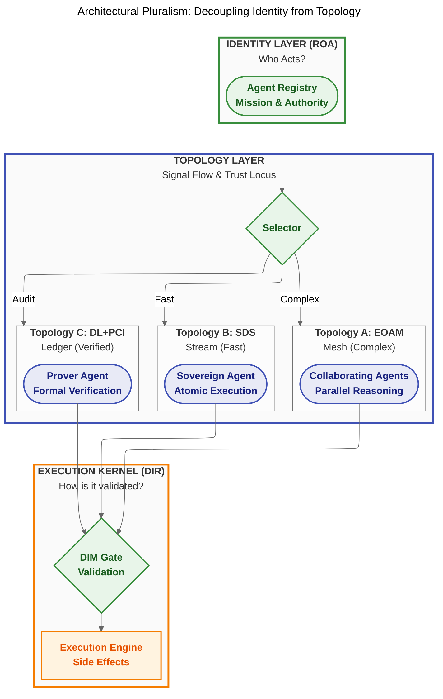
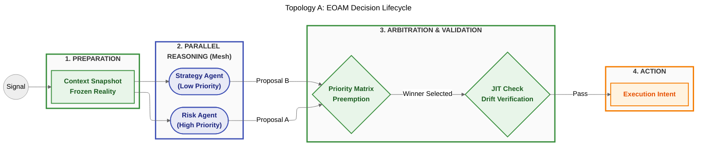
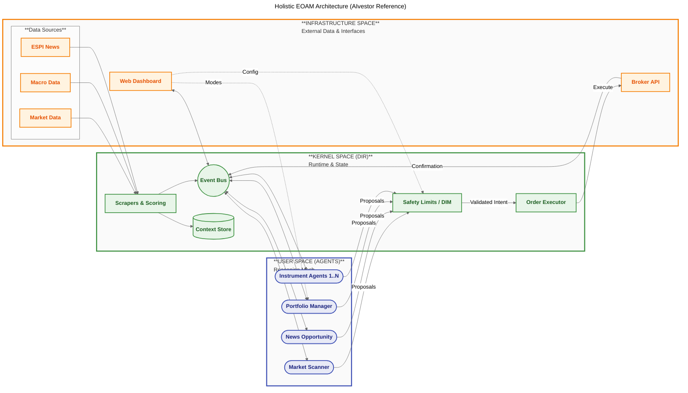
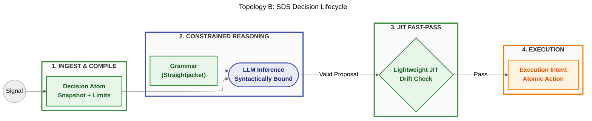
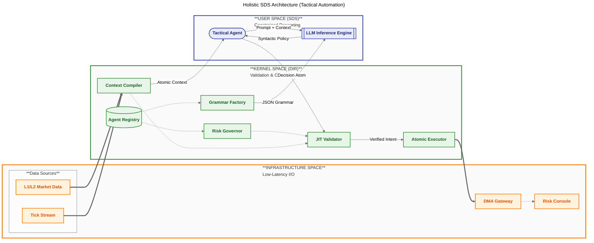
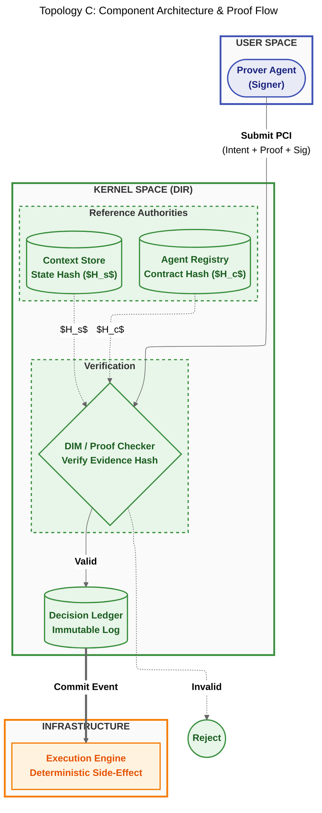
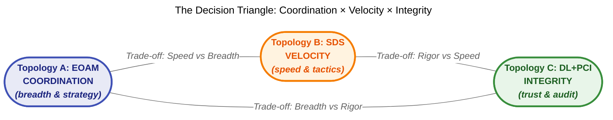
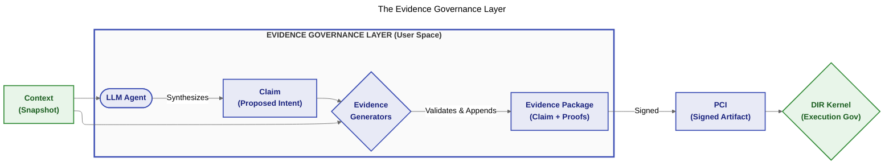
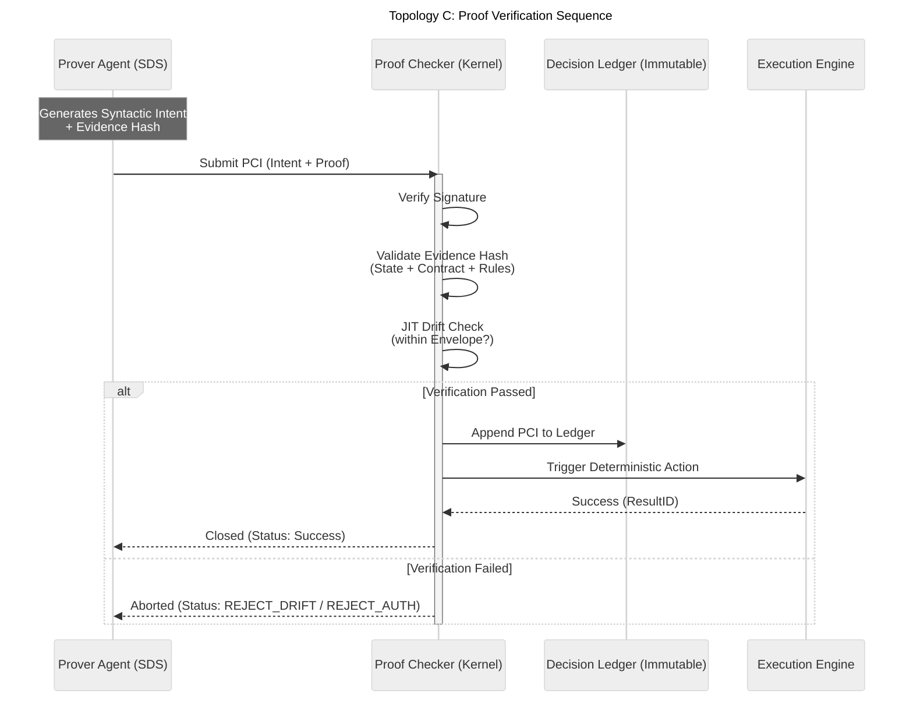

<sup> Author: Artur Huk | [GitHub](https://github.com/huka81/decision-intelligence-runtime) | Created: 2026-01-15 | Last updated: 2026-02-20 </sup>

---

# Decision Intelligence Topologies: Scaling Auditable Autonomy


### Agent orchestration patterns for complex decision systems


## 0. Abstract

> **Disclaimer:** This document describes system topologies and communication patterns for autonomous agents. It assumes the existence of the **Decision Intelligence Runtime (DIR)** to handle deterministic execution and the **Responsibility-Oriented Agents (ROA)** framework to define agent identity.

The transition from experimental AI scripts to production-grade decision systems requires a fundamental shift in how agents interact within an environment. A single architectural pattern cannot satisfy the conflicting requirements of complex, multi-perspective strategic reasoning, high-frequency tactical execution, and absolute compliance verification.

This whitepaper introduces **Decision Intelligence Topologies**, a pluralistic approach to agent orchestration. We define three distinct operational modes:

1.  **Topology A: Event-Oriented Agent Mesh (EOAM)** - A decentralized pattern for "Organizational Choreography," where responsibility-bound agents collaborate through a reactive event substrate to form a "Digital Twin" of professional decision-making.
2.  **Topology B: Sovereign Decision Stream (SDS)** - A linear, high-velocity pattern for "Atomic Execution," leveraging **Constrained Decoding** to achieve **Syntactically Bound by Design** operations at machine speeds.
3.  **Topology C: Decision Ledger (DL+PCI)** - The pattern for "Formal Verification & Absolute Audit," focusing on the integrity of the intent artifact rather than the behavior of the agent.

By selecting the appropriate topology for the specific decision class, verified by **DecisionFlow IDs (DFID)** and governed by the **Decision Intelligence Runtime**, organizations can build systems that are scalable, auditable, and resilient to the non-deterministic nature of Large Language Models.

---

## 1. The Case for Architectural Pluralism

In the early phases of AI adoption, engineers often seek a "Universal Agent Architecture"-a single loop to rule them all. However, in production environments like the **AIvestor** financial system, this monolithic approach fails. The latency required to "think fast" (scalping a price inefficiency) is incompatible with the comprehensive context required to "think slow" (rebalancing a portfolio against geopolitical risk).

To solve this, we decouple the **Identity Layer** from the **Topology Layer**:

*   **The Identity Layer (ROA):** Who acts? (Defined by Responsibility Contracts).
*   **The Execution Kernel (DIR):** How is it validated? (Defined by DFIDs, Hard Gates, and Idempotency).
*   **The Topology (EOAM / SDS / DL):** How do signals flow, and where does trust originate?

Each topology defines two orthogonal properties:

1.  **Signal Flow** — the communication pattern between agents and the runtime (mesh, stream, or ledger).
2.  **Trust Locus** — the architectural location where safety is guaranteed:
    *   **Process** (EOAM): The Runtime validates proposals *after* generation.
    *   **Generation** (SDS): The Grammar constrains output *during* inference.
    *   **Artifact** (DL+PCI): The Proof-Carrying Intent carries verifiable evidence *within itself*.

This separation allows a single systems architecture to support deliberate mesh networks, hyper-fast singular streams, and formally verified ledgers side-by-side. The three topologies are not incremental layers of the same pattern; they represent fundamentally different answers to the question: *"Where does safety come from?"*

A key motivation for this pluralistic approach is the limitation of conventional multi-agent frameworks, which typically rely on unstructured LLM-to-LLM dialogue or manager-led hierarchies. While powerful for creative synthesis, these patterns produce non-deterministic outcomes that are difficult to audit in regulated environments. The topologies defined here replace **dialogue with choreography** (typed signals, not chat), **democracy with priority** (deterministic preemption, not negotiation), and **mystery with audit** (DFID-bound causal chains, not opaque chat logs).

Viewed through the lens of formal state integrity, the three topologies are not merely operational alternatives — they are **specialized protectors of different Legal Decision State (LDS) components**. A decision is only valid when five invariants hold simultaneously: `LDS = Context (C) ∧ Authority (A) ∧ Intent (I) ∧ Evidence (E) ∧ Time (T)`. EOAM guards temporal and contextual integrity (`¬T`, `¬C`); SDS enforces intent integrity (`¬I`); DL+PCI acts as the cryptographic certificate that all five held at once. The pluralism is not a matter of taste — it is a consequence of the different threat models each LDS component faces.



---

## 2. Topology A: The Event-Oriented Agent Mesh (EOAM)

**Primary Attribute:** Organizational Choreography
**Ideal For:** Complex Strategy, Multi-Perspective Analysis, Resilience

EOAM is a decentralized architectural pattern where autonomous agents collaborate through a reactive event substrate. It defines a system that is **"Decentralized in activation, centralized in authority."** EOAM trades the conceptual simplicity of linear orchestration for the power of **parallelism** and **resilience**.

> **LDS Role — Temporal and Contextual Integrity (`¬T`, `¬C`):** EOAM's primary formal function is to prevent the system from executing a decision against an expired or drifted reality. Drift Envelopes define the maximum tolerable divergence between the context snapshot used for reasoning and the live system state at execution time. JIT Verification enforces this boundary immediately before any side effect. If the reality has moved beyond the envelope, the execution is rejected — ensuring the Time (T) and Context (C) invariants of the Legal Decision State are never violated.

### 2.1 Scope-Based Choreography

EOAM replaces the central "Manager" with **Scope-Based Choreography**. Agents do not wait for commands; they are reactive entities that monitor the event bus for **Observations** or **Triggers** that fall within their defined **Responsibility Contract**.

*   **Autonomy through Subscription:** Agents subscribe to specific metadata-such as a ticker symbol or risk domain-defined in the **Agent Registry**.
*   **Decentralized Intelligence:** When a new signal (e.g., a news event) enters the mesh, all relevant agents (Risk, Sentiment, Strategy) are activated in parallel.
*   **Inversion of Control:** The Runtime does not "call" agents; it emits a context-rich event, and agents "claim" the responsibility to reason.

### 2.2 The Anatomy of a Mesh Event

Every event transmitted through the mesh adheres to a strict schema to facilitate causality tracking.

*   **DecisionFlow ID (DFID):** The primary correlation identifier, functioning as an immutable trace header for the entire decision lifecycle. It allows for narrative reconstruction and deterministic idempotency.
*   **ContextSnapshotID:** A unique hash representing the exact "frozen reality" that an agent utilized. This ensures that every **PolicyProposal** is linked to the version of the world the agent "saw," enabling **Just-In-Time (JIT) State Verification**.

### 2.3 Semantic Routing & Economic Guardrails

In a decentralized mesh, mitigating noise and cost is critical.

*   **Semantically Constrained Routing:** The underlying transport acts as a "dumb pipe," relying on rules from the **Agent Registry** to match topics to subscribers based on Least Privilege.
*   **Wake-up Predicates (Signal Suppression):** To prevent "Token Burn" (waking up expensive LLMs for minor signals), the Runtime evaluates low-cost heuristic predicates (e.g., `abs(price_delta) > 0.5%`) defined in the agent's manifest. If the predicate fails, the event is suppressed at the routing layer.
*   **Economic Admission Control:** The Mesh implements a strict "Budget-to-Signal" filter. The system determines how many agents to activate based on signal volatility and available token budget, preventing "Thundering Herd" costs where low-value signals trigger expensive multi-agent cascades.

### 2.4 The Mesh Decision Lifecycle

1.  **Observation:** A raw signal triggers a new **DecisionFlow**. The Runtime generates an authoritative **Context Snapshot** (cached to prevent **Read Contention** on the database).
2.  **Distributed Parallel Reasoning:** Agents reason in parallel, producing **PolicyProposals**.
3.  **Priority-Based Preemption Model:** The Runtime utilizes a priority-driven logic rather than a simple time window. It collects proposals and applies the **Agent Registry Priority Matrix** to select the winner. High-priority agents (e.g., Risk Monitors) can preempt or invalidate earlier strategic proposals, ensuring safety always overrides strategy.
4.  **JIT Verification:** The Runtime compares the live state against the `ContextSnapshotID`. If the **Drift** exceeds the agent-defined **Drift Envelope** (a contract-level parameter stored in the Registry), the execution is rejected. This prevents actions based on stale data (e.g., execution against a price that has moved beyond the allowable slippage/latency threshold).



### 2.5 The Agent DMZ (Semantic Design Pattern)

Within the EOAM topology, a critical semantic design pattern is the **Agentic DMZ (Demilitarized Zone)**. This pattern mitigates the profound threat of conversational AI: the extraction of Intellectual Property (IP), proprietary pricing algorithms, or internal policy rules via "fuzzing" attacks or prompt injections from external users or autonomous broker bots.

Instead of introducing a new topology, the DMZ acts as a strict arrangement of agents within the Event-Oriented Agent Mesh, leveraging the fundamental division of **Action (Write) boundaries vs. Observation (Read) boundaries**:

1. **The `INTERFACE` Agent (The Receptionist):** Positioned at the Edge. This agent interacts directly with external entities. Under the principle of Context Starvation (Epistemic Amnesia), it has absolute zero knowledge of the business logic. It simply parses noisy conversational input into clean structural events. It is explicitly forbidden from generating a `PolicyProposal`, an `EvidencePackage`, or a `PCI`.
2. **The Event Bus (Observation Boundary):** The Event Bus facilitates communication between the Edge Zone and the Internal Core without activating the Decision Integrity Module (DIM). **Crucially:** Communications across the bus do not require DIM validation because the bus carries signal distribution—not execution intent. It holds no *executable* authority. However, to prevent data leaks (like a DMZ agent intercepting sensitive internal payloads), the bus requires strict **information-flow control** managed by the Agent Registry (Least Privilege subscription). DIM protects the mutation boundary, while the Registry and Event Bus protect the disclosure boundary.
3. **The `STRATEGIST` / `EXECUTOR` Agent (The Brain):** Positioned in the Internal Core, structurally "air-gapped" from the external world. It subscribes to the Event Bus, reads the structural JSON payload emitted by the Receptionist, and applies its proprietary business intelligence to emit a true `PolicyProposal`. Since it does not interact directly with external prompts, its contextual knowledge remains secure.

This pattern demonstrates the EOAM philosophy: the mesh handles the distribution of non-executable signals safely under static least-privilege rules (the Event Bus), while the DIM stands guard exclusively at the final Rubicon of state mutation (the The Wall / Outbound Execution).

### 2.6 Holistic EOAM Architecture (Example Implementation)

The following diagram illustrates a complete "Event-Oriented Agent Mesh" implementation, derived from the **AIvestor** reference system. It demonstrates how Data Sources, Agents, and Execution components map to the DIR architectural spaces (Infrastructure, User, Kernel).



---

## 3. Topology B: The Sovereign Decision Stream (SDS)

**Primary Attribute:** Atomic Execution Velocity
**Ideal For:** Tactical Automation, Risk Stops, Reactive Decision-Making

> **A note on latency:** SDS minimizes decision latency *relative to multi-agent topologies* (EOAM), but it still involves LLM inference (typically 100ms-2s). It is not designed for microsecond-scale High-Frequency Trading (HFT), which requires deterministic code paths without probabilistic reasoning. SDS targets "fast-for-AI" decisions (sub-second to low-second), not "fast-for-hardware" decisions (sub-millisecond).

While the **Event-Oriented Agent Mesh (EOAM)** excels at multi-perspective coordination and organizational "Digital Twins," it introduces significant latency and computational overhead due to its reliance on parallel orchestration and arbitration.

The **Sovereign Decision Stream (SDS)** is an alternative architectural pattern designed for low-latency, cost-efficient, and structurally safe decision-making. SDS treats the decision process as a "straight-line" function rather than a choreographic dialogue. It achieves structural safety not through post-generation validation (the "Audit" model), but through **Constrained Decoding**-embedding the deterministic rules of the **Decision Intelligence Runtime (DIR)** directly into the probabilistic sampling of the Large Language Model.

> **LDS Role — Intent Integrity (`¬I`):** SDS is the only topology that enforces the Intent invariant at the generation layer. By compiling the Responsibility Contract and schema constraints into a formal grammar and applying it during LLM sampling, SDS makes it **physically impossible** to generate an intent that violates contractual bounds. A `¬Intent` condition — an out-of-bounds or malformed proposal — cannot be emitted as output, because the grammar masks non-compliant tokens before they are ever sampled. Safety is not a post-generation check; it is a structural property of inference itself.

### 3.1 The SDS Philosophy: "Syntactically Bound by Design"

> **Mandatory Disclaimer:** Constrained Decoding (Grammar-based sampling) ensures structural integrity and boundary adherence but **DOES NOT** guarantee semantic alignment with the ROA Mission. Final semantic and safety validation remains the exclusive responsibility of the DIR Decision Integrity Module (DIM).

In the SDS topology, the separation between User Space (Reasoning) and Kernel Space (Validation) remains architecturally absolute, but becomes executionally transparent. SDS replaces the "Thundering Herd" of parallel agents with a single, high-context **Decision Atom**.

#### 3.1.1 Constrained Decoding (The Safety Straightjacket)

The cornerstone of SDS is the use of grammars (e.g., via libraries like *Outlines* or *Guidance*) to enforce the **Responsibility Contract** during inference.

*   **Deterministic Sampling:** The LLM is physically unable to generate a token that violates the JSON schema or numerical bounds defined by the DIR.
*   **Elimination of Syntax Errors:** Because the output is constrained by a state machine, the resulting **PolicyProposal** is guaranteed to be syntactically valid and semantically bounded before it even reaches the Runtime.

#### 3.1.2 The "Atomic Context": Input to Inference

In SDS, there is no emergent context or asynchronous message passing. The **Context Compiler** assembles an **Atomic Context**-a pre-validated package containing:

1.  **The Mission** (from ROA).
2.  **The Constraints** (from dir_core Hard Gates).
3.  **The Snapshot** (from the Context Store).

**Critical Binding:** The Agent's output (The Intent) **MUST** include the `ContextSnapshotID` hash-binding from the input. The DIR verifies this JIT to prevent execution against a drift-unverified state. The combination of the **Atomic Context**, the **Intent**, and the **Signature** forms the final **Decision Atom**.

### 3.2 The SDS Decision Lifecycle

The SDS lifecycle collapses the multi-agent choreography of EOAM into a streamlined, four-stage pipeline.

1.  **Ingest & Compile:** A trigger event initializes a **DecisionFlow (DFID)**. The Runtime compiles the "Decision Atom," injecting authority limits directly into the prompt metadata.
2.  **Constrained Reasoning (SDS Loop):** The agent performs its **Explain** phase. When transitioning to the **Policy** phase, the inference engine switches to a constrained mode, utilizing the DIR-provided grammar to ensure the proposal is "**Syntactically Bound by Design**".
3.  **JIT Fast-Pass Validation:** Because the proposal was generated under constraint, the **Decision Integrity Module (DIM)** performs only a lightweight **Just-In-Time (JIT) State Verification** to check for environment drift since the snapshot.
4.  **Execution:** The **PolicyProposal** is immediately transformed into an **Execution Intent**.



### 3.3 Holistic SDS Architecture (High-Performance Implementation)

The following diagram illustrates a complete **Sovereign Decision Stream (SDS)** architecture, designed for maximum throughput and minimal latency. It highlights the direct path from observation to execution, bypassing the complex event bus choreography of EOAM while maintaining strict safety via the "Straightjacket" grammar.



### 3.4 Design Intent: The "Fly-by-Wire" Paradigm

To visualize **Topology B**, consider the control system of a modern **Fighter Jet** (Fly-by-Wire).

In older aircraft (like standard scripts), the pilot's stick was mechanically connected to the wings. If the pilot pulled too hard, the wings could snap off. In a Fly-by-Wire system, there is no mechanical link.

*   **The Pilot (The Agent)** inputs an intent ("Pull up").
*   **The Flight Computer (The Grammar)** intercepts the signal. It knows the airframe's structural limit is 9G. Any stick input that would exceed that envelope is **rejected at the input layer** — the control surfaces physically will not respond to it. The pilot must issue a command *within* the safe envelope for the system to act.
*   **The Result:** The pilot retains full authority within the safe flight envelope, but the physics of the system make it impossible to exceed structural limits, regardless of intent.

**Topology B** applies this to decision-making. The Agent has "Sovereign" speed and authority, but it operates through a **Grammar**. It does not matter if the LLM's probability distribution favors trading 1,000,000 lots; the Grammar **masks that token at the sampling layer**, making it impossible to generate. The LLM must select from the remaining valid tokens. This allows the system to operate at high speeds (skipping the slow "Manager Review") because the "Physics of the System" (Syntax/Grammar) guarantees structural integrity.

---

## 4. Topology C: The Decision Ledger (DL+PCI)

**Primary Attribute:** Formal Verification & Absolute Audit
**Ideal For:** Compliance-Heavy Operations, Inter-Organizational Settlements, High-Value Transfers

**Topology C** represents the ultimate stage of formal verification within the Decision Intelligence Runtime framework. It shifts the focus from "trusting the agent" (EOAM) or "constraining the agent" (SDS) to **"verifying the artifact."**

> **LDS Role — Cryptographic State Certificate (`C ∧ A ∧ I ∧ E ∧ T`):** DL+PCI does not protect a single LDS component — it demands cryptographic proof that **all five held simultaneously** at the moment the intent was formed. The Proof-Carrying Intent is not a request for trust; it is a self-contained certificate asserting that Context was authentic, Authority was in scope, Intent was within bounds, Evidence was verifiable, and Time had not expired. The Proof Checker verifies this certificate deterministically, without reasoning. The Decision Ledger stores the certificate immutably. The result is a topology where safety is a structural property of the data artifact itself — independent of the agent, the runtime, or any network condition.

### 4.1 The Philosophy: Proof-Carrying Intents (PCI)

In this model, the system operates on a "Zero-Trust" basis regarding the agent's reasoning process. The **Decision Ledger** does not execute an intent because an agent "said so"; it executes it only if the intent carries an immutable proof of compliance.

This transitions the architecture from **Active Agents** to **Proof-Carrying Intents (PCI)**. The safety is a property of the data structure itself, not the process that generated it.

### 4.2 The Decision Ledger

The **Decision Ledger** is an append-only, immutable record that serves as the "Immutable Source of Truth" for the system.

*   **Append-Only:** History cannot be rewritten. Every decision, whether successful or rejected, is permanently recorded.
*   **Idempotency:** The Ledger ensures that replaying the same intent results in the same outcome (or a deterministic rejection if state has changed).
*   **Zero-Trust Auditability:** Auditors do not need to inspect the LLM's "thoughts"; they only need to verify the cryptographic proofs stored in the Ledger.

> The cryptographic protocol for generating and verifying Evidence Hashes and PCIs is formally specified in the **Technical Annex** at the end of this document.

### 4.3 The Proof Checker

In Topology C, the **Decision Integrity Module (DIM)** acts as a minimalist **Proof Checker**. It does not "think" or "reason." It simply validates the proofs attached to the intent.

*   **Cryptographic Verification:** Verifies the signature of the intent (binding it to an ROA identity).
*   **Logical Verification:** Checks that the intent includes valid evidence for all required rules (e.g., "RBAC Check Passed," "Limit Check Passed," "State Freshness Verified").
*   **Temporal Validity (Drift Check):** Explicitly verifies that the `ContextSnapshotID` referenced in the PCI is not "stale" (expired timestamp) and that the live system state has not drifted beyond the allowable envelope since the proof was generated.

### 4.4 Concept Refinement: PCI vs. Decision Atom

**Proof-Carrying Intent (PCI)** is an evolution of the "Decision Atom" from SDS.

*   **Decision Atom:** Contains **What** (Action) and **Context** (Snapshot). Guaranteed to be *syntactically* valid by SDS.
*   **Proof-Carrying Intent:** Contains **What**, **Why** (Semantic Rationale), and **Proof** (Deterministic evidence). Guaranteed to be *formally* compliant against the Ledger's history.

While SDS ensures the agent stays within *syntactic* bounds (e.g., "produce valid JSON"), DL+PCI ensures **formal compliance** (e.g., "this transfer is valid because the balance was X at block Y, and policy Z allows transfers under limit L").

> **Ontological Limits of PCI:** PCI is *Proof-Carrying Intent*, not *Proof-Carrying Code*. It does NOT prove semantic truth. It formally proves: **State binding, Contract binding, Rule binding, and Identity binding.** To address semantic truth (the "Compliant Lie"), the system relies on the Evidence Governance Layer in User Space (see Section 8).



### 4.5 Addressing the Obvious Question: "Is Topology C Just Topology B With Extra Steps?"

A natural objection arises: if a Proof-Carrying Intent builds on top of SDS's Decision Atom, isn't Topology C merely Topology B with an additional audit layer? The answer is no-and the distinction is architectural, not incremental.

The three topologies differ not only in **Signal Flow** (how messages move) but in **Trust Locus** (where safety is guaranteed):

| Property | Topology A (EOAM) | Topology B (SDS) | Topology C (DL+PCI) |
| :--- | :--- | :--- | :--- |
| **Trust Locus** | **Process** — DIM validates *after* agents reason | **Generation** — Grammar constrains *during* inference | **Artifact** — PCI carries proof *within itself* |
| **Offline Verifiability** | No — requires live DIM and Runtime | No — requires live JIT and Runtime | **Yes** — PCI is self-contained and cryptographically verifiable |
| **Recovery Model** | Re-arbitrate (select new winner from proposals) | Re-reason (trigger new LLM inference) | **Deterministic Replay** from immutable Ledger |
| **Inter-Organizational Use** | No — confined to a single trust domain | No — Grammar and JIT are internal | **Yes** — PCI can be verified by an external auditor or counterparty |

#### Why This Matters: The Regulatory Audit Scenario

Consider a concrete scenario that exposes the architectural difference:

> **Six months after execution, a regulator asks: "Why did the system sell 500 shares of XYZ on March 15th at 14:32?"**
>
> *   **Topology B (SDS):** The Runtime has logs. The DFID links the trigger to the action. But the JIT check was performed by a Runtime that has since undergone three software updates. The auditor must *trust* that the logs were not altered and that the validation logic at the time of execution matched the current version. The proof is *reconstructed* from system state-it was never an independent object.
> *   **Topology C (DL+PCI):** The auditor retrieves the PCI from the immutable Decision Ledger. They re-calculate the `evidence_hash` using the archived $H_s$, $H_c$, and $H_r$. They verify the `roa_signature` against the registered public key. **No access to the live Runtime is required.** The proof is a *property of the artifact*, not a property of the system that produced it.

This is not "B plus logging." It is a fundamentally different trust architecture:

*   **SDS guarantees:** "This intent was structurally valid *at the moment of generation*."
*   **DL+PCI guarantees:** "This intent was formally compliant, and *anyone can verify this at any time*, without trusting the system that produced it."

The distinction mirrors the difference between **runtime type-checking** (safe while the program runs) and **proof-carrying code** (safe regardless of the execution environment). Both are valid; they serve different classes of problems. Topology C exists for scenarios where the proof must *outlive* the system that generated it.

### 4.6 Design Intent: The "Notarized Execution" Paradigm

To better understand Topology C, consider the banking concept of a **Letter of Credit (L/C)**.

In a standard transaction, a buyer might promise to pay. In an L/C, a **Bank** (The Runtime) guarantees payment to a **Beneficiary** (Execution) on behalf of a **Buyer** (The Agent), *provided that* specific documents (Proofs) are presented.

*   **The Agent (Buyer)** does not touch the money directly. It instructs the bank.
*   **The Runtime (Bank)** does not judge the quality of the goods. It strictly verifies that the *documents* (Bill of Lading, Invoice) match the conditions of the Credit exactly.
*   **The Execution (Beneficiary)** gets paid (action executes) *if and only if* the documents are perfect.

In **Topology C**, the **Proof-Carrying Intent (PCI)** is that "stack of documents." The Agent (Buyer) constructs a complex transaction, but the Runtime (Bank) will only "release funds" (execute side effects) if the cryptographic proofs (documents) perfectly match the **Decision Ledger's** requirements. If a single signature is missing or a timestamp is stale, the transaction is dishonored-regardless of how "smart" the Agent's reasoning was.

This transforms the system from **"Trust but Verify"** (classic agent monitoring) to **"Verify then Trust"** (cryptographic enforcement).

---

## 5. Economic Governance: Cost-Aware Topologies

A critical, yet often overlooked, dimension of agentic architecture is the theory of cost. The current industry discourse is dominated by concerns over "token burn," expensive evaluation harnesses, and the prohibitive cost of running massive agent swarms. The prevailing narrative is simply: *AI is too expensive.*

The Decision Intelligence Runtime (DIR) challenges this by positing that **governance lowers token consumption**. By decoupling the topology from the agent, DIR introduces **Economic Governance**—the ability to deliberately select a topology based on the required intelligence-to-cost ratio for a specific class of decisions.

Not every decision requires a swarm of high-intelligence agents debating strategy. By matching the topology to the problem, organizations can optimize their token expenditure without sacrificing safety or capability (see the Cost and Intelligence profiles in the Decision Matrix in Section 6).

### 5.1 The Cost-Intelligence Trade-off

*   **EOAM (High Intelligence, High Cost):** When a decision is ambiguous, strategic, or requires multiple perspectives, the high token cost of EOAM is justified. The mesh allows agents to debate and synthesize, producing high-quality proposals at the expense of latency and compute.
*   **SDS (Medium Intelligence, Low Cost):** When a decision is well-defined and tactical, SDS is the economic choice. By using Constrained Decoding and single-agent streams, SDS minimizes token usage and latency. It is the "fast path" for routine operations.
*   **DL+PCI (Low Intelligence, High Assurance):** When the cost of a mistake is catastrophic (e.g., regulatory fines, massive financial loss), the system shifts to DL+PCI. Here, the economic calculation is not about maximizing intelligence or minimizing token burn, but about maximizing assurance and auditability. The agent's reasoning is less important than its ability to package a cryptographically verifiable proof.

By treating cost as an architectural variable rather than an unavoidable penalty, DIR allows organizations to deploy AI at scale sustainably. Economic Governance ensures that expensive cognitive cycles are reserved for problems that actually require them.

---

## 6. Comparative Analysis: The Decision Matrix

The choice between EOAM, SDS, and DL+PCI is a strategic decision based on the trade-off between **Coordination**, **Velocity**, and **Integrity**. These three dimensions form a "pick-two" triangle analogous to the **CAP Theorem** in distributed systems: optimizing for one axis necessarily constrains the others.



| Feature | Event-Oriented Agent Mesh (EOAM) | Sovereign Decision Stream (SDS) | Decision Ledger (DL+PCI) |
| :--- | :--- | :--- | :--- |
| **Primary Goal** | **Coordinated Strategic Reasoning** | Atomic execution velocity | **Formal Verification / Absolute Integrity** |
| **Topology Type** | Decentralized Choreography (Many-to-Many) | Linear Pipeline (One-to-One) | Append-Only Log (State-to-State) |
| **Intelligence Profile** | **High Intelligence** (Multi-agent synthesis, debate, strategy) | **Medium Intelligence** (Single-agent, constrained generation) | **Low Intelligence** (Minimal reasoning, focused on proof generation) |
| **Trust Locus** | **Process** — Runtime validates after generation | **Generation** — Grammar constrains during inference | **Artifact** — PCI carries self-contained proof |
| **Assurance Profile** | Process-based | Generation-based | **High Assurance** (Artifact-based cryptographic verification) |
| **Offline Verifiability** | No (requires live DIM) | No (requires live JIT) | **Yes** (self-contained cryptographic proof) |
| **Concurrency** | High (Parallel Reasoning) | Low (Linear Atomic Decision) | Serialized (Ledger Ordering) |
| **Latency** | Significant (Priority-Based Preemption) | **Minimal** (Single Inference Pass) | Medium (Log persistence & proof verification) |
| **Cost Profile** | **High Cost** (High token burn, multiple LLM calls, complex context) | **Low Cost** (Single pass, grammar-constrained, fast inference) | **Medium Cost** (Cost shifted from reasoning to cryptographic proof) |
| **Recovery Model** | Re-arbitrate (select new proposal winner) | Re-reason (new LLM inference) | **Deterministic Replay** (from immutable Ledger) |
| **Inter-Org Use** | No (single trust domain) | No (internal Grammar & JIT) | **Yes** (PCI verifiable by external party) |
| **Primary Use Case** | Strategic planning, complex problem solving, organizational choreography | High-velocity tactical execution, atomic operations, high-frequency trading | Regulated actions, irreversible financial transfers, formal audits |

---

## 7. Implementation Blueprints

A robust **Decision Intelligence** system can support all topologies simultaneously within the same **Agent Registry**.

### 7.1 Topology A: Mesh Handler (EOAM)

```python
# agents/trader_mesh_agent.py
class TacticalTrader(ResponsibleAgent):
    def register(self):
        # Register for semantic routing
        self.registry.handshake(self.agent_id, contract, topology="EOAM")

    def on_observation(self, event: ObservationEvent):
        # 1. Mesh Logic: Reactive, Parallel
        context = ContextCompiler.assemble(event.snapshot_id)
        explanation = self.llm.explain(context, self.mission)
        policy_intent = self.llm.generate_policy(context, explanation)
        
        # 2. Emit Proposal to Bus for Preemption/Selection
        proposal = PolicyProposal(
            dfid=event.dfid,
            params=policy_intent,
            constraints={"drift_envelope_bps": 50}, # JIT Drift Parameter
            context_ref=event.snapshot_id
        )
        EventBus.publish(proposal) 
```

### 7.2 Topology B: Stream Handler (SDS)

```python
# sds/core_handler.py
from outlines import models, generate
from pydantic import BaseModel, Field

class SDSExecutionConstraints(BaseModel):
    # The DIR-enforced 'Straightjacket'
    max_trade_size: float = Field(le=1000.0) # Absolute DIR Hard Gate
    authorized_instruments: list[str] = ["BTC-USD", "ETH-USD"]

class SDSPolicy(BaseModel):
    action: str # Must match Literal ["BUY", "SELL", "HOLD"]
    amount: float
    rationale: str # The 'Explain' component

def execute_sovereign_stream(dfid: str, context_snapshot: dict):
    # 1. Fetch Mission and Constraints from Registry & DIR
    contract = AgentRegistry.get_contract(context_snapshot.agent_id)
    
    # 2. Build the 'Decision Atom' Grammar
    # This prevents the LLM from ever suggesting > 1000.0 or unauthorized assets
    grammar = build_pydantic_grammar(SDSPolicy, constraints=contract.limits)
    
    # 3. Constrained Inference (The SDS Secret Sauce)
    # The model samplers are gated by the DIR-defined grammar
    policy_proposal = generate.json(model, grammar)(
        prompt=f"Mission: {contract.mission}\nContext: {context_snapshot.data}"
    )
    
    # 4. JIT Verification & Execution (Minimal Latency)
    # Requires hash-binding check against context_snapshot
    return DIR.jit_execute(dfid, policy_proposal, context_snapshot.hash)
```

### 7.3 Topology C: Ledger Handler (DL+PCI)

```python
# sds/ledger_intent_compiler.py
class ProofCarryingIntent(BaseModel):
    dfid: str
    intent: SDSPolicy # Syntactically bound
    proof: dict = {
        "rule_checks": ["RBAC", "LIMITS", "FRESHNESS"],
        "evidence_hash": "sha256_of_state_and_contract"
    }
    signature: str # Cryptographic bond to ROA identity

class ProofChecker:
    def verify(self, pci: ProofCarryingIntent, ledger: DecisionLedger):
        # 1. Cryptographic Verification
        if not self.verify_signature(pci.signature, pci.dfid):
            raise InvalidSignatureError()

        # 2. Logical Verification
        # Does the evidence hash match the current ledger state?
        current_state_hash = ledger.get_state_hash()
        if pci.proof["evidence_hash"] != current_state_hash:
             raise StateDriftError("Proof invalid for current state")
             
        # 3. Commit
        ledger.append(pci)
        return True
```

### 7.4 Kernel-User Space Integrity Constraints (All Topologies)

The following constraints apply **regardless of topology**. They are properties of the DIR Kernel, not of any specific signal flow pattern. They are included here because they govern the boundary between all Implementation Blueprints above and the Execution Engine.

*   **Deterministic Compensation Menu:** In multi-step decisions, agents MUST NOT generate "reasoning-based compensation" logic. Instead, they must select from a pre-defined, DIR-validated set of actions (e.g., `REVERT`, `CLOSE_ALL`, `ALERT_HUMAN`). This prevents the same reasoning capability that caused the failure from exacerbating it.
*   **Lock Normalization:** Agents are NOT responsible for sorting Resource IDs to prevent deadlocks. **Alphabetical lock normalization is a Kernel (Runtime) responsibility**, ensuring that the Reasoning layer remains infrastructure-agnostic.

---

## 8. The Evidence Governance Layer & The Compliant Lie

While the Decision Intelligence Runtime (DIR) enforces structural integrity and prevents operational chaos (loops, drift), it introduces a specific vulnerability within probabilistic systems known as **"The Compliant Lie"**.

To address this, the architecture defines the **Evidence Governance Layer** as a first-class citizen in User Space. If the DIR Kernel provides **Execution Governance** (structural and deterministic safety), the Evidence Governance Layer provides **Semantic Governance** (verifiable claims and evidence).

### 8.1 The Compliant Lie

A "Compliant Lie" occurs when a Large Language Model generates a decision that is **structurally perfect, fully within the contract limits, but semantically entirely wrong** based on the input context. 

> **The Commercial Insurance Scenario:** A client requests an insurance policy for "50 heavy trucks" in an email. A small, fast LLM hallucinates and parses this as "5 personal cars." 
> * Did it break the YAML contract? No, the field `vehicle_count = 5` is structurally valid.
> * Did it enter an unbounded loop? No.
> * Will the DIR Kernel catch it? No. The Kernel Space executes validated intents; it does not judge the agent's wisdom.

If the DIR executes this, the system functions flawlessly from an infrastructure perspective, but fails completely from a business perspective.

> **Compliant Lie vs. Semantic Drift:** The Compliant Lie is a *synchronous, single-decision* hallucination, caught *before* execution. It must not be confused with **Semantic Drift** — an *aggregate, post-execution* failure (the "Day Three" problem) in which an agent gradually yields to contextual manipulation while each individual action stays within limits. The two demand different defenses: pre-submission evidence generation (this chapter) versus Post-Execution Governance monitors.

### 8.2 The Evidence Governance Pipeline

To solve the Compliant Lie without violating the fundamental separation of User Space and Kernel Space, we elevate Evidence Governance from a set of ad-hoc patterns to a formal architectural pipeline.

The fundamental shift is moving from *governance of answers* (AI validating AI) to *governance of evidence*. We do not ask "Is the answer correct?", because that is impossible to prove deterministically. Instead, we ask "Does there exist a sufficient evidence package to make this decision?".

### 8.2.1 The Evidence Hierarchy

Evidence is not a monolith; it is a spectrum of assurance defined by the Responsibility Contract. DIR formalizes an **Evidence Hierarchy** with three distinct tiers:

1. **Heuristic Evidence**: Legacy deterministic checks (e.g., SQL Views, Regex, Business Rules). These verify narrow parameters and structured fields but cannot validate semantic nuances.
2. **Reconstructed Evidence**: Independent semantic verification (e.g., Bidirectional Reconstruction). This ensures the reasoning is stable and the claim maps logically back to the original context.
3. **Cryptographic Evidence**: The PCI Hash (SHA256). This provides deterministic proof of identity, state, and contract binding, ensuring the intent artifact is structurally unforgeable.

In this paradigm, an LLM does not produce *truth*; it produces a **Claim**. The system must then produce an **Evidence Package** (utilizing tiers 1 and 2) to support that claim. Only when the claim and the evidence are combined can a valid output artifact — a `Proof-Carrying Intent (PCI)`, representing tier 3 — be submitted to the DIR wall.

The formal pipeline is:
`Context` $\rightarrow$ `Claim` $\rightarrow$ `Evidence Generators` $\rightarrow$ `Evidence Package` $\rightarrow$ `PCI`



> **A note on rigor:** The Evidence Governance Layer acts as an **Evidence Generator**, not a formal prover. It sharply reduces the probability of an undetected Compliant Lie by requiring independent confirmation, but it cannot mathematically guarantee its absence. The only *cryptographic* proof in this framework is the `evidence_hash` of a signed PCI (see Topology C and the Technical Annex), which attests to identity and state-binding, not semantic truth.

### 8.3 Evidence Generators (Synthesis Patterns)

The DIR architecture dictates that we do not build massive, slow telemetry systems to grade the LLM's "confidence." Instead, we rely on the principle of differential separation to generate evidence:

#### Pattern 1: Differential Heuristics
**Definition:** A parallel processing pattern binding probabilistic LLM inference to deterministic rules (e.g., regex, SQL views) to generate supporting evidence.
* **Mechanism:**
  1. Input context $C$ is processed by Agent $A_{LLM}$ yielding a structured claim $I_{LLM}$.
  2. Concurrently, $C$ is processed by Heuristic $H_{Det}$ yielding baseline evidence $I_H$.
* **Evidence Logic:** Compute $\Delta(I_{LLM}, I_H)$ on critical fields.
* **Escalation Trigger:** IF $\Delta \neq 0$, THEN ABORT PCI generation AND flag as `COMPLIANT_LIE_SUSPECTED`.
> **Example:** $C$ = "insure 50 heavy trucks". Heuristic $H_{Det}$ uses regex to extract `vehicle_type: "heavy_trucks"` (evidence). Agent $A_{LLM}$ hallucinates `vehicle_type: "personal_cars"` (claim). Delta detected ($\Delta \neq 0$) $\rightarrow$ ABORT.

#### Pattern 2: Bidirectional Reconstruction
**Definition:** A verification pipeline leveraging functional inversion (Reconstructable Logic Slices). It generates evidence by forcing a secondary agent to blindly reconstruct the original context from the proposed JSON claim.
* **Mechanism:**
  1. **Synthesis:** Agent $A_{syn}$ processes context $C$ yielding a structured JSON claim $I$.
  2. **Reconstruction:** Agent $A_{rec}$ (Evidence Generator) processes ONLY claim $I$ yielding reconstructed narrative $C_{rec}$ (evidence).
* **Evidence Logic:** Evaluate semantic equivalence between $C$ and $C_{rec}$.
* **Escalation Trigger:** IF $C \not\approx C_{rec}$, THEN ABORT PCI generation AND flag as `COMPLIANT_LIE_SUSPECTED`.
> **Example:** Agent $A_{syn}$ hallucinates $I = \{\text{"vehicle_type": "personal_cars"}\}$ (claim). Agent $A_{rec}$ reads $I$ and reconstructs $C_{rec}$ = "User wants to insure personal cars." (evidence). Semantic comparison between $C_{rec}$ and the original $C$ ("heavy trucks") fails $\rightarrow$ ABORT.

**System Invariant:** Generation of the agent's output artifact in User Space MUST require a sufficient evidence package from the defined Evidence Generators before signing. The DIR Kernel verifies the PCI's cryptographic signature and structural proofs but **cannot judge semantic correctness**; it only checks if the required evidence package exists. Therefore, the Evidence Governance Layer is solely responsible for catching the Compliant Lie before signing.

### 8.4 Relationship to Kernel-Side Semantic Checks

Evidence Governance is the **first** of three complementary semantic defenses in the DIR framework. They operate at different points in the decision lifecycle and must not be conflated:

| Defense | Layer | Timing | Target | Blocking? |
| :--- | :--- | :--- | :--- | :--- |
| **Evidence Governance Layer** (this chapter) | User Space | Pre-submission (before signing) | The Compliant Lie (single hallucination) | Yes — no evidence package, no signed artifact |
| **Semantic Alignment Check** (Soft Guard) | DIM-adjacent | Validation-time | Proxy gaming (narrative ≠ policy) | Audit-only by default; optional strict mode |
| **Asynchronous Semantic Auditing** | Post-Execution Monitors | After execution (rolling window) | Semantic Drift (Day Three aggregate) | No — triggers circuit breaker / `SUSPENDED` |

The architectural distinction: The Evidence Governance Layer operates **entirely in User Space and adds no latency or LLM calls to the deterministic Kernel path**, preserving Invariant 1 (Determinism). The Semantic Alignment Check is an optional Kernel-adjacent soft guard; Asynchronous Semantic Auditing runs off the critical path entirely. Together they form a defense-in-depth posture — catch the lie before signing, flag misalignment at the gate, and detect drift over time.

---

## 9. Conclusion

The development of **Decision Intelligence Topologies** marks the maturation of agentic engineering. We are moving beyond the era of treating Large Language Models as meaningful entities in themselves, and towards an era where they are components within rigorous system architectures.

The inclusion of **Topology C (DL+PCI)** completes the triad-not as an incremental extension of earlier patterns, but as a fundamentally different **Trust Locus**:
*   **EOAM** for breadth and strategy — safety lives in the **process**.
*   **SDS** for speed and tactics — safety lives in the **generation**.
*   **DL+PCI** for truth and audit — safety lives in the **artifact**.

Sophisticated organizations will employ all three topologies in concert. The Mesh (EOAM) thinks deeply about strategy and risk; the Stream (SDS) executes those strategies with precision; and the Ledger (DL) records the irrevocable truth of every action-a truth that can be verified by any party, at any time, without access to the system that produced it. In all cases, the future belongs to architectures that prioritize **auditability over creativity** and **constraints over capabilities**.

Viewed through the Illegal State Theory, the triad is complete and non-redundant: EOAM prevents `¬T` and `¬C`, SDS prevents `¬I`, and DL+PCI certifies `C ∧ A ∧ I ∧ E ∧ T`. Together they cover every dimension of the Legal Decision State — ensuring that no matter how the system is composed, an Illegal Decision State remains unreachable by design.

---

## 10. Glossary

*   **Economic Governance:** The architectural capability to select an agent topology based on the required intelligence-to-cost ratio, optimizing token expenditure without sacrificing safety.
*   **Priority-Based Preemption (EOAM):** A mechanism where the Runtime selects the "winning" proposal based on the **Agent Registry Priority Matrix** (e.g., Risk > Strategy) rather than just a time window.
*   **Constrained Decoding (SDS):** Using grammar-based sampling to physically prevent an LLM from generating non-compliant tokens.
*   **Drift Envelope:** A contract-level parameter specifying the maximum allowable deviation (e.g., price slippage, latency) for JIT Verification before a PolicyProposal is rejected.
*   **DecisionFlow ID (DFID):** The immutable trace ID linking observation, reasoning, and execution.
*   **Decision Intelligence Runtime (DIR):** The deterministic kernel validating all agent actions.
*   **Decision Atom (SDS):** A single, context-complete package for atomic execution, hash-bound to a specific snapshot.
*   **Event-Oriented Agent Mesh (EOAM):** A decentralized topology for parallel, multi-agent coordination.
*   **Responsibility-Oriented Agent (ROA):** The identity layer defining "Who" is reasoning.
*   **Sovereign Decision Stream (SDS):** A linear topology for high-velocity, atomic decisions.
*   **Wake-up Predicate:** cheap heuristic logic used to suppress signals before invoking expensive agents.
*   **Decision Ledger:** An append-only, immutable record serving as the source of truth for all decisions.
*   **Proof-Carrying Intent (PCI):** An intent artifact containing action, rationale, and deterministic proof of rule compliance.
*   **Proof Checker:** A minimalist verification module that validates PCI proofs without reasoning.
*   **Immutable Narrative:** The unchangeable history of decisions and states stored in the Decision Ledger.
*   **Trust Locus:** The architectural location where safety is guaranteed within a given topology: the **Process** (EOAM — runtime validates after generation), the **Generation** (SDS — grammar constrains during inference), or the **Artifact** (DL+PCI — the PCI carries self-contained, cryptographically verifiable proof).
*   **The Compliant Lie:** A vulnerability where an LLM generates a decision that is structurally perfect and within limits, but semantically erroneous or hallucinated based on the context.
*   **Evidence Governance:** Architectural patterns deployed in User Space to generate sufficient evidence for an LLM's claim before submitting a Proof-Carrying Intent to the Kernel.
*   **Differential Heuristics:** An Evidence Governance pattern that compares a probabilistic LLM's claim against a deterministic legacy heuristic's evidence to detect and escalate discrepancies.
*   **Bidirectional Reconstruction:** An Evidence Governance pattern that generates evidence by having a secondary agent reconstruct the original narrative from the synthesized JSON claim.

---

# Technical Annex: Cryptographic Integrity for Topology C (DL+PCI)

## 1. Abstract

This technical annex defines the protocol for generating and verifying the **Evidence Hash** and **Proof-Carrying Intents (PCI)** within the **Decision Ledger** topology. As established in the **Decision Intelligence Topologies** whitepaper, Topology C moves the system from "Active Reasoning" to "Formal Verification," where safety is a structural property of the intent artifact itself.

The primary objective is to ensure that every entry in the **Decision Ledger** is cryptographically bound to a specific version of reality (**Context Snapshot**), a specific authority (**Responsibility Contract**), and a deterministic result from the **Proof Checker**.

> **Crucial Disclaimer:** This cryptographic protocol proves constraints and bindings, not semantic truth. It formally proves State binding, Contract binding, Rule binding, and Identity binding. It does not mathematically guarantee the semantic correctness of the reasoning.

---

## 2. The Proof-Carrying Intent (PCI) Structure

A **Proof-Carrying Intent** is the definitive communication primitive for Topology C. It encapsulates the probabilistic reasoning of the agent within a deterministic, verifiable envelope.

| Field | Type | Description |
| --- | --- | --- |
| `dfid` | UUID | The immutable **DecisionFlow ID** linking the intent to its causal trigger. |
| `intent_payload` | JSON | The **Syntactically Bound** policy generated via SDS Constrained Decoding. |
| `context_ref` | Hash | The **ContextSnapshotID** representing the "frozen reality" used during reasoning. |
| `evidence_hash` | Hash | The composite hash proving alignment between state, contract, and rules. |
| `roa_signature` | Signature | The cryptographic signature of the agent, verifying identity and authority. |

---

## 3. Evidence Hash Generation Protocol

The **Evidence Hash** is not a simple checksum; it is a **Merkle-root-style** derivation that ensures any drift in context or unauthorized changes to the mission results in an immediate verification failure.

### 3.1 Components of the Hash

The hash is derived from three immutable inputs provided by the **Decision Intelligence Runtime (DIR)**:

1. **State Snapshot Hash ($H_s$):** The SHA-256 hash of the `ContextSnapshotID`.
2. **Contract Hash ($H_c$):** The SHA-256 hash of the **Responsibility Contract** active in the **Agent Registry** at $T_{start}$.
3. **Rule-Set Hash ($H_r$):** The hash of the deterministic validation rules (Hard Gates) applied by the DIM.

### 3.2 Derivation Formula

The `evidence_hash` ($H_{evidence}$) is calculated as follows:

$$ H_{evidence} = \text{SHA256}( \text{DFID} \parallel H_s \parallel H_c \parallel H_r ) $$

This ensures that the proof is unique to the specific **DecisionFlow** and cannot be replayed in a different context or by an agent with a different contract.

---

## 4. The Proof Checker Workflow

In Topology C, the **Decision Integrity Module (DIM)** functions as a minimalist **Proof Checker**. It executes the following deterministic steps before committing the intent to the **Decision Ledger**:

1. **Identity Attestation:** Verifies that the `roa_signature` matches the public key registered in the **Agent Registry**.
2. **Context Binding:** Retrieves the current system state and verifies that the `context_ref` in the PCI matches the `ContextSnapshotID` generated at the start of the flow.
3. **JIT Drift Verification:** Performs a final check to ensure the live environment state is within the **Drift Envelope** defined in the contract.
4. **Hash Validation:** Re-calculates the `evidence_hash` using the Registry's authoritative data and compares it against the hash provided in the PCI.
5. **Commitment:** If all checks pass, the PCI is appended to the **Decision Ledger**, and the **Execution Engine** is triggered.



---

## 5. Resilience: Handling State Disruption

Topology C utilizes the **Decision Ledger** to manage failures without relying on probabilistic agent reasoning.

* **Audit Trait:** Because every intent is a PCI, the Ledger provides a "Zero-Trust" audit trail. If a system failure occurs, the Ledger allows for a **Deterministic Replay** to identify exactly which proof failed.
* **Immutable Compensation:** If an execution fails after the Ledger commitment (e.g., Infrastructure error), the system triggers a **Deterministic Compensation Action** from a pre-defined menu (e.g., `REVERT_STATE`), rather than asking the agent to re-reason about the failure.
* **Registry Outage:** During a Registry outage, the Proof Checker relies on **Local Responsibility Contract Caching**. However, new PCIs requiring Responsibility Contract updates are rejected to prevent **Stale Responsibility Contract Exploitation**.

---

## 6. Conclusion

The **Evidence Hash** and **Proof-Carrying Intent** represent the most rigorous layer of the **Decision Intelligence Runtime**. By treating safety as a cryptographic requirement of the artifact, Topology C ensures that even the most advanced Large Language Models remain "Provers" of intent rather than "Owners" of execution. This annex provides the technical substrate for a system where truth is found in the **Ledger**, and agents are held to an immutable standard of formal compliance.

---

## References

1. McKeeman, W. M. (1998). *Differential Testing for Software*. Digital Technical Journal, 10(1), 100–107. (Theoretical foundation for the comparative testing method used to detect semantic divergence between systems).
2. Goldberg, A. V., & Harrelson, C. (2005). *Computing the shortest path: A\* search meets graph theory*. In Proceedings of the sixteenth annual ACM-SIAM symposium on Discrete algorithms (SODA), 156–165. (Origin of the term "Differential Heuristics" / ALT in classical AI pathfinding, conceptually adapted in DIR to use deterministic rules as "anchors" to measure probabilistic LLM drift).

