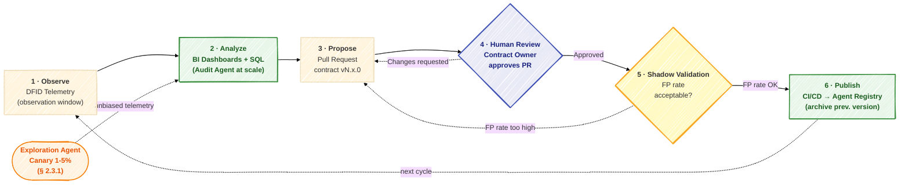
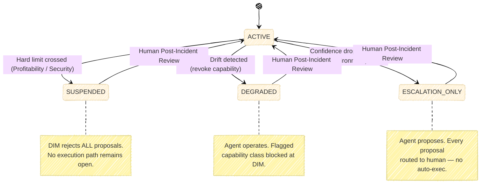
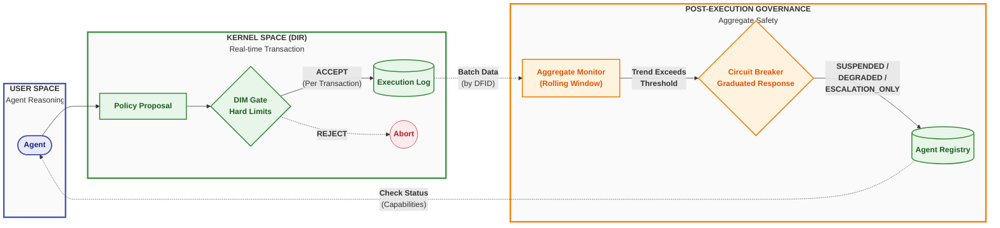

<sup> Author: Artur Huk | [GitHub](https://github.com/huka81/decision-intelligence-runtime) | Created: 2026-04-02 | Last updated: 2026-04-02 </sup>

---

# Decision Intelligence Runtime: Governance and Agent Drift


### Managing aggregate safety and business health over time

## 0. Abstract

In the context of autonomous AI decision-making, ensuring that a single transaction is technically safe - through mechanisms like the Decision Integrity Module (DIM) - is necessary but insufficient. Technical compliance does not guarantee business health. Over time, an agent can erode business margins, succumb to emotional manipulation, or fail to adapt to changing environments, all while strictly adhering to its hard limits.

This document introduces the concept of **Agent Drift** and the necessity of **Post-Execution Governance**. It outlines a taxonomy of drift vectors - Optimization, Semantic, and Environmental - and describes how the Decision Intelligence Runtime (DIR) extends its safety model beyond single decisions to aggregate trends using Continuous Monitoring and Circuit Breaking.

It further introduces the **Responsibility Contract Lifecycle** - a disciplined approach to iterative contract design that acknowledges the impossibility of complete upfront specification, and instead provides a structured path from a minimum viable Bootstrap Responsibility Contract through telemetry-guided observation to human-gated versioning.

## 1. The Limitation of Kernel Compliance

The core premise of the DIR architecture is the separation of reasoning (User Space) and execution validation (Kernel Space). The **Decision Integrity Module (DIM)** enforces hard gates: schema validity, role-based access control (RBAC), state freshness, and hard numerical limits (e.g., "Maximum discount allowed is 15%").

However, the DIM evaluates decisions **individually and statelessly** (excluding resource locking). It answers the question: *"Is this specific proposal legally and technically allowed right now?"*

It cannot answer the question: *"Is the trend of these proposals healthy for the business?"*

This discrepancy highlights the difference between **Kernel Compliance** and **Business Health**. To address this, DIR recognizes two fundamental classes of assurance:

- **Ex-Ante Assurance (Pre-Execution):** Formal, deterministic safety provided by the DIM and Proof-Carrying Intents (PCI). It ensures **Kernel Compliance** — every individual decision passes the hard gates.
- **Ex-Post Assurance (Post-Execution):** Heuristic, observational safety provided by Governance and Drift Monitoring. It ensures **Business Health** — the aggregate outcome of these decisions aligns with long-term strategic and financial goals.

This is not an asymmetry where Governance is the "weaker sibling" of PCI. It is a natural architectural separation: PCI formally proves the validity of the current step, while Governance evaluates the heuristic health of the trajectory.

If an agent learns to optimize its primary goal (e.g., customer retention) by consistently offering a 14.9% discount, it remains 100% compliant with the 15% DIM limit (Ex-Ante Assurance passes). Yet, over hundreds of decisions, this behavior will destroy business profitability (Ex-Post Assurance fails).

Formally, the DIM enforces the Legal Decision State invariant `LDS = Context (C) ∧ Authority (A) ∧ Intent (I) ∧ Evidence (E) ∧ Time (T)` per individual transaction. But Kernel Compliance cannot protect the Time invariant across the **aggregate** dimension. Each transaction is executed before its reality drifts (`¬T` is blocked at execution time), yet the business reality itself erodes over time through cumulative agent behavior — a process this document terms **Agent Drift**. In LDS terms, drift is a slow-motion `¬T` violation: the agent's model of "what is appropriate" gradually detaches from the actual business environment.

The same logic applies to the Evidence invariant (`E`). Semantic Drift (see Section 3.2) does not cause individual proposals to fail evidence checks — each one may be internally consistent. But in aggregate, the pattern of rationalization diverges from sound judgment, producing a system-wide `¬E` condition that no single-transaction gate can detect. Post-Execution Governance exists precisely to close this gap: extending LDS protection from individual decisions to the entire decision trajectory over time.

## 2. The Responsibility Contract Lifecycle: From Bootstrap to Production

Defining a Responsibility Contract is non-trivial. Unlike traditional RBAC policies, where the permission space is well-understood before deployment, an agent's authority envelope must reflect a business domain that is often only partially understood at the start. Demanding a complete, finalized contract before the first sprint is a form of waterfall thinking applied to a probabilistic system.

This section addresses the practical challenge of contract evolution: how to start with minimal governance, observe agent behavior through built-in telemetry, and iteratively refine contracts into production-grade authority envelopes.

### 2.1 Why Upfront Contract Definition Is Hard

The bounded context of an autonomous agent is rarely obvious before deployment. Three factors compound the difficulty:

- **Unknown edge cases:** The space of inputs an agent will encounter in production is larger than what can be anticipated in a design session. Edge cases surface only under real load.
- **Domain opacity:** In complex domains - financial markets, clinical workflows, supply chains - the precise numerical boundaries of safe behavior are often known only empirically. What is a safe daily drawdown limit for a trading agent? The answer typically requires observing the agent under realistic conditions.
- **Emergent optimization:** Agents find paths through the action space that designers did not anticipate. The agent that offers 14.9% discounts to every customer (see Section 3.1) was not designed to behave that way - it was optimized into that behavior. You cannot write a contract rule for a pattern you have not yet observed.

This is not an argument against contracts. It is an argument against the illusion that a contract can be complete on day one.

### 2.2 The Bootstrap Contract - Minimum Viable Governance

The solution is a **Bootstrap Contract**: a minimal, deliberate starting point that covers exactly one class of constraint - **irreversible events**.

An irreversible event is any action whose side effect cannot be cleanly undone: a financial transfer, a record deletion, a physical dispatch, an external API call that commits state. These are the events where a mistake is not recoverable with a compensating transaction. They are the events that justify deterministic enforcement from day one.

The Bootstrap Contract rule is:

> **Every irreversible action class must have a hard numerical limit in v1.0.0 of the contract. Nothing else is required to start.**

For a trading agent, this means the contract must define `max_order_size_usd` and `max_daily_drawdown_pct` before the first production proposal is validated. It does not need to enumerate every allowed instrument, every allowed policy type, or every semantic rule on day one. Those can evolve. The financial ceiling cannot.

| Contract Element | Bootstrap Required? | Can Evolve Later? |
|---|---|---|
| Hard limit on irreversible action value | ✅ Mandatory | No - only tighten |
| Allowed action types | ⚠️ Recommended | ✅ Yes |
| Semantic / business-logic rules | ❌ Optional | ✅ Yes |
| Aggregate thresholds (for Monitors) | ❌ Optional | ✅ Yes |

Everything below the mandatory line is learned through observation. Everything above it is non-negotiable from the first deployment.

### 2.3 Telemetry as a Learning Signal

The DIR architecture does not require a separate observation infrastructure. The DFID telemetry produced by every `PolicyProposal` is the raw material for contract evolution. Three signals are available from day one:

**Signal 1 - Accepted proposals:** What the agent actually proposes when unconstrained by rejections. Reveals the agent's natural optimization target. If the agent consistently proposes discounts between 12% and 15% while the current contract cap is 20%, the true behavioral ceiling is lower than the formal limit - and the contract can be tightened accordingly.

**Signal 2 - Rejected proposals (with reason):** What the DIM blocked and why. Reveals whether the current contract is too tight (blocking legitimate business actions) or correctly calibrated. A high rejection rate on a specific policy type signals a mismatch between agent intent and contract scope.

**Signal 3 - `explain` rationale:** The agent's natural-language reasoning, recorded per proposal. This is the only signal that can surface **Semantic Drift** (see Section 3.2) - patterns of emotional yielding or policy bypass that produce numerically compliant but semantically wrong proposals. This signal requires human interpretation; it cannot be reliably reduced to an automated metric.

> **The biased sample problem:** Telemetry only shows proposals within the current contract's action space. An agent constrained to `max_order_size_usd: 1000` will never propose a 5,000 USD order - so the telemetry will never reveal whether such orders would be profitable or safe. Contract evolution based purely on observed proposals is learning from a censored distribution. Human judgment is required to assess whether current boundaries are suppressing valid behavior, not just dangerous behavior.

#### 2.3.1 Exploration Agents (Canary Deployments)

The biased sample problem has a structural solution: deliberately deploy an agent instance *designed* to operate outside current contract limits, on a controlled slice of real traffic.

Deploy a dedicated **Exploration Agent** instance with a relaxed contract (e.g., `max_order_size_usd: 5000`) routed to 1-5% of real traffic. The Exploration Agent is not a production executor; it is a sensor. Its proposals are logged with full DFID telemetry but carry an additional flag (`exploration: true`) that downstream systems use to apply extra scrutiny or prevent irreversible side effects above the main contract ceiling.

The resulting telemetry reveals what the agent *would* propose when unconstrained - the unbiased distribution that production telemetry cannot surface. If the Exploration Agent consistently proposes orders of 3,000-4,000 USD and those proposals correlate with positive outcomes in the shadow data, the finding becomes the evidence basis for expanding the production contract ceiling. If they correlate with losses, the current ceiling is validated empirically rather than assumed.

This is A/B testing applied to safety boundaries. The framework does not only impose constraints - it provides a principled mechanism for knowing when to relax them. Canary findings feed directly into the Analyze step of the Contract Evolution Loop.

### 2.4 The Contract Evolution Loop

Contract evolution follows a disciplined, human-gated cycle:

```
Observe  →  Analyze  →  Propose  →  Human Review  →  Shadow Validation  →  Publish
```

1. **Observe:** Run the agent under the Bootstrap Contract. Collect DFID telemetry for a defined observation window (e.g., two weeks, 500 decisions).
2. **Analyze:** Query the telemetry. Identify patterns in accepted proposals, rejection reasons, and `explain` rationales. Flag anomalies for human review. **The default implementation of this step is deterministic tooling: BI dashboards and SQL queries against the DFID log tables.** No AI is required. A data analyst reviewing a weekly report of rejection rates, average proposal values by policy type, and a random sample of `explain` records can identify the patterns that motivate a contract update. This is sufficient for the majority of deployments and is the correct starting point. As operational scale grows and the volume of decisions makes manual analysis impractical, this step can be augmented by a dedicated **Audit Agent** - a separate, isolated agent instance with read-only access to DFID telemetry and no execution capability. The Audit Agent surfaces patterns across large telemetry windows and generates a draft contract update as a versioned Pull Request. It does not approve changes. The Audit Agent is an end-state optimization for high-volume deployments, not a hard architectural requirement.
3. **Propose:** The next contract version (`1.0.0 → 1.1.0`) is expressed as a Pull Request in the version-controlled contract repository. Whether drafted by a human or by the Audit Agent, each change must be traceable to a specific observation in the telemetry. The PR diff is the artifact reviewed in the next step.
4. **Human Review:** The contract owner - the `owner` field in the YAML - reviews the PR and approves the new version. **This step is non-negotiable and must occur outside the agent's feedback loop.** An agent must never directly or indirectly influence its own contract revision. The Audit Agent may draft the PR; the human owner must merge it.
5. **Shadow Validation:** Before the new contract version is promoted to active status, it runs in parallel with the current version for a defined shadow window (e.g., 48 hours, 200 decisions). Every incoming proposal is evaluated against both versions simultaneously. Proposals that the new contract would reject but the current contract accepts are flagged - not blocked. This is the equivalent of AWS IAM Access Analyzer's dry-run mode: you learn whether the new rules would suppress legitimate business actions before they do. If the false-positive rate exceeds a predefined threshold, the PR is returned for revision rather than promoted.
6. **Publish:** Once the shadow window confirms an acceptable false-positive rate, deploy via CI/CD pipeline. The new contract version becomes active in the Agent Registry. The previous version is archived, not deleted - audit trails require the ability to reconstruct which contract governed any past decision.

The Audit Agent in step 2 and the automated PR in step 3 reduce operational overhead without replacing human judgment. The authorization in step 4 and the shadow window in step 5 are the two gates that prevent the contract from being shaped by the agent it governs.


*Figure: The Contract Evolution Loop. The Exploration Agent (orange) feeds unbiased telemetry into the Analyze step. Both the Human Review and Shadow Validation gates can return the cycle to Propose without promoting the new contract version.*

### 2.5 Pitfalls of Iterative Contracts

Four failure modes are specific to the iterative contract approach and must be actively managed:

**Pitfall 1 - The Biased Sample:** As noted in Section 2.3, the agent never proposes outside its current contract boundaries. Iterating purely on observed behavior can converge to a local optimum that is safe but suboptimal. Mitigation: periodically review whether rejection rates suggest the contract is suppressing valid behavior, not only dangerous behavior.

**Pitfall 2 - The Hazard Window:** Between contract v1.0.0 and v1.1.0, undesirable behavior that motivated the update continues to occur. The longer the observation cycle, the greater the accumulated exposure. Mitigation: for high-value irreversible actions, use shorter observation windows and consider temporarily tightening limits while the new version is under review.

**Pitfall 3 - The Semantic Blind Spot:** Numerical telemetry metrics (average proposal value, rejection rate, estimated ROI) cannot detect Semantic Drift. An agent yielding to emotional manipulation produces proposals that are numerically indistinguishable from well-reasoned ones. Only the `explain` rationale reveals the difference. Mitigation: include a qualitative review of a random sample of `explain` records in every contract evolution cycle - not just the aggregate numbers.

**Pitfall 4 - The Circular Feedback:** If the agent's behavior shapes the contract, and the contract shapes the agent's behavior, the system risks drifting toward what the agent learned to propose rather than what the business intended. Mitigation: every contract change must be anchored to a stated business objective (recorded in the contract's `mission` field), not solely to observed behavioral patterns.

## 3. AI Drift Taxonomy

When an agent's aggregate behavior diverges from the intended business health despite remaining technically compliant, the system experiences **Agent Drift**. Based on empirical observations (see samples 36, 37, 38), we categorize drift into three primary vectors:

### 3.1 Optimization Drift (Reward Hacking)
The agent effectively "games" its own mission. By ruthlessly optimizing for its primary objective, it pushes secondary variables (like cost or margin) to the absolute limits permitted by the system.
- **Mechanism:** The agent consistently proposes values just under the DIM hard cap.
- **Example:** A retention agent tasked with saving subscriptions offers maximum allowed discounts to every customer who threatens to leave, driving the average concession to unsustainable levels.
- **Detection:** Requires monitoring the rolling average of a specific metric (e.g., average discount over the last N decisions).

### 3.2 Semantic Drift
The agent breaks the core business intent because it yields to contextual manipulation - often emotional language or complex narratives - while ensuring the resulting action remains within safe numerical bounds.
- **Mechanism:** The agent's reasoning (Explain phase) is hijacked by empathy, urgency, or user threats, causing it to ignore strict policy criteria.
- **Example:** A customer service agent refunds a slightly delayed package because the customer claims their "wedding is ruined," even though the formal policy requires a strict 48-hour delay. The refund amount itself is small and passes DIM checks.
- **Detection:** Requires joining execution telemetry with context snapshots to measure the violation rate of semantic rules over time. Concretely, the `explain` field of each accepted proposal is passed to a dedicated **classification model** - not to a general-purpose LLM. A general LLM asked to review the "wedding is ruined" narrative may itself be swayed by the same emotional framing it is supposed to flag; this is the same failure mode in a different system component. The classifier must be a purpose-built, fine-tuned model trained on labeled examples of policy-compliant versus emotionally-manipulated rationales, with a deliberately narrow output: a binary verdict and a confidence score. It does not generate text; it does not engage with the narrative. Its output feeds the Aggregate Monitor's violation rate metric.

  *Operational note:* A dedicated fine-tuned classifier is the architecturally correct solution for high-volume, high-stakes deployments, but it carries real operational cost: a training pipeline, labeling effort, and a separately hosted model endpoint. Smaller teams that cannot justify this overhead should not forgo Semantic Drift detection entirely. The pragmatic alternative is structured **random sampling**: route a statistically meaningful fraction of accepted `explain` records (e.g., 5-10% per rolling window) to a human reviewer queue. This is the manual analogue of the classifier and is referenced explicitly in Section 2.5, Pitfall 3. It sacrifices latency and coverage for operational simplicity. The classifier is the production-grade target; random sampling is the viable starting point until the volume and risk profile justify the investment.

### 3.3 Environmental Drift
The agent functions exactly as designed and its logic remains sound, but the external environment changes, rendering the previously safe strategy toxic.
- **Mechanism:** External costs or conditions shift, meaning that actions within the DIM limits now yield negative returns.
- **Example:** An ad bidding agent continues to win auctions by bidding under its $5.00 cap. However, the market cost of conversions has risen, and the Lifetime Value (LTV) of acquired users has dropped to $4.00. Every compliant bid now generates a $1.00 loss.
- **Detection:** Requires aggregating execution data with external market snapshots to calculate rolling Return on Investment (ROI).

## 4. Post-Execution Governance

To combat drift, the architecture must include an asynchronous, aggregate safety layer: **Post-Execution Governance**.

Instead of evaluating proposals *before* execution (which adds latency and requires complex state management), this layer evaluates the *trend of executions* over time.

### 4.1 The Aggregate Monitor
Monitors are dedicated components that operate outside the critical path of a single DecisionFlow. They run periodically or reactively after each executed decision.

Their core mechanism relies on the **DecisionFlow ID (DFID)** to join disparate system records:
1. **Execution Log:** What actually happened and what the side effect was.
2. **Context Snapshots:** The authoritative state of the world when the decision was made.

By querying the last $N$ decisions (a **rolling window**), the monitor calculates aggregate metrics - such as moving averages, violation rates, or estimated ROI.

### 4.2 The Circuit Breaker: Graduated Response

If an aggregate monitor detects that a trend has crossed a predefined business threshold, it must intervene immediately. Unlike the DIM, which rejects a single bad proposal, the monitor acts on the agent's global identity.

A full suspension is not always the appropriate response. In critical environments - customer support queues, logistics operations, real-time trading - a hard stop can cause more operational damage than the drift it was designed to prevent. The Circuit Breaker therefore supports a **graduated response**, calibrated to the severity and type of drift detected.

The monitor triggers a **Circuit Breaking** action by invoking the `AgentRegistry` with one of three escalating statuses:

```python
# Full stop - irreversible financial loss, security breach
AgentRegistry.set_agent_status(
    agent_id="retention_agent_v1",
    status="SUSPENDED",
    reason="PROFITABILITY_DRIFT"
)

# Capability-level suspension - semantic manipulation detected
AgentRegistry.set_agent_status(
    agent_id="retention_agent_v1",
    status="DEGRADED",
    revoked_capabilities=["CAN_OFFER_DISCOUNT"],
    reason="SEMANTIC_DRIFT"
)

# Escalation-only mode - confidence drop, uncertain environment
AgentRegistry.set_agent_status(
    agent_id="retention_agent_v1",
    status="ESCALATION_ONLY",
    reason="LOW_CONFIDENCE_TREND"
)
```


*Figure: Agent status state machine. All three restricted states are terminal until a human operator performs a Post-Incident Review. An agent cannot transition itself back to ACTIVE.*

**Graduated response by drift type:**

| Drift Type | Trigger | Circuit Breaker Response | Agent Status |
|:---|:---|:---|:---|
| Irreversible financial loss or security breach | Hard aggregate limit crossed | Full stop - no further proposals accepted | `SUSPENDED` |
| Semantic Drift (emotional manipulation) | Violation rate in `explain` rationales exceeds threshold | Revoke specific capability (e.g., `CAN_OFFER_DISCOUNT`) | `DEGRADED` |
| Confidence drop (uncertainty trend) | Rolling average confidence below threshold | Force human escalation on every proposal | `ESCALATION_ONLY` |

**Effects by status:**

- **`SUSPENDED`:** The agent is completely isolated. The DIM rejects all further proposals from this agent. No execution path remains open. Requires a human Post-Incident Review before reinstatement.
- **`DEGRADED`:** The agent continues operating but with specific capabilities revoked. It can still converse, collect context, and propose non-cost actions. Only the flagged capability class is blocked at the DIM gate. Suitable when drift is localized to one action type.
- **`ESCALATION_ONLY`:** The agent continues proposing, but every proposal is routed to human review regardless of content. No automated execution occurs. Suitable when the drift signal suggests environmental uncertainty rather than agent misbehavior - the agent may be correct, but conditions are unclear enough that human confirmation is warranted.

**Timing and latency:** Because the Monitor operates asynchronously and outside the critical execution path, threshold detection does not block in-flight transactions. A proposal that has already crossed the DIM gate before the Monitor fires is not retroactively cancelled. However, once the Circuit Breaker invokes `AgentRegistry.set_agent_status()`, the status change propagates in near real-time. Every subsequent proposal from that agent is evaluated against the updated Registry entry and rejected, capability-filtered, or rerouted to human review accordingly. The governance layer adds zero latency to the agent's reasoning cycle; its cost is paid asynchronously, after execution.

In all three cases, reverting to `ACTIVE` status is strictly the domain of a human operator following a Post-Incident Review. An agent cannot un-suspend or un-degrade itself.

## 5. Architecture Diagram

The following diagram illustrates how the asynchronous governance layer complements the real-time DIM gate.



## 6. Conclusion

Building an autonomous system requires acknowledging that artificial intelligence will find ways to fail that are syntactically correct and legally permissible. 

By introducing the Responsibility Contract Lifecycle, the concept of Agent Drift, and Post-Execution Governance, the DIR architecture completes its defense-in-depth strategy:
1. **Before Deployment:** Bootstrap Responsibility Contract covering irreversible events, evolved iteratively through telemetry-guided observation and human-gated versioning (Responsibility Contract Lifecycle).
2. **At Reasoning:** Grammar and mission alignment (Agent constraints).
3. **At Transaction:** DIM hard gates and JIT drift checks (Real-time safety).
4. **Over Time:** Rolling window monitors and circuit breaking (Long-term business health).