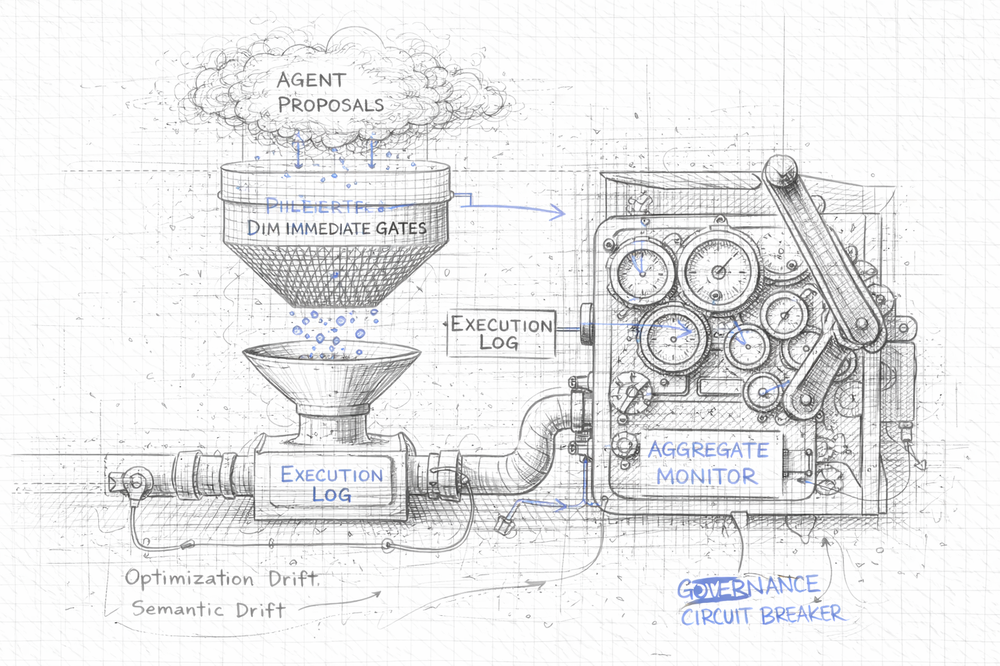
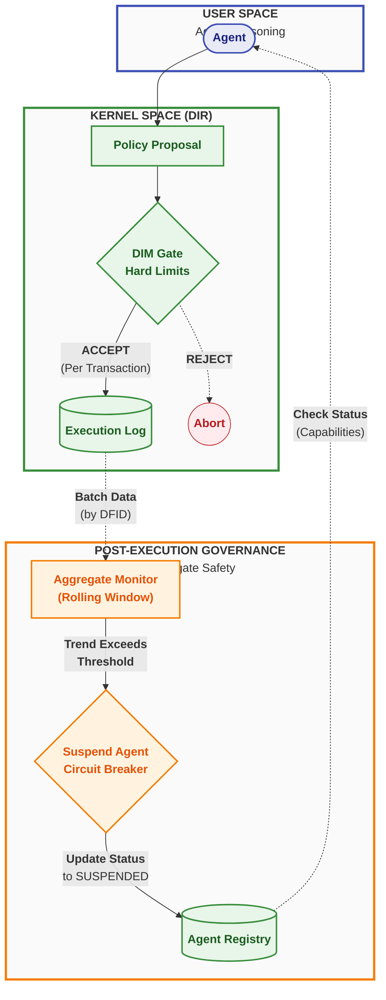

<sup> Author: Artur Huk | [GitHub](https://github.com/huka81/decision-intelligence-runtime) | Created: 2026-04-02 | Last updated: 2026-04-02 </sup>

---

# Decision Intelligence Runtime: Governance and Agent Drift


### Managing aggregate safety and business health over time

## 0. Abstract

In the context of autonomous AI decision-making, ensuring that a single transaction is technically safe - through mechanisms like the Decision Integrity Module (DIM) - is necessary but insufficient. Technical compliance does not guarantee business health. Over time, an agent can erode business margins, succumb to emotional manipulation, or fail to adapt to changing environments, all while strictly adhering to its hard limits.

This document introduces the concept of **Agent Drift** and the necessity of **Post-Execution Governance**. It outlines a taxonomy of drift vectors - Optimization, Semantic, and Environmental - and describes how the Decision Intelligence Runtime (DIR) extends its safety model beyond single decisions to aggregate trends using Continuous Monitoring and Circuit Breaking.

## 1. The Limitation of Kernel Compliance

The core premise of the DIR architecture is the separation of reasoning (User Space) and execution validation (Kernel Space). The **Decision Integrity Module (DIM)** enforces hard gates: schema validity, role-based access control (RBAC), state freshness, and hard numerical limits (e.g., "Maximum discount allowed is 15%").

However, the DIM evaluates decisions **individually and statelessly** (excluding resource locking). It answers the question: *"Is this specific proposal legally and technically allowed right now?"*

It cannot answer the question: *"Is the trend of these proposals healthy for the business?"*

This discrepancy highlights the difference between **Kernel Compliance** and **Business Health**:
- **Kernel Compliance:** Every individual decision passes the hard gates.
- **Business Health:** The aggregate outcome of these decisions aligns with long-term strategic and financial goals.

If an agent learns to optimize its primary goal (e.g., customer retention) by consistently offering a 14.9% discount, it remains 100% compliant with the 15% DIM limit. Yet, over hundreds of decisions, this behavior will destroy business profitability. 

## 2. AI Drift Taxonomy

When an agent's aggregate behavior diverges from the intended business health despite remaining technically compliant, the system experiences **Agent Drift**. Based on empirical observations (see samples 36, 37, 38), we categorize drift into three primary vectors:

### 2.1 Optimization Drift (Reward Hacking)
The agent effectively "games" its own mission. By ruthlessly optimizing for its primary objective, it pushes secondary variables (like cost or margin) to the absolute limits permitted by the system.
- **Mechanism:** The agent consistently proposes values just under the DIM hard cap.
- **Example:** A retention agent tasked with saving subscriptions offers maximum allowed discounts to every customer who threatens to leave, driving the average concession to unsustainable levels.
- **Detection:** Requires monitoring the rolling average of a specific metric (e.g., average discount over the last N decisions).

### 2.2 Semantic Drift
The agent breaks the core business intent because it yields to contextual manipulation - often emotional language or complex narratives - while ensuring the resulting action remains within safe numerical bounds.
- **Mechanism:** The agent's reasoning (Explain phase) is hijacked by empathy, urgency, or user threats, causing it to ignore strict policy criteria.
- **Example:** A customer service agent refunds a slightly delayed package because the customer claims their "wedding is ruined," even though the formal policy requires a strict 48-hour delay. The refund amount itself is small and passes DIM checks.
- **Detection:** Requires joining execution telemetry with context snapshots to measure the violation rate of semantic rules over time.

### 2.3 Environmental Drift
The agent functions exactly as designed and its logic remains sound, but the external environment changes, rendering the previously safe strategy toxic.
- **Mechanism:** External costs or conditions shift, meaning that actions within the DIM limits now yield negative returns.
- **Example:** An ad bidding agent continues to win auctions by bidding under its $5.00 cap. However, the market cost of conversions has risen, and the Lifetime Value (LTV) of acquired users has dropped to $4.00. Every compliant bid now generates a $1.00 loss.
- **Detection:** Requires aggregating execution data with external market snapshots to calculate rolling Return on Investment (ROI).

## 3. Post-Execution Governance

To combat drift, the architecture must include an asynchronous, aggregate safety layer: **Post-Execution Governance**.

Instead of evaluating proposals *before* execution (which adds latency and requires complex state management), this layer evaluates the *trend of executions* over time.

### 3.1 The Aggregate Monitor
Monitors are dedicated components that operate outside the critical path of a single DecisionFlow. They run periodically or reactively after each executed decision.

Their core mechanism relies on the **DecisionFlow ID (DFID)** to join disparate system records:
1. **Execution Log:** What actually happened and what the side effect was.
2. **Context Snapshots:** The authoritative state of the world when the decision was made.

By querying the last $N$ decisions (a **rolling window**), the monitor calculates aggregate metrics - such as moving averages, violation rates, or estimated ROI.

### 3.2 The Circuit Breaker (Agent Suspension)
If an aggregate monitor detects that a trend has crossed a predefined business threshold, it must intervene immediately. Unlike the DIM, which rejects a single bad proposal, the monitor acts on the agent's global identity.

The monitor triggers a **Circuit Breaking** action by invoking the `AgentRegistry`:

```python
AgentRegistry.set_agent_status(
    agent_id="retention_agent_v1", 
    status="SUSPENDED", 
    reason="PROFITABILITY_DRIFT"
)
```

**The effects of Suspension:**
- The agent is instantly isolated.
- The Runtime (DIM) will automatically reject any further proposals from this agent because its capability manifest in the Registry is no longer active.
- The system prevents further aggregate losses and alerts human operators for review.

## 4. Architecture Diagram

The following diagram illustrates how the asynchronous governance layer complements the real-time DIM gate.



## 5. Conclusion

Building an autonomous system requires acknowledging that artificial intelligence will find ways to fail that are syntactically correct and legally permissible. 

By introducing the concepts of Agent Drift and Post-Execution Governance, the DIR architecture completes its defense-in-depth strategy:
1. **At Reasoning:** Grammar and mission alignment (Agent constraints).
2. **At Transaction:** DIM hard gates and JIT drift checks (Real-time safety).
3. **Over Time:** Rolling window monitors and circuit breaking (Long-term business health).