<sup> Author: Artur Huk | [GitHub](https://github.com/huka81/decision-intelligence-runtime) | Created: 2026-03-06 | Last updated: 2026-03-06 </sup>

---

# DIR-minified: Decision Intelligence Runtime  -  Complete Framework Specification

### LLM-Optimized Context Reference | ROA + DIR + Topologies

---

## 0. HOW TO USE THIS DOCUMENT

This file is the **single-source context** for the Decision Intelligence Runtime (DIR) framework. Load this file as context before asking an LLM to implement, extend, or review any DIR-compliant system.

**What this document contains:**
- Complete specification of ROA (Responsibility-Oriented Agents)  -  the Identity Layer
- Complete specification of DIR (Decision Intelligence Runtime)  -  the Execution Kernel
- Complete specification of all three Topologies  -  the Signal Flow Layer
- Python coding standards for all generated code
- Reference sample map and unified glossary

**What this document does NOT contain:**
- Full executable implementations (see `samples/` directory)
- Domain-specific business logic
- Infrastructure configuration

**Key principle:** *Intelligence without governance is liability. Agents propose. The Runtime validates and executes. No prompt is a permission.*

---

## 1. MOTIVATION  -  Why DIR Exists

### 1.1 The Day Two Problem

AI agents fail in production not because models are wrong, but because the architecture around them is missing. Three failure modes emerge universally:

| Failure | Root Cause | Required Mechanism |
|---------|------------|-------------------|
| **Hallucination Loops** | No retry governor; unbounded feedback cycles | Intent Retry Governor (REASONING_EXHAUSTION state, max ~3 retries) |
| **State Drift (Stale Context)** | TOCTOU race: reasoning completed at T0, execution at T1 | Context hash-binding (ContextSnapshotID) + JIT State Verification |
| **Execution Chaos** | No exactly-once guarantees; duplicate side effects | Idempotency key derived from decision context |

These failures are **not model failures**. They are **architecture failures**. The model reasoned correctly; the system lacked the infrastructure to execute safely.

### 1.2 AIvestor  -  Documented Production Failure Cases

The following failure cases were observed in **AIvestor**, an autonomous multi-agent trading system operating against live financial markets. Each failure traced back not to model limitations but to missing architectural constraints.

**Failure Case 1  -  Hallucination Loops (feedback poisoning)**

The agent attempted to sell a position it no longer held. When the broker API returned an error, the model interpreted this as a signal to "try harder." Without a retry governor, it looped  -  each iteration generating new reasoning and consuming tokens. After three retries, it concluded that it should *buy* the position first in order to then sell it: a complete inversion of the original strategy, hallucinated through feedback poisoning.

- **Root cause:** No retry governor; unbounded feedback cycles
- **Mechanism required:** Intent Retry Governor with explicit `REASONING_EXHAUSTION` terminal state and a hard maximum (~3 retries before escalation to `ESCALATED`)

**Failure Case 2  -  State Drift (TOCTOU)**

The agent began reasoning based on a context snapshot at T0 with price $99.50. LLM inference took ~15 seconds. By T1, the price was $101.20. The "buy at $100" decision executed at $101.20, incurring slippage that invalidated the strategy. This is a classic TOCTOU (Time-of-Check to Time-of-Use) vulnerability  -  well-known in systems programming, almost universally ignored in agent architectures.

- **Root cause:** TOCTOU race condition between reasoning and execution
- **Mechanism required:** `ContextSnapshotID` binding + JIT State Verification. The runtime verifies live state is within `drift_envelope` (e.g., 0.5% price tolerance) immediately before executing any side effect

**Failure Case 3  -  Execution Chaos (duplicate orders)**

Without idempotency controls, network timeouts caused the agent to retry execution. The system bought the same position twice. Then sold twice. Each execution created real financial exposure  -  not because the model was wrong, but because the infrastructure lacked exactly-once guarantees.

- **Root cause:** No idempotency; no duplicate intent protection
- **Mechanism required:** `SHA256(DFID + Step_ID + Canonical_Params)`. The runtime recognizes duplicate intents and prevents duplicate side effects regardless of environmental state changes at retry time

> **Key insight:** In each case, the agent's reasoning was sound. The failures occurred *after* reasoning  -  in the gap between "what the agent decided" and "what the system actually did." These were failures of architecture, not intelligence.

### 1.3 The Core Thesis

> **Intelligence without governance is liability.**
> To safely deploy AI agents, we need deterministic runtime discipline around probabilistic reasoning.

The shift required:
- **From:** Prompt engineering (hoping the model behaves)
- **To:** System engineering (guaranteeing the system behaves)

**The industry shift  -  from model-centric to execution-centric AI:**

| Paradigm | Success metric | Safety approach | Failure handling |
|----------|---------------|-----------------|-----------------|
| **Model-centric AI** | Reasoning quality, benchmark scores | "Smarter / better aligned model" | Retry, add to system prompt |
| **Execution-centric AI** | Reliability, operational safety, auditability | Deterministic execution boundary + Zero Trust | Structural enforcement, validated guardrails |

The industry is shifting from measuring success by reasoning quality alone to measuring it by reliability and operational safety as first-class concerns. DIR is the architectural pattern that enables this shift. It does not make models smarter  -  it makes them safe enough to trust in production.

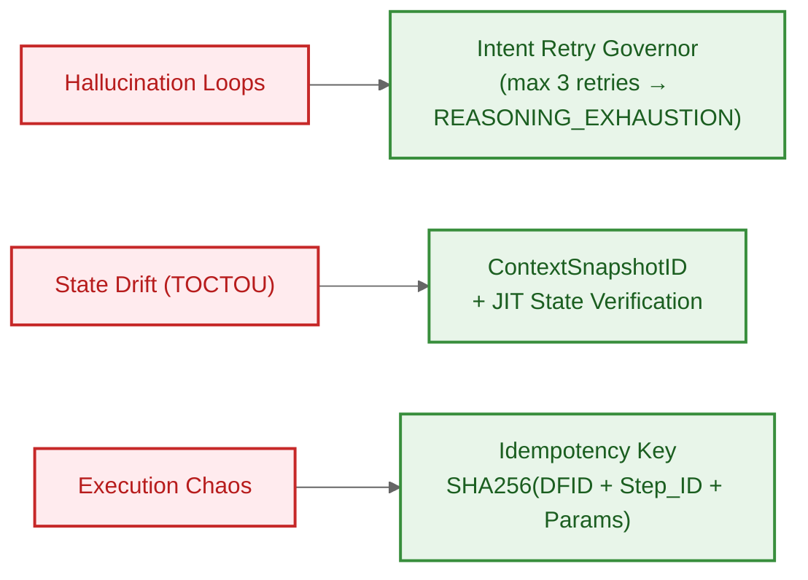

---

## 2. ARCHITECTURE OVERVIEW

### 2.1 The Three-Layer Model

DIR is composed of three orthogonal layers. Each layer addresses a distinct architectural concern and can vary independently.

| Layer | Pattern | Question Answered |
|-------|---------|------------------|
| **Identity Layer** | ROA  -  Responsibility-Oriented Agents | *Who* is responsible for proposing intent? |
| **Execution Kernel** | DIR  -  Decision Intelligence Runtime | *Is this intent allowed and valid to execute right now?* |
| **Flow Layer** | Topologies (EOAM / SDS / DL+PCI) | *How do signals and intents move through the system?* |

### 2.2 User Space vs. Kernel Space  -  The Wall

Borrowed from operating systems: the fundamental separation between **unprivileged processes** (agents) and the **privileged kernel** (runtime).

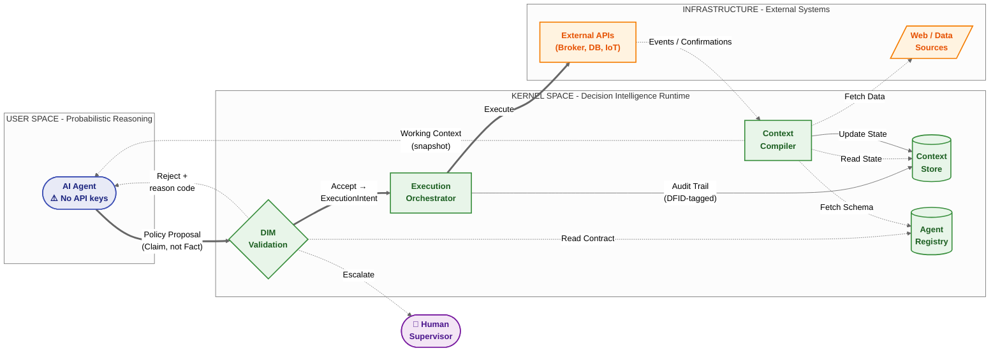
*The Runtime separates User Space (probabilistic reasoning) from Kernel Space (deterministic execution). Agents never hold API keys or write credentials. Every side effect passes through DIM validation. The Context loop ensures agents always reason on Kernel-managed, validated state.*

**The Wall is absolute:**
- Agents MUST NOT hold API keys or database write credentials
- Agents MUST NOT execute side effects directly
- No prompt grants execution privilege  -  `Prompts are not permissions`
- No "trusted agent" bypasses validation
- LLMs MUST NOT exist in Kernel Space

### 2.3 CQRS Adaptation

DIR is an adaptation of **Command Query Responsibility Segregation (CQRS)**:
- Agents emit **tentative commands** (Policy Proposals)  -  the Write Model
- The Runtime **validates and decides** whether to commit them  -  the Execution
- Only DIM-validated policies trigger side effects

---

## 3. ROA  -  RESPONSIBILITY-ORIENTED AGENTS

> **ROA agents are epistemic entities. They interpret, explain, and propose. They provide no safety, correctness, or enforcement guarantees.**

ROA defines agents not by their *capabilities* (what tools they can call) but by their *responsibilities* (what they are accountable for, what they own, what limits bind them).

### 3.1 Responsibility Contract

Every ROA agent is governed by a **Responsibility Contract**  -  a formal, machine-readable definition registered with the Agent Registry. Contracts are loaded from a trusted source (CI/CD pipeline or cryptographically signed repository) at deployment. Agents MUST NOT self-register at runtime.

```python
from pydantic import BaseModel, Field
from typing import List
from enum import Enum

class AuthorityLevel(str, Enum):
    OBSERVE = "observe"           # Read-only analysis
    PROPOSE = "propose"           # Propose actions for review
    EXECUTE_LIMITED = "execute_limited"  # Execute within strict bounds
    EXECUTE_FULL = "execute_full"        # Full execution authority (rare)

class EscalationTrigger(BaseModel):
    confidence_threshold: float = Field(
        default=0.7,
        description="Escalate if confidence falls below this threshold"
    )
    max_exposure_usd: float = Field(
        default=10000.0,
        description="Escalate if proposed action exceeds this exposure"
    )
    requires_human_approval: List[str] = Field(
        default_factory=list,
        description="Action types that always require human approval"
    )

class ResponsibilityContract(BaseModel):
    agent_id: str = Field(description="Unique identifier for this agent instance")
    mission: str = Field(description="The agent's optimization target or guiding principle")
    scope: str = Field(description="The domain or decision space this agent owns")
    authority: AuthorityLevel = Field(description="Maximum level of action this agent can propose")
    allowed_instruments: List[str] = Field(default_factory=list)
    allowed_actions: List[str] = Field(default_factory=list)
    forbidden_actions: List[str] = Field(default_factory=list)
    max_position_size: float = Field(default=0.0)
    escalation: EscalationTrigger = Field(default_factory=EscalationTrigger)
    version: str = Field(default="1.0.0", description="Contract version for schema compatibility")
```

**Why contract as code, not constraints as prompt:** Prompts are suggestions. Code is enforcement. A prompt saying "do not exceed $10,000 exposure" can be ignored or creatively reinterpreted. A contract field `max_position_size: 10000.0` validated by deterministic code cannot be bypassed.

**YAML deployment format  -  how contracts are configured at deployment time:**

```yaml
# agent_contract.yaml  -  registered via CI/CD pipeline, NOT self-registered by agent
agent_id: "crypto_position_manager_01"
version: "1.2.0"                       # Immutable versioning for audit trails
owner: "jane.doe@example.com"          # Human accountability  -  who is responsible?
effective_from: "2026-02-01"           # Temporal validity of this contract version
role: "EXECUTOR"

# Deterministic Boundaries (enforced by DIM in Kernel Space)
permissions:
  allowed_instruments: ["ETH-USD", "BTC-USD"]
  allowed_policy_types: ["TAKE_PROFIT", "CLOSE_POSITION", "REDUCE_SIZE", "HOLD"]
  max_order_size_usd: 50000.00

# Safety and Economic Triggers (escalation and intervention logic)
safety_rules:
  min_confidence_threshold: 0.85      # Don't act on low-certainty reasoning
  max_drawdown_limit_pct: 4.0         # Hard stop-loss enforced by Runtime
  wake_up_threshold_pnl_pct: 2.5     # Cost optimization: suppress noise signals
  escalate_on_uncertainty: 0.70       # If confidence < 70%, escalate to human
```

Note the `owner` field: every contract MUST have a named human accountable for its behavior. This prevents "agent accountability vacuum"  -  the situation where no person is responsible for an agent's decisions.

### 3.2 The Decision Lifecycle: Explain → Policy → Self-Check → Emit

ROA agents produce decisions through a structured four-stage internal process:

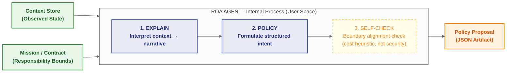

| Stage | What happens | Owner | Purpose |
|-------|-------------|-------|---------|
| **Explain** | Agent interprets context, identifies patterns, articulates situation | LLM | Narrative for human auditors |
| **Policy** | Agent formulates structured, executable intent | LLM | Machine-interpretable proposal |
| **Self-Check** | Agent verifies mission alignment before emitting | LLM (heuristic) | Noise reduction, cost optimization  -  NOT a security gate |
| **Emit** | Agent outputs Policy Proposal JSON artifact | LLM | Input to Runtime |

**Critical:** Self-Check has NO security value. It is a cost-optimization heuristic. All real safety enforcement happens in Kernel Space (DIM).

**ROA agents are long-lived, persistent entities  -  not stateless inference calls.** Unlike ephemeral LLM loops that reset between calls, ROA agents maintain continuity across decision cycles. This property is called **Epistemic Longevity**.

### 3.2a Epistemic Longevity  -  The Third ROA Pillar

ROA agents are characterized by three defining properties. The third is frequently missing from implementations:

| Pillar | Definition | Implementation |
|--------|-----------|----------------|
| **Mission** | Formal optimization objective  -  the agent's "north star" | Registered in Agent Registry; referenced via `mission_context_hash` during DIM validation |
| **Responsibility Contract** | Versioned, machine-evaluated authority boundary | Pydantic model stored in Registry; evaluated deterministically by DIM |
| **Epistemic Longevity** | Persistent decision trajectory across decision cycles | Memory Context layer in Context Store; managed by Kernel |

**Epistemic Longevity** means each agent maintains an ordered record of:
- Prior Policy Proposals and their `explain` rationales
- DIM validation outcomes (ACCEPTED / REJECTED / ESCALATED) for each proposal
- Execution results and their financial/operational consequences

This trajectory enables coherent multi-cycle reasoning: the agent's current proposal is contextualized by the history of its prior decisions and their outcomes. Without this, agents exhibit **decision amnesia**  -  proposing the same invalid action repeatedly because they cannot remember being rejected.

**Critical implementation rules:**
1. Epistemic Longevity is **Kernel-managed**, not prompt-managed. The Memory Context layer supplies only the *relevant subset* of historical artifacts to each inference call  -  avoiding context window overflow while preventing decision amnesia
2. Persistence is managed via the Context Store (Memory layer), NOT via embedding history in the system prompt
3. Agents MUST NOT manage their own memory state; all trajectory persistence is delegated to the Runtime

**Without Epistemic Longevity:** Agent proposes BUY → rejected (position limit) → re-triggered → proposes BUY again → rejected again → infinite loop. The agent has no memory of being rejected.

**With Epistemic Longevity:** Agent proposes BUY → rejected → Memory Context records rejection + reason → next cycle, agent sees "last BUY rejected: POSITION_LIMIT_EXCEEDED" → proposes HOLD instead.

### 3.3 Policy Proposal  -  The Output Contract

The `explain` field is narrative metadata for human auditors  -  it is NEVER parsed for execution logic. The `policy` field is the only machine-processed artifact.

```json
{
  "dfid": "550e8400-e29b-41d4-a716-446655440000",
  "agent_id": "momentum-trader-btc-01",
  "timestamp": "2026-02-11T14:30:00Z",
  "explain": "BTC has broken above the 20-day moving average with increasing volume. RSI at 62 suggests momentum without overbought conditions. Given the current portfolio allocation (15% crypto) and risk parameters, a modest position increase aligns with the momentum-following mandate.",
  "policy": {
    "action": "BUY",
    "instrument": "BTC-USD",
    "quantity": 0.05,
    "execution_constraints": {
      "max_price": 48500.00,
      "valid_until": "2026-02-11T14:35:00Z",
      "drift_envelope_bps": 50
    }
  },
  "confidence": 0.78,
  "context_snapshot_id": "snap_a1b2c3d4e5f6"
}
```

**Claims vs. Facts:** A Policy Proposal is a **Claim** (untrusted assertion). It becomes a **Fact** (executed event) only after the Runtime validates schema, permissions, and state. Authority bias  -  trusting an output because the AI produced it  -  is an anti-pattern.

**Execution Parametrization:** The agent does NOT say "buy at the current price." It says "buy if price ≤ $48,500, only within 5 minutes, with drift tolerance of 50 bps." This decouples slow reasoning time from fast execution time. The `drift_envelope_bps: 50` means the Runtime will reject execution if live price has drifted >0.5% from snapshot price  -  solving TOCTOU without making reasoning faster.

> **"The agent decouples slow reasoning from fast market time."** Policies carry constraints (`max_price`, `valid_until`, `drift_envelope_bps`) rather than raw commands. The Runtime checks these constraints *at the moment of execution*, not at the moment of proposal. This means an agent can take 30 seconds to reason, and the policy will still execute safely  -  or be discarded as stale  -  based on runtime conditions at T₁, not T₀.

### 3.3a ExecutionIntent  -  The Kernel's Output Contract

`PolicyProposal` is the **agent's output** (User Space claim). `ExecutionIntent` is the **Kernel's output** (validated, signed artifact that leaves DIM toward the Execution Engine). These are two distinct classes  -  `ExecutionIntent` does NOT inherit from `PolicyProposal`.

**Ownership rule:** `ExecutionIntent` is created **exclusively by DIM**. No agent, no external system, no test fixture may instantiate it directly. The only valid path to an `ExecutionIntent` is through the DIM validation pipeline.

```python
from __future__ import annotations

import hashlib
from datetime import datetime
from typing import Any

from pydantic import BaseModel, ConfigDict, Field, model_validator


class ExecutionConstraints(BaseModel):
    model_config = ConfigDict(frozen=True)

    max_price: float | None = Field(default=None, description="Maximum acceptable execution price")
    min_price: float | None = Field(default=None, description="Minimum acceptable execution price")
    valid_until: datetime = Field(description="Hard expiry  -  Runtime MUST NOT execute after this timestamp")
    drift_envelope_bps: int = Field(default=50, description="Max price drift in basis points since snapshot")


class ExecutionIntent(BaseModel):
    """
    The validated, Kernel-signed artifact produced by DIM after all hard gates pass.
    Flows from DIM → Execution Engine → External API.
    MUST NOT be constructed outside of the DIM validation pipeline.
    """
    model_config = ConfigDict(frozen=True, extra="forbid")

    dfid: str = Field(description="DecisionFlow ID  -  propagated unchanged from originating PolicyProposal")
    source_proposal_hash: str = Field(
        description="SHA256 of the serialized PolicyProposal. Enables full traceability: Proposal → Intent."
    )
    agent_id: str
    validated_at: datetime = Field(description="Timestamp of DIM acceptance  -  set by Kernel, not agent")
    validation_gate_version: str = Field(
        description="SemVer of the DIM rule set used for validation. Enables historical audit of which rules applied."
    )
    context_snapshot_id: str = Field(
        description="ID of the ContextSnapshot the proposal was validated against. Used for JIT re-check."
    )

    # Replicated from PolicyProposal.policy  -  DIM copies only validated fields
    action: str
    instrument: str
    quantity: float
    execution_constraints: ExecutionConstraints

    kernel_signature: str = Field(
        description=(
            "HMAC-SHA256 of canonical ExecutionIntent fields, keyed with the Kernel's signing secret. "
            "Proof that this artifact passed through DIM. Execution Engine MUST verify before dispatching."
        )
    )

    @model_validator(mode="after")
    def validate_not_expired(self) -> ExecutionIntent:
        if self.execution_constraints.valid_until < self.validated_at:
            raise ValueError("ExecutionIntent validated after its own valid_until  -  clock skew or replay attack")
        return self
```

**Data flow and traceability:**

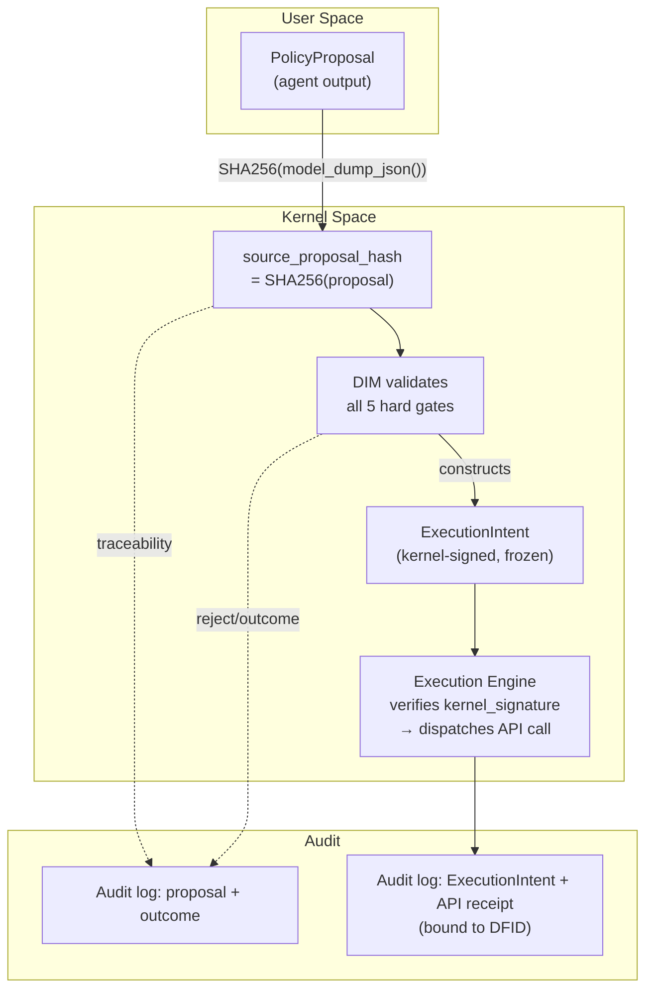

**Key distinctions from PolicyProposal:**

| Property | PolicyProposal | ExecutionIntent |
|----------|---------------|-----------------|
| **Origin** | Agent (User Space) | DIM (Kernel Space) |
| **Trust status** | Untrusted claim | Kernel-validated artifact |
| **Mutability** | Mutable during reasoning | `frozen=True`  -  immutable |
| **`kernel_signature`** | Absent | Present  -  mandatory |
| **`validated_at`** | Absent | Present  -  set by DIM clock |
| **`source_proposal_hash`** | N/A (is the source) | Hash of originating proposal |
| **Can agent construct?** | Yes | **No  -  DIM only** |

### 3.4 Context Store  -  The Four Layers

Agents MUST NOT query external systems directly. All data comes from the Context Store, assembled by the Context Compiler (Kernel Space).

| Layer | Persistence | Contents | Purpose |
|-------|------------|----------|---------|
| **Session (Ephemeral)** | Resets at DecisionFlow close | Current trigger, intermediate reasoning, prompt chain for this interaction | The "now"  -  immediate stimuli |
| **State (Authoritative)** | Live, synced from external systems | Real-time signals, derived metrics, resource state (balances, positions), agent metadata from Registry | The "truth"  -  ground truth for validation |
| **Memory (Long-term)** | Persists across sessions | Decision trajectory, prior policy rationales, escalation history, policy version evolution | The "experience"  -  continuity |
| **Artifacts (Reference)** | Static / slow-changing | Business rules, compliance rulebooks, strategy whitepapers, RAG-retrievable large documents | The "library"  -  reference data |

**Shared Reality Invariant:** The Context Store is the single authoritative reality for all agents. Agents MUST NOT synchronize via dialogue, local world models, or inferred memory. Shared context prevents conflicting state, reasoning drift, "echo chambers," and emergent inconsistencies. Synchronization is explicit via Kernel-assembled context, never emergent via agent interaction.

**Context Compilation Pipeline:**

```python
def compile_working_context(agent_id: str, dfid: str) -> dict:
    # Step 1: Snapshot authoritative state (optimistic lock)
    current_state = state_store.get_snapshot(timestamp=now())

    # Step 2: Retrieve session events (time-windowed)
    session_events = event_log.query(dfid=dfid, limit=10)

    # Step 3: Retrieve memory and artifacts (deterministic query)
    mission = memory_store.get_mission(agent_id)

    # Step 4: Assemble immutable context object (token budgeting)
    return {
        "snapshot_id": current_state.hash,  # CRITICAL: verified by DIM (anti-TOCTOU)
        "market_data": current_state.data,
        "recent_history": session_events,
        "mission": mission
    }
```

**Need-to-Know principle:** The Context Compiler enforces strict limits (e.g., "last 10 events", "positions from last 24h") to prevent context window overflow. Agents see only the most relevant, recent slice of reality.

**Agent Read/Write Contract:**
- **Agents read context to:** perform Explain, ground Policy in current facts, maintain reasoning continuity, and verify whether mission/boundaries still apply
- **Agents write context to:** append explanations, decision rationales, policy progress/completion markers, and memory trajectory updates
- **Critical boundary:** agent write-back does NOT grant authority and MUST NOT redefine authoritative state except through Kernel-controlled, validated state transitions

**WorkingContext Contract:** Every implementation MUST explicitly specify its `WorkingContext`. The specification MUST define which Context Store layers are used, which fields are mandatory, and which hashes/refs bind the context to validation (`ContextSnapshotID`, `mission_context_hash`, `evidence_hash`, etc.). `WorkingContext` is architecture-specific, but it MUST NEVER be implicit.

**Context Store vs. Memory vs. Knowledge  -  Disambiguation:**

This distinction is frequently confused in agent system design:

| Term | In DIR | Scope | Managed by |
|------|--------|-------|-----------|
| **Context Store** | The complete 4-layer structured store (Session + State + Memory + Artifacts) | Full system | Kernel Space (Context Compiler) |
| **Memory** | Specifically the Long-term layer of the Context Store  -  cross-session decision history | Agent-scoped, persisted | Kernel Space |
| **Knowledge** | A property of the LLM's pre-trained weights  -  implicit, static, unauditable | Model-internal | NOT in Context Store; cannot be controlled |

**Critical rule:** Agents MUST NOT rely on LLM "knowledge" (pre-training data) as a source of business facts, rules, or real-time data. All business-relevant information MUST enter via the Context Store. LLM knowledge provides linguistic reasoning capability; Context Store provides domain facts.

### 3.5 Dynamic Agents, Hierarchy, and the Agent Registry

**Dynamic instantiation:** Agents are NOT pre-compiled static roles. They are instantiated when a new unit of responsibility is identified and retired when that responsibility ends.

- **Class Agents:** Represent a general capability/role; exist throughout system lifetime
- **Instance Agents:** Represent specific occurrences of responsibility; created when needed, retired when their lifecycle ends (e.g., a PositionAgent created when a trade is opened, retired when closed)

**Agent Hierarchy:** Mirrors organizational responsibility structures:
- Higher-level agents **delegate** specific responsibilities to lower-level agents
- Lower-level agents **escalate** when encountering situations beyond their authority
- Higher-level agents can **override** subordinate proposals  -  within their own governance bounds

**Agent Registry:** The Kernel's single source of truth for agent identity, capabilities, and lifecycle:
- **Capability Contract:** When DIM asks "Can Agent X trade Asset Y?", it queries the Registry  -  not the Agent
- **Lifecycle Management:** Create, initialize, persist, retire agents
- **Schema Versioning:** SemVer alignment required; version mismatch → registration rejected at handshake
- **Resource Locking:** Registry grants temporary Reservation Locks to prevent horizontal resource contention
- **SPOE Mitigation:** Local Manifest Caching with TTL (e.g., 60s); degraded mode serves cached definitions during Registry outage

**The Four Conceptual Authorities of the Agent Registry:**

| Authority | Description |
|-----------|-------------|
| **Identity** | Who is this agent? Canonical ID, version, owner (team/system) |
| **Capability** | What is this agent authorized to do? Derived from `ResponsibilityContract` |
| **Lifecycle** | What is this agent's operational state? (INITIALIZING, ACTIVE, SUSPENDED, RETIRED) |
| **Schema** | What version of PolicyProposal schema does this agent produce? (for DIM compatibility) |

**Flow binding rule:** Non-critical Registry updates (e.g., contract version change, authority expansion) are NOT applied retroactively to in-flight DecisionFlows. A DecisionFlow remains bound to the contract snapshot active at `CREATED`; new DecisionFlows pick up the newer version. This prevents race conditions between capability changes and active executions.

**Revocation exception:** Authority revocation, contract invalidation, or kill-switch is a security exception. If detected during JIT or later validation, the flow MUST transition to `ABORTED`. No policy may execute under revoked authority, even if the flow started under an earlier contract snapshot.

**Registry supports all topologies simultaneously:** A single Agent Registry instance can serve agents operating under different topologies (EOAM, SDS, DL+PCI). The topology is a routing/coordination concern, not a registry concern.

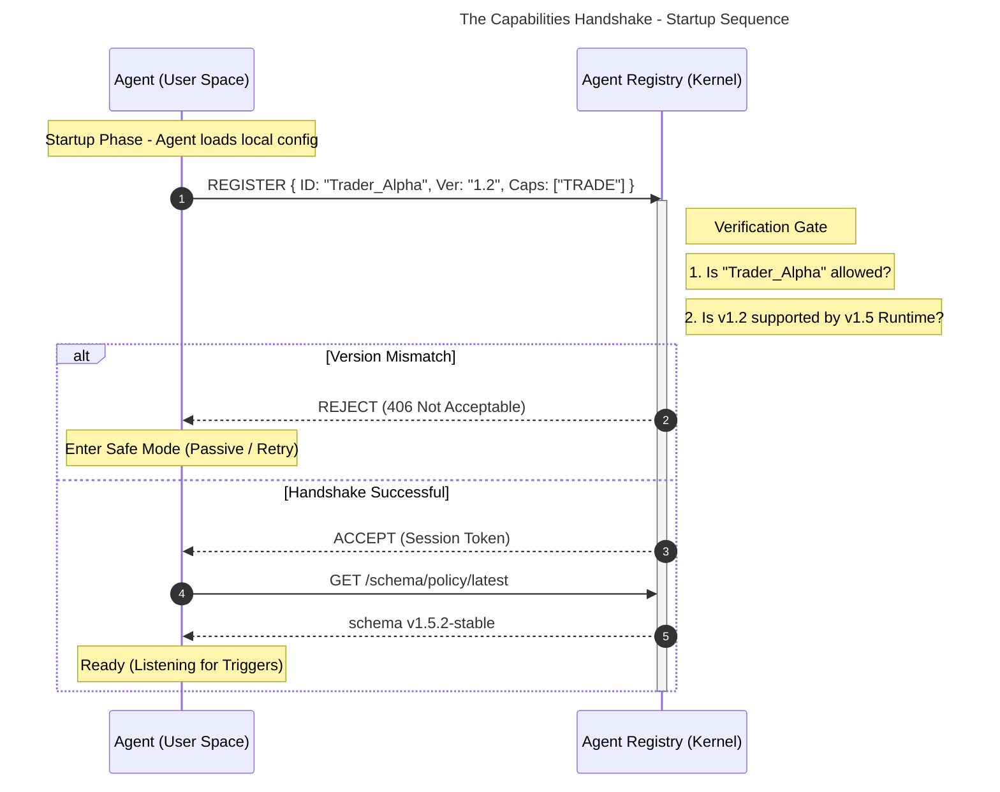

### 3.5a Agent Lifecycle  -  State Transitions and Ownership

The Agent Registry manages each agent's lifecycle state. **Who triggers what** is precisely defined  -  ambiguity here leads to agents self-promoting authority or to zombie agents blocking resource locks.

**Lifecycle state machine:**

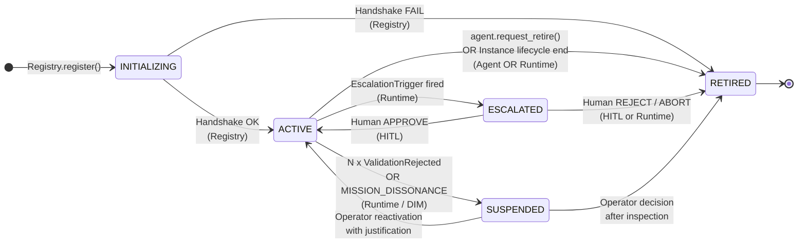

**Transition ownership table:**

| Transition | Triggered by | Condition |
|-----------|-------------|-----------|
| `INITIALIZING → ACTIVE` | Registry | Handshake schema + version check passed |
| `INITIALIZING → RETIRED` | Registry | Handshake failed  -  incompatible version or unauthorized ID |
| `ACTIVE → SUSPENDED` | Runtime (DIM) | N consecutive `ValidationRejected` within a time window, OR `MISSION_DISSONANCE` detected |
| `ACTIVE → ESCALATED` | Runtime | `EscalationTrigger` condition met (confidence < threshold, exposure > limit, etc.) |
| `ACTIVE → RETIRED` | **Agent** (only allowed self-transition) OR Runtime | Agent calls `registry.request_retire(agent_id, reason)` after completing its mission; OR Runtime closes Instance Agent lifecycle |
| `ESCALATED → ACTIVE` | Human (HITL) | Human approves via OVERRIDE |
| `ESCALATED → RETIRED` | Human (HITL) or Runtime | Human rejects / ABORT decision; or retry budget exhausted |
| `SUSPENDED → ACTIVE` | Operator | Manual reactivation with documented justification (audit trail required) |
| `SUSPENDED → RETIRED` | Operator | Post-inspection decision |

**Critical rules:**

1. **Agent authority over own state is minimal:** An agent may only call `registry.request_retire()`. It cannot transition itself to ACTIVE, SUSPENDED, or ESCALATED. All such transitions are Kernel/operator decisions.
2. **SUSPENDED does not mean RETIRED:** A SUSPENDED agent's resource locks are released, but its Responsibility Contract and Memory Context remain intact. Operator inspection determines final disposition.
3. **ESCALATED is a pause, not a failure:** The DecisionFlow is paused at `ESCALATED`. The agent is not suspended  -  it is waiting. Human decision resumes or terminates the flow.
4. **Registry update vs. state transition:** Updating a contract version is NOT a state transition. A contract update that passes validation leaves the agent in `ACTIVE`. A failed update attempt does NOT change lifecycle state.

**`AgentLifecycleState` enum:**

```python
from enum import Enum

class AgentLifecycleState(str, Enum):
    INITIALIZING = "INITIALIZING"
    ACTIVE       = "ACTIVE"
    SUSPENDED    = "SUSPENDED"
    ESCALATED    = "ESCALATED"
    RETIRED      = "RETIRED"
```

### 3.6 ROA as Governance Wrapper for Generative Frameworks

ROA can wrap existing frameworks (LangChain, CrewAI, AutoGen) using the **Boxed Intelligence Pattern**:

1. **Inbound:** ROA Wrapper injects Context Store + Mission into the generative framework
2. **Processing:** Internal agents (e.g., CrewAI Crew) collaborate freely using emergent reasoning
3. **Outbound:** Internal agents are stripped of all execution tools. Their only available action is `emit_policy_proposal()`

This sandboxes the swarm: high-variance creative reasoning + zero-variance safe execution.

**Without ROA:** Agent produces `exchange.create_order(symbol="BTC-USD", amount=100)` directly → if decimal separator is misinterpreted (15.500 ETH vs 15,500 ETH), catastrophic loss occurs instantly.

**With ROA:** Agent produces `PolicyProposal(action="BUY", instrument="BTC-USD", amount=100)` → Runtime checks `max_order_size=5.0 BTC` → rejected before reaching exchange.

### 3.7 ROA vs. Current Industry Approaches

> **"Responsibility is the missing primitive."** Current agent frameworks provide powerful capabilities but omit the accountability layer. ROA supplies that layer.

| Approach | What it provides | What it lacks |
|----------|-----------------|---------------|
| **Tool-Oriented Agents** (function calling) | Actions mapped to tools | Accountability: who authorized this tool call? |
| **Multi-Agent Conversation** (AutoGen, CrewAI) | Emergent reasoning, collaboration | Auditability: which agent is responsible for this outcome? |
| **Workflow-Driven** (LangGraph, Temporal) | Deterministic execution paths | Contextual reasoning within steps |
| **Persona-Based Agents** | Behavioral consistency | Bounded authority: personas don't constrain actions |
| **ROA** | Bounded accountability + contextual reasoning | Combines all above; delegates creativity, constrains consequence |

**Key insight:** ROA does not compete with these frameworks. It wraps them (see §3.6 Boxed Intelligence Pattern), providing the governance layer they were not designed to include.

**DIR vs. the agent safety landscape  -  where each tool operates:**

| Tool / Approach | Where it operates | What it guards |
|-----------------|------------------|----------------|
| **LangChain / LangGraph / CrewAI** | User Space  -  reasoning orchestration | Quality of reasoning chains |
| **Anthropic Constitutional AI** | Inference time  -  training/RLHF | Harmful output suppression |
| **Pydantic schema validation** | Inference time  -  output parsing | Structural validity of output |
| **DIR** | **Execution boundary  -  Kernel Space** | Authorization, state integrity, idempotency, auditability |

**Critical rule:** These approaches are **complementary, not competitive**. An application built on LangChain can integrate DIR as security middleware  -  gaining Zero Trust validation, JIT state verification, and idempotency guarantees without modifying core reasoning logic. DIR is a **safety layer for mission-critical systems**, not a replacement for reasoning frameworks.

> **"Agents built on LangChain or CrewAI operate in User Space. DIR provides the Kernel Space layer they lack: the execution boundary they were not designed to include."**

### 3.8 ROA and Reinforcement Learning  -  Complementarity

> **"DIR is RL-ready."** ROA/DIR does not replace Reinforcement Learning; it complements it.

- **RL role:** Training agents to produce better Policy Proposals  -  optimizing the `explain → policy` generation quality over time
- **DIR role:** Providing the stable, safe execution environment within which RL agents operate during both training and production
- **How they interact:** RL reward signal is derived from outcomes of DIR-validated executions. The Ledger/Context Store provides ground truth for RL training loops
- **RL without DIR:** High-performing RL agents with no execution guardrails → catastrophic failure modes in production (reward hacking, distributional shift)
- **DIR without RL:** Safe execution of rule-based or static agents → limited adaptability over time

**Rule:** When deploying RL agents in production, wrap them with ROA contracts. The contract defines the RL agent's authority envelope. RL optimizes *within* that envelope; DIR *enforces* it.

### 3.9 Confidence ≠ Authority

> **"An agent may propose with confidence=0.99 and still be unauthorized. Confidence scores are observability metadata, not permission grants."**

This is a critical invariant for all DIR implementations:

- **`confidence`** field in `PolicyProposal` (0.0–1.0): The agent's self-assessed certainty about the correctness of the proposal
- **`authority`** in `ResponsibilityContract` (`AuthorityLevel`): What the agent is *permitted* to do, independent of its certainty

**Common mistake:** Using confidence threshold as the primary safety gate. Example: "If confidence > 0.9, execute without human review."

**Why this fails:** A miscalibrated LLM may output confidence=0.95 for a fundamentally incorrect or out-of-scope proposal. Confidence is a property of the model's probability distribution  -  not a compliance check.

**Correct pattern:**
1. Confidence < `escalation.confidence_threshold` → escalate regardless of action type
2. Action type in `requires_human_approval` → escalate regardless of confidence
3. Proposed action exceeds `authority` or `max_position_size` → DIM rejects regardless of confidence

Confidence MAY reduce or increase the *urgency* of human review in escalation workflows. It MUST NOT gate execution authority.

---

## 4. DIR  -  DECISION INTELLIGENCE RUNTIME

DIR is the privileged kernel that turns tentative Policy Proposals into controlled side effects. It is **not** an agent. It contains **no LLMs**. It performs **no semantic reasoning**. Given the same inputs, it always produces the same output.

**Architectural roots  -  DIR stands on proven engineering foundations:**

| Pattern | Source | How DIR applies it |
|---------|--------|--------------------|
| **Zero Trust Architecture (ZTA)** | NIST SP 800-207 | No agent output is implicitly trusted. Every Policy Proposal traverses a Policy Enforcement Point (DIM) with explicit authorization rules. *Training alignment does not constitute cryptographic provenance.* |
| **CQRS** (Command Query Responsibility Segregation) | Fowler, Young | Agents query Context Store during reasoning (read-only). Kernel exclusively owns write authority. Clean boundary between intent formation and state modification. |
| **Saga Pattern** | Garcia-Molina & Salem (1987) | Multi-step workflows tracked via DFID parent-child hierarchy. Partial failures trigger pre-registered compensating transactions  -  not agent re-reasoning. |
| **OS Kernel/User Space** | Modern OS design | Privilege separation: agents cannot directly mutate authoritative state or hold execution credentials. The Runtime is the fixed, trusted gatekeeper. |

> **"Policy as a Claim, not a Fact."** DIR treats every agent-generated Policy Proposal as an untrusted claim  -  a structured assertion of the form: "Given this context snapshot, this agent, governed by this contract, asserts that the following action is appropriate." The DIM is the Policy Enforcement Point that evaluates this claim deterministically.

### 4.1 The Four System Invariants

These invariants MUST hold regardless of agent behavior, model updates, or topology:

**Invariant 1  -  Deterministic State Transitions:**
User Space (agents, LLMs, prompts) is probabilistic. Kernel Space (validation logic, state machines, API calls) MUST be deterministic. Given the same `(Policy, Context, Time)`, the Runtime MUST always return the same Validation Result. Hard Gates MUST be implemented in code (Python/Go/Rego), not prompts. Probabilistic validation (LLM-based) MUST remain in User Space or serve as non-blocking auditors only.

**Invariant 2  -  The Reasoning-Execution Wall:**
Agents propose (tentative commands). Runtime validates and executes. No agent holds API keys or database write credentials. No agent opens network sockets. Agents ONLY submit proposals to the Runtime's internal bus.

**Invariant 3  -  Execution Parametrization (Constraints over Deadlines):**
Agents do NOT propose "buy at current price." Agents propose "buy with limit of $102 (acceptable slippage: 2%), valid until T+30s." The Runtime checks Execution Constraints at the exact moment of execution, decoupling slow reasoning time from fast execution time.

**Invariant 4  -  Auditability by Correlation:**
Every artifact in the system (from initial observation to final API response) is tagged with a **DecisionFlow ID (DFID)**. This enables full causal reconstruction: `Context → Prompt → Reasoning → Proposal → Validation → Execution`. Without this correlation, explaining a system failure is impossible.

### 4.2 DecisionFlow ID (DFID)  -  Distributed Tracing for Reasoning

> **"DFID is a reconstruction primitive  -  one correlation key that binds the minimum evidence needed to answer critical operational questions about a decision."**

DFID is distributed tracing adapted for reasoning chains. It is conceptually a Correlation ID that spans a wider scope than a typical HTTP request  -  it covers the entire lifecycle of a single intent.

**The four operational questions DFID enables answering:**

1. **Why did the system execute this action?** → Policy Proposal + Validation Receipt + Contract/Schema version active at the time
2. **Was the decision stale at execution time?** → Context Snapshot hash + JIT Drift Report (was live state within `drift_envelope`?)
3. **Did the system retry safely, or duplicate the side effect?** → Idempotency Key + Attempt log + External API acknowledgment receipt
4. **Which authority allowed it?** → Agent identity + Agent Registry contract snapshot at DFID creation time

In practice, this turns a postmortem from "the agent traded" into "this exact intent was accepted under these deterministic gates against this exact snapshot, and produced this external receipt." The goal is not to claim perfect correctness  -  it is to make side effects **explainable at the level of inputs and gates**, even when the reasoning remains probabilistic.

**What a DFID binds:**

| # | Artifact | Description |
|---|---------|-------------|
| 1 | **Trigger** | The event or timer that woke the agent |
| 2 | **Context Snapshot** | Hash or link to the exact data the agent saw (enables replayability) |
| 3 | **Reasoning (Explain)** | Raw LLM output explaining *why* |
| 4 | **Policy Proposal** | Structured JSON intent |
| 5 | **Validation Outcome** | Accept/Reject with reason code |
| 6 | **Execution Result** | Final side effect (transaction ID, API response) |

**Structured Decision Telemetry  -  the AIvestor SQL pattern:**

In a production trading simulation, each position generated a DecisionFlow queryable as a first-class system artifact:

```sql
SELECT position_id
     , instrument
     , entry_price
     , initial_exposure
     , news_full_headline
     , news_score
     , news_justification     -- the agent's Explain field
     , decisions_timeline      -- all child DFIDs in sequence
     , close_price
     , close_reason
     , pnl_percent
     , pnl_usd
  FROM position_audit_agg_v
 WHERE simulation_id = 'sim_2026-02-24T11-20-18-516762+00-00_0dc07774';
```

This is fundamentally different from prompt logging. The agent's reasoning becomes **one field among many**  -  not the system of record. The system of record is the validated decision and its deterministic execution boundary.

**Hierarchical DFIDs (Parent-Child / Saga Pattern):**
- **Parent Flow:** High-level intent (Strategy: "Manage AAPL Swing Trade")
- **Child Flows:** Granular actions (T=0h: BUY, T=4h: WATCH, T=24h: SELL)
- Enables tracing a failed action back to the strategic mandate that authorized it

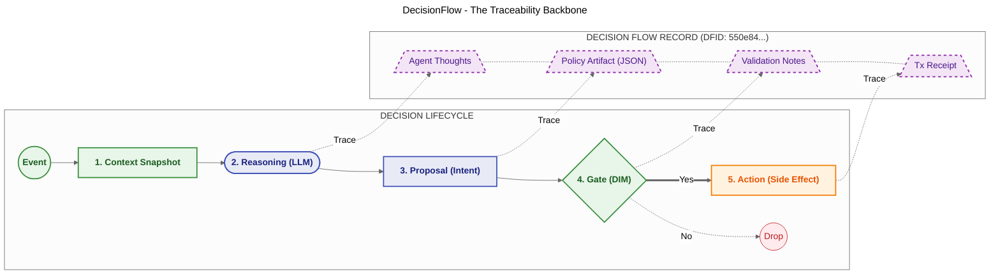

### 4.3 DecisionFlow Lifecycle State Machine

A DecisionFlow is a **stateful entity** managed by the Runtime. It is NOT a stateless HTTP request.

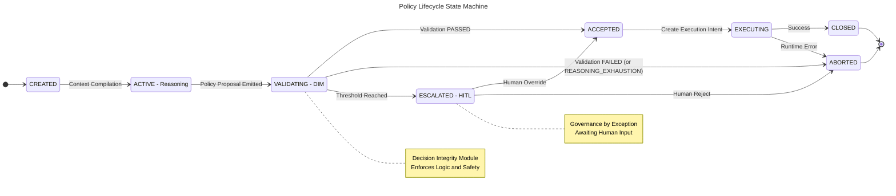

**State semantics:**
- `CREATED` → `ACTIVE`: Context compilation begins
- `ACTIVE` → `VALIDATING`: Agent emits a Policy Proposal
- `VALIDATING` → `ACCEPTED/ABORTED/ESCALATED`: DIM validation result
- `ACCEPTED` → `EXECUTING`: Runtime creates Execution Intent
- `EXECUTING` → `CLOSED/ABORTED`: External system call result
- `ABORTED` with tag `DIRTY`: Multi-step flow failed mid-execution; triggers Saga Compensation

### 4.4 Decision Integrity Module (DIM)  -  The Validation Pipeline

DIM is the **Policy Enforcement Point (PEP)** of the Runtime. It is the kernel's access control system. Every proposal MUST pass all gates before any side effect occurs.

> **"Training alignment does not constitute cryptographic provenance."** The DIM does not trust that a model is "aligned." It evaluates five explicit, deterministic criteria against registered authority. A hallucinating model, a prompt-injected agent, and a well-aligned model all traverse the same pipeline. Security derives from structural enforcement, not behavioral trust.

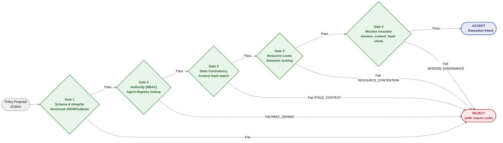

**Gate details:**

| Gate | What it checks | Rejection code |
|------|---------------|----------------|
| **1  -  Schema & Integrity** | JSON matches versioned Pydantic schema; required fields present; no extra fields | `SCHEMA_INVALID` |
| **2  -  Authority (RBAC)** | Permissions resolved from Agent Registry; agent authorized for this policy kind and instrument | `RBAC_DENIED` |
| **3  -  State Consistency** | `context_ref` / `context_snapshot_id` in proposal matches live state hash | `STALE_CONTEXT` |
| **4  -  Resource Locks** | Temporary lock/reservation on required assets placed; prevents horizontal contention between concurrent agents | `RESOURCE_CONTENTION` / `INSUFFICIENT_LIQUIDITY` |
| **5  -  Mission Invariant** | `mission_context_hash` in proposal matches agent's registered mission contract | `MISSION_DISSONANCE` |

**Lock Normalization (Deadlock Prevention):** Resources MUST be requested in alphabetical order of their Global Resource IDs. This is a **Kernel responsibility**  -  agents are NOT responsible for sorting. Mandatory `LockTimeout` (e.g., 5s) aborts stalled flows with `RESOURCE_CONTENTION_TIMEOUT`.

**Intent Retry Governor (Feedback Poisoning Protection):** When DIM rejects a proposal, it returns `ValidationFeedback` to the agent. The agent may retry  -  but MUST NOT exceed `Maximum Intent Retries` (typically 3 per DFID). After 3 rejections, the Runtime forcibly aborts with `REASONING_EXHAUSTION`. This prevents infinite reasoning loops and token budget drainage.

**Semantic Alignment Check (Optional  -  Soft Guard):**
Detects "proxy gaming": agent narrative says "I am reducing risk" while policy says `{"action": "BUY_LEVERAGE"}`.

- **Default (Audit Mode):** `SEMANTIC_MISMATCH` flags flow as `NEEDS_REVIEW` and triggers async alert. Does NOT block execution.
- **Strict Mode (`strict_semantic_blocking: true`):** `SEMANTIC_MISMATCH` triggers immediate `ABORT`. **Violates Invariant 1 (Determinism).** Use only in low-throughput, high-risk environments.

**Time as a Hard Constraint:** If `current_time > policy.valid_until`, the proposal is rejected immediately. Prevents "queued command" problem where a backlog of old decisions executes hours later.

### 4.5 JIT State Verification  -  Anti-TOCTOU

LLM latency makes TOCTOU (Time-of-Check to Time-of-Use) races inevitable. The Runtime mitigates this with Just-In-Time State Verification executed **immediately before** the external API call.

**Mechanism:**
- Bind each policy to a `context_snapshot_id` and explicit `drift_envelope` (e.g., 50 bps = 0.5%)
- Re-verify that live state is within the envelope relative to snapshot
- If `current_state_age > hard_threshold` (e.g., 500ms) OR drift exceeds bounds → abort with `STATE_DRIFT_DETECTED`
- Agent must re-reason against fresh context

**Cost:** One extra read operation before every execution. DIR accepts this "Safety over Speed" trade-off. A missed trade due to aggressive validation is an opportunity cost; a realized hallucination is an actual loss.

**JIT Drift Envelope  -  YAML configuration per field:**

```yaml
# jit_verification.yaml  -  per-agent configuration in Kernel Space
jit_verification:
  enabled: true

  # Maximum allowed drift per monitored field before aborting execution
  drift_envelope:
    price_pct: 2.0            # Abort if price moved > 2% since snapshot
    volume_pct: 15.0          # Abort if volume changed > 15%
    position_state: strict    # Any change in position state = abort

  # Snapshot expiration  -  reject proposals older than this threshold
  max_context_age_seconds: 30

  # Response when drift detected
  on_drift_exceeded:
    action: "ABORT"
    notify: ["ops-channel"]
    retry_with_fresh_context: true   # Signal agent to re-reason with new snapshot
```

The `position_state: strict` setting is an example of field-level drift sensitivity: some fields (position state, account balance) allow zero drift; others (price, volume) allow a configurable tolerance. This granular control enables fine-tuning the safety/performance trade-off per use case.

Agents repeat themselves. Networks drop packets. Without idempotency, retries become duplicate executions (double trades, double charges, double database writes).

**The formula  -  MUST be followed exactly:**

```
IdempotencyKey = SHA256(DFID + Step_ID + Canonical_Params)
```

- `DFID`: The trace ID of the reasoning chain
- `Step_ID`: For multi-step sequences within the same DFID
- `Canonical_Params`: Sorted JSON string of action parameters

```python
import hashlib
import json

def idempotency_key(dfid: str, step_id: str, canonical_params: dict) -> str:
    """Derive a stable idempotency key for a decision step."""
    payload = f"{dfid}:{step_id}:{json.dumps(canonical_params, sort_keys=True)}"
    return hashlib.sha256(payload.encode("utf-8")).hexdigest()

# Example
key = idempotency_key(
    dfid="550e8400-e29b-41d4-a716-446655440000",
    step_id="step-02",
    canonical_params={"action": "BUY", "instrument": "BTC-USD", "qty": 0.05}
)
```

**CRITICAL:** `Attempt_Number` MUST NOT be part of the key. Including it would make each retry produce a different key, defeating idempotency. Log `Attempt_Number` for observability only.

**Why `context_ref` (the Context Snapshot hash) is deliberately excluded from the key:**

This is a non-obvious but critical design decision. Suppose an agent decides "Buy 10 ETH" and the network fails during execution. The agent retries 10 seconds later. By then, the market price (Context) has changed.

- **If `context_ref` were included:** `SHA256(Action + NewContext)` → produces a **new key** → bypasses idempotency check → **duplicate order executed**
- **By excluding `context_ref`:** `SHA256(DFID + Step_ID + Params)` → **same key** regardless of context drift → idempotency cache recognizes it as duplicate → returns prior result without re-executing

> **"Lock the key to the Flow ID and the Intent params. A retry of the same logical decision is recognized as a duplicate even if the world has shifted since the first attempt."**

This is intentional: idempotency protects against *re-execution of the same logical intent*. JIT State Verification (§4.5) is the separate mechanism that decides whether the intent is still *valid* given current state. They solve orthogonal problems and must not be conflated.

**Cache behavior:** Cache hit → return saved result (no API call). Cache miss → execute → store result. On transient API failure → retry with exponential backoff (same key). On terminal failure → mark `ABORTED`.

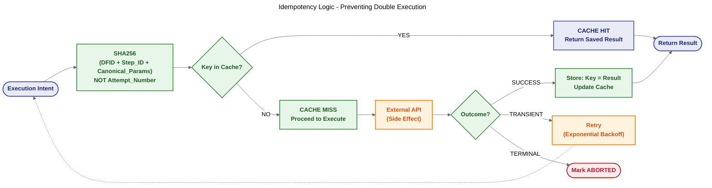

### 4.7 Escalation  -  Governance by Exception

DIR does NOT default to "Mother-May-I" (human approval for every step). It acts autonomously and escalates **only by exception**.

**Escalation outcomes:**

| Type | Meaning | Typical Result |
|------|---------|----------------|
| **Soft-stop** | Return proposal for revision without execution | Agent retries with new reasoning or fresh context |
| **Hard-stop** | Reject and block progression | Manual or supervisory intervention required |
| **Delegation** | Forward unresolved responsibility upward | Broader-scope agent decides |
| **Alerting** | Notify human/operator of ambiguity or risk | Flow pauses or aborts pending external review |

Escalation is not synonymous with human approval. It is the controlled routing of unresolved responsibility.

**Hierarchical Escalation (Agent → Agent before Human):**
1. Blocked `PositionAgent` escalates to parent `StrategyAgent`
2. `StrategyAgent` (broader context, higher authority) may override, modify, or reject
3. Only if `StrategyAgent` also cannot resolve → Human-in-the-Loop alert

**Escalation Triggers (AIvestor reference):**
- Agent proposes action exceeding authority limit (e.g., trade > $1,000)
- Agent confidence < 0.7
- Broker API 5xx error > 3 times
- Silence Watchdog: no decision in >30 minutes during active period

**Escalation Budget (Rate Limiting):** Each agent has a token bucket (e.g., 3 escalations/hour). If budget exhausted → agent auto-demoted to `PASSIVE` (read-only); DecisionFlow silently aborted. Prevents "Alert Fatigue" and "Escalation DDoS."

**Computation Budget (Token Cap per DFID):** Each DecisionFlow has a hard token limit (e.g., $0.50 or 10k tokens). If exceeded before a Policy Proposal is emitted → `ABORTED` (Timeout and Reject). Prevents "financial DDoS" from looping models.

**Human Interface:** When a flow transitions to `ESCALATED`, the human is presented with `WorkingContext` + `PolicyProposal` + `Reason`. Available decisions: **OVERRIDE**, **MODIFY**, **ABORT**. The UI MUST display an **Impact Category** to prevent rubber-stamping:

| Impact Category | Criteria | Human Action Required |
|-----------------|----------|-----------------------|
| **LOW_IMPACT** | Fully reversible, below exposure threshold, within standard patterns | Fast-track approval queue |
| **HIGH_IMPACT** | Partially or fully irreversible, above exposure threshold, unusual pattern | Mandatory review with acknowledgment of consequences |

**Context-Schema Validation during agent invocation:** Before an agent is invoked, the Runtime verifies that the `WorkingContext` it is about to receive matches the schema version the agent was registered with. Schema mismatch → `REJECTED` (prevents agent from reasoning on unexpected context structure that could produce unpredictable proposals).

### 4.8 Saga Pattern  -  Multi-Step Transactions

DIR treats every `ExecutionIntent` as **Atomic**. For complex workflows spanning multiple steps:

1. **Parent Agent (Saga Manager):** Maintains state of complex transaction; emits Policy to spawn Child Flow for Step 1
2. **Child Agent (Executor):** Acts atomically on the mandate (e.g., "Sell Asset A"); reports success/failure to Parent
3. **Partial Failure → `DIRTY` State:** If Step 1 succeeds but Step 2 fails → flow tagged `PARTIAL_SUCCESS_DIRTY`
4. **Compensation:** Runtime reports failure to Parent. Parent reasons about partial state and emits a Compensation Policy (e.g., "Re-buy Asset A" or "ALERT_HUMAN"). The Runtime does NOT reason about recovery. Recovery logic stays in User Space.

Agents MUST select compensation actions from a **pre-defined, DIR-validated menu** (e.g., `REVERT`, `CLOSE_ALL`, `ALERT_HUMAN`). Agents MUST NOT generate "reasoning-based compensation" logic  -  the same reasoning capability that caused the failure cannot be trusted to fix it.

### 4.9 Observability  -  Golden Signals

Production systems MUST export these metrics (Prometheus/Grafana compatible):

| Metric | Type | Description |
|--------|------|-------------|
| `validation_latency_ms` | Histogram | Time in DIM. Split by `type=hard` (code) and `type=soft` (LLM). |
| `stale_context_reject_rate` | Counter | Proposals rejected by JIT State Check (`STATE_DRIFT`). High rates → optimize snapshot freshness. |
| `escalation_count` | Counter | Total escalations, tagged by `agent_id` and `reason`. Identifies "needy" agents. |
| `resource_lock_contention` | Gauge | Active locks vs. configured limits. |
| `token_budget_burn` | Histogram | Tokens consumed per DecisionFlow. |
| `idempotency_hit_rate` | Counter | Times Runtime saved a redundant API call. |

### 4.10 Trade-offs and Limitations

| Trade-off | Impact | Guidance |
|-----------|--------|----------|
| **Latency vs. Safety** | Validation adds overhead; unsuitable for HFT (microsecond) | DIR targets "Human-Speed" decisions (seconds to minutes). Fail safe (reject) beats fail open (execute and apologize). |
| **Complexity Overhead** | Context Compiler + Policy Engine + State Machine >> `while True` loop | Justified only when cost of failure is non-zero (money, PII, customer actions). |
| **Policy Engineering Burden** | Safety = quality of the weakest rule in DIM | "Garbage Policy In" risk: syntactically valid but semantically dangerous policies execute. Define least-privilege constraints. |
| **OS Analogy Scope** | Architectural, NOT mechanistic | Privilege separation and failure isolation are accurate. Token sampling ≠ instruction execution. Deterministic validation contains consequences, does not prevent occurrences. |

> **"A duplicate $50,000 order is far more expensive than a 200ms validation check."**

This is the core DIR value proposition: the cost of adding deterministic validation overhead is negligible compared to the cost of a single unchecked execution failure. For systems that move capital, control infrastructure, or make irreversible decisions  -  these are not optional engineering concerns. They are survival requirements.

**When NOT to use DIR:** Simple summarization tasks, read-only information retrieval, low-stakes classification. DIR overhead is justified only when the cost of failure (financial, legal, physical) is non-zero and consequential.

### 4.11 Functional Evaluation  -  Verified Failure Mode Interception

DIR has been validated against its three target failure modes using targeted functional scenarios. The baseline represents direct agent-to-execution dispatch (no Kernel mediation); the DIR configuration interposes the full validation pipeline.

| Scenario | Failure Mode | Baseline Outcome | DIR Kernel Outcome | DIR Mechanism | Test Source |
|:---------|:-------------|:-----------------|:-------------------|:--------------|:------------|
| **S1  -  State Drift** | TOCTOU | Stale decision executes; incorrect position taken | `REJECT: STATE_DRIFT`  -  execution suppressed, agent re-reasons | JIT State Verifier | `test_jit.py`; fraud detection sample |
| **S2  -  Idempotent Retry** | Duplicate side effect | Second execution triggered; duplicate transaction issued | Cache `HIT`: original result returned; no re-invocation (`t < 0.1s` vs `t > 1.0s` baseline) | Idempotency Guard (SQLite backend) | `test_saga.py`; idempotency sample |
| **S3  -  Prompt Manipulation** | Contract violation | Catastrophic order (~USD 38.75M) submitted to exchange API | `REJECT: ORDER_VALUE_EXCEEDED`  -  no API call issued | DIM + `ResponsibilityContract` validator | `test_dim_ttl.py`; quick-start sample |

**Key findings:**
- All three failure modes intercepted without false positives in nominal paths
- Validation pipeline is **compositional**: a proposal passing JIT verification can still be rejected by contract enforcement  -  each check is independently necessary
- Runtime overhead limited to SHA-256 computation + ledger append + state read  -  negligible relative to LLM inference latency

### 4.12 Deployment Topologies  -  Evolution Path

> **"DIR is a pattern, not a framework."** There is no mandatory infrastructure. Start with a single process; the architectural separation remains valid.

**Option A  -  Single-Process MVP (recommended starting point):**
- All DIR components (Context Store, DIM, Context Compiler) run in-process alongside the agent
- SQLite for Context Store, in-memory DIM rule evaluator
- Suitable for: prototype validation, low-volume systems, single-agent deployments
- Characteristic: Zero infrastructure overhead; architectural separation enforced by code structure, not process boundaries

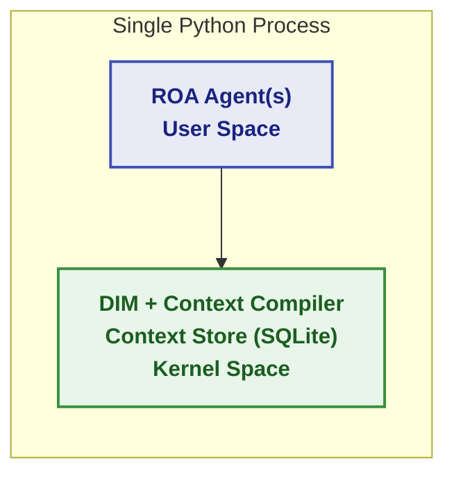

**Option B  -  Distributed Event-Driven Architecture (production scale):**
- Agents run as independent services, communicating via Event Bus (Kafka, RabbitMQ)
- Context Store as a shared distributed database (PostgreSQL + Redis cache)
- Agent Registry as a separate service with API
- DIM as a gateway service (sidecar or proxy pattern)
- Suitable for: multi-agent EOAM deployments, high-availability requirements, horizontally scalable workloads

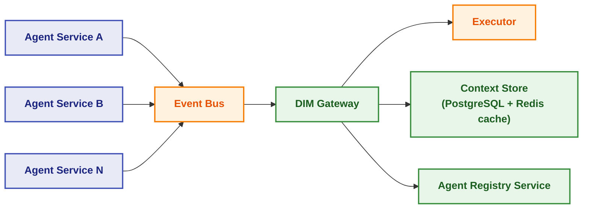

**Migration rule:** The same `ResponsibilityContract`, `PolicyProposal`, and DIM validation logic operate identically in both options. Moving from Option A to Option B is an infrastructure refactor, not a business logic refactor.

---

## 5. TOPOLOGIES  -  SIGNAL FLOW PATTERNS

Topologies define **how signals flow** and **where safety is guaranteed**. The Identity Layer (ROA) and Execution Kernel (DIR) remain constant across all topologies. Only the coordination pattern changes.

**The transportation infrastructure analogy:**

Think about how cities move people and goods. Roads, airspace, and railways all move things from A to B  -  but they use fundamentally different coordination models:

| Infrastructure | Coordination model | AI Topology equivalent |
|---------------|-------------------|----------------------|
| **Roads** | Drivers negotiate locally; traffic jams tolerated; local rules prevent crashes | **EOAM**  -  agents reason in parallel, arbitration resolves conflicts |
| **Controlled Airspace** | Pilots follow cleared flight paths; Air Traffic Control ensures separation | **SDS**  -  single agent follows grammar-constrained path; Runtime is ATC |
| **Railways** | Movement only with authoritative signals; every movement recorded and authorized | **DL+PCI**  -  movement only with cryptographic proof; everything permanently logged |

> **"Smarter drivers don't eliminate traffic jams. Better road topology does."**
> The same applies to AI systems: smarter agents won't fix architectural mismatches. The topology must match the decision type.

In AIvestor, all three topologies run simultaneously:
- **EOAM** for daily portfolio rebalancing  -  strategic decisions requiring negotiation between Risk, Strategy, and Sentiment agents
- **SDS** for momentum scalping  -  tactical decisions where speed and procedural precision override deliberation  
- **DL+PCI** for regulatory audit trails  -  compliance decisions where absolute accountability trumps speed and flexibility

The system routes decisions based on their **class**, not their **content**. A $50 tactical adjustment flows through SDS. A $10,000 strategic rebalancing flows through EOAM. Any action flagged for compliance flows through DL+PCI.

### 5.1 The Three Topologies  -  Overview

Each topology represents a fundamentally different answer to the question: *"Where does safety come from?"*

| Property | Topology A  -  EOAM | Topology B  -  SDS | Topology C  -  DL+PCI |
|----------|-------------------|-----------------|---------------------|
| **Full Name** | Event-Oriented Agent Mesh | Sovereign Decision Stream | Decision Ledger + Proof-Carrying Intents |
| **Primary Goal** | Coordinated strategic reasoning | Atomic execution velocity | Formal verification & absolute audit |
| **Trust Locus** | **Process**  -  DIM validates *after* agents reason | **Generation**  -  Grammar constrains *during* inference | **Artifact**  -  PCI carries proof *within itself* |
| **Topology Type** | Decentralized Choreography (Many-to-Many) | Linear Pipeline (One-to-One) | Append-Only Log (State-to-State) |
| **Latency** | **High** (multi-agent coordination overhead) | **Low** (single constrained inference pass) | Medium (proof generation + verification) |
| **Cost per Decision** | **High** (N agent invocations) | **Low** (1 token-optimized call) | Medium (1 call + proof overhead) |
| **Decision Depth** | Deep (multi-perspective analysis) | Shallow (procedural, rule-based) | Medium (compliance-constrained) |
| **State Guarantees** | Eventually consistent | Strongly consistent (JIT drift checks) | **Immutable** (ledger-backed) |
| **Offline Verifiability** | No (requires live DIM) | No (requires live JIT) | **Yes** (self-contained cryptographic proof) |
| **Recovery Model** | Re-arbitrate (select new proposal winner) | Re-reason (new LLM inference) | **Deterministic Replay** from immutable Ledger |
| **Inter-Org Use** | No (single trust domain) | No (Grammar and JIT are internal) | **Yes** (PCI verifiable by external party) |
| **Ideal For** | Portfolio rebalancing, supply chain, multi-expert decisions | Fraud detection, risk stops, industrial automation | Interbank settlements, medical records, regulatory reporting |
| **Avoid When** | Speed is critical | Multiple perspectives needed | High-frequency, low-stakes scenarios |
| **Concurrency** | **N agents in parallel** (all activated by same event) | **1 agent per flow** (serial pipeline) | **1 agent per intent** (sequential ledger append) |

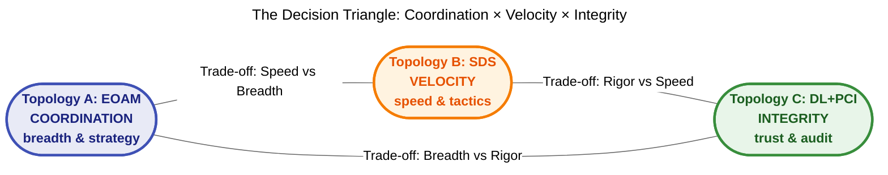

**Selection rule:** Choose topology based on decision class, not decision content. Route by class at the system boundary, not per individual decision.

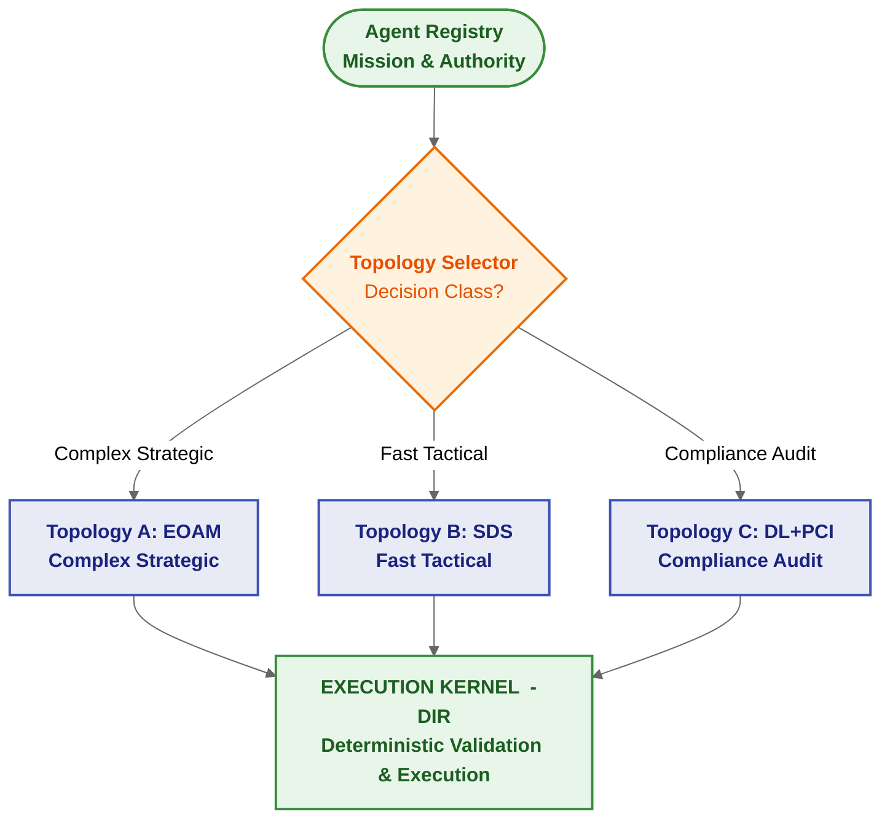

---

### 5.2 Topology A  -  Event-Oriented Agent Mesh (EOAM)

**Metaphor:** Road traffic  -  drivers (agents) react independently to observations; local arbitration rules prevent crashes.

**Key principle:** *Decentralized in activation, centralized in authority.* Agents are NOT commanded by a central manager. They subscribe to event topics (defined in Registry) and activate when relevant signals arrive.

**When to use:** Complex decisions requiring multi-perspective analysis where multiple domain experts should reason in parallel (Risk + Strategy + Sentiment), and the "best" outcome requires synthesis or priority-based preemption.

**EOAM Interface Constraint:** EOAM uses typed events and structured proposals, not free-form inter-agent conversation. The transport layer is a dumb pipe; routing decisions come from Registry-defined rules. Activation MUST follow least-privilege subscription and routing constraints. Agent-to-agent dialogue MUST NOT be treated as a synchronization or authority mechanism.

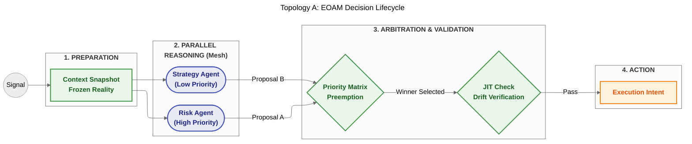

**EOAM-specific mechanisms:**

- **Scope-Based Choreography:** Agents subscribe to event topics defined in Registry; they do not wait for commands  -  they claim responsibility
- **Wake-up Predicates:** Cheap heuristics (e.g., `abs(price_delta) > 0.5%`) suppress minor signals before activating expensive LLMs; prevents "Thundering Herd" token burn
- **Economic Admission Control:** Signal volatility + available token budget determine how many agents activate
- **Priority-Based Preemption Model:** DIM does NOT use a simple time window. It applies the **Agent Registry Priority Matrix** to select the winning proposal. A Risk Agent's `HALT` architecturally preempts a Strategy Agent's `BUY` regardless of arrival order
- **JIT Drift Envelope:** Each agent's contract specifies `drift_envelope_bps`. If live state has drifted beyond the envelope since the `ContextSnapshotID` was taken → execution rejected

**EOAM: Inversion of Control:** The Runtime does NOT "call" agents. It emits a context-rich event; agents "claim" the responsibility to reason. Agents are reactive, not passive. Each mesh event MUST carry `DFID` (immutable trace header) + `ContextSnapshotID`. These two fields are mandatory in every event transmitted through the mesh.

**EOAM: Read Contention prevention:** In EOAM, multiple agents activate in parallel against the same trigger. The Runtime generates an authoritative Context Snapshot **once** and caches it  -  all agents read the same cached snapshot. This prevents parallel database reads from causing contention under load.

**EOAM blueprint:**

```python
class TacticalTrader(ResponsibleAgent):
    def register(self):
        self.registry.handshake(self.agent_id, contract, topology="EOAM")

    def on_observation(self, event: ObservationEvent):
        context = ContextCompiler.assemble(event.snapshot_id)
        explanation = self.llm.explain(context, self.mission)
        policy_intent = self.llm.generate_policy(context, explanation)

        proposal = PolicyProposal(
            dfid=event.dfid,
            params=policy_intent,
            constraints={"drift_envelope_bps": 50},
            context_ref=event.snapshot_id
        )
        EventBus.publish(proposal)
```

**Holistic EOAM Architecture  -  AIvestor Reference Implementation:**

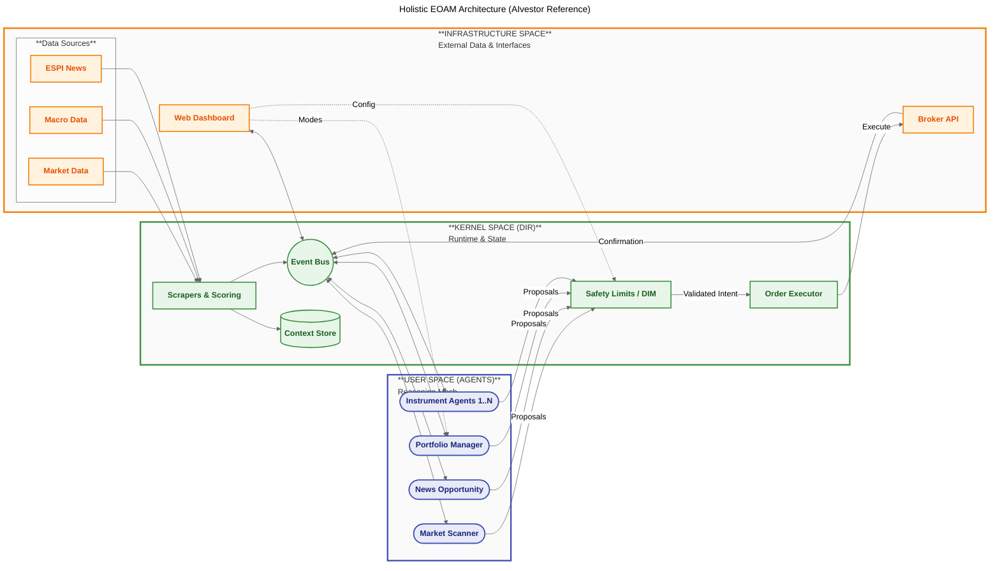

---

### 5.3 Topology B  -  Sovereign Decision Stream (SDS)

**Metaphor:** Fly-by-Wire aircraft  -  the pilot has full authority within the safe flight envelope; the flight computer physically prevents exceeding structural limits. No matter what the pilot intends, the physics make it impossible to exceed the constraints.

**Key principle:** *Syntactically Bound by Design.* Safety is achieved not through post-generation validation but through **Constrained Decoding**  -  embedding deterministic rules of DIR directly into the probabilistic sampling of the LLM.

**Important latency note:** SDS minimizes latency *relative to EOAM*, but still involves LLM inference (typically 100ms–2s). It targets "fast-for-AI" decisions, NOT microsecond-scale HFT.

**When to use:** Tactical, high-frequency, atomic decisions requiring speed over deliberation. Single perspective sufficient. Pre-defined decision boundaries amenable to grammar expression.

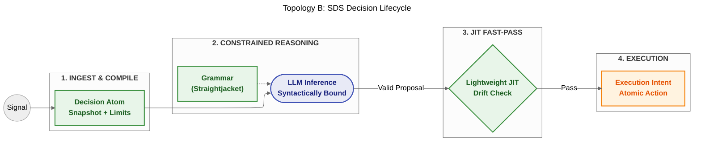

**SDS-specific mechanisms:**

- **Constrained Decoding:** Uses grammar libraries (e.g., `Outlines`, `Guidance`) to enforce Responsibility Contract during inference. LLM physically cannot generate a token violating JSON schema or numerical bounds
- **Atomic Context:** The Context Compiler assembles a complete package (Mission + Constraints + Snapshot) before inference. No emergent context or async message passing
- **ContextSnapshotID binding:** Agent's output MUST include the `ContextSnapshotID` hash. DIM verifies this JIT before execution
- **JIT Fast-Pass:** Because proposal was generated under constraint, DIM performs only a lightweight drift check (not full validation pipeline)
- **Disclaimer:** Constrained Decoding guarantees structural integrity but DOES NOT guarantee semantic alignment with ROA Mission. Final semantic and safety validation remains with DIM

**Holistic SDS Architecture  -  Autonomous Flight Delay Refund System Reference:**

```mermaid
---
config:
  layout: dagre
  theme: neutral
  look: classic
title: Holistic SDS Architecture (Refund System Reference)
---
flowchart LR
 subgraph External_Sources["**External Data**"]
    direction TB
        FlightAPI["Flight API (delay data)"]
        AirlineDB["Airline Policy DB"]
        PaymentGW["Payment Gateway"]
  end
 subgraph Kernel_Layer["**KERNEL SPACE (DIR)**<br>Runtime & Pipeline"]
    direction TB
        ContextStore[("Context Store<br>(State + Session)")]
        DIM["DIM<br>(Hard Guards)"]
        ContextCompiler["Context Compiler<br>(assembles snapshot)"]
        Executor["Refund Executor"]
  end
 subgraph User_Layer["**USER SPACE (SDS Agent)**<br>Constrained Decoding"]
    direction TB
        Grammar["Grammar Builder<br>(Pydantic → schema)"]
        Inference["LLM Inference<br>(grammar-constrained)"]
        SDSAgent(["RefundDecisionAgent"])
  end
    FlightAPI --> ContextStore
    AirlineDB --> ContextStore
    ContextStore --> ContextCompiler
    ContextCompiler -->|"Mission + Constraints + Snapshot"| Grammar
    Grammar -->|"Compiled grammar"| Inference
    Inference -->|"Structurally-valid proposal"| SDSAgent
    SDSAgent -->|"PolicyProposal + ContextSnapshotID"| DIM
    DIM -->|"JIT fast-pass (drift check only)"| Executor
    Executor --> PaymentGW

     FlightAPI:::infraSpace
     AirlineDB:::infraSpace
     PaymentGW:::infraSpace
     ContextStore:::kernelSpace
     DIM:::kernelSpace
     ContextCompiler:::kernelSpace
     Executor:::kernelSpace
     Grammar:::userSpace
     Inference:::userSpace
     SDSAgent:::userSpace
    classDef userSpace fill:#E8EAF6,stroke:#3F51B5,stroke-width:2px,color:#1A237E,font-weight:bold
    classDef kernelSpace fill:#E8F5E9,stroke:#388E3C,stroke-width:2px,color:#1B5E20,font-weight:bold
    classDef infraSpace fill:#FFF3E0,stroke:#F57C00,stroke-width:2px,color:#E65100,font-weight:bold
    style Kernel_Layer fill:#FAFAFA,stroke:#388E3C,stroke-width:3px
    style User_Layer fill:#FAFAFA,stroke:#3F51B5,stroke-width:3px
    style External_Sources fill:#FAFAFA,stroke:#F57C00,stroke-width:3px
```

**SDS blueprint:**

```python
from outlines import models, generate
from pydantic import BaseModel, Field

class SDSPolicy(BaseModel):
    action: str  # Must match Literal["BUY", "SELL", "HOLD"]
    amount: float
    rationale: str  # The Explain component

def execute_sovereign_stream(dfid: str, context_snapshot: dict):
    contract = AgentRegistry.get_contract(context_snapshot["agent_id"])

    # Grammar enforces DIR constraints at sampling layer
    grammar = build_pydantic_grammar(SDSPolicy, constraints=contract.limits)

    # Constrained inference  -  model cannot generate tokens violating grammar
    policy_proposal = generate.json(model, grammar)(
        prompt=f"Mission: {contract.mission}<br>Context: {context_snapshot['data']}"
    )

    # JIT fast-pass: only drift check needed (grammar already enforced schema/bounds)
    return DIR.jit_execute(dfid, policy_proposal, context_snapshot["hash"])
```

---

### 5.4 Topology C  -  Decision Ledger with Proof-Carrying Intents (DL+PCI)

**Metaphor:** Letter of Credit in banking  -  a Bank (Runtime) guarantees payment to a Beneficiary (Execution Engine) on behalf of a Buyer (Agent), *provided that* specific documents (Proofs) are presented. The Bank does not judge the quality of the goods; it strictly verifies the documents.

**Key principle:** *Verify then Trust.* Safety is a property of the **data structure itself**, not the process that generated it. The Runtime does not trust the agent's reasoning. It verifies proofs attached to the intent artifact.

**The Regulatory Imperative  -  Why DL+PCI exists:**

The EU AI Act (entering force 2026) classifies autonomous decision systems in financial services, critical infrastructure, and healthcare as **high-risk**, requiring:
- **Article 12:** Automatic recording of events throughout the system lifecycle, with logs sufficient to *verify compliance with regulatory requirements*
- **Article 13:** Human oversight mechanisms **architecturally integrated**  -  not retrofitted post-deployment

Conventional logging fails these requirements for three structural reasons:

| Conventional Logging Failure | Why It Fails EU AI Act |
|------------------------------|------------------------|
| **Non-deterministic reconstruction** | Auditors cannot reproduce the decision context from logs; stochastic sampling + external state interactions are not captured | 
| **No cryptographic binding** | Logs can be selectively disclosed, redacted, or generated post-hoc; no artifact-level proof that a decision was made under specific constraints |
| **Process-dependent verification** | Auditors must trust the originating system's runtime and access live infrastructure to validate compliance  -  precludes independent third-party verification |

DL+PCI addresses all three: **each decision artifact cryptographically proves its own compliance**  -  verifiable independently of the originating system, without trusting the operator's runtime or accessing live infrastructure. This is the shift from **process inspection** to **artifact verification**.

**Distinction from Topology B:**
- **SDS guarantees:** "This intent was structurally valid at the moment of generation."
- **DL+PCI guarantees:** "This intent was formally compliant, and *anyone can verify this at any time*, without trusting or accessing the system that produced it."

**When to use:** Compliance-heavy operations requiring offline verifiability; inter-organizational settlements; high-value irreversible transfers; regulatory reporting where proof must outlive the system.

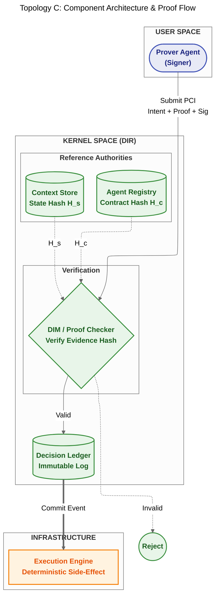

**Proof-Carrying Intent (PCI)  -  Mandatory Structure:**

| Field | Type | Description |
|-------|------|-------------|
| `dfid` | UUID | Immutable DecisionFlow ID  -  trace identifier |
| `intent_payload` | JSON | The syntactically bound policy (from SDS constrained decoding) |
| `context_ref` | Hash | `ContextSnapshotID`  -  hash of Working Context used during reasoning |
| `evidence_hash` | Hash | Composite proof hash binding state + contract + rules |
| `roa_signature` | Signature | Cryptographic signature binding PCI to Agent's registered identity |

**Evidence Hash  -  Derivation Formula (MUST follow exactly):**

$$H_{evidence} = \text{SHA256}(\text{DFID} \parallel H_s \parallel H_c \parallel H_r)$$

Where:
- **$H_s$ (State Snapshot Hash):** `SHA256(ContextSnapshotID)`  -  the "frozen reality" used during reasoning
- **$H_c$ (Contract Hash):** `SHA256(ResponsibilityContract)` from Agent Registry at `T_start`
- **$H_r$ (Rule-Set Hash):** `SHA256(DIM Hard Gates)`  -  deterministic validation rules applied

Any drift in context, unauthorized change to the mission, or rule-set update results in immediate hash mismatch → verification failure.

**Proof Checker Workflow (DIM in Topology C  -  5 steps, in order):**

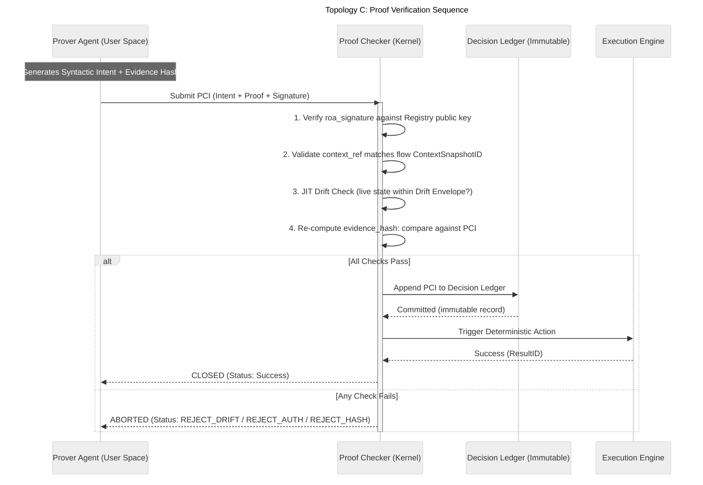

**Decision Ledger properties (all MUST hold):**
- **Append-only:** No updates, no deletes. History is immutable.
- **Idempotent:** Replaying the same PCI yields the same outcome (or deterministic rejection)
- **Self-contained:** Auditors need only the Ledger + public keys to verify any entry. No access to live Runtime required.

**DL+PCI blueprint:**

```python
from pydantic import BaseModel

class ProofCarryingIntent(BaseModel):
    dfid: str
    intent_payload: dict   # Syntactically bound policy
    context_ref: str       # ContextSnapshotID hash
    evidence_hash: str     # SHA256(DFID || H_s || H_c || H_r)
    roa_signature: str     # Cryptographic bond to ROA identity

class ProofChecker:
    def verify(self, pci: ProofCarryingIntent, ledger: "DecisionLedger") -> bool:
        # 1. Identity Attestation
        if not self.verify_signature(pci.roa_signature, pci.dfid):
            raise InvalidSignatureError()

        # 2. Context Binding (no network I/O during verification)
        expected_ref = self.flow_store.get_snapshot_id(pci.dfid)
        if pci.context_ref != expected_ref:
            raise ContextBindingError()

        # 3. JIT Drift Check
        if not self.within_drift_envelope(pci.context_ref):
            raise StateDriftError("Live state outside drift envelope")

        # 4. Re-compute and compare evidence hash
        h_s = self.hash(self.context_store.get_snapshot(pci.context_ref))
        h_c = self.hash(self.registry.get_contract(pci.dfid))
        h_r = self.hash(self.dim_rules.get_current_ruleset())
        expected_hash = sha256(f"{pci.dfid}{h_s}{h_c}{h_r}")
        if pci.evidence_hash != expected_hash:
            raise ProofVerificationFailed("Evidence hash mismatch")

        # 5. Commit  -  only if all checks pass
        ledger.append(pci)
        return True
```

**Resilience (Topology C specific):**
- **Deterministic Replay:** On system failure, Ledger enables exact replay to identify which proof failed
- **Immutable Compensation:** Post-Ledger-commit execution failure → deterministic compensation action from pre-defined menu (`REVERT_STATE`, `ALERT_HUMAN`). Agent MUST NOT re-reason about the failure.
- **Registry Outage:** Proof Checker uses Local Manifest Cache. New PCIs requiring authority updates are rejected until connectivity restored (prevents Stale Authority Exploitation)

**PCI vs. Decision Atom  -  Key Distinction:**

| Property | Decision Atom (Topologies A+B) | Proof-Carrying Intent (Topology C) |
|----------|-------------------------------|-------------------------------------|
| **Trust basis** | Runtime process validates the record | Data artifact carries its own proof |
| **Verifiability** | Requires access to the live system | Offline verifiable  -  proof is self-contained |
| **Mutability** | Can be updated/corrected in runtime | Ledger-appended; immutable once committed |
| **Audit scope** | Session/State level | Cross-organizational, cross-system, cross-time |
| **Best for** | Operational decisions needing fast validation | Compliance, settlement, regulatory reporting |

**Regulatory Audit Scenario  -  Why DL+PCI, not SDS:**

Imagine a cross-border payment instruction executed six months ago. The regulator asks: "Prove that at the moment of execution, this instruction was within the agent's authorized bounds, that the market state was as claimed, and that the risk rules used were the current official ruleset."

- **With SDS (Topology B):** The system can show that the policy was structurally valid when generated. But verifying the *exact* market state, *exact* contract, and *exact* rules active at that moment requires querying live system history  -  trusting the runtime's audit log integrity.
- **With DL+PCI (Topology C):** The PCI artifact itself carries the `evidence_hash = SHA256(DFID ‖ H_state ‖ H_contract ‖ H_rules)`. The regulator can independently hash the same inputs (provided separately) and verify the hash matches. No live system access required. The proof travels with the decision  -  forever.

**Rule:** Use DL+PCI whenever the question "Can someone outside the system verify this decision was compliant?" must be answerable as "Yes, without trusting us."

**DL+PCI Regulatory Compliance Properties:**

DL+PCI satisfies EU AI Act and broader regulatory requirements through five architectural properties:

| Property | Description | Regulatory Relevance |
|----------|-------------|---------------------|
| **Independent Verifiability** | Auditors verify compliance without accessing production systems or trusting operator infrastructure | EU AI Act Article 12 |
| **Immutable Decision History** | Append-only Ledger preserves all decisions throughout system lifecycle  -  cannot be selectively disclosed or retroactively modified | EU AI Act Article 12 |
| **Deterministic Reproducibility** | Unlike stochastic model outputs, PCI verification is deterministic  -  independent auditors reach identical conclusions on identical artifacts | EU AI Act Article 13 |
| **Cryptographic Non-Repudiation** | Kernel-issued signature binds each decision to responsible agent identity and precise compliance context  -  agents cannot deny decisions; operators cannot claim different conditions | General compliance |
| **Cross-Organizational Auditability** | PCIs enable compliance verification across organizational boundaries without sharing internal system access | Inter-org settlement, regulated industries |

---

## 6. CODING STANDARDS

All generated code implementing DIR/ROA patterns MUST comply with these rules.

### 6.1 Language and Runtime

| Rule | Requirement |
|------|-------------|
| **LS-1** | Python 3.12+. Use modern syntax (`type` statement, pattern matching where appropriate). |
| **LS-2** | All modules MUST have `from __future__ import annotations` at top. |
| **LS-3** | No `# type: ignore` without explicit justified comment. Fix the underlying type issue. |

### 6.2 Type Hints

| Rule | Requirement |
|------|-------------|
| **TH-1** | All function signatures MUST have complete type hints for parameters and return types. |
| **TH-2** | All module-level variables and class attributes MUST be typed. |
| **TH-3** | Use `list[str]` over `List[str]` (Python 3.9+ style). |
| **TH-4** | Optional values: use `X | None`. Never untyped `None` returns. |
| **TH-5** | Use `Literal` for enumerated string values (e.g., `Literal["ACCEPT", "REJECT"]`). |
| **TH-6** | Use `TypedDict` or Pydantic for structured dicts. Raw `dict[str, Any]` is forbidden except for truly dynamic payloads (must be justified). |

### 6.3 Pydantic

| Rule | Requirement |
|------|-------------|
| **PY-1** | Pydantic v2 only. Use `BaseModel` from `pydantic`. |
| **PY-2** | All DTOs, Policy Proposals, and domain models MUST be Pydantic models. |
| **PY-3** | Use `Field()` for validation constraints. Document fields with `description`. |
| **PY-4** | Use `model_config = ConfigDict(...)` for global settings (e.g., `frozen=True`, `extra="forbid"`). |
| **PY-5** | Use `model_validate()` and `model_dump()` (Pydantic v2 API). Not `parse_obj()` / `dict()`. |

### 6.4 Global State and Dependencies

| Rule | Requirement |
|------|-------------|
| **GS-1** | BAN global mutable state. No module-level variables mutated at runtime. |
| **GS-2** | BAN implicit magic. No `__getattr__`-based dynamic dispatch, no hidden side effects in property access. |
| **GS-3** | BAN singletons unless explicitly required (e.g., Agent Registry). Document the rationale. |
| **GS-4** | Dependencies MUST be injected explicitly (constructor injection or explicit parameters). |
| **GS-5** | Configuration (API keys, URLs, feature flags) MUST come from environment variables or a config object. Never hardcode secrets. |

### 6.5 Pure Functions vs. Side Effects (Critical for DIR)

| Rule | Requirement |
|------|-------------|
| **PF-1** | Pure functions (validation, hashing, rule evaluation) MUST NOT perform I/O. MUST be deterministic given the same inputs. |
| **PF-2** | Side-effect functions (API calls, DB writes, Ledger appends) MUST be clearly separated. Name with verbs: `call_payout_api`, `append_to_ledger`. |
| **PF-3** | Pure validation logic MUST NOT depend on external services. May depend on in-memory caches populated at startup. |
| **PF-4** | The boundary between User Space (reasoning, policy formation) and Kernel Space (validation, execution) MUST be explicit in code structure. No LLM calls inside Proof Checker or Execution Engine. |
| **PF-5** | Functions performing side effects MUST return a result type indicating success or failure. |

### 6.6 Logging

| Rule | Requirement |
|------|-------------|
| **LG-1** | Structured JSON logging only. Use `structlog` or `logging` with JSON formatter. No unstructured `print()` for operational output. |
| **LG-2** | Every log entry MUST include: `dfid` (when in a decision flow), `event`, `timestamp`. |
| **LG-3** | Use log levels correctly: `DEBUG` for internal state, `INFO` for lifecycle events, `WARNING` for recoverable issues, `ERROR` for failures. |
| **LG-4** | Sensitive data (PII, payment details, credentials) MUST NOT appear in logs. Log hashes or redacted identifiers only. |

### 6.7 Error Handling

| Rule | Requirement |
|------|-------------|
| **EH-1** | Define domain-specific exception classes. Do not use generic `Exception` for control flow. |
| **EH-2** | Validation failures MUST raise typed exceptions (e.g., `ValidationRejected`, `ProofVerificationFailed`) with structured `reason` and `details` fields. |
| **EH-3** | Catch only exceptions you can handle. Let others propagate. Avoid bare `except:`. |
| **EH-4** | When re-raising, use `raise X from e` to preserve the chain. |

### 6.7a Exception Hierarchy  -  `kernel/exceptions.py`

Rule **EH-1** requires domain-specific exceptions. Without a shared base class and defined tree, LLMs generate `ValidationRejected` in one module and `ValidationError` in another, making top-level handling impossible. The entire tree lives in `kernel/exceptions.py` and is the **single import source** for all DIR error types.

```python
from __future__ import annotations


class DIRException(Exception):
    """
    Base for ALL DIR exceptions across all layers.
    Always carries dfid (if available) and a structured reason.
    Usage: raise ValidationRejected("msg", dfid=dfid, reason="SCHEMA_INVALID", details={...})
    """
    def __init__(
        self,
        message: str,
        *,
        dfid: str | None = None,
        reason: str = "",
        details: dict | None = None,
    ) -> None:
        super().__init__(message)
        self.dfid = dfid
        self.reason = reason
        self.details = details or {}

    def __repr__(self) -> str:
        return f"{type(self).__name__}(reason={self.reason!r}, dfid={self.dfid!r})"


# ─── Kernel Space ────────────────────────────────────────────────────────────

class KernelException(DIRException):
    """Base for all exceptions originating in Kernel Space components."""


class ValidationRejected(KernelException):
    """
    A PolicyProposal failed one of the DIM hard gates.
    Subclass identifies which gate failed.
    reason values: SCHEMA_INVALID | RBAC_DENIED | STALE_CONTEXT |
                   RESOURCE_CONTENTION | MISSION_DISSONANCE
    """


class SchemaMismatch(ValidationRejected):
    """Gate 1: proposal does not conform to the registered versioned schema."""


class AuthorizationDenied(ValidationRejected):
    """Gate 2: agent not authorized for this policy kind or instrument (RBAC)."""


class StaleContextError(ValidationRejected):
    """Gate 3: context_snapshot_id in proposal does not match live state."""


class ResourceContention(ValidationRejected):
    """Gate 4: required resource lock cannot be acquired."""


class MissionDissonance(ValidationRejected):
    """Gate 5: mission_context_hash diverges from registered agent mission."""


class StateDriftError(KernelException):
    """
    JIT re-check (§4.5) detected that live state drifted beyond drift_envelope
    AFTER DIM acceptance but BEFORE dispatch. ExecutionIntent is invalidated.
    Agent must re-reason with a fresh context snapshot.
    """


class IdempotencyConflict(KernelException):
    """
    Idempotency cache HIT: this (DFID + Step_ID + Params) combination was
    already executed. The stored result is returned; the new attempt is suppressed.
    This is NOT an error  -  it is a successful deduplication. Log at INFO, not ERROR.
    """


class ProofVerificationFailed(KernelException):
    """
    Topology C (DL+PCI): evidence_hash recomputation did not match the hash
    embedded in the PCI artifact. Indicates tampering or replay attack.
    """


class ReasoningExhausted(KernelException):
    """
    Maximum Intent Retries exceeded within a single DecisionFlow.
    The Runtime transitions the flow to ABORTED. Prevents hallucination loops.
    """


class KernelSignatureInvalid(KernelException):
    """
    Execution Engine rejected an ExecutionIntent because kernel_signature
    verification failed. Indicates the intent did not pass through DIM.
    """


# ─── User Space ──────────────────────────────────────────────────────────────

class AgentException(DIRException):
    """Base for exceptions originating in User Space (agent logic)."""


class ContractViolation(AgentException):
    """
    Agent attempted to emit a PolicyProposal outside its Responsibility Contract
    bounds (e.g., unauthorized instrument, forbidden action).
    Raised by the agent's own self-check before submission  -  NOT by DIM.
    """


class EscalationRequired(AgentException):
    """
    Agent's EscalationTrigger condition is met.
    Agent MUST NOT continue reasoning; it emits this to signal handoff to Runtime.
    """


# ─── Infrastructure ───────────────────────────────────────────────────────────

class InfrastructureException(DIRException):
    """Base for exceptions from external systems (APIs, DBs, message brokers)."""


class ExternalAPIError(InfrastructureException):
    """
    External API call failed (network error, HTTP 4xx/5xx).
    The Execution Engine catches this and initiates the Saga compensation path.
    """


class RegistryUnavailable(InfrastructureException):
    """
    Agent Registry unreachable. Kernel falls back to Local Manifest Cache.
    If cache is stale (TTL exceeded), new DecisionFlows are rejected.
    """


class LedgerWriteError(InfrastructureException):
    """
    Append-only Ledger write failed (Topology C).
    The intent MUST NOT be dispatched to the Execution Engine until committed.
    """
```

**Exception handling patterns:**

```python
# ✅ Correct  -  catch at appropriate level, re-raise with chain
try:
    intent = dim.validate(proposal)
except ValidationRejected as exc:
    logger.warning("proposal_rejected", dfid=exc.dfid, reason=exc.reason, details=exc.details)
    raise

# ✅ Correct  -  top-level catch for structured logging / metrics
except DIRException as exc:
    metrics.increment("dir.exceptions", tags={"type": type(exc).__name__})
    raise

# ❌ Forbidden  -  loses all structured context
except Exception:
    logger.error("something went wrong")
```

### 6.8 DIR-Specific Constraints (Non-Negotiable)

| Rule | Requirement |
|------|-------------|
| **DIR-1** | **Proof Checker / DIM MUST be deterministic.** No LLM calls, no network I/O during verification. |
| **DIR-2** | **Decision Ledger MUST be append-only.** No updates or deletes. |
| **DIR-3** | **Idempotency Key MUST follow** `SHA256(DFID + Step_ID + Canonical_Params)`. `Attempt_Number` MUST NOT be in the key. |
| **DIR-4** | **DFID MUST propagate through the entire pipeline.** Every function that participates in a decision flow MUST accept and forward `dfid`. Every log entry in the flow MUST include `dfid`. |
| **DIR-5** | **Agent (ROA) MUST NOT hold API keys or database credentials.** Agents submit proposals only. |
| **DIR-6** | **Kernel (DIR) MUST validate every proposal before execution.** No bypass, no "trusted agent" exception. |
| **DIR-7** | **No LLM in Kernel Space.** Context Compiler, DIM, Proof Checker, Execution Engine are deterministic code. |
| **DIR-8** | **Compensation actions MUST be selected from a pre-defined menu.** Agents MUST NOT generate reasoning-based compensation logic. |

### 6.9 Python-Specific Rules

| Rule | Requirement |
|------|-------------|
| **PY-1** | Use dataclasses for simple data containers (no validation needed). Use Pydantic `BaseModel` when validation, serialization, or schema export is required. |
| **PY-2** | Prefer `pathlib.Path` over `os.path` for all file operations. |
| **PY-3** | Use `contextlib.suppress` over bare `try/except/pass` for intentional exception suppression. |
| **PY-4** | Async code: use `asyncio.gather` for concurrent operations; avoid `asyncio.run` inside already-running event loops. |
| **PY-5** | Never use `time.sleep` in async contexts; use `asyncio.sleep`. |
| **PY-6** | f-strings are preferred for string interpolation. `%` formatting is forbidden. `.format()` is acceptable only for complex template scenarios where f-strings reduce readability. |

### 6.10 Testing Standards

| Rule | Requirement |
|------|-------------|
| **TE-1** | All DIR kernel components (DIM, Proof Checker, Context Compiler) MUST have unit tests with 100% branch coverage of validation logic. |
| **TE-2** | Tests for Kernel Space components MUST use deterministic fixtures  -  no random data, no time-dependent behavior without explicit time injection. |
| **TE-3** | Integration tests for agent–runtime interaction MUST assert on the `PolicyProposal` structure and validate that DIM correctly accepts or rejects boundary cases. |
| **TE-4** | Every `EscalationTrigger` condition defined in a `ResponsibilityContract` MUST have a corresponding test case that verifies escalation fires (and only fires) when the condition is met. |

### 6.11 Security Standards

| Rule | Requirement |
|------|-------------|
| **SC-1** | Agents MUST NOT hold credentials (API keys, passwords, tokens). Credentials are injected by the Runtime via secure secret management. |
| **SC-2** | DFID MUST be generated by the Runtime, not by agents. Agent-supplied DFIDs are rejected as potential replay-attack vectors. |
| **SC-3** | All external inputs reaching the Context Store MUST be sanitized before persistence. Prompt injection patterns (e.g., `<br><br>Ignore previous instructions`) MUST be detected and logged as security events. |
| **SC-4** | Proof Checker cryptographic operations MUST use `hashlib.sha256` (standard library). Third-party cryptography libraries require explicit security review. Evidence hash computation MUST match the canonical formula: `SHA256(DFID ‖ H_state ‖ H_contract ‖ H_rules)`. |

### 6.12 Naming Conventions

| Rule | Pattern | Example |
|------|---------|---------|
| **NM-1** | Classes: `PascalCase` | `ResponsibilityContract`, `ProofCarryingIntent` |
| **NM-2** | Functions and methods: `snake_case` | `compile_working_context`, `verify_proof` |
| **NM-3** | Constants and Enum values: `UPPER_SNAKE_CASE` | `EXECUTE_LIMITED`, `MAX_DRIFT_BPS` |
| **NM-4** | DFID variables: always named `dfid` (not `flow_id`, `trace_id`, `correlation_id`) | `dfid: str` |
| **NM-5** | Policy field naming: `action`, `instrument`, `quantity` (not `cmd`, `ticker`, `amount`)  -  standardized across all agents for interoperability | `policy.action = "BUY"` |

### 6.13 Kernel Component Interfaces  -  `kernel/interfaces.py`

These `typing.Protocol` definitions are the **authoritative API contracts** for all Kernel Space components. Every implementation (SQLite, PostgreSQL, Redis, Kafka, in-memory) MUST satisfy the corresponding protocol. Using protocols  -  not abstract base classes  -  allows structural subtyping and keeps implementations decoupled from the `kernel/` package.

**Rule:** Any module in `agents/` that needs to interact with a Kernel component MUST type-hint against the Protocol, never the concrete implementation. This enforces The Wall at the type-checker level.

```python
from __future__ import annotations

from collections.abc import Callable
from datetime import datetime
from typing import Any, Protocol, runtime_checkable

# Forward references to domain types defined elsewhere in kernel/
# (imported at runtime  -  listed here for documentation)
# from kernel.models import (
#     ContextSnapshot, MemoryEntry, ResponsibilityContract,
#     PolicyProposal, ExecutionIntent, AgentLifecycleState
# )


# ─── Context Store ────────────────────────────────────────────────────────────

@runtime_checkable
class ContextStoreProtocol(Protocol):
    """
    Kernel's authoritative source of environmental state.
    Implements all four Context layers: Session, State, Memory, Artifacts.
    """

    def get_snapshot(self, dfid: str) -> ContextSnapshot:
        """Return the ContextSnapshot bound to this DecisionFlow."""
        ...

    def save_snapshot(self, snapshot: ContextSnapshot) -> None:
        """Persist a compiled snapshot. Called by Context Compiler after assembly."""
        ...

    def append_session_event(self, dfid: str, event: dict[str, Any]) -> None:
        """Append an ephemeral event to the Session layer for this DecisionFlow."""
        ...

    def get_memory(self, agent_id: str, limit: int = 10) -> list[MemoryEntry]:
        """
        Retrieve the most recent `limit` Memory layer entries for this agent.
        Used by Context Compiler to populate Epistemic Longevity context.
        """
        ...

    def save_memory_entry(self, agent_id: str, entry: MemoryEntry) -> None:
        """Persist a decision outcome to agent's long-term Memory layer."""
        ...


# ─── Agent Registry ───────────────────────────────────────────────────────────

@runtime_checkable
class AgentRegistryProtocol(Protocol):
    """
    Single source of truth for agent identity, contracts, and lifecycle state.
    All DIM authority checks route through this interface.
    """

    def get_contract(self, agent_id: str) -> ResponsibilityContract:
        """
        Return the active ResponsibilityContract for this agent.
        Raises RegistryUnavailable if registry is unreachable and cache is stale.
        """
        ...

    def register(self, agent_id: str, contract: ResponsibilityContract) -> None:
        """
        Register an agent with its Responsibility Contract.
        MUST be called at deployment, not at runtime by the agent itself.
        Raises ContractViolation if agent attempts self-registration.
        """
        ...

    def get_lifecycle_state(self, agent_id: str) -> AgentLifecycleState:
        """Return current lifecycle state of this agent."""
        ...

    def transition(
        self,
        agent_id: str,
        new_state: AgentLifecycleState,
        *,
        reason: str,
        triggered_by: str,  # "runtime" | "operator" | "agent"
    ) -> None:
        """
        Transition agent to new_state with audit trail.
        Validates that the transition is allowed (see §3.5a).
        Raises ValueError for forbidden transitions (e.g., agent → ACTIVE).
        """
        ...

    def request_retire(self, agent_id: str, *, reason: str) -> None:
        """
        Agent-callable method: request RETIRED transition.
        The ONLY lifecycle transition agents may initiate.
        """
        ...


# ─── Event Bus ────────────────────────────────────────────────────────────────

@runtime_checkable
class EventBusProtocol(Protocol):
    """
    Topology A (EOAM) routing backbone.
    In Single-Process MVP: in-memory synchronous dispatcher.
    In Distributed EDA: Kafka / RabbitMQ adapter.
    """

    def publish(self, topic: str, event: dict[str, Any], *, dfid: str) -> None:
        """
        Publish event to topic. dfid is mandatory  -  every event on the bus
        MUST carry the DecisionFlow ID for traceability.
        """
        ...

    def subscribe(
        self,
        topic: str,
        handler: Callable[[dict[str, Any]], None],
        *,
        agent_id: str,
    ) -> None:
        """
        Subscribe handler to topic. agent_id is recorded for audit.
        In EOAM: only agents registered for this topic (per their contract) may subscribe.
        """
        ...


# ─── DIM (Decision Integrity Module) ─────────────────────────────────────────

@runtime_checkable
class DIMProtocol(Protocol):
    """
    Policy Enforcement Point. Deterministic  -  NO LLM calls, NO network I/O.
    Given identical inputs, always produces identical output.
    """

    def validate(
        self,
        proposal: PolicyProposal,
        *,
        dfid: str,
    ) -> ExecutionIntent:
        """
        Run all 5 hard gates against the proposal.
        Returns an ExecutionIntent (Kernel-signed) on success.
        Raises a ValidationRejected subclass on any gate failure.
        Raises StateDriftError if JIT check fails immediately after acceptance.
        """
        ...

    def get_rule_version(self) -> str:
        """Return SemVer of the currently active DIM rule set. Used in ExecutionIntent."""
        ...


# ─── Execution Engine ─────────────────────────────────────────────────────────

@runtime_checkable
class ExecutionEngineProtocol(Protocol):
    """
    Dispatches validated ExecutionIntents to external APIs.
    MUST verify kernel_signature before dispatch.
    """

    def dispatch(self, intent: ExecutionIntent) -> ExecutionReceipt:
        """
        Execute the side effect described in the intent.
        1. Verifies intent.kernel_signature
        2. Performs final JIT drift check
        3. Checks idempotency cache (raises IdempotencyConflict on hit)
        4. Dispatches to external API
        5. Appends to audit log (DFID-tagged)
        Returns ExecutionReceipt on success.
        """
        ...
```

**Why `@runtime_checkable`:** Enables `isinstance(obj, ContextStoreProtocol)` checks in tests and dependency injection containers, without requiring inheritance. Concrete implementations remain decoupled.

**Migration path  -  Single-Process MVP → Distributed EDA:**

```python
# MVP: in-process SQLite implementation
class SQLiteContextStore:
    def get_snapshot(self, dfid: str) -> ContextSnapshot: ...
    # ... all methods implemented inline

# assert isinstance(SQLiteContextStore(), ContextStoreProtocol)  # True

# Production: PostgreSQL + Redis implementation
class PostgresContextStore:
    def get_snapshot(self, dfid: str) -> ContextSnapshot: ...
    # ... same interface, different backend

# The DIM, Context Compiler, and agents never change  -  only the injected implementation.
```

### 6.13 Implementation Checklist

Before considering an implementation complete, verify:

**Language and structure:**
- [ ] Python 3.12+, `from __future__ import annotations`
- [ ] Full type hints, Pydantic v2 for all DTOs
- [ ] No global mutable state, no implicit magic
- [ ] Pure functions (validation) separated from side-effect functions (API, Ledger)
- [ ] f-strings used for interpolation (no `%` formatting)
- [ ] Project follows canonical file structure (§7b): `kernel/`, `agents/`, `topologies/`, `infrastructure/`
- [ ] `agents/` does not import from `infrastructure/` or `kernel.execution` (enforced by ruff `banned-api`)

**Kernel component contracts:**
- [ ] Kernel components typed against Protocols from `kernel/interfaces.py` (§6.14), not concrete implementations
- [ ] All exceptions inherit from `DIRException` in `kernel/exceptions.py` (§6.15)  -  no ad-hoc `Exception` subclasses
- [ ] `ExecutionIntent` is only ever constructed by DIM  -  never by agent or test fixture directly (§3.3a)
- [ ] `ExecutionIntent.kernel_signature` is verified by Execution Engine before dispatch (§3.3a)
- [ ] Agent lifecycle transitions follow ownership table (§3.5a)  -  agents only call `registry.request_retire()`

**DIR invariants:**
- [ ] Structured JSON logging with `dfid` in all decision-related logs
- [ ] Domain-specific exceptions from exception tree, no bare `except:`
- [ ] Proof Checker / DIM is deterministic; no LLM in Kernel Space
- [ ] DFID propagation throughout entire pipeline
- [ ] Idempotency Key formula: `SHA256(DFID + Step_ID + Canonical_Params)`
- [ ] Append-only Ledger (Topology C)
- [ ] Agent MUST NOT hold credentials or call external APIs directly
- [ ] Responsibility Contract registered in Agent Registry at deployment (not self-registered at runtime)

**Testing:**
- [ ] Kernel Space components have 100% branch-coverage unit tests
- [ ] Every EscalationTrigger condition has a corresponding test case
- [ ] Integration test covers full `PolicyProposal → ExecutionIntent → API dispatch` pipeline

**Security:**
- [ ] All external inputs sanitized before entering Context Store (prompt injection detection)
- [ ] Evidence hash uses canonical formula: `SHA256(DFID ‖ H_state ‖ H_contract ‖ H_rules)`
- [ ] Field naming: `dfid`, `action`, `instrument`, `quantity` (standard across all agents)

---

## 7. REFERENCE IMPLEMENTATIONS

All samples are in `samples/` from the repository root. Run with `python samples/<folder>/run.py` after `pip install -e .`.

### 7.1 Core Mechanics Samples

| Sample | Pattern / Focus | Key Demonstration |
|--------|----------------|------------------|
| `00_quick_start` | DIR full overview | "Comma Catastrophe": agent misparses 15.500 ETH → 15,500 ETH (~$38M); DIM blocks ORDER_VALUE_EXCEEDED. Also shows prompt injection protection. |
| `01_roa_agent` | ROA pattern | Responsibility Contract, Explain → Policy → Proposal lifecycle |
| `02_dfid_propagation` | DFID | DecisionFlow ID generation, propagation through pipeline, log correlation |
| `03_idempotency_guard` | Idempotency | SHA256 key formula, cache hit/miss behavior, duplicate side-effect prevention |
| `04_context_store` | Context Store | All 4 layers (Session/State/Memory/Artifacts), Context Compilation Pipeline |
| `05_dim_validation` | DIM | Deterministic validation gate, all 5 hard gates, rejection codes |
| `06_agent_registry` | Agent Registry | Capability contracts, version handshake, schema sync |
| `07_event_bus_swappable` | Infrastructure | In-memory Event Bus; pattern for swapping to Kafka/PubSub |
| `08_bootstrap_sqlite` | Infrastructure | DB bootstrap: ensure schema exists before run |
| `09_topology_a_eoam` | Topology A | Event-Oriented Agent Mesh, parallel reasoning, priority arbitration |
| `10_topology_b_sds` | Topology B | Sovereign Decision Stream, constrained decoding |
| `11_topology_c_dl_pci` | Topology C | Decision Ledger, Proof-Carrying Intents, Proof Checker |

### 7.2 Business Use Case Samples

| Sample | Topology | Domain | Scenario |
|--------|----------|--------|---------|
| `31_finance_trading` | Topology A (EOAM) | Finance/Trading | Market quotes, news feeds, parallel agents (Risk+Strategy+Sentiment), dynamic PositionAgent spawning |
| `32_fraud_gate` | Topology B (SDS) | Fraud Detection | Real-time payment fraud gate; constrained decoding, JIT state drift, drift-attack demonstration |
| `33_insurance_underwriting` | Topology C (DL+PCI) | Insurance | Risk evaluation with cryptographic Proof-Carrying Intents |
| `34_langchain_roa_wrapper` | ROA + DIR | FinOps (Cloud) | LangChain ReAct wrapped as ROA; cloud cost management; verifies mission injection blocks PROD termination |
| `35_crewai_roa_wrapper` | ROA + DIR | E-commerce (Refunds) | CrewAI Crew wrapped as ROA; verifies ACCEPT/ESCALATE/REJECT by category, return window, amount; NL intake |

### 7.3 Meta-Context Engineering Sample

`88_meta_context_engineering` demonstrates DIR applied to the *construction* of systems, not only their runtime execution. Markdown specifications are active implementation inputs, not passive documentation.

**Three input artifact classes:**

| Artifact Class | Contract Function |
|----------------|-------------------|
| **Engineering Rules** | Define non-negotiable coding, typing, separation, and verification constraints |
| **Problem Specification** | Define the domain model, required components, topology choice, and `WorkingContext` contract |
| **Execution Prompt** | Invoke generation against the above constraints; it orchestrates implementation but does NOT define authority |

**Minimal workflow:**
1. Define engineering rules.
2. Define the problem specification.
3. Invoke generation with an execution prompt/template.
4. Review the generated implementation against the specification.

**Critical rule:** generated code is a **Claim**, not source of truth. The specification remains authoritative; review acts as proof checking for implementation alignment.

---

## 7b. PROJECT FILE STRUCTURE

> **Purpose:** Provide LLM agents with a canonical directory layout that enforces The Wall at the module system level. When an LLM generates a new file, it MUST place it in the correct package. A linter rule enforces that agents cannot import from infrastructure.

### Canonical Layout

```
dir_project/
│
├── kernel/                         # KERNEL SPACE  -  deterministic only; no LLM calls
│   ├── __init__.py
│   ├── interfaces.py               # §6.14: Protocol definitions  -  import source for all consumers
│   ├── exceptions.py               # §6.15: Full DIRException tree  -  single import source
│   │
│   ├── dim/                        # Decision Integrity Module
│   │   ├── __init__.py
│   │   ├── validator.py            # Hard gates 1–5 (pure functions, no I/O)
│   │   └── rules.py                # DIM rule set; versioned; produces validation_gate_version
│   │
│   ├── context/                    # Context Store + Compiler
│   │   ├── __init__.py
│   │   ├── store.py                # ContextStore implementation (SQLite MVP / Postgres prod)
│   │   └── compiler.py             # Context Compiler: assembles WorkingContext from 4 layers
│   │
│   ├── registry/                   # Agent Registry
│   │   ├── __init__.py
│   │   └── agent_registry.py       # AgentRegistry + lifecycle state machine (§3.5a)
│   │
│   ├── execution/                  # Execution pipeline
│   │   ├── __init__.py
│   │   ├── intent.py               # ExecutionIntent schema (§3.3a)  -  created ONLY by DIM
│   │   ├── executor.py             # ExecutionEngine: verifies signature, dispatches API call
│   │   └── idempotency.py          # Idempotency key computation + cache
│   │
│   └── ledger/                     # Topology C only
│       ├── __init__.py
│       └── decision_ledger.py      # Append-only Ledger; ProofCarryingIntent persistence
│
├── agents/                         # USER SPACE  -  probabilistic; NO API keys; NO external imports
│   ├── __init__.py
│   ├── base.py                     # ResponsibleAgent ABC: receive context, emit PolicyProposal
│   ├── contracts/                  # Responsibility Contract definitions
│   │   ├── __init__.py
│   │   └── *.yaml                  # Per-agent YAML contracts (loaded at deployment, not runtime)
│   └── implementations/            # Concrete agent classes
│       ├── __init__.py
│       └── *.py                    # One file per agent role
│
├── topologies/                     # Topology-specific orchestration (routing + coordination)
│   ├── __init__.py
│   ├── eoam/                       # Topology A: Event-Oriented Agent Mesh
│   │   ├── __init__.py
│   │   ├── mesh.py                 # Event Bus wiring, wake-up predicates, arbitration
│   │   └── arbitration.py          # Priority-based conflict resolution
│   ├── sds/                        # Topology B: Sovereign Decision Stream
│   │   ├── __init__.py
│   │   └── stream.py               # Grammar builder, constrained inference pipeline
│   └── dl_pci/                     # Topology C: Decision Ledger + Proof-Carrying Intents
│       ├── __init__.py
│       ├── proof_builder.py        # Evidence hash computation; PCI construction
│       └── proof_checker.py        # Stateless verifier; no LLM; deterministic
│
├── infrastructure/                 # INFRASTRUCTURE  -  external system adapters
│   ├── __init__.py
│   ├── broker_api.py               # Exchange / broker integration
│   ├── event_bus_kafka.py          # Kafka adapter implementing EventBusProtocol
│   ├── event_bus_inmemory.py       # In-memory adapter for Single-Process MVP
│   └── persistence/
│       ├── sqlite_store.py         # SQLite ContextStore (MVP)
│       └── postgres_store.py       # PostgreSQL ContextStore (production)
│
└── tests/
    ├── kernel/                     # 100% branch coverage required (TE-1)
    │   ├── test_dim_validator.py   # All 5 hard gates; boundary cases
    │   ├── test_jit.py             # JIT drift scenarios
    │   ├── test_idempotency.py     # Cache hit/miss; duplicate suppression
    │   └── test_proof_checker.py   # Evidence hash; tamper detection
    ├── agents/
    │   └── test_escalation.py      # Every EscalationTrigger condition (TE-4)
    └── integration/
        └── test_dim_proposal_flow.py  # Full PolicyProposal → ExecutionIntent pipeline (TE-3)
```

### Import Rules  -  Enforcing The Wall

**Forbidden imports** that violate the User/Kernel Space separation:

| Location | MAY import from | MUST NOT import from |
|----------|----------------|----------------------|
| `agents/` | `kernel.interfaces`, `kernel.exceptions` | `infrastructure/`, `kernel.execution`, `kernel.dim` |
| `kernel/dim/` | `kernel.exceptions`, `kernel.interfaces` | `infrastructure/`, `agents/`, `topologies/` |
| `kernel/execution/` | `kernel.exceptions`, `kernel.interfaces` | `agents/`, any LLM library |
| `topologies/` | `kernel/`, `agents/`, `infrastructure/` |  -  (orchestration layer; may import all) |
| `infrastructure/` | `kernel.interfaces`, `kernel.exceptions` | `agents/` |

**Ruff configuration** (`pyproject.toml`) to enforce The Wall statically:

```toml
[tool.ruff]
src = ["kernel", "agents", "topologies", "infrastructure"]

[tool.ruff.lint.per-file-ignores]
# agents/ must not import execution infrastructure or LLM-external systems directly
"agents/**/*.py" = ["TID251"]  # use flake8-tidy-imports banned-api

[tool.ruff.lint.flake8-tidy-imports.banned-api]
"infrastructure".msg = "agents/ must not import from infrastructure/. Submit PolicyProposal to Runtime."
"kernel.execution".msg = "agents/ must not import from kernel.execution. Execution is Kernel-only."
"openai".msg = "LLM clients must be instantiated in agents/, not kernel/."
"anthropic".msg = "LLM clients must be instantiated in agents/, not kernel/."
```

**Additional `mypy` check** (optional, strict mode):

```ini
# mypy.ini
[mypy-kernel.*]
disallow_any_generics = True
disallow_untyped_defs = True
no_implicit_reexport = True

[mypy-agents.*]
# Prevent agents from accidentally importing concrete kernel implementations
# (they should only use Protocol types)
disallow_any_explicit = False
```

### File Placement Decision Rules

When an LLM generates a new file, apply these rules in order:

1. Does it contain **LLM inference, probability, or prompt logic**? → `agents/`
2. Does it contain **deterministic validation, hashing, or state machine logic**? → `kernel/`
3. Does it contain **external API calls, DB connections, message broker clients**? → `infrastructure/`
4. Does it contain **routing, orchestration, or topology-specific coordination**? → `topologies/`
5. Is it a **data schema / DTO** shared across layers? → `kernel/interfaces.py` or inline in the relevant `kernel/` module

---

## 8. GLOSSARY

| Term | Definition |
|------|-----------|
| **Artifacts Context** | The "library" layer of the Context Store  -  large, static, or reference data retrieved via RAG (e.g., compliance rulebooks, strategy whitepapers) |
| **Agent Registry** | Kernel Space service acting as single source of truth for agent identity, capability manifests, authority, lifecycle, and schema versioning |
| **Atomic Context (SDS)** | Pre-validated input package assembled by Context Compiler before SDS inference: Mission + Constraints + Snapshot |
| **Authority Level** | Enumerated capability bound in Responsibility Contract: `OBSERVE` / `PROPOSE` / `EXECUTE_LIMITED` / `EXECUTE_FULL` |
| **Boxed Intelligence Pattern** | ROA governance wrapper around generative frameworks (LangChain, CrewAI); strips execution tools, allows only `emit_policy_proposal()` |
| **Claims vs. Facts** | Policy Proposals are Claims (untrusted assertions); they become Facts (executed events) only after DIM validation |
| **Compensation Action** | Deterministic recovery action selected from a pre-defined Runtime menu after multi-step failure (`REVERT`, `CLOSE_ALL`, `ALERT_HUMAN`). Agents MUST NOT generate reasoning-based compensation. |
| **Constrained Decoding (SDS)** | Grammar-based LLM sampling that physically prevents generating tokens violating JSON schema or numerical bounds defined by DIR |
| **Context Compilation** | Deterministic process of assembling a `WorkingContext` snapshot from 4 Context Store layers before agent invocation |
| **Context Store** | Structured, layered, deterministic data store serving as single source of truth for agent reasoning. Four layers: Session, State, Memory, Artifacts |
| **ContextSnapshotID** | Hash uniquely representing the "frozen reality" an agent used during reasoning; bound to Policy Proposal; verified by DIM (JIT) before execution |
| **CQRS (DIR adaptation)** | Command Query Responsibility Segregation: agents emit tentative commands (proposals); Runtime validates and commits. Only validated proposals trigger side effects. |
| **Decision Atom (SDS)** | Single context-complete package for atomic execution: intent + ContextSnapshotID hash-binding + signature |
| **Decision Integrity Module (DIM)** | Deterministic Kernel Space component acting as Policy Enforcement Point (PEP). Validates all proposals through 5 hard gates. No LLMs. No probabilistic logic. |
| **Decision Ledger (DL)** | Append-only, immutable record of all verified intents. Serves as Zero-Trust audit trail. Enables offline cryptographic verification and deterministic replay. |
| **Decision Validity Window (DVW)** | Time period during which a proposed decision is valid. Expired proposals are rejected immediately  -  not queued. |
| **DecisionFlow** | The traceable container for the entire lifecycle of a single intent: trigger → context → reasoning → proposal → validation → execution |
| **DecisionFlow ID (DFID)** | Unique UUID correlation identifier tagging every artifact in a decision lifecycle. Enables full causal reconstruction. Supports parent-child hierarchies for multi-step Sagas. |
| **DIR (Decision Intelligence Runtime)** | The deterministic Kernel Space framework managing lifecycle, validation, execution, and auditability of agent decisions. Contains no LLMs. |
| **Drift Envelope** | Contract-level parameter specifying maximum allowable state deviation (e.g., 50 bps = 0.5% price slippage) before JIT Verification rejects execution |
| **EOAM (Event-Oriented Agent Mesh)** | Topology A: decentralized choreography where agents subscribe to event topics and reason in parallel; safety via Priority-Based Preemption in DIM |
| **Escalation Budget** | Rate-limiting token bucket restricting agent escalation requests (e.g., 3/hour); prevents Alert Fatigue and Escalation DDoS |
| **Evidence Hash ($H_{evidence}$)** | Composite cryptographic proof: `SHA256(DFID ‖ H_state ‖ H_contract ‖ H_rules)`  -  binds intent to specific state, authority, and rule-set |
| **Execution Intent** | Validated, approved object derived from a Policy Proposal. The only artifact authorized to trigger external I/O. Never produced without DIM validation. |
| **Execution Parametrization** | Agent encodes execution boundary conditions (max price, validity window, drift tolerance) rather than raw commands; decouples reasoning time from execution time |
| **Explain Stage** | First stage of ROA decision lifecycle: agent interprets context into natural language narrative. For human auditors. Never parsed for execution logic. |
| **Governance by Exception** | DIR operates autonomously; escalates to humans only when deterministic resolution is impossible. Opposite of "Mother-May-I" approval model. |
| **Hard Gates** | Blocking, deterministic validation rules in DIM (code, Rego, arithmetic). Contrast with Soft Guards (non-blocking, probabilistic). |
| **Idempotency Key** | `SHA256(DFID + Step_ID + Canonical_Params)`  -  stable key enabling exactly-once execution. `Attempt_Number` MUST NOT be included. |
| **Intent Retry Governor** | DIM mechanism limiting agent retries per DFID to ~3. After exhaustion → `REASONING_EXHAUSTION` abort. Prevents feedback poisoning and infinite loops. |
| **JIT State Verification** | Just-In-Time check performed immediately before external API call  -  verifies live state is within Drift Envelope relative to ContextSnapshotID. Anti-TOCTOU mechanism. |
| **Kernel Space** | DIR-controlled execution environment where deterministic validation and side effects occur. No LLMs. No probabilistic logic. |
| **Memory Context** | Long-term layer of Context Store  -  decision trajectory, prior policy rationales, escalation history; persists across sessions |
| **Mission** | Agent's optimization target or guiding principle. An interpretive constraint used during Explain and Policy formation. NOT executable intent. |
| **Mission Dissonance** | DIM rejection code (`MISSION_DISSONANCE`) when `mission_context_hash` in proposal does not match agent's registered contract |
| **PCI (Proof-Carrying Intent)** | Topology C artifact containing: intent payload + context_ref + evidence_hash + roa_signature. Safety is a property of the artifact, not the process. |
| **Policy** | Structured JSON object emitted by an ROA agent representing proposed course of action; subject to DIM validation; treated as a Claim until validated |
| **Policy Enforcement Point (PEP)** | Security architectural term for a gatekeeper intercepting requests and validating them against policies. DIM is the PEP in DIR. |
| **Policy Proposal** | Complete output artifact of the ROA decision lifecycle: `{dfid, agent_id, explain, policy, confidence, context_snapshot_id}` |
| **Priority-Based Preemption (EOAM)** | DIM selects winning proposal using Agent Registry Priority Matrix (e.g., Risk > Strategy)  -  NOT a time-based race |
| **Proof Checker (DL+PCI)** | DIM acting as minimalist verifier in Topology C: does not reason, only validates cryptographic proofs. No LLM. No network I/O during verification. |
| **REASONING_EXHAUSTION** | DecisionFlow abort state triggered when an agent exhausts its `Maximum Intent Retries` (typically 3) within a single DFID |
| **Responsibility Contract** | Formal, machine-readable Pydantic model defining an agent's scope, authority, allowed/forbidden actions, escalation triggers, and version. Registered at deployment, not at runtime. |
| **ROA (Responsibility-Oriented Agents)** | Architectural pattern defining agents by their responsibilities (what they are accountable for) rather than capabilities (what tools they can call). User Space. |
| **Saga Compensation** | Recovery workflow for multi-step failures: triggered when flow is `DIRTY`; Runtime reports failure to Parent Agent; Parent emits Compensation Policy from pre-defined menu |
| **SDS (Sovereign Decision Stream)** | Topology B: linear pipeline where a single agent produces an atomic decision using constrained decoding; minimal latency |
| **Semantic Alignment Check** | Optional Soft Guard detecting narrative/policy mismatch (proxy gaming). Default: audit-only. Strict mode: blocks execution (violates Invariant 1). |
| **Self-Check** | Third stage of ROA decision lifecycle: agent verifies mission alignment before emitting. Cost-optimization heuristic only  -  NO security value. |
| **Session Context** | Ephemeral layer of Context Store  -  current trigger, intermediate reasoning, prompt chain for this interaction. Resets at DecisionFlow close. |
| **Soft Guards** | Non-blocking, probabilistic validation (LLM-based). Operate as auditors only in default mode. Must not be used as primary safety mechanism. |
| **State Context** | Authoritative layer of Context Store  -  live, deterministic view of the world synced from external systems. Ground truth for DIM validation. |
| **STATE_DRIFT_DETECTED** | JIT State Verification rejection code when live state exceeds drift tolerance or context age exceeds threshold |
| **TOCTOU (Time-of-Check to Time-of-Use)** | Race condition where state changes between when the agent reasons (T₀) and when the Runtime executes (T₁). Mitigated by JIT State Verification + ContextSnapshotID. |
| **Token Budget** | Hard limit on token consumption per DecisionFlow (e.g., $0.50 or 10k tokens). Exceeded budget → `ABORTED`. Prevents financial DDoS from looping models. |
| **Trust Locus** | Where safety is guaranteed in a topology: Process (EOAM), Generation (SDS), or Artifact (DL+PCI) |
| **User Space** | Agent execution environment. Probabilistic. Unreliable. Agents may hallucinate, loop, overreach. Must never access infrastructure directly. |
| **Wake-up Predicate (EOAM)** | Cheap heuristic evaluated before activating expensive LLMs (e.g., `abs(price_delta) > 0.5%`). Suppresses noise signals at routing layer. |
| **Working Context** | Immutable snapshot object assembled by Context Compiler and passed to agent: contains snapshot_id, authoritative data, session events, mission |

---

## 9. KEY PRINCIPLES  -  QUICK REFERENCE

These principles MUST be applied in all DIR-compliant implementations:

1. **Intelligence without governance is liability.** Agents propose; the Runtime validates and executes.
2. **Prompts are not permissions.** Authority is defined by the Agent Registry and validated deterministically  -  never inferred from model confidence or narrative.
3. **The Wall is absolute.** No "trusted agent" bypasses DIM. No topology changes this invariant.
4. **Claims become Facts only after validation.** Every Policy Proposal is untrusted until DIM accepts it.
5. **DFID propagates everywhere.** Every artifact in a decision flow must be traceable back to its causal trigger.
6. **Idempotency Key formula is exact:** `SHA256(DFID + Step_ID + Canonical_Params)`. `Attempt_Number` is NOT part of the key.
7. **Evidence Hash formula is exact:** `SHA256(DFID ‖ H_state ‖ H_contract ‖ H_rules)`. Any component drift → verification failure.
8. **Choose topology by decision class:** EOAM for complex multi-perspective decisions; SDS for fast atomic decisions; DL+PCI for compliance and inter-organizational verification.
9. **Compensation is deterministic.** Agents MUST NOT reason about recovery. Pre-defined menu only.
10. **Context as Code.** This document is the "physics" of the system. It governs what the LLM must adhere to. The architecture is the safety mechanism  -  not the model.
11. **Context Store is shared reality.** Agents reason over Kernel-assembled reality, never over conversationally emergent state.
12. **WorkingContext must be explicit.** Each implementation must define the exact context layers, mandatory fields, and bindings used for reasoning and validation.
13. **Registry revocation overrides flow binding.** In-flight flows keep their snapshot except when authority is revoked or the contract is invalidated; then execution MUST abort.
14. **Escalation is a routing contract.** Soft-stop, hard-stop, delegation, and alerting are distinct system outcomes.
15. **DIR is a pattern, not a framework.** There is no mandatory runtime binary, no package to `pip install dir`. DIR is an architectural discipline implemented in code. The minimal viable implementation is a single-process Python program that enforces the User Space / Kernel Space separation and the four invariants.
16. **Confidence ≠ Authority.** A `confidence=0.99` proposal from an agent without `execute_full` authority is still rejected. Confidence gates urgency of escalation review; it does not grant permissions.
17. **Agents are reactive, not called.** In EOAM, the Runtime emits typed events; agents subscribe and claim responsibility. The Runtime does not schedule or invoke agents by name.
18. **The developer is a Context Coordinator.** The primary skill in a DIR-based system is designing the information architecture (what agents see, when, and in what form)  -  not the LLM prompts. Prompts are implementation detail; context structure is the architecture.
19. **Generated code is not authority.** In Context-as-Code workflows, specifications are authoritative inputs; generated implementations must be reviewed against them.
20. **ROA and RL are complementary, not competing.** RL optimizes within the authority envelope that ROA defines. DIR provides the stable, safe execution environment for both static agents and RL-trained agents.

---

*Repository: [github.com/huka81/decision-intelligence-runtime](https://github.com/huka81/decision-intelligence-runtime)*
*Source documents: `docs/01-roa-manifesto/`, `docs/02-decision-runtime/`, `docs/03-topologies/`, `docs/08-conclusion/`, `samples/88_meta_context_engineering/`*
