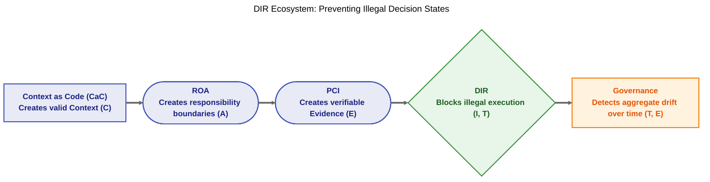

<sup> Author: Artur Huk | [GitHub](https://github.com/huka81/decision-intelligence-runtime) | Created: 2026-02-19 | Last updated: 2026-06-09 </sup>

---

# Context as Code: The Philosophy Behind the Repository


```text
Context as Code = The meta-architecture of DIR
```

## 1. Introduction

The "Decision Intelligence Runtime" (DIR) repository differs from traditional software libraries. It is not designed as a monolithic framework or a turnkey solution. Instead, it functions as a repository of context - a foundational structure for developers, architects, and AI coding agents to assist in designing robust decision-making systems.

This document serves as a reflection on the design philosophy behind the repository. It explains why the executable code is intentionally minimal, emphasizing architectural patterns over extensive boilerplate, and how this architecture ultimately prevents illegal decision states.

---

## 2. A Minimal Core for the AI Era

The Decision Intelligence Runtime (DIR) is designed primarily as a pattern - a methodology for structuring AI systems to be safe, auditable, and reliable. It draws inspiration from established architectural paradigms like Model-View-Controller (MVC) or CQRS, which provide structure rather than just tooling.

In traditional software development, comprehensive frameworks were necessary to handle common use cases manually, leading to deep abstraction layers. The AI-driven Software Development Life Cycle (SDLC) shifts this dynamic. With AI coding agents capable of generating syntax rapidly, the bottleneck is no longer writing the implementation, but defining the correct behavior and constraints. Heavy, opinionated frameworks often obscure the system's logic, making it difficult for AI agents to reason about the architecture.

For this reason, the repository includes a Python package (`src`) that is intended only as a **reference implementation**. DIR embraces a "minimal core" approach, providing the essential components needed to implement the pattern and avoiding hidden magic. It reduces the cognitive load on both the human developer and the AI agent, keeping the architecture flexible to rapidly changing requirements.

---

## 3. Illegal States as the Design Target

Why does this entire architecture exist? 

The answer is singular: **To prevent illegal decision states.**

Large Language Models are semantic engines, not formal state machines. They can easily propose actions that violate logic, permissions, or temporal realities. If we do not govern them, they will execute illegal states.

A Legal Decision State (LDS) requires five components to be valid simultaneously: 
```LDS = Authority (A) ∧ Context (C) ∧ Time (T) ∧ Intent (I) ∧ Evidence (E)``` 
Every concept in the DIR ecosystem exists to protect one or more of these invariants:



Suddenly, these are not disjointed tools. They are a single, cohesive story.

---

## 4. The DIR Architecture Stack

Context as Code (CaC) is not another component of the architecture. It is the design principle that governs all of them.

```text
Context as Code (CaC)
│
├── Responsibility-Oriented Agents (ROA)
│     Defines decision responsibilities (Identity Layer)
│
├── Decision Intelligence Runtime (DIR)
│     Enforces deterministic execution (Execution Kernel)
│
├── Proof-Carrying Intents (PCI)
│     Carries evidence for decisions
│
├── Governance Layer
│     Monitors and audits aggregate behavior
│
└── Topologies
      Define signal flow and deployment patterns (EOAM, SDS, DL)
```

---

## 5. Context as the New Compiler

As AI coding tools become integrated into the workflow, the role of the developer evolves. Syntax creation becomes commoditized, while **Context Quality** becomes the primary determinant of system reliability.

The developer moves towards the role of a "Context Coordinator," responsible for defining the boundaries and deterministic gates that govern the system. The documentation in this repository serves a dual purpose: it educates human engineers and acts as a **system prompt** for AI agents.

In this paradigm, Markdown files are not just passive documentation; they are active inputs that guide the generation of code. They define the **absolute constraints** of the system that the AI must adhere to. The repository does the heavy lifting of architectural safety, while the AI handles the syntax.

> *Note: If loading the entire `docs/` tree feels like overkill, point your AI agent at [DIR-minified.md](../07-dir-minified/DIR-minified.md) to get the same architectural **boundaries** in a single, machine-optimized file.*

---

## 6. Engineering as the Foundation of AI Production

While major platforms will likely offer their own comprehensive libraries for AI agents, one size rarely fits all in complex enterprise environments. Reliable AI systems require solid engineering foundations, not just better models.

This repository offers a "tailored suit" approach. It provides the foundational principles to design systems that are functional, auditable, and aligned with very specific domain constraints. It challenges the notion that more code always equals more value, emphasizing instead the importance of clear boundaries over rigid scaffolding.

---

## 7. The Final Shift

DIR is a tool for thinking and a foundation for designing reliable AI systems. 

By offloading the syntactic heavy lifting to AI, and reserving the **system's core invariants** for human engineers through documentation, we move from writing code to writing context. In the AI era, context acts as code.