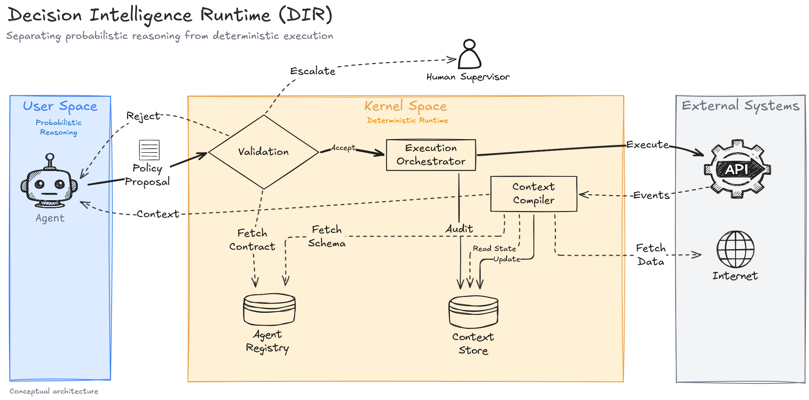
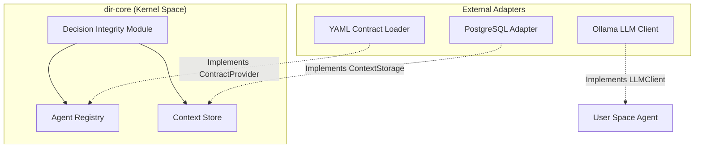

# Architecture

The **Decision Intelligence Runtime (`dir-core`)** introduces a robust architectural pattern tailored for AI governance. This pattern enforces predictability, determinism, and safety while allowing seamless integration with modern generative models.

## "The Wall": A Strict Separation of Concerns

At the core of `dir-core` is a conceptual boundary called **The Wall**. It separates the unpredictable nature of AI from the deterministic mechanics of application infrastructure.

### 1. User Space (Probabilistic AI)
- **Role**: Creativity, reasoning, analyzing context, processing natural language, planning.
- **Tools**: LangChain, CrewAI, Autogen, OpenAI, Anthropic, Ollama, Gemini.
- **Output**: Generates a `PolicyProposal`—an unverified **Claim** of what the agent *intends* to do.
- **Constraints**: Agents in User Space are completely isolated. They have zero credentials, cannot access production databases, and are incapable of dispatching real-world API requests (like transferring funds or spinning up servers).

### 2. Kernel Space (Deterministic Runtime)
- **Role**: Validation, enforcement, traceability, and execution.
- **Tools**: `dir-core`, the Decision Integrity Module (DIM), Context Compiler, Idempotency Guard.
- **Input**: Consumes a `PolicyProposal` and evaluates it against formal `ResponsibilityContracts`.
- **Output**: If accepted, transforms the Claim into an `ExecutionIntent` (a **Fact**)—which is then safely dispatched to infrastructure layers.
- **Constraints**: The Kernel Space contains **no AI**. It relies strictly on boolean arithmetic, regular expressions, JSON schemas, cryptographic hashing, and hard-coded business rules.

## Hexagonal Architecture

`dir-core` leverages **Hexagonal Architecture** (Ports and Adapters). It places the deterministic Kernel at the center and uses abstract interfaces (`Ports`) to interact with the outside world (`Adapters`).

### Dependency Inversion

In a standard AI application, an agent typically interacts directly with a database or an external API.

In `dir-core`, this flow is inverted:
1. The **Application** defines technical implementations for logging, LLMs, Storage, and Contracts (Adapters).
2. The **Application** injects these Adapters into `dir-core` Components (Ports).
3. The **Application** initiates a DecisionFlow.

Because `dir-core` only defines interfaces (like `LLMClient` or `AgentRegistryStorage`), it remains **technology-agnostic**. It doesn't matter if your contracts are stored in a Git repository, a relational database, or an Open Policy Agent (OPA) server. As long as you provide an Adapter that fulfills the expected Interface, `dir-core` will enforce the rules.

## The DecisionFlow Lifecycle

Every decision in `dir-core` follows a rigorous lifecycle tracked by a globally unique `DFID` (DecisionFlow ID).

1. **Trigger**: An event occurs (e.g., market price changes, a user submits a refund request).
2. **Context Compilation**: The Runtime gathers a deterministic snapshot of reality (`ContextSnapshot`) and binds it cryptographically to the DFID.
3. **Reasoning (User Space)**: The Agent evaluates the ContextSnapshot against its assigned `Mission` and emits a `PolicyProposal` (a **Claim**).
4. **Validation (Kernel Space)**: The DIM evaluates the Proposal against the Agent's `ResponsibilityContract` (e.g., verifying limits like `max_refund_eur` or `allowed_environments`).
5. **Execution**: Only validated Proposals are transformed into an `ExecutionIntent`.
6. **Audit**: All actions, including rejections (`MISSION_DISSONANCE`, `STATE_DRIFT_ERROR`), are logged immutably.
