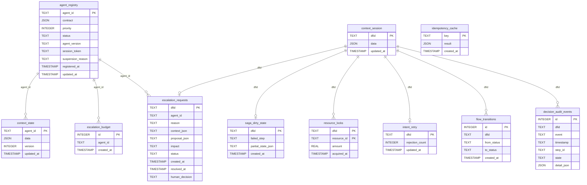

# Storage Schema (Data Model)

This document describes the canonical data model (Schema) used by the Decision Intelligence Runtime (DIR). The tables defined here form the stateful backbone of the Kernel Space, supporting features like Agent Registry, DecisionFlow ID (DFID) tracking, Context Storage, Idempotency Guards, and Escalation limits.

## Entity-Relationship Diagram (ERD)

The following diagram illustrates the core tables and their relationships. 

## Table Specifications

The authoritative DDL can be found in `src/dir_core/storage/schema.sql`. Depending on the backend (e.g., SQLite vs. PostgreSQL), the exact types might vary (e.g. `JSON` mapping to `TEXT` in SQLite or `JSONB` in Postgres).

### Core Components

**`agent_registry`**
Authoritative source of agent identity, capability contracts, lifecycle status, and session token.
- **`agent_id`**: Stable identifier supplied by the agent at handshake.
- **`contract`**: JSON responsibility contract (roles, policy types, limits).
- **`status`**: Lifecycle state (`ACTIVE`, `SUSPENDED`, `RETIRED`).

**`context_session`**
Transient, DFID-scoped context written by the Context Compiler before the agent receives the decision flow. Consumed (read-once) by the agent.

**`context_state`**
Long-lived, agent-scoped state that survives across individual decision flows (e.g., running averages, learned thresholds).
- **`version`**: Monotonically incremented on every write, used for optimistic locking.

### Safety & Integrity Mechanisms

**`idempotency_cache`**
Guards against duplicate execution. The caller supplies a unique idempotency key (e.g. SHA-256 of the request). The result is cached to prevent re-execution.

**`resource_locks`**
Tracks exclusive resource reservations held by a decision flow (`dfid`, `resource_id`). Inserted atomically when a lock is granted and deleted upon flow completion or rollback.

**`intent_retry`**
Governor table that counts how many times a decision flow has been rejected and re-submitted to prevent infinite LLM retry loops.

**`saga_dirty_state`**
When a multi-step saga fails mid-flight, partial state is persisted here to allow compensating transactions or background sweeps to clean it up.

### Human-in-the-Loop & Audit

**`escalation_budget`**
Append-only log of escalation tokens consumed by an agent. Used by the EscalationManager to enforce per-agent rate limits over a rolling time window.

**`escalation_requests`**
One row per escalation request traversing the `PENDING` → `RESOLVED` states. Contains the agent's proposal, context, and human decision.

**`flow_transitions`**
Append-only audit trail of every lifecycle state transition for a decision flow (`CREATED` → `RUNNING` → `COMPLETED` / `FAILED`).

**`decision_audit_events`**
DFID-scoped audit rows tracking detailed steps, states, and operations for compliance and debugging. Exposed via `DecisionAuditStorage`.
