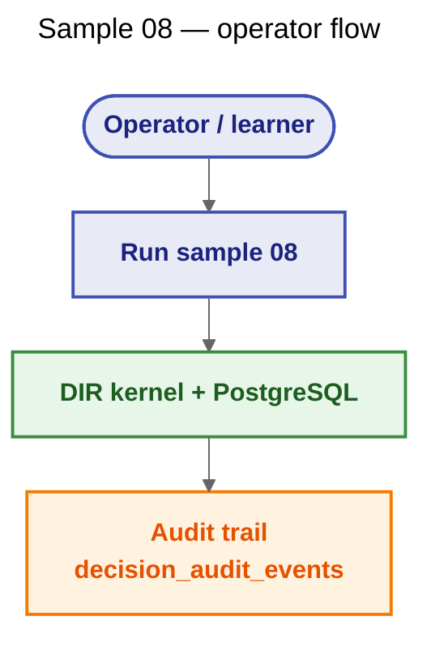
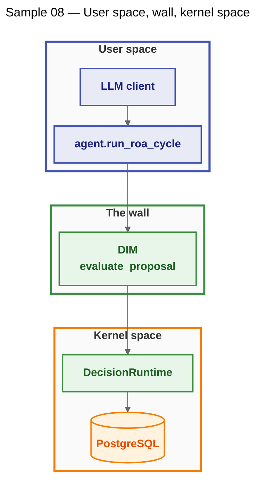
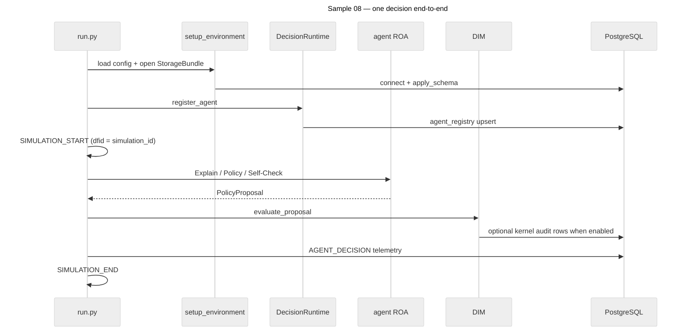

# Sample 08 — PostgreSQL `StorageBundle`

This sample shows how to attach the **canonical** DIR `StorageBundle` to **PostgreSQL** using only `samples.shared.bootstrap.setup_environment` (Sample Development Guide §2, §10). Topology is **classic**: one agent, one decision flow (`new_dfid`), ROA in user space, DIM in kernel space, rows in `decision_audit_events` via `DecisionRuntime.audit`.

**Mechanisms used:** `setup_environment`, `DecisionRuntime`, `ContextStore` / `AgentRegistry` (through the runtime facade), ROA stages Explain → Policy → Self-Check → Proposal, `evaluate_proposal`, `SIMULATION_START` / `SIMULATION_END`, `AGENT_DECISION`.

## Use cases



## Architecture



## Execution flow



## How to run

```bash
pip install -e .
pip install pyyaml psycopg2-binary
```

Create a database and user once (example names match `config.yaml`; override with `DB_*`):

```bash
createuser dir_user
createdb -O dir_user dir_quickstart
```

Set a password through the environment — **do not** commit secrets:

```bash
set DB_PASS=your_secret
python samples/08_custom_repo_psql/run.py
```

**Ollama (live LLM):** ensure `llm_defaults` points at your instance and the model is pulled.

**Gemini:** set `llm_defaults.provider: gemini`, supply an API key via env (`GOOGLE_API_KEY` or `GEMINI_API_KEY`), and keep PostgreSQL configured as above.

**Mock LLM (no network, no API key):**

```bash
set USE_MOCK_LLM=1
python samples/08_custom_repo_psql/run.py
```

## Configuration

Annotated excerpt — full file is `config.yaml`.

- **`database.provider: postgres`** — selects `samples.shared.storage.pg_repo`. Host, port, dbname, user, and optional `password` come from YAML but are **overridden** when `DB_HOST`, `DB_PORT`, `DB_NAME`, `DB_USER`, or `DB_PASS` are set.
- **`simulation.run_id`** — used as `simulation_id` in telemetry payloads (Guide §9.4).
- **`simulation.seeds`** — recorded on `SIMULATION_START`; keep keys here for any seeded behaviour (this sample uses a deterministic mock strategy without RNG).
- **`demo.note`** — short text placed into `context_session` under `input` for the ROA prompts.
- **`llm_defaults`** — same resolution rules as other samples (`USE_MOCK_LLM`, provider).
- **`contracts.provider: yaml`** — loads `ResponsibilityContract` objects from the same file as bootstrap’s `config_path`; do not set `contracts.path` to a bare `config.yaml` unless your working directory is the sample folder (Guide §7).
- **`agents`** — each row supplies `agent_id`, `priority`, governance metadata (`owner`, `version`, `effective_from`, optional `effective_until`, `approved_by`) copied into `SIMULATION_START.details.agents[]`, plus nested `contract` for the kernel model. Handshake `agent_version` comes from `agents[].version` (fallback: `agent_version` at file root if present).

## Database storage

| Domain meaning | Canonical surface | Event / table |
| --- | --- | --- |
| Run envelope | `decision_audit_events` | `SIMULATION_START` (topology, `llm_backend`, `agents[]`, `seeds`, timestamps), `SIMULATION_END` (`status`, `error_message`, `elapsed_seconds`, `decisions_total`, `executions_total`; `dfid` = `simulation_id`) |
| Decision narrative | `decision_audit_events` | `AGENT_DECISION` |
| Agent row | `agent_registry` | Written by `register_agent` / handshake |
| Working context | `context_session` | Merged JSON per `dfid` |

**Filter a run by `simulation_id` (PostgreSQL):**

```sql
SELECT dfid, event, detail_json
FROM decision_audit_events
WHERE detail_json->>'simulation_id' = 'psql_repo_demo_001'
ORDER BY id;
```

**Same intent on SQLite (if you ever point the sample at SQLite):**

```sql
SELECT dfid, event, detail_json
FROM decision_audit_events
WHERE json_extract(detail_json, '$.simulation_id') = 'psql_repo_demo_001'
ORDER BY id;
```

## Expected output

You should see `INFO` lines tagged with a DFID, a DIM line (`ACCEPT` or `REJECT` for the single `HOLD` proposal), and a closing summary similar to:

```
SUMMARY / 08_custom_repo_psql simulation_id=psql_repo_demo_001 elapsed=…s DIM=ValidationVerdict.ACCEPT
```

## DDL and wiring notes

PostgreSQL DDL lives in `samples/shared/storage/pg_schema.sql` and is applied by `apply_schema` inside `open_storage_bundle` — there is no duplicate `schema.sql` under this sample directory.
