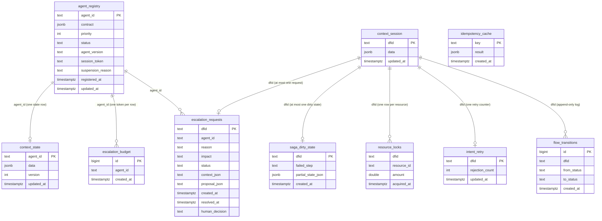

# Sample 08 — Custom PostgreSQL Repository

**Topology:** DIR kernel + PostgreSQL persistence for the same “Comma Catastrophe” demo as `00_quick_start`.  
**Scenario:** Mock market feed (with ambiguous number / injection text) → context compile → LLM `PolicyProposal` → DIM / contract validation → either reject (no mock exchange call) or accept (mock exchange + session audit fields). A second **bonus** pass uses clean feed data to exercise the accept path.

**What is special here:** `run.py` wires **only** `AgentRegistry` and `ContextStore` to PostgreSQL via `dir_repo.build_repository(conn)`. The database still holds the **full** DIR repository schema (10 tables) and `dir_repo.py` implements every storage protocol - tables you do not touch in this script simply stay empty until you plug in other DIR managers.

---

## What this sample does at runtime

1. **Config** - Loads [`config.yaml`](config.yaml) (contract, mock web, database, LLM). Optional env overrides: `DB_*`, `USE_MOCK_LLM=1` for [`llm_client.py`](llm_client.py) `MockLLM`.
2. **Database** - `connect` → `apply_schema` (all `CREATE TABLE IF NOT EXISTS` from [`schema.sql`](schema.sql)) → `build_repository` → one shared `psycopg2` connection for every `Pg*` backend.
3. **Registry** - `AgentRegistry.handshake` persists the agent row in **`agent_registry`**.
4. **Context** - `compile_context` / `ContextStore.update_session` merge compiled and raw web data into **`context_session`** for each `dfid`. `compile_working_context` may read **`context_state`** for long-lived agent state (the demo contract path does not require prior state).
5. **Agent** - LLM (Ollama or mock) returns JSON → `PolicyProposal`; audit lines go to the **logger only** (no `flow_transitions` or escalation tables in this script).
6. **Validation** - `validate_proposal` and `validate_order_against_contract` run in process; outcomes are printed and logged.
7. **Execution** - On `ACCEPT`, `execute_and_audit` calls the mock exchange API and writes an `audit` blob into the same **`context_session`** row via `update_session`.
8. **Bonus** - Second `dfid`, clean `mock_fetch_market_data`, repeat compile → agent → validate → optional execute.
9. **Shutdown** - `conn.close()`.

**Not used by `run.py` (schema present, rows unused in this demo):** `idempotency_cache`, `saga_dirty_state`, `resource_locks`, `intent_retry`, `escalation_budget`, `escalation_requests`, `flow_transitions`. The console line “Human notified” on reject is **narrative only** - no `EscalationManager` and no writes to escalation tables.

---

## What this sample shows (code comparison)

`00_quick_start` uses SQLite through `db_path=`. This sample uses the same managers with explicit PostgreSQL storage:

```python
# 00_quick_start (SQLite, built-in)
store    = ContextStore(db_path="data/quick_start.db")
registry = AgentRegistry(db_path="data/quick_start.db", ...)

# this sample (PostgreSQL, custom)
conn = dir_repo.connect(cfg["database"])
apply_schema(conn)
repo = dir_repo.build_repository(conn)

store    = ContextStore(storage=repo.context)
registry = AgentRegistry(storage=repo.agent_registry, ...)
```

`Repository` is a type alias for `dir_core.storage.StorageBundle` - same field names (`agent_registry`, `context`, `idempotency`, …) as in the core library.

---

## File structure

```
samples/08_custom_repo_psql/
    schema.sql       PostgreSQL DDL - full DIR repository (10 tables)
    dir_repo.py      Pg* backends + apply_schema + build_repository
    run.py           Entry point - scenario above
    config.yaml      Database URL parts, contract, mock web, LLM
    llm_client.py    MockLLM for deterministic CI / no Ollama
    README.md        This file
```

---

## PostgreSQL setup (one-time)

```bash
createuser dir_user
createdb -O dir_user dir_quickstart
psql -U dir_user -d dir_quickstart \
     -c "ALTER USER dir_user PASSWORD 'dir_pass';"
```

`apply_schema()` runs each `CREATE TABLE` in a separate `execute()` (psycopg2 limitation). Re-running is safe.

Manual apply:

```bash
psql -U dir_user -d dir_quickstart \
     -f samples/08_custom_repo_psql/schema.sql
```

---

## How to run

```bash
pip install -e .
pip install pyyaml psycopg2-binary
python samples/08_custom_repo_psql/run.py
```

### Environment overrides

```bash
DB_HOST=my-pg-host DB_PORT=5432 DB_NAME=dir_quickstart \
DB_USER=dir_user DB_PASS=dir_pass \
python samples/08_custom_repo_psql/run.py
```

```bash
USE_MOCK_LLM=1 python samples/08_custom_repo_psql/run.py
```

---

## Repository data model (explicit)

Canonical definition lives in [`src/dir_core/storage/schema.sql`](../../src/dir_core/storage/schema.sql). This sample’s [`schema.sql`](schema.sql) is the PostgreSQL translation: same table and column names; `JSONB`, `TIMESTAMPTZ`, `DOUBLE PRECISION`, and `BIGINT … GENERATED BY DEFAULT AS IDENTITY` for surrogate keys. **No foreign keys are declared** - `agent_id` / `dfid` consistency is logical, same as the SQLite reference.

### `agent_registry` (DIR §2.3)

| Column | Type | Notes |
|--------|------|--------|
| `agent_id` | `TEXT` | Primary key |
| `contract` | `JSONB` | Responsibility contract JSON |
| `priority` | `INTEGER` | Handshake priority |
| `status` | `TEXT` | e.g. `ACTIVE`, `SUSPENDED` |
| `agent_version` | `TEXT` | SemVer string |
| `session_token` | `TEXT` | Opaque session token |
| `suspension_reason` | `TEXT` | Optional |
| `registered_at` | `TIMESTAMPTZ` | Default `NOW()` |
| `updated_at` | `TIMESTAMPTZ` | Default `NOW()` |

### `context_session` (DIR §8 - ephemeral, per `dfid`)

| Column | Type | Notes |
|--------|------|--------|
| `dfid` | `TEXT` | Primary key - decision-flow id |
| `data` | `JSONB` | Merged session JSON (web, audit, …) |
| `updated_at` | `TIMESTAMPTZ` | Default `NOW()` |

### `context_state` (DIR §8 - durable, per `agent_id`)

| Column | Type | Notes |
|--------|------|--------|
| `agent_id` | `TEXT` | Primary key - aligns with `agent_registry.agent_id` by convention |
| `data` | `JSONB` | Long-lived agent JSON |
| `version` | `INTEGER` | Incremented on conflict update in `PgContextStorage` |
| `updated_at` | `TIMESTAMPTZ` | Default `NOW()` |

### `idempotency_cache` (DIR §7)

| Column | Type | Notes |
|--------|------|--------|
| `key` | `TEXT` | Primary key |
| `result` | `JSONB` | Cached outcome |
| `created_at` | `TIMESTAMPTZ` | Default `NOW()` |

### `saga_dirty_state` (DIR §7)

| Column | Type | Notes |
|--------|------|--------|
| `dfid` | `TEXT` | Primary key |
| `failed_step` | `TEXT` | Step name |
| `partial_state_json` | `JSONB` | Snapshot at failure |
| `created_at` | `TIMESTAMPTZ` | Default `NOW()` |

### `resource_locks` (DIR §6.2)

| Column | Type | Notes |
|--------|------|--------|
| `dfid` | `TEXT` | Composite PK with `resource_id` |
| `resource_id` | `TEXT` | Logical resource name |
| `amount` | `DOUBLE PRECISION` | Reserved quantity |
| `acquired_at` | `TIMESTAMPTZ` | Default `NOW()` |

### `intent_retry` (DIR §6.2)

| Column | Type | Notes |
|--------|------|--------|
| `dfid` | `TEXT` | Primary key |
| `rejection_count` | `INTEGER` | Default `0` |
| `updated_at` | `TIMESTAMPTZ` | Default `NOW()` |

### `escalation_budget` (DIR §9)

| Column | Type | Notes |
|--------|------|--------|
| `id` | `BIGINT` | `GENERATED BY DEFAULT AS IDENTITY`, primary key |
| `agent_id` | `TEXT` | Append-only token rows |
| `created_at` | `TIMESTAMPTZ` | Default `NOW()` |

### `escalation_requests` (DIR §9)

| Column | Type | Notes |
|--------|------|--------|
| `dfid` | `TEXT` | Primary key |
| `agent_id` | `TEXT` | Aligns with registry by convention |
| `reason`, `impact`, `status` | `TEXT` | `status` e.g. `PENDING` / `RESOLVED` |
| `context_json`, `proposal_json` | `TEXT` | Serialized JSON strings |
| `created_at`, `resolved_at` | `TIMESTAMPTZ` | Optional resolution time |
| `human_decision` | `TEXT` | Set when resolved |

### `flow_transitions` (DIR §4.3)

| Column | Type | Notes |
|--------|------|--------|
| `id` | `BIGINT` | `GENERATED BY DEFAULT AS IDENTITY`, primary key |
| `dfid` | `TEXT` | Flow id |
| `from_status`, `to_status` | `TEXT` | Nullable `from_status` |
| `created_at` | `TIMESTAMPTZ` | Default `NOW()` |

---

## ERD - repository (logical relationships)

No database-level foreign keys are declared - `agent_id` and `dfid` are logical identifiers kept consistent by the orchestration layer.  Relationships below reflect that logical ownership.



> `context_session` acts as the per-flow anchor in the diagram. In the database there is no FK - all `dfid`-keyed tables are peers; a flow id may exist in any subset of them.
>
> `resource_locks` primary key is the composite `(dfid, resource_id)` - not shown as two `PK` markers due to Mermaid notation.
>
> `idempotency_cache` is keyed by an arbitrary caller-supplied token; it has no relationship to the other tables.

---

## How `dir_repo.py` maps to DIR

- **`apply_schema(conn)`** - creates every table above.
- **`build_repository(conn)`** - returns `Repository` (`StorageBundle`) with one `Pg*` instance per protocol, all using the same connection.
- **`PgResourceLockStorage.acquire_batch`** - uses `LOCK TABLE resource_locks IN EXCLUSIVE MODE` plus `lock_timeout` and retries; fine for demos, often replaced in production.
- **`PgEscalationStorage.get_window_count`** - compares `created_at` to `(%s::timestamp AT TIME ZONE 'UTC')` to match the naive UTC strings produced by `EscalationManager` in the core library.

`dir_repo.py` does not import `dir_core.storage.sqlite`.

---

## Expected console output (abbreviated)

```
[1] Agent Registry: Handshake accepted ...
[2] Context Compiler: Fetching from mock web source...
[3] Agent [MockLLM or Ollama]: Reasoning over context...
[4] DIM Validation: ...
[5] DIR blocked catastrophic action. No API call. Escalation: Human notified.
--- BONUS: Run with correct data (no injection) ---
    Verdict: ACCEPT - executed.
```

---

## Prerequisites

- Python **3.12+**
- `pip install -e .` (repo root), `pip install pyyaml psycopg2-binary`
- PostgreSQL **12+**
