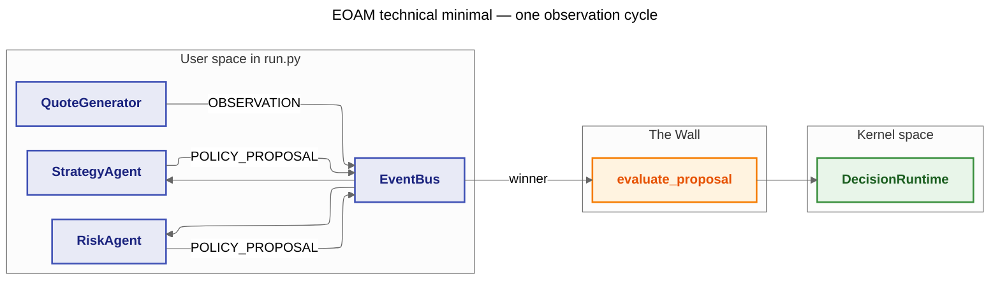

# 09 — Topology A (EOAM) — Technical Minimal Demo

**Goal:** One market tick drives a single **OBSERVATION** on an in-memory **EventBus** (`create_event_bus`). Two reactive agent classes defined in **`run.py`** subscribe by instrument scope, each publishes a **POLICY_PROPOSAL**, the runtime **arbitrates** with a fixed `priority_matrix`, then **DIM** validates the winner through **`DecisionRuntime.evaluate_proposal`** after **handshake** — all with **`memory_storage()`** and **no** `samples/shared`, **no** YAML, **no** LLM. **QuoteGenerator** lives under **`mocks/`** (same tick shape as `samples/31_finance_trading`). This layout follows **`.cursor/rules/06-technical-sample-development-guide.mdc`**.

**Mechanisms:** `DecisionRuntime`, `memory_storage`, `create_event_bus`, `EventType.OBSERVATION`, scope dispatch, priority arbitration, `IntentRetryGovernor`, DIM with default in-memory proposal audit rows.

---

## Architecture / flow



---

## How to run

From the repository root:

```bash
python samples/09_topology_a_eoam/run.py
```

No API keys or database files are required. Tweak constants at the top of `run.py` (`_PRIORITY_MATRIX`, `_INSTRUMENT`, `_QUOTE_SEED`, wake-up flags) to experiment.

---

## Expected output

You should see two handshake log lines, one `OBSERVATION` dispatch, two `POLICY_PROPOSAL` dispatches (when `with_logging` is false on the bus, only kernel logs appear), DIM verdict, mock execution on `ACCEPT`, a `SUMMARY` log line, and the final `[SUMMARY]` print:

```text
INFO Handshake: agent_id=agent_risk ver=1.0.0 accepted
INFO Handshake: agent_id=agent_strategy ver=1.0.0 accepted
INFO [DFID=...] EOAM: publishing OBSERVATION for BTC-USD
INFO [DFID=...] DIM verdict=ACCEPT reason=VALIDATION_PASSED
INFO [DFID=...] Mock execution for agent_risk policy=ALERT
INFO [DFID=...] SUMMARY proposals=2 chosen_agent=agent_risk chosen_policy=ALERT verdict=ACCEPT executed=True

[SUMMARY] DFID=... proposals=2 chosen=agent_risk policy=ALERT verdict=ACCEPT executed=True
```

With default thresholds, **Risk** usually wins **ALERT** because quote volatility exceeds `_RISK_VOL_ALERT_ABOVE`.
