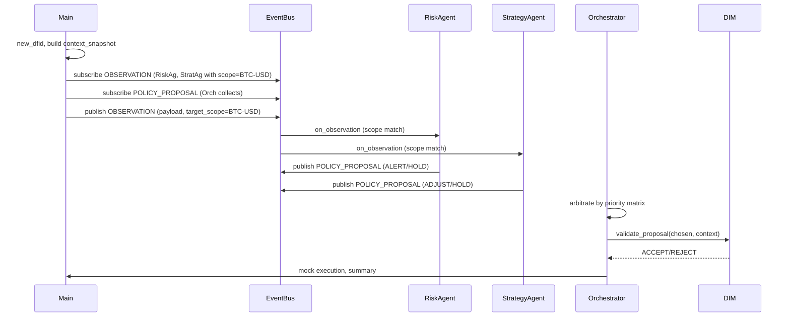
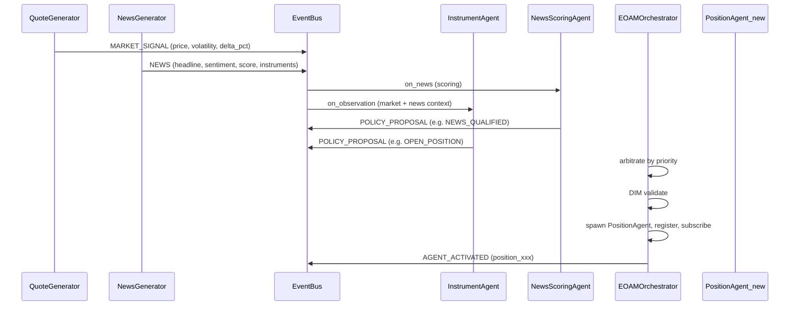

# 09 - Topology A (Event-Oriented Agent Mesh, EOAM)

**Goal:** Minimal EOAM demo: Event bus with **scope-based choreography**; runtime publishes **OBSERVATION** (inversion of control); two reactive agents (`RiskAgent`, `StrategyAgent`) subscribe by scope and publish Policy Proposals; runtime collects proposals, **arbitrates by priority matrix**, validates with DIM, and performs mock execution. All steps logged with DFID.

**ROA/DIR:** DIR Topologies §2 (EOAM: decentralized choreography, parallel reasoning, priority-based preemption).

## How to run

From repo root:

```bash
pip install -e .
python samples/09_topology_a_eoam/run.py
```

Or with PYTHONPATH (if not installed):

```bash
PYTHONPATH=src python samples/09_topology_a_eoam/run.py
```

## Logic and flow

1. **Observation**: A single DFID is created; a context snapshot is built; `QuoteGenerator` produces one tick (instrument, price, volatility, trend).
2. **Reactive agents**: `RiskAgent` and `StrategyAgent` subscribe to `OBSERVATION` with `scope="BTC-USD"`. They react when the bus dispatches the observation.
3. **Inversion of control**: The runtime publishes `OBSERVATION` with `target_scope="BTC-USD"`; agents receive the payload and publish `POLICY_PROPOSAL` (ALERT/HOLD from Risk, ADJUST/HOLD from Strategy).
4. **Arbitration**: The runtime selects the winner using a **priority matrix** (ALERT=1 > ADJUST=2 > HOLD=3). Risk can preempt Strategy.
5. **DIM**: The chosen proposal is validated with context (`risk_score`).
6. **Mock execution**: A log line indicates execution for the chosen agent and policy kind.
7. **Summary**: Prints DFID, proposal count, chosen agent ID, and policy kind.

## Inputs and outputs

**Input:** None (the sample is self-contained; it uses `QuoteGenerator` for one tick and simulates the EOAM flow).

**Output:** Logs and a summary line:

```
INFO [DFID=dfid_...] EOAM: Observation received
INFO [DFID=dfid_...] [InMemory] Dispatching OBSERVATION to 2/2 listeners (scope=BTC-USD)
INFO [InMemory] Dispatching POLICY_PROPOSAL to 1/1 listeners (scope=None)
INFO [InMemory] Dispatching POLICY_PROPOSAL to 1/1 listeners (scope=None)
INFO [DFID=dfid_...] DIM result=ACCEPT reason=Validation passed
INFO [DFID=dfid_...] Mock execution for agent_risk (policy=HOLD)
[SUMMARY] DFID=dfid_... proposals=2 chosen=agent_risk policy=HOLD
```

## Expected output

- One OBSERVATION event triggers two agents (scope-based dispatch).
- Each agent produces a Policy Proposal (ALERT/ADJUST/HOLD) based on volatility/trend.
- Runtime arbitrates by priority matrix (Risk preempts Strategy when both propose).
- DIM validates, mock execution.
- Summary with DFID, proposal count, chosen agent, and policy kind.

---

## Minimal EOAM flow (this sample)



---

## Detailed EOAM simulation (Topology A)

The full EOAM pattern can be extended with a **live-like simulation** of quotes and market events. That simulation is implemented in **sample 10** (`samples/10_eoam_live_simulation/`). This section describes the architecture and flow so that sample 09 is understood as the minimal EOAM building block.

### Simulation overview

- **Quote stream:** A generator produces a sequence of market ticks (price, volatility, trend, volume) compatible with `MARKET_SIGNAL` / `OBSERVATION` payloads. Each tick is published on the event bus with a scope (e.g. instrument symbol). Agents subscribed to that scope react in parallel.
- **News events:** A separate generator emits market news (headline, sentiment, category, affected instruments). Each event is published as type `NEWS`. A **News Scoring** agent evaluates quality (e.g. relevance and sentiment strength) and may emit a `NEWS_QUALIFIED` policy proposal when the score exceeds a threshold.
- **Reactive agents:** Instrument-level agents interpret market context and may propose `OPEN_POSITION` or `HOLD`. Position-level agents (created dynamically when a position is opened) propose `CLOSE`, `TAKE_PROFIT`, `ADJUST_STOP`, or `HOLD` based on PnL and risk.
- **Arbitration:** The runtime collects all proposals for a given decision flow (DFID) and selects a winner using a **priority matrix** (e.g. RISK_ALERT > CLOSE > OPEN_POSITION > NEWS_QUALIFIED > HOLD).
- **Validation and execution:** The winning proposal is validated by the Decision Integrity Module (DIM). If accepted and the proposal is `OPEN_POSITION`, the runtime **spawns a new PositionAgent**, registers it with the orchestrator, and subscribes it to the bus so it receives future observations for that instrument. Mock execution is used for other policy kinds.

### Sequence diagram (EOAM with quotes, news, and dynamic agents)

The following diagram shows the flow from quote and news generators through the event bus, reactive agents, orchestration, and dynamic creation of a position agent.



- **QuoteGenerator (QG)** and **NewsGenerator (NG)** publish to the **EventBus**: market ticks as `MARKET_SIGNAL` (or `OBSERVATION`) and news as `NEWS`.
- The bus dispatches to subscribers by event type and scope. **NewsScoringAgent** receives news and may emit **POLICY_PROPOSAL** (e.g. `NEWS_QUALIFIED`). **InstrumentAgent** receives observations and may emit proposals (e.g. `OPEN_POSITION`, `HOLD`).
- **EOAMOrchestrator** collects proposals, **arbitrates** by priority, runs **DIM** validation, and on accepted `OPEN_POSITION` **spawns** a new **PositionAgent**, registers it, and subscribes it to the bus (**AGENT_ACTIVATED**). The new agent then participates in future observation cycles.

### Relation to this sample (09)

Sample 09 is a **minimal** EOAM: it publishes an **OBSERVATION** event with scope; two reactive agents (`RiskAgent`, `StrategyAgent`) subscribe to `OBSERVATION` with `scope="BTC-USD"` and publish `POLICY_PROPOSAL` when they receive it. The runtime arbitrates by **priority matrix** (ALERT > ADJUST > HOLD), validates with DIM, and performs mock execution. It uses `QuoteGenerator` for one tick. It does not include quote/news streams, dynamic agent creation, or LLM-backed reasoning. For the full simulation with generators, scoring, and dynamic position agents, run **sample 10** (`samples/10_eoam_live_simulation/`).
