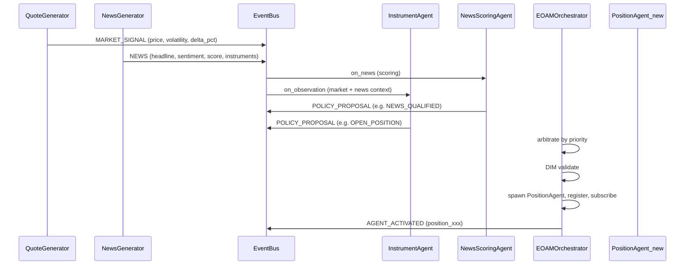

# 09 - Topology A (Event-Oriented Agent Mesh, EOAM)

**Goal:** Event bus; 2-3 agents subscribe to "Observation"; parallel Policy Proposals; simple arbitration (e.g. priority); DIM; mock execution. All steps logged with DFID.

**ROA/DIR:** DIR Topologies §2 (EOAM: decentralized choreography, parallel reasoning, priority-based preemption).

## How to run

From repo root:

```bash
pip install -e .
python samples/09_topology_a_eoam/run.py
```

## Expected output

- One Observation event triggers multiple agents.
- Each agent produces a Policy Proposal (logged with DFID).
- Runtime selects one (e.g. by priority), DIM validates, mock execution.
- Summary with DFID and chosen proposal.

---

## Detailed EOAM simulation (Topology A)

The full EOAM pattern can be extended with a **live-like simulation** of quotes and market events. That simulation is implemented in **sample 10** (`samples/10_eoam_live_simulation/`). This section describes the architecture and flow so that sample 09 is understood as the minimal EOAM building block.

### Simulation overview

- **Quote stream:** A generator produces a sequence of market ticks (price, volatility, trend, volume) compatible with `MARKET_SIGNAL` / `OBSERVATION` payloads. Each tick is published on the event bus with a scope (e.g. instrument symbol). Agents subscribed to that scope react in parallel.
- **News events:** A separate generator emits market news (headline, sentiment, category, affected instruments). Each event is published as type `NEWS`. A **News Scoring** agent evaluates quality (e.g. relevance and sentiment strength) and may emit a `NEWS_QUALIFIED` policy proposal when the score exceeds a threshold.
- **Reactive agents:** Instrument-level agents interpret market context and may propose `OPEN_POSITION` or `HOLD`. Position-level agents (created dynamically when a position is opened) propose `CLOSE`, `TAKE_PROFIT`, `ADJUST_STOP`, or `HOLD` based on PnL and risk.
- **Arbitration:** The runtime collects all proposals for a given decision flow (DFID) and selects a winner using a **priority matrix** (e.g. RISK_ALERT > CLOSE > OPEN_POSITION > NEWS_QUALIFIED > HOLD).
- **Validation and execution:** The winning proposal is validated by the Decision Integrity Module (DIM). If accepted and the proposal is `OPEN_POSITION`, the runtime **spawns a new PositionAgent**, registers it with the orchestrator, and subscribes it to the bus so it receives future observations for that instrument. Mock execution is used for other policy kinds.

### Sequence diagram (EOAM with quotes, news, and dynamic agents)

The following diagram shows the flow from quote and news generators through the event bus, reactive agents, orchestration, and dynamic creation of a position agent.



- **QuoteGenerator (QG)** and **NewsGenerator (NG)** publish to the **EventBus**: market ticks as `MARKET_SIGNAL` (or `OBSERVATION`) and news as `NEWS`.
- The bus dispatches to subscribers by event type and scope. **NewsScoringAgent** receives news and may emit **POLICY_PROPOSAL** (e.g. `NEWS_QUALIFIED`). **InstrumentAgent** receives observations and may emit proposals (e.g. `OPEN_POSITION`, `HOLD`).
- **EOAMOrchestrator** collects proposals, **arbitrates** by priority, runs **DIM** validation, and on accepted `OPEN_POSITION` **spawns** a new **PositionAgent**, registers it, and subscribes it to the bus (**AGENT_ACTIVATED**). The new agent then participates in future observation cycles.

### Relation to this sample (09)

Sample 09 is a **minimal** EOAM: one observation triggers two agents that publish policy proposals; the runtime arbitrates (e.g. by priority), validates with DIM, and performs mock execution. It does not include quote/news generators or dynamic agent creation. For the full simulation with generators, scoring, and dynamic position agents, run **sample 10**.
