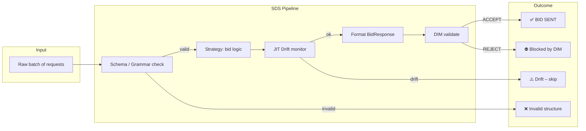
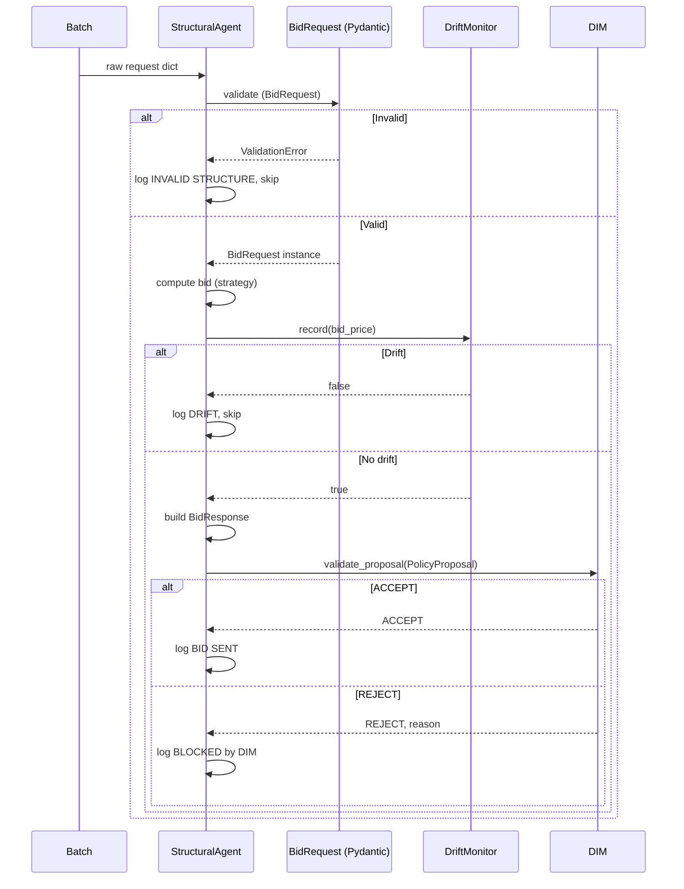
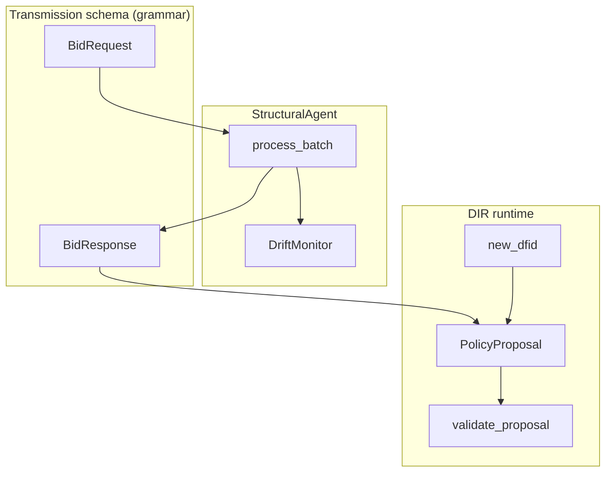

# 10 - Topology B (Structural Decision Stream, SDS)

**Goal:** Demonstrate high-velocity processing where **“Structure is Safety”**. The sample enforces strict grammar/schema validation, JIT drift monitoring, and batched execution, then gates each decision with the Decision Integrity Module (DIM).

**ROA/DIR:** DIR §2.4 / Topologies B: suited to high-frequency scenarios (e.g. trading, ad bidding) where inputs must conform to a fixed contract and distribution drift must be caught early.

---

## How to run

From the repository root:

```bash
pip install -e .
python samples/10_topology_b_sds/run.py
```

---

## Purpose and logic

This sample models a **structural agent** that:

1. **Validates structure first**: Every incoming item is checked against a Pydantic schema (`BidRequest`). Malformed or missing fields are rejected before any business logic runs.
2. **Applies strategy**: A simple bidding rule: bid 10% above base price, or 50% above for the `"premium"` user segment.
3. **Monitors drift**: A sliding window tracks recent bid values; if the average exceeds a threshold (e.g. 50), the agent skips the current request (drift detected).
4. **Formats output**: Responses are built as strict `BidResponse` objects (exchange-compatible).
5. **Guards with DIM**: Each bid is wrapped in a `PolicyProposal` and validated by the Decision Integrity Module (schema, RBAC, context state). Only accepted proposals are “sent”.

The pipeline is: **Grammar → Strategy → Drift check → Format → DIM**. No execution happens without passing all stages.

### Implementation Note

This sample demonstrates **structural validation** (Pydantic) as the first line of defense.
Full **Constrained Decoding** (Outlines/Guidance) as described in DIR Topologies §3.1 requires
grammar-based sampling *during* LLM inference—the model physically cannot generate
non-compliant tokens. Here, Pydantic validates *after* data generation—a simplified SDS
variant. Trust Locus in the docs: "Generation — Grammar constrains during inference";
this sample approximates that with post-generation schema validation.

---

## Inputs and outputs

### Input: batch of raw requests

Each item in the batch is a dictionary that should match the **BidRequest** schema:

| Field          | Type   | Required | Description                    |
|----------------|--------|----------|--------------------------------|
| `request_id`   | string | Yes      | Unique request identifier      |
| `item_id`      | string | Yes      | Item being bid on              |
| `base_price`   | float  | Yes      | Base price for the item        |
| `user_segment` | string | Yes      | e.g. `"standard"` or `"premium"` |

**Example valid input:**

```json
{
  "request_id": "req_0",
  "item_id": "item_442",
  "base_price": 25.50,
  "user_segment": "premium"
}
```

**Example invalid input (structure breach):**

```json
{
  "request_id": "req_malformed",
  "base_price": "NOT_A_NUMBER",
  "user_segment": "standard"
}
```

Missing `item_id` or wrong types cause **ValidationError**; the agent logs the error and skips the item.

### Output: validated bids and logs

- **Accepted:** Log line like `BID SENT: <bid_price> for <item_id>`.
- **Blocked by DIM:** Log line like `BLOCKED by DIM: <reason>`.
- **Invalid structure:** Log line like `INVALID STRUCTURE: <ValidationError>`.
- **Drift detected:** Log line like `DRIFT DETECTED! High bid average. Skipping <request_id>.`

The sample does not return a structured output; it demonstrates the pipeline and logging. A real system would collect accepted `BidResponse` objects or send them to an exchange.

**Example successful bid response (internal shape):**

```json
{
  "request_id": "req_0",
  "bid_price": 38.25,
  "currency": "USD",
  "creative_id": "cr_123"
}
```

---

## Pipeline diagram

End-to-end flow from raw batch to accepted or rejected bid:



---

## Sequence (per request)

What happens for a single request inside the batch:



---

## Component overview



- **BidRequest / BidResponse:** Pydantic models; first line of defense and output contract.
- **DriftMonitor:** Sliding window of recent bid values; signals when average exceeds threshold.
- **StructuralAgent:** Orchestrates validation → strategy → drift → format → DIM.
- **DIM:** Final guardrail (schema, RBAC, context) on the `PolicyProposal`.

---

## Example run (what you see)

The script builds a batch that includes:

- 10 valid requests (mixed `standard` / `premium`, base prices 10–40).
- 1 malformed request (wrong type for `base_price`, missing `item_id`).
- 5 high-price requests (base 100, premium) to trigger the drift monitor.

You should see log lines similar to:

- `Processing batch of 16 requests...`
- `❌ INVALID STRUCTURE: ...` for the malformed request.
- `✅ BID SENT: <price> for <item_id>` for accepted bids.
- `⚠️ DRIFT DETECTED! ...` after enough high bids push the window average over the threshold (e.g. 50).
- Optionally `⛔ BLOCKED by DIM: ...` if DIM rejects (e.g. risk or RBAC in a custom setup).

---

## Summary

| Aspect        | Description                                                                 |
|---------------|-----------------------------------------------------------------------------|
| **Topology**  | B (Structural Decision Stream)                                             |
| **Input**     | List of raw dicts; must conform to `BidRequest` (request_id, item_id, base_price, user_segment). |
| **Output**    | Logs: BID SENT, INVALID STRUCTURE, DRIFT DETECTED, BLOCKED by DIM.          |
| **Logic**     | Grammar → strategy (bid multiplier) → JIT drift check → format → DIM.      |
| **Goal**      | Show high-velocity, structure-first processing with drift detection and DIM. |
