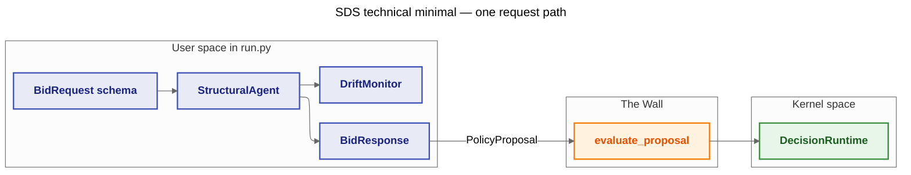

# 10 — Topology B (SDS) — Technical Minimal Demo

**Goal:** Show **Structure is Safety** for a high-velocity slice: validate each raw dict with **Pydantic** (`BidRequest`), apply a tiny bidding rule, run a **sliding-window drift** heuristic on bid prices, build a strict **`BidResponse`**, then wrap the intent as **`PolicyProposal`** and pass it through **DIM** using **`DecisionRuntime.evaluate_proposal`** on **`memory_storage()`**. No LLM, no YAML, no `samples/shared` — see **`.cursor/rules/06-technical-sample-development-guide.mdc`**.

This sample validates **after** generation (Pydantic). Grammar constrained **during** LLM inference (e.g. Outlines) is the production-grade variant described in DIR Topologies for SDS.

---

## Architecture / flow



---

## How to run

From the repository root:

```bash
python samples/10_topology_b_sds/run.py
```

Tune `_SEED`, `DriftMonitor.mean_threshold`, and batch construction in `run.py` if you want different drift behaviour.

---

## Expected output

The script builds **16** rows: **10** normal bids, **1** malformed (schema failure), **5** high-base premium bids to push the drift window. With default ``_SEED = 42`` you should see one **INVALID_STRUCTURE** line, several **BID_SENT** lines, then **DRIFT_DETECTED** skips once the window average exceeds the threshold, and a final **`[SUMMARY]`** line with counts (below).

```text
INFO [DFID=...] SDS: processing batch of 16 requests
WARNING [DFID=...] INVALID_STRUCTURE skipped: ...
INFO [DFID=...] BID_SENT bid_price=... item_id=...
...
WARNING [DFID=...] DRIFT_DETECTED skipping request_id=...

[SUMMARY] struct_invalid=1 drift_skip=3 dim_accept=12 dim_reject=0
```
