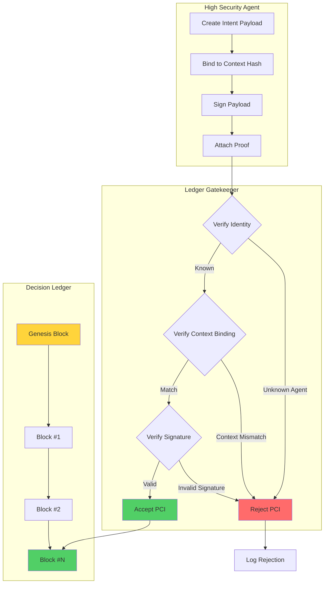
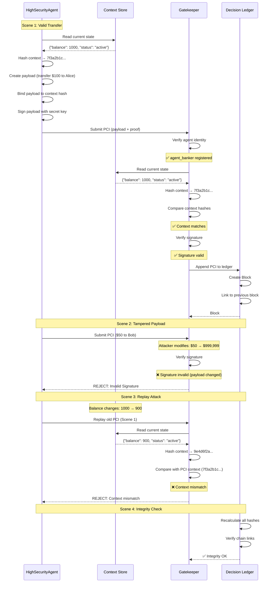

# 11 - Topology C (Decision Ledger & Proof-Carrying Intents)

**Goal:** Demonstrate **high-stakes decision auditability** through an append-only Decision Ledger (Merkle-chain style) and **Proof-Carrying Intents (PCI)** with cryptographic signatures and context binding. Ensures non-repudiation, tamper-evidence, and replay attack prevention for critical operations like fund transfers, production deployments, or compliance-regulated decisions.

**ROA/DIR:** DIR Architectural Pattern §2.4 / Topologies C: suited to high-assurance scenarios (finance, healthcare, infrastructure) where every decision must be cryptographically verifiable and auditable for regulatory compliance or forensic analysis.

---

## How to run

From the repository root:

```bash
pip install -e .
python samples/11_topology_c_dl_pci/run.py
```

---

## Purpose and logic

This sample models a **high-security decision system** with:

1. **Decision Ledger**: An append-only, tamper-evident log (similar to blockchain) where each entry is linked to the previous via cryptographic hashes. Genesis block establishes chain origin. Every accepted decision creates a new block.

2. **Proof-Carrying Intent (PCI)**: Agents package their intents with cryptographic proof:
   - **Payload**: Action, parameters, DFID, timestamp, context binding
   - **Proof**: Digital signature, signer identity, algorithm identifier

3. **Context Binding**: Each PCI includes a hash of the current system context (e.g., account balance, risk score). If context changes between intent creation and submission, verification fails (prevents replay attacks).

4. **Gatekeeper Verification**: Before appending to the ledger, the gatekeeper performs three checks:
   - **Identity**: Is the signer registered/authorized?
   - **Context Match**: Does the current context hash match the intent's context binding?
   - **Signature**: Is the cryptographic signature valid?

5. **Ledger Integrity Check**: The chain can be verified at any time by recalculating hashes and checking links. Any tampering breaks the chain.

The pipeline is: **Agent creates PCI → Gatekeeper verifies (identity, context, signature) → Append to Ledger → Integrity verification**.

---

## Cryptographic primitives

This sample uses **HMAC-SHA256** for simplicity (symmetric keys). Production systems would use **asymmetric cryptography** (RSA, ECDSA, Ed25519) with public/private key pairs.

| Primitive | Purpose | Implementation |
|-----------|---------|----------------|
| **sign_data()** | Create signature for payload | `HMAC-SHA256(secret_key, data)` |
| **verify_signature()** | Verify signature matches payload | Compare expected vs. provided signature |
| **hash_content()** | Deterministic content hash | `SHA256(canonical_json)` |

---

## Decision Ledger structure

Each ledger entry (block) contains:

```python
@dataclass
class LedgerEntry:
    index: int                # Block number (0 = genesis)
    prev_hash: str            # Hash of previous block (Merkle chain)
    timestamp: float          # Unix timestamp
    data: Dict[str, Any]      # The PCI (payload + proof)
    entry_hash: str           # Hash of this block
```

**Hash calculation:**
```python
entry_hash = SHA256(f"{index}|{prev_hash}|{timestamp}|{hash(data)}")
```

**Genesis block:**
```python
index=0, prev_hash="0"*64, data={"msg": "GENESIS"}
```

---

## Proof-Carrying Intent (PCI) structure

```python
{
  "payload": {
    "agent_id": "agent_banker",
    "dfid": "df-12a3b4c5...",
    "action": "TRANSFER",
    "params": {"amount": 100.0, "recipient": "alice"},
    "context_bind": "7f3a2b1c...",  # SHA256 of context snapshot
    "timestamp": 1645123456.789
  },
  "proof": {
    "signer": "agent_banker",
    "signature": "a1b2c3d4e5f6...",  # HMAC-SHA256 signature
    "algo": "HMAC-SHA256"
  }
}
```

**Context binding** is critical: the intent is only valid for the specific system state (context) at creation time. If the context changes (e.g., account balance updated), the hash won't match and verification fails.

---

## Scenarios demonstrated

### Scene 1: Valid Transfer (ACCEPT)
- **Setup**: Agent creates PCI with correct context hash and signs it
- **Context**: `{"balance": 1000, "status": "active"}`
- **Intent**: Transfer $100 to Alice
- **Gatekeeper checks**:
  - ✅ Agent identity recognized
  - ✅ Context hash matches current state
  - ✅ Signature valid
- **Result**: PCI appended to ledger as Block #1

### Scene 2: Tampered Payload (REJECT)
- **Setup**: Agent creates PCI for $50 to Bob
- **Attack**: Man-in-the-middle changes amount to $999,999
- **Gatekeeper checks**:
  - ✅ Agent identity recognized
  - ✅ Context hash matches
  - ❌ **Signature invalid** (payload modified after signing)
- **Result**: REJECT - "Invalid Signature"

### Scene 3: Replay Attack (REJECT)
- **Setup**: Valid PCI from Scene 1 (context_a: balance=1000)
- **Context Change**: Balance now 900 (context_b after Scene 1 transfer)
- **Attack**: Attacker replays PCI from Scene 1
- **Gatekeeper checks**:
  - ✅ Agent identity recognized
  - ❌ **Context mismatch** (PCI bound to old context hash)
  - (Signature check not reached)
- **Result**: REJECT - "Context mismatch (Stale intent or replay?)"

### Scene 4: Ledger Integrity Verification (SUCCESS)
- **Check**: Recalculate all block hashes and verify chain links
- **Result**: ✅ Ledger Integrity OK (no tampering detected)

---

## Architecture diagram



---

## Sequence diagram (PCI lifecycle)



---

## Expected output

```
======================================================================
Decision Ledger & Proof-Carrying Intents (PCI)
======================================================================
INFO ⛓️  Block #0 appended. Hash: 7a8f3c1b... (Genesis)

[Scene 1] Valid Transfer
INFO ✅ VERIFIED PCI from agent_banker. Action: TRANSFER
INFO ⛓️  Block #1 appended. Hash: 2e5d9a4f...

[Scene 2] Tampered Payload
WARNING ⛔ REJECT: Invalid Signature

[Scene 3] Replay Attack (Context Mismatch)
WARNING ⛔ REJECT: Context mismatch (Stale intent or replay?)

[Scene 4] Ledger Verification
✅ Ledger Integrity OK
```

---

## Key classes and methods

### HighSecurityAgent
```python
agent = HighSecurityAgent("agent_banker", secret_key=b"super_secret")

# Create PCI with context binding
pci = agent.create_intent(
    amount=100.0,
    recipient="alice",
    context_snapshot={"balance": 1000, "status": "active"}
)
# Returns: {"payload": {...}, "proof": {"signature": "...", ...}}
```

### LedgerGatekeeper
```python
gatekeeper = LedgerGatekeeper(ledger, keys={"agent_banker": secret_key})

# Verify and submit PCI
accepted = gatekeeper.submit(
    pci=pci,
    context_snapshot=current_context
)
# Returns: True (appended) or False (rejected)
```

### DecisionLedger
```python
ledger = DecisionLedger()

# Append PCI (called by gatekeeper)
ledger.append(pci)

# Verify integrity
is_valid = ledger.verify_integrity()
# Returns: True if chain intact, False if tampered
```

---

## Why Decision Ledger & PCI matter

from dir_core Architectural Pattern §2.4 / Topologies C:

> *"High-stakes decisions (fund transfers, medical diagnoses, infrastructure changes) require cryptographic non-repudiation and tamper-evident audit trails. Traditional logs can be modified post-hoc. Decision Ledgers provide append-only, cryptographically linked records where any tampering breaks the chain. Proof-Carrying Intents ensure that agents cannot deny their decisions and that intents cannot be replayed or modified in transit."*

### Key benefits:

1. **Non-Repudiation**:
   - Agent cannot deny creating an intent (signature proves authorship)
   - Timestamp proves when intent was created
   - Immutable record in ledger prevents retroactive changes

2. **Tamper Evidence**:
   - Any modification to historical entries breaks the hash chain
   - `verify_integrity()` immediately detects tampering
   - Cryptographic hashes make forgery computationally infeasible

3. **Replay Attack Prevention**:
   - Context binding ensures intent is only valid for specific system state
   - If context changes (account balance, risk score, etc.), old intents are rejected
   - Prevents attackers from reusing valid intents in different circumstances

4. **Auditability**:
   - Every decision recorded with full context and justification
   - Cryptographic proof of who authorized what and when
   - Supports regulatory compliance (SOX, GDPR, HIPAA, PCI-DSS)

5. **Forensic Analysis**:
   - Complete decision history for incident investigation
   - Can trace root cause of failures or security breaches
   - Establishes clear accountability chain

### Real-world use cases:

**Financial Services (Banking)**:
- Wire transfers and ACH payments
- Credit line approvals
- High-value trades (>$1M)
- Regulatory reporting (Dodd-Frank, MiFID II)

**Healthcare (HIPAA Compliance)**:
- Prescription authorizations (controlled substances)
- Diagnosis changes with significant legal implications
- Patient data access (audit trail for privacy regulations)
- Medical device control commands

**Cloud Infrastructure (Change Management)**:
- Production deployments
- Database schema migrations
- Security policy changes
- API key rotations

**Supply Chain (Track and Trace)**:
- Custody transfers (pharmaceuticals, diamonds, luxury goods)
- Quality certifications
- Origin verification (conflict minerals, organic certification)
- Import/export declarations

**Smart Contracts (Blockchain Integration)**:
- Off-chain decision that triggers on-chain execution
- Oracle data submission (price feeds, weather data)
- Governance votes with non-repudiation
- Cross-chain bridges and atomic swaps

### Comparison to alternatives:

| Approach | Non-Repudiation | Tamper Evidence | Replay Prevention | Auditability |
|----------|----------------|-----------------|-------------------|--------------|
| **Plain Logs** | ❌ No | ❌ Can modify | ❌ No | ⚠️ Limited |
| **Signed Logs** | ✅ Yes | ⚠️ Append, but no chain | ❌ No | ✅ Yes |
| **Database Audit Trail** | ❌ No | ⚠️ If DB secured | ❌ No | ✅ Yes |
| **Decision Ledger + PCI** | ✅ Yes | ✅ Hash chain | ✅ Context binding | ✅ Full |
| **Public Blockchain** | ✅ Yes | ✅ Distributed | ✅ Nonce/timestamp | ✅ Full, but slow/expensive |

**Decision Ledger + PCI** offers the security of blockchain without the overhead of distributed consensus (suitable for centralized systems with high assurance requirements).

---

## Integration with DIR pattern

```
Agent Decision Cycle:
  → Agent formulates intent
  → Read current context snapshot
  → Bind intent to context hash
  → Sign intent with private key
  → Submit PCI to gatekeeper

Gatekeeper Validation:
  → Verify agent identity (signature key registered?)
  → Read current context, hash it
  → Compare context hash with PCI binding (replay check)
  → Verify signature (authorship and integrity)
  → If all pass: append to Decision Ledger
  → If any fail: reject with reason (logged)

Audit/Forensics:
  → Read ledger from genesis to head
  → Verify integrity (recalculate all hashes, check links)
  → Extract decision timeline for specific DFID or agent
  → Generate compliance report with cryptographic proofs
```

---

## Production considerations

### 1. Key Management
- **Current**: Symmetric keys (HMAC) for simplicity
- **Production**: Asymmetric keys (RSA 4096, ECDSA P-256, Ed25519)
- Use HSM (Hardware Security Module) for private key storage
- Implement key rotation with key versioning in PCI proof

### 2. Persistence
- **Current**: In-memory ledger (lost on restart)
- **Production**: Persistent storage (SQLite, PostgreSQL, MongoDB)
- Periodic snapshots + incremental blocks for recovery
- Replicate ledger to multiple nodes for disaster recovery

### 3. Performance
- **Single-threaded append** is fast (~1ms per block)
- For high throughput: batch multiple PCIs into one block
- Use Merkle tree for efficient proof of inclusion
- Index by DFID, agent_id, timestamp for fast queries

### 4. Distributed Deployment
- **Option A**: Centralized ledger with signature verification
- **Option B**: Distributed ledger with consensus (Raft, PBFT)
- **Option C**: Hybrid: centralized append + periodic anchoring to public blockchain

### 5. Regulatory Compliance
- **Retention**: Configure ledger retention period (7 years for SOX)
- **Privacy**: Encrypt PCI payload, store decryption keys separately (GDPR)
- **Access Control**: Restrict ledger read access to authorized auditors
- **Reporting**: Generate compliance reports from ledger (transaction logs, access trails)

### 6. Security Hardening
- **Rate limiting**: Prevent spam attacks (limit PCIs per agent per minute)
- **Anomaly detection**: Flag unusual patterns (large transfers, off-hours activity)
- **Multi-signature**: Require multiple agents to approve high-value decisions
- **Threshold cryptography**: Split signing key across multiple parties

---

## Extension: Multi-Signature Intents

For ultra-high-value decisions, require multiple agents to co-sign:

```python
# Intent requires 2-of-3 signatures
pci = {
    "payload": {...},
    "proof": {
        "signers": ["agent_banker", "agent_compliance", "agent_cfo"],
        "signatures": ["sig1", "sig2", "sig3"],
        "threshold": 2,  # Require at least 2 valid signatures
        "algo": "ECDSA-P256"
    }
}

# Gatekeeper verification
valid_sigs = [verify(s, payload) for s in signatures]
if sum(valid_sigs) >= threshold:
    ledger.append(pci)
```

This prevents single-point-of-failure (compromised agent) and distributes accountability.

