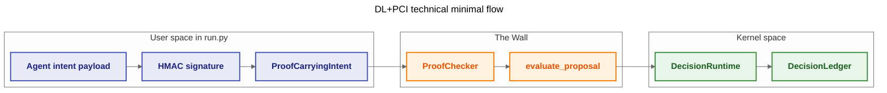

# 11 — Topology C (DL+PCI) — Technical Minimal Demo

**Goal:** demonstrate Topology C in the smallest technical slice: build a
`ProofCarryingIntent`, verify signature and evidence hash with `ProofChecker`,
gate the resulting `PolicyProposal` through `DecisionRuntime.evaluate_proposal`,
and append only accepted intents to `DecisionLedger`.

This sample follows `.cursor/rules/06-technical-sample-development-guide.mdc`:
no `samples/shared`, no YAML, no external DB, in-memory only.

---

## Architecture / flow



---

## How to run

From repository root:

```bash
python samples/11_topology_c_dl_pci/run.py
```

---

## Expected output

The script executes three scenes:
- valid transfer intent (accepted, appended to ledger),
- tampered payload (rejected by signature check),
- replay on changed context (rejected by proof hash mismatch).

Example:

```text
INFO Handshake: agent_id=agent_banker ver=1.0.0 accepted
INFO [DFID=...] ACCEPT ledger_append
WARNING [DFID=...] REJECT invalid signature
WARNING [DFID=...] REJECT proof: Evidence Invalid

[SUMMARY] accepted=1 rejected=2 ledger_entries=1
```
