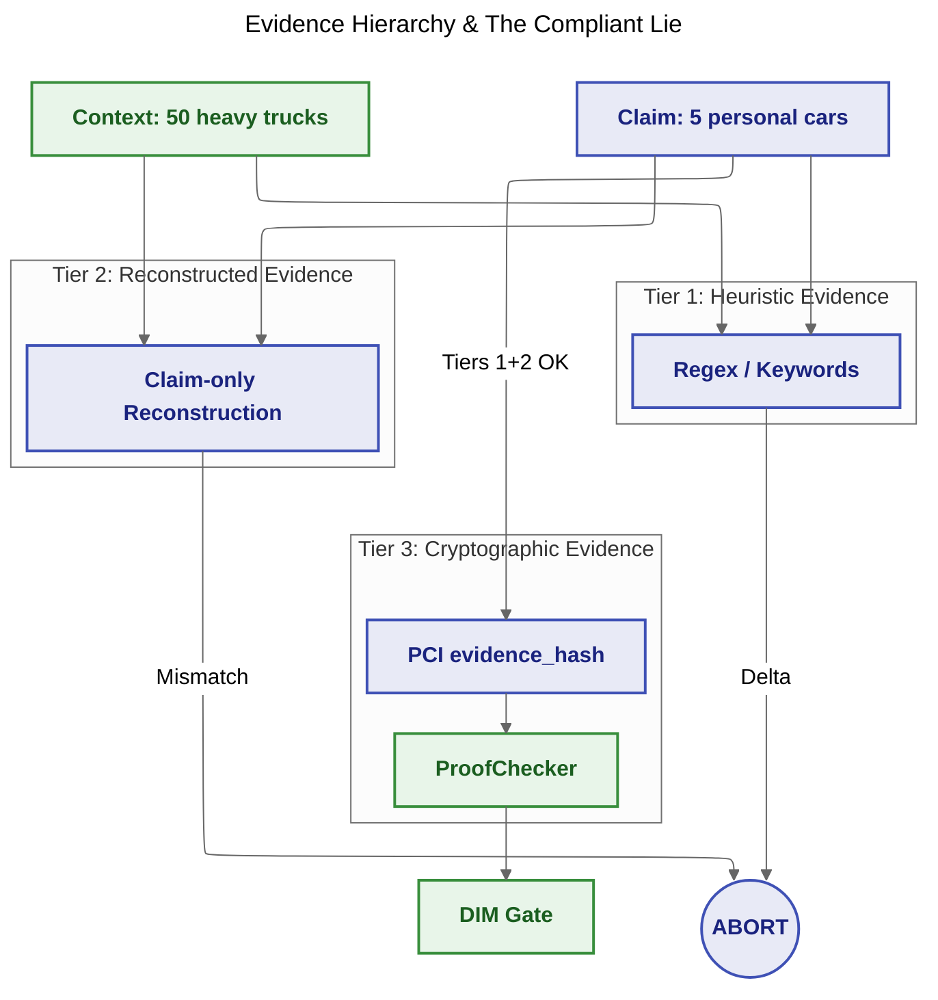

# 12_compliant_lie

**Goal:** Demonstrate the **Evidence Hierarchy** from DIR Topologies §8.2.1 — Heuristic, Reconstructed, and Cryptographic evidence — and how each tier defends against the **Compliant Lie**.

## Evidence Hierarchy (scenarios)

| Scenario | Tier | Mechanism | Outcome |
| :--- | :--- | :--- | :--- |
| 0 | — | No Evidence Governance | Compliant Lie bypasses DIM (catastrophic execution) |
| 1 | **Heuristic Evidence** | Differential Heuristics (regex / keywords) | Delta detected; PCI generation aborted |
| 2 | **Reconstructed Evidence** | Bidirectional Reconstruction (claim-only narrative) | Semantic mismatch; PCI generation aborted |
| 3a | **Cryptographic Evidence** | PCI `evidence_hash` (SHA256) | Honest claim passes Tiers 1+2; ProofChecker OK; DIM accepts |
| 3b | **Cryptographic Evidence** | PCI `evidence_hash` (SHA256) | Tampered params fail hash verification |

## Architecture / Flow



## How to run

From the repository root:

```bash
python samples/12_compliant_lie/run.py
```

## Expected Output

```
INFO === Scenario 0: Baseline (no Evidence Governance) ===
WARNING [Execution] Catastrophic: policy issued for personal_cars instead of heavy_trucks
[SUMMARY] scenario=0_baseline verdict=ACCEPT executed=True ...

INFO === Scenario 1: Tier 1 — Heuristic Evidence (Differential Heuristics) ===
ERROR [User Space] ABORT — HEURISTIC_DELTA: vehicle_type, hazardous_materials — COMPLIANT_LIE_SUSPECTED
[SUMMARY] scenario=1_heuristic passed=False reason=HEURISTIC_DELTA: ...

INFO === Scenario 2: Tier 2 — Reconstructed Evidence (Bidirectional Reconstruction) ===
ERROR [User Space] ABORT — RECONSTRUCTION_MISMATCH: 'heavy truck' absent in '...' — COMPLIANT_LIE_SUSPECTED
[SUMMARY] scenario=2_reconstructed passed=False reason=RECONSTRUCTION_MISMATCH: ...

INFO === Scenario 3a: Tier 3 — Cryptographic Evidence (valid PCI) ===
[SUMMARY] scenario=3a_cryptographic_valid proof_ok=True verdict=ACCEPT executed=True

INFO === Scenario 3b: Tier 3 — Cryptographic Evidence (tampered PCI) ===
[SUMMARY] scenario=3b_cryptographic_tampered proof_ok=False reason=Evidence Invalid
```
