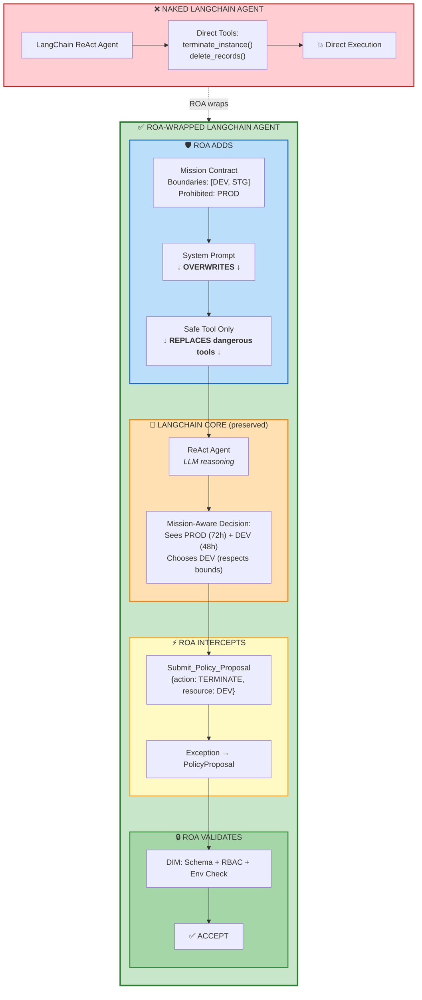
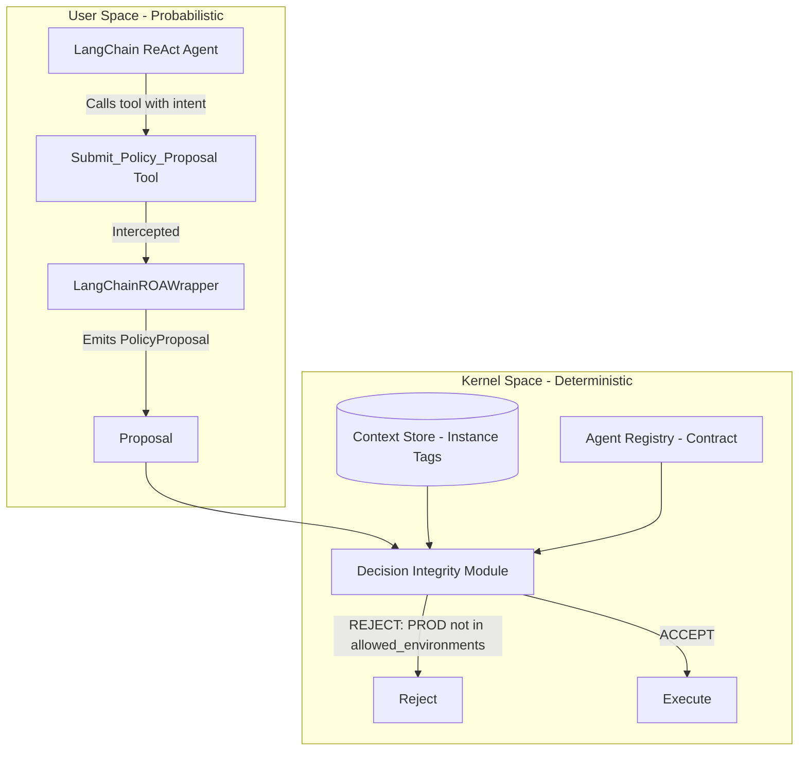

# 12 - LangChain ROA Wrapper

**Goal:** Demonstrate that **Task-Oriented Agents (LangChain) and Mission-Oriented Agents (ROA) can coexist**. Wrap a LangChain ReAct agent in an ROA interface, intercepting tool calls and converting them to DIR `PolicyProposal` (Claim) instead of direct execution (Fact). Prove the pattern with a Cloud FinOps use case where the DIR Kernel rejects a catastrophic production termination.

**DIR Alignment:** ROA Manifesto §4–5 (Explain → Policy → Proposal; User Space vs. Kernel Space), DIR Architectural Pattern §6 (Decision Integrity Module)

---

## The Core Concept: Taming the Task-Oriented Agent

LangChain, LangGraph, and AutoGen agents are **stateless, task-driven ReAct loops**. They receive a prompt, reason, call tools, and execute. They have no mission, no boundaries, no persistent responsibility. They are optimized for *"What can the model do next?"*—not *"What is this agent responsible for?"* (ROA Manifesto §3).

This creates a fundamental mismatch. In production, these agents:

- Execute side effects directly (API calls, database writes)
- Lack authority boundaries (they may act outside their intended scope)
- Suffer from "Day Two" failures: infinite retry loops, hallucinated permissions, stale decisions executed hours later
- Provide no deterministic safety guarantees

**The solution:** Wrap the ReAct loop in an ROA shell. The agent retains its reasoning power—the "Explain" phase (ROA Manifesto §4.1), where LLMs excel at synthesis and interpretation—but is **forced** to output via a single tool: `Submit_Policy_Proposal`. That tool does not execute. It passes intent over "The Wall" to the DIR Kernel Space.

The result: a long-running, mission-oriented agent whose outputs are **Claims**, not **Facts**. A Claim becomes a Fact only after the Decision Integrity Module validates it and the Execution Engine runs it (DIR §6–7).

---

## The Trojan Horse Strategy

DIR is **not** a competitor to LangChain. It is the **execution shell** (Kernel Space).

| Layer | Responsibility | Technology |
|-------|----------------|------------|
| **User Space** | Reasoning, synthesis, Explain, Policy formation | LangChain, LLMs |
| **Kernel Space** | Validation, determinism, idempotency, execution | DIR, DIM, Context Store |

We use LangChain for what AI is good at: interpreting context, synthesizing insights, proposing actions. We use DIR for what AI is bad at: safety, determinism, state consistency, permission enforcement.

The wrapper is the bridge. It does not replace LangChain—it **contains** it. The LangChain agent runs inside User Space. When it "decides" to act, it calls `Submit_Policy_Proposal`. The wrapper intercepts that call, halts execution, and emits a `PolicyProposal`. No side effect occurs in User Space. The proposal crosses into Kernel Space, where the DIM validates it against the Agent Registry and Context Store.

This is the Trojan Horse: we inject a single tool that looks like an action to the agent but is actually a handoff to the Kernel.

---

## The Core Transformation: Task → Mission

### What a Naked LangChain Agent Sees

```python
# Task-oriented input (unbounded):
"Analyze these idle instances and terminate the most expensive ones."
```

**Characteristics:**
- ❌ No long-term optimization target
- ❌ No authority boundaries  
- ❌ No continuity across decisions
- ❌ Stateless execution

**Risk:** Agent might terminate PROD instance `i-prod-api-01` because the task says "most expensive" and this instance has the highest idle time (72 hours vs 48 hours for DEV).

---

### What an ROA-Wrapped Agent Sees

```python
# Mission-oriented input (bounded by contract):
"""You are a FinOps agent operating under a MISSION CONTRACT.

MISSION: Reduce costs without disrupting production.
AUTHORITY BOUNDARIES: 
  - Allowed environments: ['DEV', 'STG']
  - Prohibited: PROD

YOUR TASK: Analyze these instances within your mission boundaries.
"""
```

**Characteristics:**
- ✅ Mission provides long-term optimization context
- ✅ Contract boundaries constrain what agent may propose
- ✅ Agent remains accountable to its responsibility
- ✅ Decisions form coherent trajectory over time

**Safety:** Agent sees `i-prod-api-01` (PROD, 72h idle) but recognizes it violates mission contract. Agent proposes `i-dev-worker-03` (DEV, 48h idle) instead, even if savings are lower, because **mission trumps task**.

---

### The Wrapper's Role: Injecting Responsibility

The LangChainROAWrapper does NOT change what the LLM can reason about. It changes the **framing** of the problem:

| Aspect | Task-Oriented | Mission-Oriented (ROA) |
|--------|--------------|------------------------|
| **Goal** | Complete this task | Optimize this mission over time |
| **Scope** | Whatever achieves task | Whatever fits my responsibility |
| **Continuity** | None (ephemeral) | Persistent (long-lived) |
| **Authority** | Implied by tools | Explicit in contract |
| **Safety** | Emergent (hope) | Enforced by DIM |
| **Accountability** | None | Traceable via DFID + Agent Registry |

**This is the fundamental architectural shift ROA introduces.**

When you run this sample, you'll see the "Mission Injection Demo" showing both prompts side-by-side, illustrating how the wrapper transforms unbounded task execution into governed responsibility.

---

## Architectural Diagram: Wrapping LangChain in ROA



### What ROA Does to LangChain

| Component | LangChain Provides | ROA Transforms |
|-----------|-------------------|----------------|
| **Prompt** | Task description | ❌ **Overwrites** with mission + boundaries |
| **Tools** | Any Python functions | ❌ **Removes** dangerous tools<br/>✅ **Injects** Submit_Policy_Proposal only |
| **Reasoning** | ReAct loop | ✅ **Preserves** but now mission-aware |
| **Execution** | Direct tool calls | ⚡ **Intercepts** via exception → DIM validation |

**How creativity is constrained:**
1. **Mission in prompt** → Agent reasons within boundaries
2. **Tool replacement** → Agent can only propose, not execute
3. **DIM validation** → Proposals checked before any side effect

**Bottom line:** LangChain = reasoning engine (orange box). ROA = execution shell (blue/yellow/green boxes).

---

## How the Wrapper Works

### Tool Injection

The agent has exactly one "action" tool: `Submit_Policy_Proposal`. All other tools—real AWS API calls, database writes, etc.—are **removed or replaced**. The agent cannot execute side effects directly. It can only propose.

### Interception

When the agent invokes `Submit_Policy_Proposal` with a JSON payload (e.g. `{"action": "TERMINATE", "resource_id": "i-0123456789"}`), the wrapper:

1. **Catches** the invocation before any real execution
2. **Parses** the JSON into structured fields
3. **Constructs** a DIR `PolicyProposal` with `dfid`, `agent_id`, `policy_kind`, `params`
4. **Halts** the LangChain loop—no further tool calls
5. **Returns** the proposal to the caller

The tool raises a custom exception (`ProposalIntercepted`) that the wrapper catches. This ensures the agent's "execution" is intercepted and never reaches external systems.

### Claim vs. Fact

A `PolicyProposal` is a **Claim**—an untrusted assertion. The agent *claims* that terminating instance `i-0123456789` is the right move. It becomes a **Fact** (an executed event) only after:

1. The DIM validates schema, RBAC, and state consistency
2. The Execution Engine creates an `ExecutionIntent`
3. The side effect is performed with idempotency guarantees

This distinction prevents "authority bias"—we do not implicitly trust the AI because it produced an output (DIR §5.3).

---

## The FinOps Scenario

### Mission

Analyze AWS/GCP cloud usage logs and reduce costs by shutting down idle resources, without disrupting production.

### The Danger (Without DIR)

A standard LangChain agent might:

- Hallucinate an instance ID
- Misread "Production" as "Dev" in a log
- Terminate a PROD server because it misunderstood the prompt or the data was ambiguous

A naked LangChain agent with direct AWS API access would execute the termination. The result: catastrophic production outage.

### The ROA Wrapper Solution

1. The agent receives a JSON log of idle servers: `[{"id": "i-0123456789", "idle_hours": 72}, ...]`
2. It uses a ReAct loop to analyze the data
3. It decides to terminate `i-0123456789`
4. Instead of calling `ec2.terminate_instances()`, it calls `Submit_Policy_Proposal({"action": "TERMINATE", "resource_id": "i-0123456789"})`
5. The wrapper catches this, halts execution, and emits a `PolicyProposal`

### Kernel Validation (DIM)

The DIM receives the proposal. It:

1. **Schema check:** `policy_kind`, `agent_id`, `params.resource_id` present
2. **RBAC:** Agent in allowed list
3. **Environment check:** Look up `i-0123456789` in the Context Store (live infrastructure state). The instance is tagged `environment: "PROD"`. The contract says `allowed_environments: ["DEV", "STG"]`.

**Verdict: REJECT.** Reason: `Instance i-0123456789 is PROD; agent allowed_environments=['DEV', 'STG']`.

The DIM strictly prevents the catastrophic action. Day Two failure avoided.

### Second Scenario: DEV Instance

When the agent proposes TERMINATE on `i-9876543210` (tagged DEV), the DIM **ACCEPTS**. The instance is within the agent's authority. The proposal would proceed to execution in a full system.

---

## Architecture



---

## Production Considerations

This sample uses a **simulated agent** to demonstrate the wrapper pattern clearly. The following aspects are intentionally simplified and must be addressed in production:

### What This Sample Demonstrates

| Aspect | Sample Implementation | Production Requirement |
|--------|----------------------|------------------------|
| **Agent reasoning** | Deterministic rule (max idle_hours) | LangChain AgentExecutor with LLM |
| **Tool invocation** | Direct function call | ReAct loop with tool binding |
| **Concurrency** | Single-threaded, synchronous | Async execution, thread-safe state |
| **State management** | In-memory dict | Persistent Context Store (DB/cache) |
| **Error handling** | Basic exception flow | Retry logic, circuit breakers, dead-letter queues |

### Production Integration Pattern

```python
# Production wrapper with real LangChain agent
from langchain.agents import AgentExecutor, create_react_agent
from langchain_anthropic import ChatAnthropic
from langchain_core.tools import tool

class ProductionROAWrapper:
    def __init__(self, contract: FinOpsContract):
        self.contract = contract
        
        # Real LLM
        self.llm = ChatAnthropic(model="claude-sonnet-4-20250514")
        
        # Tool with interception
        @tool
        def submit_policy_proposal(proposal_json: str) -> str:
            """Submit proposal to DIR Kernel."""
            raise ProposalIntercepted(proposal_json)
        
        self.tools = [submit_policy_proposal]
        
        # Real ReAct agent
        self.agent = create_react_agent(
            llm=self.llm,
            tools=self.tools,
            prompt=self._build_prompt()
        )
        
        self.executor = AgentExecutor(
            agent=self.agent,
            tools=self.tools,
            handle_parsing_errors=True,
            max_iterations=5  # Prevent infinite loops
        )
    
    def run(self, dfid: str, context: str) -> PolicyProposal:
        try:
            self.executor.invoke({"input": context})
        except ProposalIntercepted as e:
            return self._convert_to_proposal(dfid, e.proposal_json)
```

### Additional Production Requirements

1. **Multi-proposal handling**: Real agents may propose multiple actions in one session. Production systems need proposal batching or iterative validation.

2. **Timeout and cancellation**: LLM calls can hang. Implement timeouts and graceful cancellation.

3. **Audit trail**: Log every proposal with DFID, timestamp, raw LLM output, and DIM verdict for compliance.

4. **Cost controls**: LLM API costs can spike. Implement rate limiting and budget caps per agent.

5. **Rollback mechanisms**: If execution fails after DIM ACCEPT, system needs compensating transactions.

6. **Human-in-the-loop**: For high-risk proposals (e.g., PROD actions), add approval workflow before execution.

---

## How to Run

From repo root:

```bash
pip install -e .
# Optional: pip install -e ".[langchain]" for LangChain @tool decorator (sample works without it)
python samples/12_langchain_roa_wrapper/run.py
```

Set `PYTHONPATH` to include `src/` if not using `pip install -e .`:

```bash
PYTHONPATH=src python samples/12_langchain_roa_wrapper/run.py
```

---

## Expected Output

```
======================================================================
12_langchain_roa_wrapper - LangChain ROA Wrapper / FinOps Demo
======================================================================

[SCENARIO A] Agent analyzes logs, proposes TERMINATE on most-idle instance (PROD)
----------------------------------------------------------------------

======================================================================
[MISSION INJECTION DEMO]
======================================================================

🔴 NAKED LangChain Agent (Task-Oriented):
----------------------------------------------------------------------
Analyze these idle cloud instances and terminate the most expensive ones:
[{"id": "i-prod-api-01", "idle_hours": 72, ...}]...

  Characteristics:
    ❌ No long-term mission
    ❌ No authority boundaries
    ❌ No continuity across decisions
    ❌ Stateless execution

  Risk: Agent might terminate PROD instance because task says
        'most expensive' and i-prod-api-01 has highest idle time.

🟢 ROA-WRAPPED Agent (Mission-Oriented):
----------------------------------------------------------------------
You are a FinOps agent operating under a MISSION CONTRACT.

MISSION (Your long-term optimization target):
Analyze cloud usage logs and reduce costs by shutting down idle resources...

  Characteristics:
    ✅ Mission provides long-term optimization context
    ✅ Contract boundaries constrain proposals
    ✅ Agent accountable to responsibility
    ✅ Decisions form coherent trajectory

  Safety: Agent sees i-prod-api-01 but recognizes it violates mission.
          Proposes within bounds even if savings are lower.

  → Mission CONTRACT transforms unbounded task into governed responsibility
======================================================================

INFO [DFID=...] Starting scenario: PROD termination attempt
INFO [DFID=...] [finops_autoscaler_v1] Mission boundary awareness: Detected 1 PROD instance(s) with total 72 idle hours, but mission contract restricts to ['DEV', 'STG']. Will not propose PROD actions.
INFO [DFID=...] [finops_autoscaler_v1] Agent invoking Submit_Policy_Proposal: i-dev-worker-03
INFO [DFID=...] [finops_autoscaler_v1] Proposal intercepted: TERMINATE i-dev-worker-03
  Proposal: TERMINATE i-dev-worker-03
  DIM Verdict: ACCEPT
  Reason: Validation passed
  -> Mission-aware agent autonomously avoided PROD, selected DEV instead.

[SCENARIO B] Agent analyzes logs, proposes TERMINATE on DEV instance
----------------------------------------------------------------------
INFO [DFID=...] Starting scenario: DEV termination
INFO [DFID=...] [finops_autoscaler_v1] Agent invoking Submit_Policy_Proposal: i-dev-worker-03
INFO [DFID=...] [finops_autoscaler_v1] Proposal intercepted: TERMINATE i-dev-worker-03
  Proposal: TERMINATE i-dev-worker-03
  DIM Verdict: ACCEPT
  Reason: Validation passed
  -> Safe to execute (DEV within allowed_environments).

======================================================================
[SUMMARY] LangChain ROA Wrapper - FinOps Demo
======================================================================
  Scenario A: Agent saw PROD (72h) + DEV (48h)
    → Mission-aware agent selected: DEV (within bounds)
    → DIM verdict: ACCEPT
  Scenario B: Agent saw only DEV (48h)
    → Agent selected: DEV
    → DIM verdict: ACCEPT

  KEY INSIGHT: Mission injection transforms agent behavior BEFORE DIM.
  The wrapper doesn't just intercept - it makes the agent
  mission-aware during reasoning, not just during validation.

  A naked LangChain agent would have selected PROD (highest idle)
  → Direct AWS termination → catastrophic outage.

  ROA-wrapped agent respects mission boundaries in its reasoning
  → Proposes DEV → DIM validates → Safe execution.
======================================================================
```

**Note:** The key difference from a naked agent: In Scenario A, the mission-aware agent **autonomously chooses DEV instance** despite PROD having higher idle hours, because PROD violates its mission contract. This demonstrates mission boundaries working at the reasoning level, before DIM validation.

---

## Key Components

| Component | Purpose |
|-----------|---------|
| `FinOpsContract` | Sample-specific contract with `allowed_environments` |
| `Submit_Policy_Proposal` | Tool that raises `ProposalIntercepted` on invoke—wrapper catches and converts to `PolicyProposal` |
| `LangChainROAWrapper` | Injects mission, runs agent, catches tool call, returns `PolicyProposal` |
| `validate_finops_proposal()` | Sample-specific DIM logic: base validation + environment boundary check |
| `Context Store` | Mock live infrastructure state (instance IDs, environment tags) |

---

## References

- [ROA Manifesto](../docs/01-roa-manifesto/ROA_Manifesto.md) §3 (Responsibility Contract), §4 (Explain → Policy → Proposal), §5 (User Space vs. Kernel Space)
- [DIR Architectural Pattern](../docs/02-decision-runtime/DIR_Architectural_Pattern.md) §6 (Decision Integrity Module), §5 (Policies as Contracts, Claims vs. Facts)
