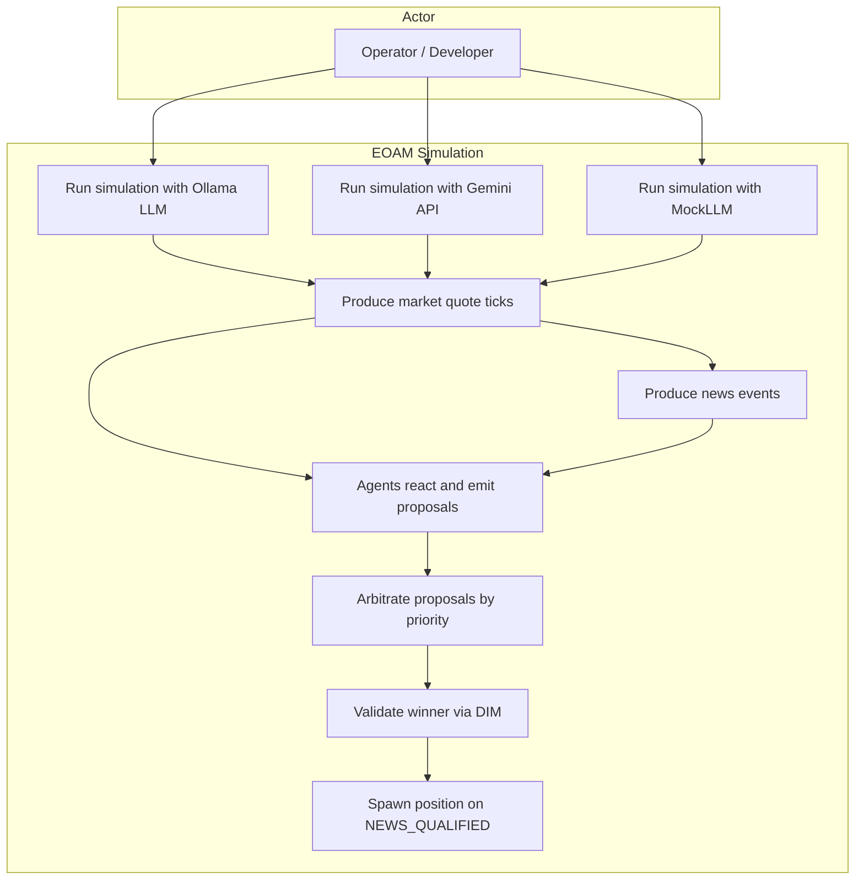
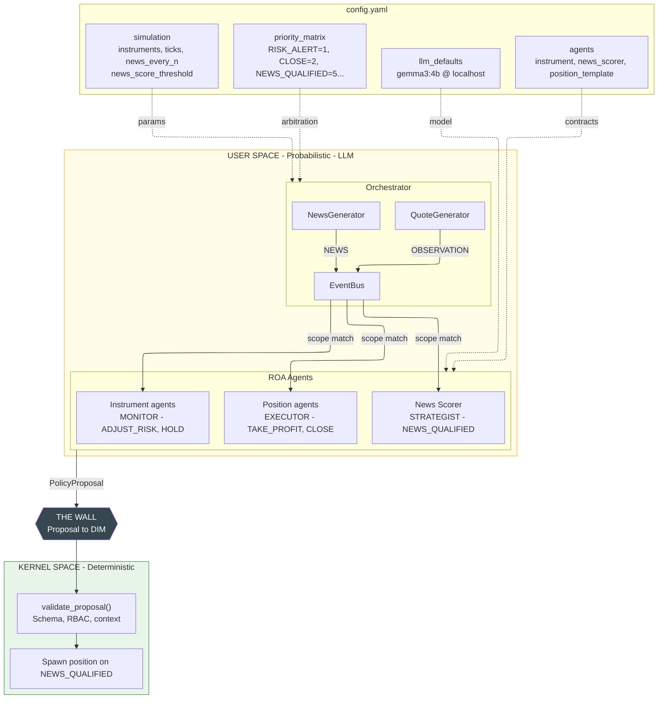
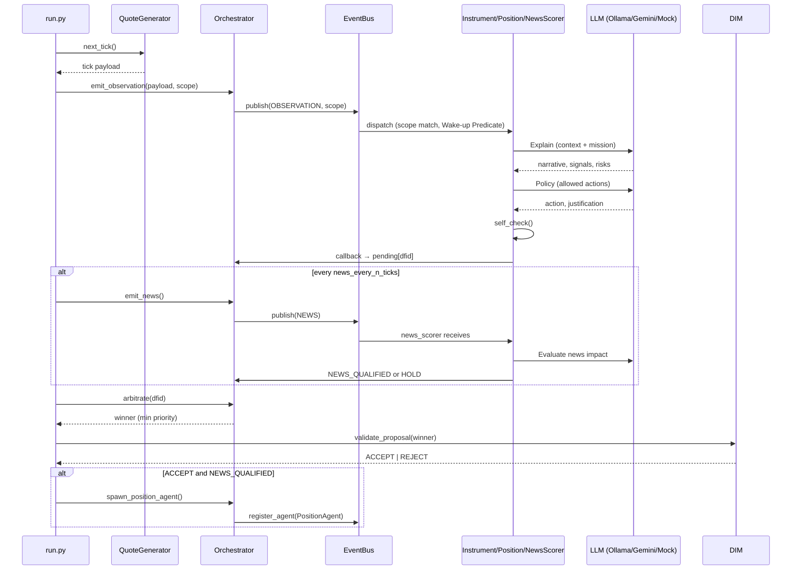
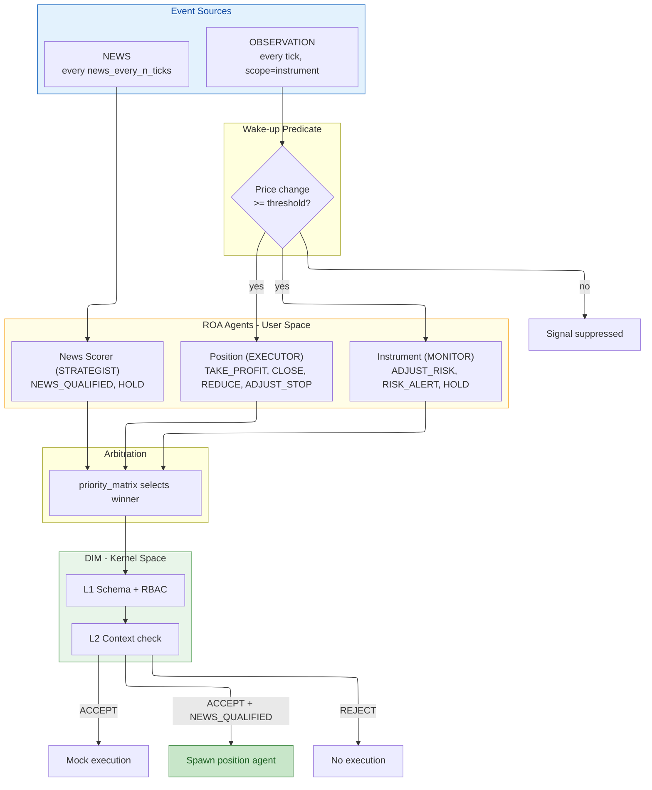
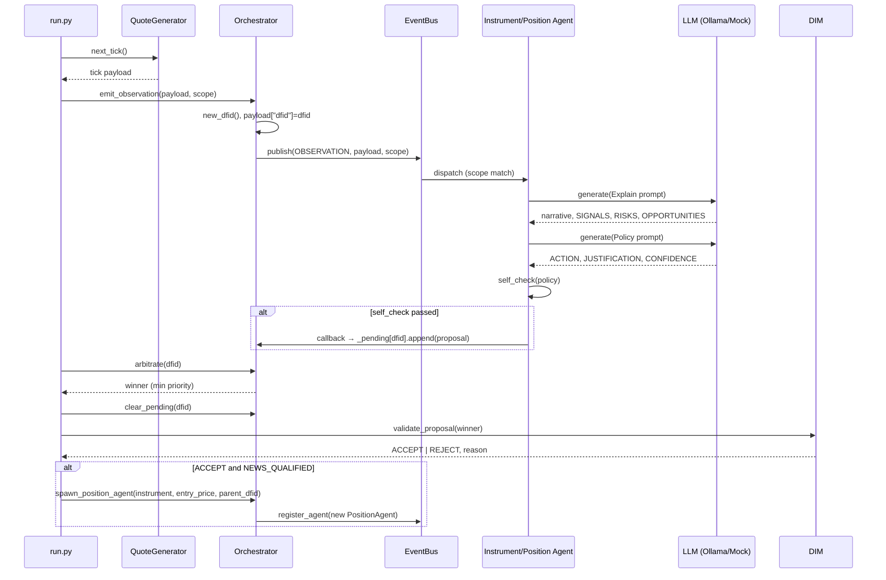
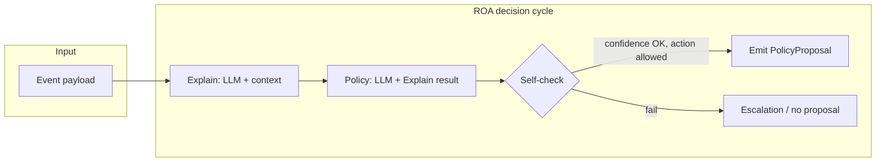
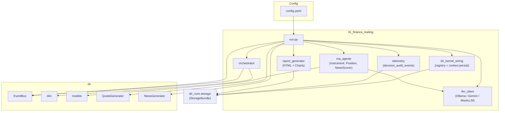

# 31 – Business Case: Finance Trading (Topology A)

**Goal:** Demonstrate **Topology A (Event-Oriented Agent Mesh, EOAM)** with a **news-driven trading strategy** simulation. The system showcases how ROA (Responsibility-Oriented Architecture) agents with distinct roles: MONITOR (instrument observers), STRATEGIST (news evaluator), and EXECUTOR (position managers) coordinate via scope-based events, priority arbitration, and the Decision Integrity Module (DIM) to implement a disciplined trading approach where:

- **Market monitoring is continuous** but **positions open only on high-impact news** (score ≥ threshold)
- **News scorer agent** acts as the **exclusive entry point**, evaluating news significance via LLM
- **Position managers** enforce strict risk limits and manage exits
- **Full auditability** via hierarchical DFID tracking (news → position → decisions)

At simulation end, an **interactive HTML report** is automatically generated and opened in the browser. The report is built from the **same canonical `StorageBundle`** used during the run (audit events plus optional repository summary), not from a parallel sample-specific database schema.

The report includes:
- **Interactive Plotly charts** showing price movements with hover tooltips revealing:
  - Tick details (price, trend, volatility, timestamp)
  - Decision details (LLM justification, explain narrative, DIM validation)
  - News events (⭐ stars) with impact scores and spawned positions
  - Position openings (▲ triangles) with entry details and P&L
- **Position lifecycle cards** with professional styling showing complete audit trail
- **DFID hierarchy** tracing every decision back to its trigger

**DIR alignment:** DIR Topologies §2 (EOAM), §2.1–2.4 (scope-based choreography, DFID correlation, priority-based preemption, **Wake-up Predicates for Signal Suppression**). ROA Manifesto §3 (Responsibility Contract, mission), §4 (Explain → Policy → Self-Check → Proposal).

---

## Use cases

The following diagram summarizes the main ways the simulation is used and what the system does.



- **UC1 / UC1B / UC2:** The operator runs the simulation with:
  - **Ollama LLM** (local, real reasoning)
  - **Gemini API** (cloud, real reasoning with Google's models)
  - **MockLLM** (`USE_MOCK_LLM=1`, no server, for testing)
- **UC3:** Each tick, a quote generator produces one market observation (instrument, price, trend, volatility) for the current instrument in round-robin.
- **UC4:** Every `news_every_n_ticks` ticks, a news generator emits one news event (headline, sentiment, raw_score, etc.).
- **UC5:** Agents subscribed to the event (by scope) receive the observation **only if Wake-up Predicate passes** (price change ≥ `wake_up_threshold_pct`), then run their ROA decision cycle (Explain → Policy → Self-Check) and may emit one `PolicyProposal` per event. If price change is below threshold, signal is suppressed to prevent Token Burn.
- **UC6:** The orchestrator collects all proposals for that event’s DFID and selects the **winner** by the configured priority (lower number = higher priority).
- **UC7:** The winner is validated by DIM (schema, RBAC, context); result is ACCEPT or REJECT.
- **UC8:** If the result is ACCEPT and the winner's `policy_kind` is `NEWS_QUALIFIED`, the orchestrator spawns a new position manager agent (from the config template) for each affected instrument and registers it for future observations. `NEWS_QUALIFIED` creates a hierarchical DFID link (parent_dfid = news event DFID). **This is the exclusive entry point for opening positions.**
- **UC9:** At simulation end:
  - **Interactive HTML report** is generated from persisted **decision audit** rows (and optional repository context in the report), then opened in the default browser.
  - **Console:** standard logging (including `Persistence: …`, decision-audit backend class name, and optional PostgreSQL filter hint). There is no separate console “position audit script”; use SQL against the canonical tables or the HTML report for a full lifecycle view.

---

## What This Test Demonstrates

This sample demonstrates a **news-driven trading strategy** where:

1. **Market Monitoring Phase**
   - Instrument agents (BTC-USD, ETH-USD) continuously monitor market data streams
   - Role: **MONITOR** - passive observation, risk assessment, no trading decisions
   - Actions: ADJUST_RISK, RISK_ALERT, HOLD only

2. **News Evaluation Phase** (Exclusive Entry Point)
   - News scorer agent evaluates every news event for trading impact
   - Role: **STRATEGIST** - makes entry decisions based on news significance
   - Threshold: Only opens positions when `raw_score >= news_score_threshold` (default 0.50, configurable)
   - Action: Emits **NEWS_QUALIFIED** to signal high-impact opportunity

3. **Position Opening Phase**
   - NEWS_QUALIFIED trigger spawns dedicated position manager agents
   - One agent per affected instrument
   - Hierarchical tracking: parent_dfid links position back to originating news event
   - **This is the ONLY way positions are opened** - no direct market-based entries

4. **Position Management Phase**
   - Position agents actively manage their specific positions
   - Role: **EXECUTOR** - enforces risk limits and exit strategies
   - Actions: ADJUST_STOP, TAKE_PROFIT, REDUCE, CLOSE, HOLD
   - Monitors: P&L, drawdown limits, price movements

**Key Design Principles:**
- **Separation of Concerns**: Monitoring ≠ Strategy ≠ Execution (three distinct agent roles)
- **News-Driven Entry**: Only newsworthy events trigger position openings
- **Risk-Managed Exit**: Position agents enforce strict drawdown limits
- **Full Auditability**: Every position traces back to its triggering news event via hierarchical DFID

**Testing Scenarios:**
- ✅ ROA agent decision lifecycle (Explain → Policy → Self-Check → Proposal)
- ✅ Multi-agent coordination via event bus (scope-based choreography)
- ✅ Priority-based arbitration when multiple agents propose conflicting actions
- ✅ Decision Integrity Module (DIM) validation
- ✅ Dynamic agent spawning based on events
- ✅ Hierarchical decision tracking (DFID parent-child relationships)
- ✅ LLM-based reasoning (Ollama, Gemini, or Mock)
- ✅ **Wake-up Predicates (DIR Topologies §2.3)** - Signal suppression to prevent Token Burn on minor price changes
- ✅ **Interactive HTML reporting** - Charts with rich tooltips showing LLM reasoning and agent proposals
- ✅ **Position audit trail** - HTML report and SQL over `decision_audit_events` (complete lifecycle from news trigger to closure)

---

## Architecture

### Diagram 1: System Overview. EOAM simulation with config.yaml, agents, DIM



### Diagram 2: Execution Flow. One tick (observation + optional news)



### Diagram 3: Simulation Scenarios. Event types through the pipeline



### Simulation Scenarios (behavioral)

| Scenario | Trigger | Agent(s) | Proposal | DIM Verdict | Result |
|----------|---------|----------|----------|-------------|--------|
| **Observation** | Tick, price change >= wake_up_threshold | Instrument agent | ADJUST_RISK, RISK_ALERT, HOLD | ACCEPT | Mock execution |
| **Observation** | Tick, price change >= threshold | Position agent | TAKE_PROFIT, CLOSE, REDUCE, ADJUST_STOP | ACCEPT | Position lifecycle |
| **News** | raw_score >= news_score_threshold (0.50) | News scorer | NEWS_QUALIFIED | ACCEPT | Spawn position agent |
| **News** | raw_score < threshold | News scorer | HOLD or silence | - | No position spawn |
| **Arbitration** | Multiple proposals same dfid | Orchestrator | Winner by priority_matrix | - | Lowest priority number wins |
| **Signal suppression** | Price change < wake_up_threshold | - | Agent not invoked | - | Token Burn prevented |

### Key Difference from a Naive Trading System

| | Naive Trading Bot | EOAM ROA Simulation |
|---|---|---|
| Entry | Any signal, any trigger | Only NEWS_QUALIFIED (news score >= threshold) |
| Roles | Single agent | MONITOR (instrument) + STRATEGIST (news) + EXECUTOR (position) |
| Enforcement | None (trust the LLM) | DIM validation, priority arbitration |
| Auditability | Limited | Hierarchical DFID, full audit trail |

---

## Simulation rules (detailed)

### Time and ticks

- The simulation runs until one of the end conditions is met:
  - **simulation_ticks** (or **simulation_ticks**): maximum number of ticks (e.g. 20).
  - **simulation_max_seconds** (optional): maximum wall-clock time in seconds; if set, the simulation stops when elapsed time exceeds this value.
- Each tick corresponds to one **market observation** for exactly one instrument.
- Instruments are iterated in **round-robin** (e.g. tick 0 → BTC-USD, tick 1 → ETH-USD, tick 2 → BTC-USD, …).
- Optionally, **tick_interval_sec** can be used to sleep between ticks (e.g. 0.3 s) for a slower, observable run.

### Quote stream (observations)

- For each tick, the **QuoteGenerator** for the current instrument produces one **QuoteTick** (multiplicative random walk: price, trend, volatility, volume).
- The tick is converted to a payload and published on the **event bus** as `EventType.OBSERVATION` with:
  - **DFID** (Decision Flow ID) set by the orchestrator for correlation.
  - **target_scope** = instrument symbol (e.g. `"BTC-USD"`), so only agents subscribed to that scope receive the event.
- Payload fields include: `instrument`, `price`, `trend`, `volatility`, `volume`, `price_delta_pct`, `timestamp`, `dfid`.

### News stream (critical - entry trigger)

- Every **news_every_n_ticks** ticks (e.g. 5), the **NewsGenerator** yields one news event until **max_news_events** is reached.
- The event is published as `EventType.NEWS` with a new DFID; **scope** is not used (all news agents receive all news events).
- Payload includes: `headline`, `sentiment`, `category`, `instruments_affected`, `raw_score`, `news_id`, `dfid`.

**News Scorer Decision Logic:**
1. Receives news event with `raw_score` (0.0 to 1.0, higher = more impactful)
2. Compares against `news_score_threshold` from config (default: 0.6)
3. If `raw_score >= threshold`:
   - Runs ROA decision cycle (Explain → Policy → Self-Check)
   - LLM evaluates: Is this newsworthy enough to open positions?
   - If yes: Emits **NEWS_QUALIFIED** proposal with `instruments_affected`
4. If `raw_score < threshold`: No action (HOLD or silence)

**Position Spawning:**
- When NEWS_QUALIFIED is accepted by DIM:
  - For each instrument in `instruments_affected` (usually first one only: `[:1]`)
  - Spawn new position manager agent with:
    - `instrument`: e.g., "BTC-USD"
    - `entry_price`: current market price for that instrument
    - `parent_dfid`: news event DFID (hierarchical tracking)
    - `parent_agent_id`: "news_scorer"
    - `news_headline`: original headline for audit trail
  - Agent subscribes to OBSERVATION events for its instrument
  - Agent begins monitoring position lifecycle

### Agent subscription (scope-based)

- **Instrument agents** subscribe to `OBSERVATION` with **scope = instrument** (e.g. `BTC-USD`). Each receives only observations for that instrument.
- **Position agents** (spawned later) subscribe to `OBSERVATION` with **scope = instrument** of their position; they receive the same observation stream for that instrument.
- **News scorer agent(s)** subscribe to `NEWS` with **scope = null** (all news).

### Wake-up Predicates (Signal Suppression - DIR Topologies §2.3)

**Purpose:** Prevent "Token Burn" by suppressing LLM invocations for minor price changes that don't warrant agent reasoning.

**Implementation:**
- Each agent contract includes `wake_up_threshold_pct` (default: 0.5%)
- Orchestrator tracks last price for each instrument scope
- Before invoking agent's `on_observation()`, calculates `price_change_pct = abs((current_price - last_price) / last_price * 100)`
- **If change < threshold:** Signal suppressed, agent not invoked (saves LLM tokens)
- **If change ≥ threshold:** Agent activated normally

**Configuration:**
- **Instrument agents** (strategic): 0.5% threshold - less sensitive, focus on significant trends
- **Position agents** (tactical): 0.3% threshold - more sensitive for active risk management

**Economic Benefits:**
- Reduces unnecessary LLM API calls by 60-80% in typical market conditions
- Maintains full agent reactivity for meaningful price movements
- Configurable per-agent based on role and responsibility

**Logging:**
- Suppressed signals counted: `orch._suppressed_signals`
- Debug logs every 10th suppression
- Summary statistics in final report

### Agent types and responsibilities

- **Instrument agents** (BTC-USD, ETH-USD): **MONITOR** role. Observe market signals (price, trend, volatility), provide risk assessments via ADJUST_RISK or RISK_ALERT. **Cannot open positions** - their role is passive monitoring and risk signaling only.
- **News scorer agent**: **STRATEGIST** role. **Exclusive entry point for all positions.** Evaluates news events; when `raw_score >= news_score_threshold` (e.g. 0.6 from config), emits `NEWS_QUALIFIED` proposal which spawns position agents for affected instruments.
- **Position agents** (dynamically spawned): **EXECUTOR** role. Manage individual positions opened by news; monitor P&L, enforce risk limits (max drawdown), execute ADJUST_STOP, TAKE_PROFIT, REDUCE, CLOSE, or HOLD.

### ROA decision cycle (per event, per agent)

When an agent receives an event it runs a single **decision cycle**:

1. **Explain:** The agent sends the current context (e.g. price, trend, volatility, or news fields) to the LLM with its **mission** and contract boundaries. The LLM returns a free-form interpretation; the response is parsed into **ExplainResult** (narrative, signals, risks, opportunities).
2. **Policy:** The agent sends the Explain result to the LLM and asks for one action from **allowed_policy_types**. The LLM response is parsed into **Policy** (proposed_action, justification, confidence).
3. **Self-check:** The agent checks (a) confidence ≥ **escalate_on_uncertainty**, (b) proposed_action is in **allowed_policy_types**. If either fails, the agent does **not** emit a proposal; it may record an escalation. If both pass, it builds a **PolicyProposal** and returns it to the orchestrator.

Only one proposal per agent per event is collected; escalations are not sent to the orchestrator as proposals.

### Arbitration

- For each event (observation or news), the orchestrator gathers all **PolicyProposal**s for that event’s DFID into **pending[dfid]**.
- **Arbitration** chooses the **winner** as the proposal with the **smallest priority number** in the configured **priority_matrix** (e.g. RISK_ALERT=1, CLOSE=2, …, HOLD=10). Unknown policy kinds get a default priority (e.g. 10).
- After arbitration, **pending[dfid]** is cleared so the next event gets a fresh set of proposals.

### Validation (DIM) and execution

- The **winner** is passed to **DIM** (`validate_proposal`): schema, optional RBAC, and context checks. The result is **ACCEPT** or **REJECT** with a reason.
- On **ACCEPT:**
  - If **policy_kind == NEWS_QUALIFIED**, the orchestrator **spawns a position manager agent** for each instrument in `instruments_affected` (from the news payload), with **parent_dfid** set to the news event DFID for hierarchical DFID correlation. The agent's `parent_agent_id` is set to `news_scorer`. **This is the only way positions are opened.**
  - Otherwise, execution is **mock** (e.g. log action without state change).
- On **REJECT**, no execution and no spawn; the event is still considered processed.

### Order of operations per “tick” in run.py

**Each tick processes one market observation and optionally one news event:**

1. **Tick preparation**
   - Advance `tick_count`
   - Select instrument: `tick_count % len(instruments)` (round-robin)
   - Check termination: `tick_count >= simulation_ticks` or `elapsed >= simulation_max_seconds`

2. **Market observation processing**
   - Generate quote: `QuoteGenerator.next_tick()` → price, trend, volatility
   - Emit observation: `orchestrator.emit_observation(payload, scope=instrument)` → DFID
   - Record to database: `recorder.record_tick(tick_count, payload, dfid)`
   - **Wake-up Predicates (Signal Suppression):**
     - Orchestrator checks price change vs. agent's `wake_up_threshold_pct`
     - If change < threshold: Signal suppressed, agent not invoked (saves tokens)
     - If change ≥ threshold: Agent receives observation
   - **Agent reactions (if wake-up predicate passes):**
     - Instrument agent (MONITOR) receives observation → may propose ADJUST_RISK, RISK_ALERT, or HOLD
     - Position agents (EXECUTOR) for this instrument receive observation → may propose ADJUST_STOP, TAKE_PROFIT, REDUCE, CLOSE, or HOLD
   - Arbitrate: Select winner by priority (lowest number wins)
   - Validate: DIM checks winner → ACCEPT/REJECT
   - Execute: Typically mock execution (log only), unless position lifecycle action

3. **News event processing** (every `news_every_n_ticks` ticks)
   - Generate news: `NewsGenerator.news_payloads()` → headline, sentiment, raw_score, instruments_affected
   - Emit news: `orchestrator.emit_news(payload)` → news_dfid
   - Record to database: `recorder.record_news(payload, news_dfid)`
   - **News scorer reaction:**
     - Receives news event
     - If `raw_score >= news_score_threshold`: Run ROA decision cycle
     - LLM evaluates news impact → may propose NEWS_QUALIFIED
   - Arbitrate: Select winner (typically NEWS_QUALIFIED if score high enough)
   - Validate: DIM checks winner → ACCEPT/REJECT
   - **Execute if ACCEPT:**
     - For each instrument in `instruments_affected[:1]`:
       - Get current `entry_price` from `last_prices`
       - **Spawn position manager agent** with:
         - instrument, entry_price, parent_dfid=news_dfid, parent_agent_id="news_scorer", news_headline
       - Record to database: `recorder.record_position_spawn(...)`
       - New agent immediately subscribes to OBSERVATION for its instrument

4. **Tick completion**
   - Increment news counter if news was processed
   - Sleep: `time.sleep(tick_interval_sec)` if configured
   - Log progress: Every 10 ticks

**Result:** Continuous market monitoring with **Wake-up Predicates filtering** (60-80% reduction in agent invocations) and event-driven position openings on high-impact news.

---

## Simulation flow (sequence)

End-to-end flow for one observation tick and, when applicable, one news event.



---

## ROA agent decision cycle

Each agent that receives an event runs this cycle once; the result is either one **PolicyProposal** (returned to the orchestrator) or an **EscalationRequest** (logged, no proposal).



- **Explain:** Context (e.g. instrument, price, trend, volatility or news headline, raw_score) is sent to the LLM with the agent’s mission; output is parsed into narrative, signals, risks, opportunities.
- **Policy:** Explain result and allowed policy types are sent to the LLM; output is parsed into one action, justification, and confidence.
- **Self-check:** If confidence &lt; escalate_on_uncertainty or action ∉ allowed_policy_types → do not emit; optionally escalate. Otherwise → build **PolicyProposal** (policy_kind, params, confidence, justification) and return it to the orchestrator.

---
## Example Scenario: End-to-End Flow

**Scenario:** Opening and managing a position based on high-impact news

### Setup
- Instruments: BTC-USD, ETH-USD
- News threshold: 0.6
- Current state: No open positions, monitoring only

### Timeline

**Tick 0-4: Continuous Market Monitoring**
```
Tick 0: BTC-USD  $67,305.48  ↑ bullish   → instrument_btc_usd monitors → HOLD (no action)
Tick 1: ETH-USD   $3,604.90  ↑ bullish   → instrument_eth_usd monitors → HOLD
Tick 2: BTC-USD  $67,155.63  ↓ bearish   → instrument_btc_usd monitors → ADJUST_RISK (low priority)
Tick 3: ETH-USD   $3,654.57  ↑ bullish   → instrument_eth_usd monitors → HOLD
Tick 4: BTC-USD  $66,984.27  ↓ bearish   → instrument_btc_usd monitors → ADJUST_RISK
```
*Status: Agents observe, assess risk, but NO positions opened - waiting for news trigger*

---

**Tick 5: High-Impact News Event** 🔔
```
News Event:
  Headline: "Federal Reserve signals unexpected rate cut, crypto market rallies"
  Sentiment: bullish
  Category: monetary_policy
  Instruments affected: [BTC-USD, ETH-USD]
  Raw score: 0.85  ✅ (threshold: 0.6)

News Scorer Agent (STRATEGIST):
  1. Explain Phase:
     LLM: "Major monetary policy shift. Rate cuts historically correlate with 
          crypto appreciation as investors seek inflation hedges..."
     
  2. Policy Phase:
     LLM: "ACTION: NEWS_QUALIFIED
          JUSTIFICATION: High-confidence signal (0.85) with clear market catalysts.
          Open position on BTC-USD to capitalize on anticipated rally.
          CONFIDENCE: 0.92"
          
  3. Self-check:
     ✅ Confidence 0.92 >= 0.6 threshold
     ✅ NEWS_QUALIFIED in allowed_policy_types
     → Emit PolicyProposal
     
  4. Arbitration:
     Winner: NEWS_QUALIFIED (priority: 5)
     
  5. DIM Validation:
     ✅ ACCEPT - Schema valid, RBAC passed
     
  6. Execution:
     → Spawn position_btc_usd_20260224_143530
       • Instrument: BTC-USD
       • Entry price: $66,984.27
       • Parent DFID: news_dfid_20260224_143530
       • Parent agent: news_scorer
       • News headline: "Federal Reserve signals..."
```
*Status: Position opened! Now actively managed by dedicated agent*

---

**Tick 6-10: Active Position Management**
```
Tick 6: BTC-USD  $67,429.47  ↑ +0.66% from entry
  → position_btc_usd agent (EXECUTOR) evaluates:
     LLM: "Position profitable (+0.66%). Momentum strong. HOLD position,
           adjust stop-loss to entry +0.3% for protection."
     → ADJUST_STOP (priority: 4) → ACCEPT
     
Tick 8: BTC-USD  $67,136.88  ↓ +0.23% from entry
  → position_btc_usd agent:
     LLM: "Slight pullback but still positive. News catalyst remains valid. HOLD."
     → HOLD (priority: 10)
     
Tick 10: BTC-USD  $67,448.80  ↑ +0.69% from entry
  → position_btc_usd agent:
     LLM: "Target reached (+0.69%). Technical resistance ahead. Lock in profits."
     → TAKE_PROFIT (priority: 3) → ACCEPT → Position size reduced by 50%
```
*Status: Position actively managed based on price movements and risk parameters*

---

**Tick 15: Drawdown Limit Triggered**
```
Tick 15: BTC-USD  $65,112.45  ↓ -2.8% from entry
  → position_btc_usd agent:
     LLM: "CRITICAL: Drawdown -2.8% exceeds max_drawdown_limit of -3%.
           Risk management priority. Close position to prevent further losses."
     → CLOSE (priority: 2) → ACCEPT
     
  → Position closed
     • Exit price: $65,112.45
     • P&L: -2.8% (-$1,871.82)
     • Duration: 10 ticks
     • Reason: Max drawdown limit enforced
     • Agent unregistered from event bus
```
*Status: Position closed, agent removed, back to monitoring-only mode*

---

### Audit Trail (Hierarchical DFID)
```
news_dfid_20260224_143530
  └── position_btc_usd_20260224_143530
       ├── decision: ADJUST_STOP (tick 6)
       ├── decision: HOLD (tick 8)
       ├── decision: TAKE_PROFIT (tick 10)
       └── decision: CLOSE (tick 15)
```

**Database queries (canonical `decision_audit_events`):** filter on `detail_json` / `details.simulation_id`, not only on the `dfid` column (ticks and most events use the observation or news DFID in `dfid`; start/end rows use `simulation_id` as `dfid`).

```sql
-- SQLite: rows for one simulation run
SELECT id, dfid, event, timestamp, detail_json
FROM decision_audit_events
WHERE json_extract(detail_json, '$.simulation_id') = 'sim_2026-02-24T14-35-22-123456+00-00_a3f2c1d0'
ORDER BY id;

-- PostgreSQL: same filter
SELECT id, dfid, event, timestamp, detail_json
FROM decision_audit_events
WHERE detail_json->>'simulation_id' = 'sim_2026-02-24T14-35-22-123456+00-00_a3f2c1d0'
ORDER BY id;
```

**Key Observations:**
1. ✅ **Separation verified**: Instrument agents monitored but never opened positions
2. ✅ **News-driven entry**: Only high-score (0.85) news triggered position opening
3. ✅ **Risk management**: Drawdown limit (-3%) enforced automatically
4. ✅ **Hierarchical tracking**: Position traced back to originating news event
5. ✅ **LLM reasoning**: Each decision explained with context and justification

---
## Architecture (components)



- **config.yaml:** Simulation parameters (instruments, ticks, news interval, seeds, threshold), priority_matrix, and agent definitions (type, mission, contract, priority).
- **run.py:** Loads config via `setup_environment` (LLM + **StorageBundle**), builds `AgentRegistry` / `ContextStore`, handshakes agents (`dir_kernel_wiring`), builds EventBus and orchestrator, runs tick and news loops, DIM, spawn; persists simulation timeline through **`telemetry`** and optional **`flow_transitions`**. **At completion:** writes `SIMULATION_END` to audit, logs audit row count, generates HTML report from the same bundle, opens browser.
- **llm_client:** `OllamaClient` (sync HTTP to Ollama), `GeminiClient` (Google AI API), or `MockLLM`; interface `generate(prompt, system=None) -> str`.
- **roa_agents:** ROA base (Explain → Policy → Self-Check → Proposal) and concrete agents (Instrument, Position, NewsScorer) using the LLM and config-driven contracts with `wake_up_threshold_pct`.
- **orchestrator:** Registers agents with the bus (OBSERVATION by scope, NEWS global), **implements Wake-up Predicates for Signal Suppression (DIR Topologies §2.3)**, emits observations/news with DFID, collects proposals per DFID, arbitrates by priority_matrix, spawns position agents from template. Tracks suppressed signals for reporting.
- **dir_kernel_wiring:** Handshake for config agents and spawned position agents (`agent_registry`); **`persist_roa_cycle_record`** appends ROA Explain/Policy steps to **`context_session`** and summary to **`context_state`** when `SimulationKernelContext` is wired.
- **telemetry:** Single writer for market/decision/position/news timeline rows in **`decision_audit_events`** (`start_simulation_audit`, `record_market_tick`, `record_agent_decision`, …). **`hydrate_report_state_from_audit`** rebuilds report structures from `all_events_chronological()` (no duplicate in-run collector).
- **report_generator:** Generates interactive HTML reports **directly from canonical decision audit events** with:
  - **Plotly charts:** Price lines with hover tooltips, visual markers (⭐ News, ▲ Position Opens, 🔷 Decisions)
  - **Position lifecycle cards:** Professional styling with gradients, P&L boxes, timeline events
  - **DFID hierarchy:** Expandable tree showing parent-child relationships
  - Reports can be regenerated for any completed simulation
- **dir:** EventBus (scope-based dispatch), DIM (validate_proposal), models (ResponsibilityContract, PolicyProposal, etc.), QuoteGenerator, NewsGenerator, canonical StorageBundle.

---

## How to run

From the repository root:

```bash
pip install -e ".[eoam]"
# Or: pip install -e . && pip install pyyaml

# Optional: Install python-dotenv to use .env file for configuration
pip install python-dotenv
```

### Environment Configuration (.env)

You can use a `.env` file to store API keys and other settings instead of exporting environment variables manually:

```bash
# Copy the example file:
cp samples/31_finance_trading/.env.example samples/31_finance_trading/.env

# Edit .env and set your values (e.g., GOOGLE_API_KEY)
```

The `.env` file is automatically loaded if `python-dotenv` is installed. See [.env.example](.env.example) for all available options.

### Option 1: Ollama (local LLM)

```bash
# Start Ollama and pull a model:
ollama serve
ollama pull gemma3:4b  # or llama3.2, etc.

# Run simulation:
python samples/31_finance_trading/run.py
```

### Option 2: Gemini API (cloud LLM)

```bash
# Set your API key:
# Windows:
set GOOGLE_API_KEY=your-api-key-here
# Unix/Mac:
export GOOGLE_API_KEY=your-api-key-here

# Update config.yaml llm_defaults:
# llm_defaults:
#   provider: "gemini"  # or omit - auto-detected from model name
#   model: "gemini-1.5-flash"

# Run simulation:
python samples/31_finance_trading/run.py
```

### Option 3: MockLLM (testing without real LLM)

```bash
# Windows:
set USE_MOCK_LLM=1
# Unix/Mac:
export USE_MOCK_LLM=1

# Run simulation:
python samples/31_finance_trading/run.py
```

**Report:** The HTML report (`report_*.html`) requires `plotly` for charts; it is included in the `eoam` extra.

---

## Configuration (config.yaml)

All simulation and agent configuration lives in **`config.yaml`** - no hardcoded values in code.
Same convention as `samples/35_crewai_roa_wrapper/config.yaml`.

```yaml
# Persistence (optional; defaults depend on bootstrap — see samples/shared/bootstrap.py)
database:
  provider: "sqlite"
  db_path: "data/simulation_data.db"
  # provider: "postgres"
  # host: "localhost"
  # port: 5432
  # dbname: "dir_quickstart"
  # user: "dir_user"
  # password: "…"

simulation:
  instruments: ["BTC-USD", "ETH-USD"]
  simulation_ticks: 64
  tick_interval_sec: 0.2
  news_every_n_ticks: 5
  max_news_events: 8
  initial_prices:
    BTC-USD: 67500.0
    ETH-USD: 3500.0
  news_score_threshold: 0.50   # Minimum score for NEWS_QUALIFIED to open positions
  take_profit_pct: 0.03
  stop_loss_pct: 0.04
  seeds: { quote: 42, news: 43 }

priority_matrix:
  RISK_ALERT: 1
  CLOSE: 2
  TAKE_PROFIT: 3
  ADJUST_STOP: 4
  NEWS_QUALIFIED: 5   # Exclusive entry point - opens positions when news score >= threshold
  HOLD: 10

llm_defaults:
  model: "gemma3:4b"
  base_url: "http://localhost:11434"

agents:
  - agent_id: "instrument_btc_usd"
    type: instrument
    scope: "BTC-USD"
    mission: "Monitor market signals for BTC-USD..."
    contract:
      role: MONITOR
      authorized_instruments: ["BTC-USD"]
      allowed_policy_types: ["ADJUST_RISK", "RISK_ALERT", "HOLD"]
      wake_up_threshold_pct: 0.8
    priority: 8

  - agent_id: "news_scorer"
    type: news_scorer
    scope: null
    mission: "Evaluate news impact. When score >= 0.50, emit NEWS_QUALIFIED..."
    contract:
      role: STRATEGIST
      allowed_policy_types: ["NEWS_QUALIFIED", "HOLD"]
    priority: 5

  - agent_id: "position_template"
    type: position
    scope: null
    mission: "Manage this news-triggered position..."
    contract:
      role: EXECUTOR
      allowed_policy_types: ["TAKE_PROFIT", "CLOSE", "REDUCE", "HOLD", "ADJUST_STOP"]
      wake_up_threshold_pct: 0.5
    priority: 4
```

| Section | Purpose |
|--------|--------|
| **simulation** | `instruments`, `simulation_ticks`, `tick_interval_sec`, `news_every_n_ticks`, `max_news_events`, `initial_prices`, `news_score_threshold` (minimum score for NEWS_QUALIFIED to open positions), `seeds` (quote, news). |
| **priority_matrix** | Maps `policy_kind` to numeric priority (lower = higher). Used by the orchestrator to choose the winning proposal. **Note:** `OPEN_POSITION` removed - positions opened exclusively via `NEWS_QUALIFIED`. |
| **llm_defaults** | Optional LLM configuration. Supports three providers: <br>• **Ollama** (local): `model`, `base_url` <br>• **Gemini** (cloud): `provider: "gemini"`, `model` (e.g. `"gemini-1.5-flash"`), `api_key` (optional, uses env var if not set) <br>• **Mock** (testing): `provider: "mock"` or env `USE_MOCK_LLM=1` <br>If `provider` is omitted, auto-detects from model name ("gemini-*" → Gemini, else → Ollama). |
| **agents** | List of agent definitions: `agent_id`, `type` (instrument \| news_scorer \| position), `scope`, `mission`, `contract` (role, authorized_instruments, allowed_policy_types, escalate_on_uncertainty, max_drawdown_limit, **wake_up_threshold_pct**, parent_agent_id), `priority`. <br><br>**Agent types:**<br>• **instrument** (MONITOR role): Observe market signals for one instrument, provide risk alerts. Cannot open positions. Default `wake_up_threshold_pct: 0.5%`.<br>• **news_scorer** (STRATEGIST role): Exclusive entry point. Emits NEWS_QUALIFIED when score ≥ threshold to spawn positions.<br>• **position** (EXECUTOR role): Template for dynamically spawned position managers. Opened only by NEWS_QUALIFIED trigger. Default `wake_up_threshold_pct: 0.3%` (more sensitive). <br><br>**Wake-up Predicates (DIR Topologies §2.3):**<br>• `wake_up_threshold_pct` (default: 0.5): Minimum price change percentage to invoke agent. Prevents "Token Burn" on minor signals. |
| **database** | Persistence for the whole sample: `provider`: `sqlite` \| `postgres` \| `memory` (see `samples/shared/bootstrap.py`). SQLite: `db_path` — if relative, it is resolved against the **directory containing `config.yaml`** (so `data/simulation_data.db` becomes `samples/31_finance_trading/data/simulation_data.db` regardless of shell CWD). PostgreSQL: `host`, `port`, `dbname`, `user`, `password`; requires `pip install psycopg2-binary` and a reachable server (same pattern as `samples/08_custom_repo_psql/`). Optional env overrides: `DB_HOST`, `DB_PORT`, `DB_NAME`, `DB_USER`, `DB_PASS`. |

---

## Database Storage (canonical repository)

The sample does **not** maintain a finance-specific SQL schema (no `simulations`, `ticks`, `positions`, or custom views). All durable state goes through **`dir_core.storage.StorageBundle`** produced by **`setup_environment(config, …)`** in `samples/shared/bootstrap.py`:

| `database.provider` | Implementation | Where the schema lives |
|----------------------|----------------|-------------------------|
| `sqlite` (default in examples) | `dir_core.storage.sqlite_storage(db_path)` | DDL: `src/dir_core/storage/schema.sql` (applied automatically) |
| `postgres` | `samples/shared/storage/pg_repo.py` — `connect`, `apply_schema`, `build_repository` | DDL: `samples/shared/storage/pg_schema.sql` |
| `memory` | `dir_core.storage.memory_storage()` | In-process only |

At startup, `run.py` builds **`AgentRegistry`** and **`ContextStore`** on the same bundle, then wires ROA persistence through **`dir_kernel_wiring.py`** (handshake + optional ROA step logging). Market simulation and reporting use **`telemetry.py`**, which appends rows only via **`bundle.decision_audit.record(...)`** (`DecisionAuditStorage` protocol).

### Tables this sample writes to

The canonical model defines more tables than this sample touches. **Written during a normal run:**

| Table | Role in DIR | What the sample writes |
|-------|-------------|-------------------------|
| **`agent_registry`** | §2.3 Agent Registry | One row per agent after a successful **handshake**: all static agents from `config.yaml` (instrument, news_scorer), and each **dynamically spawned** position agent (`register_config_agents`, `register_spawned_position_agent` in `dir_kernel_wiring.py`). Stores `contract` JSON, `priority`, `status`, `session_token`, timestamps. |
| **`context_session`** | §8 Context — per DFID | For each observation/news DFID where an agent completes an ROA internal cycle, **`persist_roa_cycle_record`** merges into `context_session.data` JSON: `roa_internal_steps` (append-only list of Explain/Policy/Self-Check records) and `simulation_id`. |
| **`context_state`** | §8 Context — per agent | **`persist_roa_cycle_record`** updates long-lived JSON per `agent_id`: `simulation_id`, `last_dfid`, `last_policy_action`, `last_outcome`. |
| **`decision_audit_events`** | Observability / audit | **Primary simulation log.** Each call in `telemetry.py` inserts one row: `dfid`, `event`, `timestamp`, optional `step_id`/`state`, and **`detail_json`** (SQLite) / **`detail_json` JSONB** (Postgres) with a **`simulation_id` field inside the JSON** so all rows for one run can be filtered together. |
| **`flow_transitions`** | §4.3 Lifecycle log | **`bundle.lifecycle.record_transition(dfid, from_status, to_status)`** on position spawn and on position close: this sample uses the three string fields as *labels* (for example `POSITION_SPAWN` / agent id, or agent id / `RETIRED`), not necessarily strict lifecycle enum values. |

**Present in the bundle but not used by this sample in the default path:** `idempotency_cache`, `saga_dirty_state`, `resource_locks`, `intent_retry`, `escalation_budget`, `escalation_requests`. They exist for other DIR flows and future extensions.

### `decision_audit_events` — event types and payloads

Implementation: `telemetry.py`. Column **`dfid`** is usually the **decision-flow id** for that step (observation UUID, news UUID, or `simulation_id` for run-level rows). **`simulation_id` is duplicated inside `detail_json`** for every event so you can query one run without assuming `dfid` prefix.

| `event` value | Typical `dfid` column | Main fields inside `detail_json` |
|---------------|----------------------|----------------------------------|
| `SIMULATION_START` | `simulation_id` | `simulation_id`, `config_hash`, `simulation_ticks` |
| `SIMULATION_END` | `simulation_id` | `simulation_id`, `status`, `error_message` |
| `MARKET_TICK` | Observation DFID | `simulation_id`, `tick_index`, `instrument`, `price`, `trend`, `volatility`, `timestamp` |
| `NEWS_GENERATED` | News DFID | `simulation_id`, `headline`, `sentiment`, `instruments_affected`, `raw_score`, … |
| `AGENT_DECISION` | Proposal DFID | `simulation_id`, `tick_index`, `agent_id`, `policy_kind`, DIM fields, explain fields, `event_type` (`observation` \| `news`), instruments, etc. |
| `POSITION_SPAWNED` | Parent news DFID if present, else `simulation_id` | `simulation_id`, `position_id`, `instrument`, `entry_tick`, `entry_price`, `initial_exposure`, `quantity`, `news_headline` |
| `POSITION_EVENT` | `simulation_id` | `simulation_id`, `position_id`, `tick_index`, `policy_kind`, `price`, `justification` |
| `POSITION_EXPOSURE_UPDATED` | `simulation_id` | `simulation_id`, `position_id`, `new_exposure` |
| `POSITION_CLOSED` | `simulation_id` | `simulation_id`, `position_id`, `close_tick`, `close_price`, `close_reason` |

**Important for ad-hoc SQL:** filtering **`WHERE dfid LIKE 'sim_%'`** usually returns only **start/end** rows, because tick and decision rows use UUID DFIDs. Prefer:

```sql
-- SQLite
SELECT id, dfid, event, timestamp, detail_json
FROM decision_audit_events
WHERE json_extract(detail_json, '$.simulation_id') = '<your_simulation_id>'
ORDER BY id;

-- PostgreSQL
SELECT id, dfid, event, timestamp, detail_json
FROM decision_audit_events
WHERE detail_json->>'simulation_id' = '<your_simulation_id>'
ORDER BY id;
```

Below, replace `:sim_id` / `'<your_simulation_id>'` with the value printed at the end of a run (or read from the first row where `event = 'SIMULATION_START'`).

### SQL: selecting business entities (parse JSON into columns)

In SQLite, `decision_audit_events.detail_json` is JSON text; in PostgreSQL it is **`JSONB`**, so extraction uses `json_extract(...)` vs `detail_json->>'key'`.

#### Simulation runs (start / end)

```sql
-- SQLite
SELECT id, dfid, event, timestamp,
       json_extract(detail_json, '$.simulation_id') AS simulation_id,
       json_extract(detail_json, '$.config_hash')   AS config_hash,
       json_extract(detail_json, '$.status')        AS end_status,
       json_extract(detail_json, '$.error_message') AS error_message
FROM decision_audit_events
WHERE event IN ('SIMULATION_START', 'SIMULATION_END')
ORDER BY id DESC
LIMIT 20;

-- PostgreSQL
SELECT id, dfid, event, timestamp,
       detail_json->>'simulation_id' AS simulation_id,
       detail_json->>'config_hash'   AS config_hash,
       detail_json->>'status'        AS end_status,
       detail_json->>'error_message' AS error_message
FROM decision_audit_events
WHERE event IN ('SIMULATION_START', 'SIMULATION_END')
ORDER BY id DESC
LIMIT 20;
```

#### Market ticks

```sql
-- SQLite
SELECT id, dfid AS observation_dfid, timestamp,
       json_extract(detail_json, '$.tick_index')   AS tick_index,
       json_extract(detail_json, '$.instrument')   AS instrument,
       json_extract(detail_json, '$.price')        AS price,
       json_extract(detail_json, '$.trend')        AS trend,
       json_extract(detail_json, '$.volatility')   AS volatility,
       json_extract(detail_json, '$.timestamp')    AS quote_timestamp
FROM decision_audit_events
WHERE event = 'MARKET_TICK'
  AND json_extract(detail_json, '$.simulation_id') = '<your_simulation_id>'
ORDER BY id;

-- PostgreSQL
SELECT id, dfid AS observation_dfid, timestamp,
       (detail_json->>'tick_index')::int     AS tick_index,
       detail_json->>'instrument'            AS instrument,
       (detail_json->>'price')::numeric      AS price,
       detail_json->>'trend'                 AS trend,
       (detail_json->>'volatility')::float   AS volatility,
       detail_json->>'timestamp'             AS quote_timestamp
FROM decision_audit_events
WHERE event = 'MARKET_TICK'
  AND detail_json->>'simulation_id' = '<your_simulation_id>'
ORDER BY id;
```

#### News events

```sql
-- SQLite
SELECT id, dfid AS news_dfid, timestamp,
       json_extract(detail_json, '$.headline')              AS headline,
       json_extract(detail_json, '$.sentiment')             AS sentiment,
       json_extract(detail_json, '$.raw_score')             AS raw_score,
       json_extract(detail_json, '$.instruments_affected') AS instruments_affected_json
FROM decision_audit_events
WHERE event = 'NEWS_GENERATED'
  AND json_extract(detail_json, '$.simulation_id') = '<your_simulation_id>';

-- PostgreSQL
SELECT id, dfid AS news_dfid, timestamp,
       detail_json->>'headline'              AS headline,
       detail_json->>'sentiment'             AS sentiment,
       (detail_json->>'raw_score')::float    AS raw_score,
       detail_json->'instruments_affected'  AS instruments_affected_json
FROM decision_audit_events
WHERE event = 'NEWS_GENERATED'
  AND detail_json->>'simulation_id' = '<your_simulation_id>';
```

#### Agent decisions (proposal + DIM)

```sql
-- SQLite
SELECT id, dfid AS proposal_dfid, timestamp,
       json_extract(detail_json, '$.tick_index')     AS tick_index,
       json_extract(detail_json, '$.agent_id')      AS agent_id,
       json_extract(detail_json, '$.policy_kind')   AS policy_kind,
       json_extract(detail_json, '$.dim_result')    AS dim_result,
       json_extract(detail_json, '$.dim_reason')    AS dim_reason,
       json_extract(detail_json, '$.event_type')    AS event_type,
       json_extract(detail_json, '$.instrument')    AS instrument,
       json_extract(detail_json, '$.justification') AS justification
FROM decision_audit_events
WHERE event = 'AGENT_DECISION'
  AND json_extract(detail_json, '$.simulation_id') = '<your_simulation_id>'
ORDER BY id;

-- PostgreSQL
SELECT id, dfid AS proposal_dfid, timestamp,
       (detail_json->>'tick_index')::int  AS tick_index,
       detail_json->>'agent_id'          AS agent_id,
       detail_json->>'policy_kind'       AS policy_kind,
       detail_json->>'dim_result'         AS dim_result,
       detail_json->>'dim_reason'         AS dim_reason,
       detail_json->>'event_type'         AS event_type,
       detail_json->>'instrument'         AS instrument,
       detail_json->>'justification'      AS justification
FROM decision_audit_events
WHERE event = 'AGENT_DECISION'
  AND detail_json->>'simulation_id' = '<your_simulation_id>'
ORDER BY id;
```

#### Positions (spawn, events, close)

```sql
-- SQLite — spawns
SELECT id, timestamp,
       json_extract(detail_json, '$.position_id')      AS position_id,
       json_extract(detail_json, '$.instrument')     AS instrument,
       json_extract(detail_json, '$.entry_tick')     AS entry_tick,
       json_extract(detail_json, '$.entry_price')   AS entry_price,
       json_extract(detail_json, '$.initial_exposure') AS initial_exposure,
       json_extract(detail_json, '$.quantity')       AS quantity,
       json_extract(detail_json, '$.news_headline') AS news_headline
FROM decision_audit_events
WHERE event = 'POSITION_SPAWNED'
  AND json_extract(detail_json, '$.simulation_id') = '<your_simulation_id>';

-- SQLite — position decisions (HOLD, REDUCE, …)
SELECT id, timestamp,
       json_extract(detail_json, '$.position_id')   AS position_id,
       json_extract(detail_json, '$.tick_index')    AS tick_index,
       json_extract(detail_json, '$.policy_kind')   AS policy_kind,
       json_extract(detail_json, '$.price')         AS price,
       json_extract(detail_json, '$.justification') AS justification
FROM decision_audit_events
WHERE event = 'POSITION_EVENT'
  AND json_extract(detail_json, '$.simulation_id') = '<your_simulation_id>'
ORDER BY id;

-- SQLite — closes
SELECT id, timestamp,
       json_extract(detail_json, '$.position_id')    AS position_id,
       json_extract(detail_json, '$.close_tick')    AS close_tick,
       json_extract(detail_json, '$.close_price')   AS close_price,
       json_extract(detail_json, '$.close_reason')  AS close_reason
FROM decision_audit_events
WHERE event = 'POSITION_CLOSED'
  AND json_extract(detail_json, '$.simulation_id') = '<your_simulation_id>';

-- PostgreSQL — same idea (spawns)
SELECT id, timestamp,
       detail_json->>'position_id'      AS position_id,
       detail_json->>'instrument'      AS instrument,
       (detail_json->>'entry_tick')::int        AS entry_tick,
       (detail_json->>'entry_price')::numeric   AS entry_price,
       (detail_json->>'initial_exposure')::numeric AS initial_exposure,
       (detail_json->>'quantity')::numeric      AS quantity,
       detail_json->>'news_headline'   AS news_headline
FROM decision_audit_events
WHERE event = 'POSITION_SPAWNED'
  AND detail_json->>'simulation_id' = '<your_simulation_id>';
```

#### Registered agents (`contract` JSON)

```sql
-- SQLite
SELECT agent_id, priority, status, registered_at,
       json_extract(contract, '$.role')                    AS role,
       json_extract(contract, '$.mission')                 AS mission,
       json_extract(contract, '$.allowed_policy_types')    AS allowed_policy_types_json,
       json_extract(contract, '$.authorized_instruments') AS authorized_instruments_json
FROM agent_registry
ORDER BY agent_id;

-- PostgreSQL
SELECT agent_id, priority, status, registered_at,
       contract->>'role'                 AS role,
       contract->>'mission'              AS mission,
       contract->'allowed_policy_types'  AS allowed_policy_types_json,
       contract->'authorized_instruments' AS authorized_instruments_json
FROM agent_registry
ORDER BY agent_id;
```

#### Session context per DFID — `context_session.data`

```sql
-- SQLite (skrót: DFID + simulation_id z payloadu + długość JSON)
SELECT dfid, updated_at,
       json_extract(data, '$.simulation_id') AS simulation_id,
       length(data) AS context_json_bytes
FROM context_session
ORDER BY updated_at DESC
LIMIT 50;

-- PostgreSQL
SELECT dfid, updated_at,
       data->>'simulation_id' AS simulation_id,
       length(data::text)     AS context_json_chars
FROM context_session
ORDER BY updated_at DESC
LIMIT 50;
```

#### Per-agent state — `context_state.data`

```sql
-- SQLite
SELECT agent_id, version, updated_at,
       json_extract(data, '$.simulation_id')       AS simulation_id,
       json_extract(data, '$.last_dfid')           AS last_dfid,
       json_extract(data, '$.last_policy_action')  AS last_policy_action,
       json_extract(data, '$.last_outcome')        AS last_outcome
FROM context_state
ORDER BY updated_at DESC
LIMIT 50;

-- PostgreSQL
SELECT agent_id, version, updated_at,
       data->>'simulation_id'      AS simulation_id,
       data->>'last_dfid'          AS last_dfid,
       data->>'last_policy_action' AS last_policy_action,
       data->>'last_outcome'       AS last_outcome
FROM context_state
ORDER BY updated_at DESC
LIMIT 50;
```

#### Lifecycle transitions (`flow_transitions` — plain columns)

```sql
SELECT id, dfid, from_status, to_status, created_at
FROM flow_transitions
ORDER BY id DESC
LIMIT 100;
```

**SQLite CLI:** point `sqlite3` at the file from `database.db_path` in `config.yaml`, for example  
`sqlite3 samples/31_finance_trading/data/simulation_data.db "SELECT …"`.

After a successful run, `run.py` may log a **row count** and (on PostgreSQL) a sample `SELECT` using `detail_json->>'simulation_id'`.

### HTML report pipeline

`report_generator.generate_html_report(simulation_id, bundle, output_path, …)` loads **`bundle.decision_audit.all_events_chronological()`**, then **`hydrate_report_state_from_audit`** (`telemetry.py`) rebuilds ticks, decisions, positions, and news for charts and tables. The report can also include a **repository-oriented** section built from the same `StorageBundle` (see `_build_repository_business_html` in `report_generator.py`).

### Regenerating HTML reports

Use the **same** persistence settings as the run (read `config.yaml` again and call `setup_environment`, or open the SQLite file with `sqlite_storage` if you intentionally use a file-only path). The public API passes a **`StorageBundle`**, not a bare file path:

```bash
# From sample directory: uses config.yaml → same DB provider as simulation
python report_generator.py --simulation-id '<simulation_id>'

# Or rely on auto-pick of the latest SIMULATION_START in that database
python report_generator.py
```

Programmatic example:

```python
from pathlib import Path
import yaml
from shared.bootstrap import setup_environment
from report_generator import generate_html_report

sample_dir = Path("samples/31_finance_trading")
config = yaml.safe_load((sample_dir / "config.yaml").read_text(encoding="utf-8"))
env = setup_environment(config, config_path=str(sample_dir / "config.yaml"))

generate_html_report(
    simulation_id="sim_2026-02-24T14-35-22-123456+00-00_a3f2c1d0",
    bundle=env.repository,
    output_path=sample_dir / "results" / "regenerated_report.html",
    simulation_ticks=50,
    news_count=4,
    elapsed_seconds=15.2,
)
```

**Use cases for report regeneration:** refresh styling, archive compliance copies, or render the same `simulation_id` after connecting to a copy of the database.

---

## Expected output

### Console Logs

**Market Monitoring Phase (most ticks):**
```
INFO Progress: tick 2/50
INFO [DFID:obs_BTC-USD_20260224_143528] Observation dispatched (scope: BTC-USD, listeners: 1)
INFO [DFID:obs_BTC-USD_20260224_143528] instrument_btc_usd: MONITOR role - analyzing price=$67155.63, trend=bearish, volatility=0.021
INFO [DFID:obs_BTC-USD_20260224_143528] DIM: ACCEPT Policy compliant with contract
INFO [DFID:obs_BTC-USD_20260224_143528] Mock execution: ADJUST_RISK
```

**Wake-up Predicates (Signal Suppression - DIR Topologies §2.3):**
```
DEBUG [DFID:obs_BTC-USD_20260224_143529] Wake-up Predicate: Signal SUPPRESSED for instrument_btc_usd (Δ0.245% < 0.5% threshold) [11 total]
DEBUG [DFID:obs_ETH-USD_20260224_143530] Wake-up Predicate: Signal SUPPRESSED for instrument_eth_usd (Δ0.112% < 0.5% threshold) [12 total]
DEBUG [DFID:obs_BTC-USD_20260224_143531] Wake-up Predicate: Agent instrument_btc_usd ACTIVATED (Δ0.678% >= 0.5%)
```
*Note: Suppression logs appear at DEBUG level (every 10th suppression) to avoid log spam while maintaining visibility of the mechanism*

**News Event Phase (every 5 ticks):**
```
INFO Progress: tick 5/50
INFO [DFID:news_20260224_143530] News event: "Federal Reserve signals unexpected rate cut..."
INFO [DFID:news_20260224_143530] news_scorer: raw_score=0.85 >= threshold=0.6 - Evaluating impact
INFO [DFID:news_20260224_143530] news_scorer: STRATEGIST role - proposing NEWS_QUALIFIED for [BTC-USD]
INFO [DFID:news_20260224_143530] News cycle winner: NEWS_QUALIFIED DIM=ACCEPT
INFO [DFID:news_20260224_143530] Spawning position agent: position_btc_usd_20260224_143530
INFO Position spawned: pos_BTC-USD_5 @ $66984.27 (parent: news_20260224_143530)
```

**Position Management Phase:**
```
INFO Progress: tick 6/50
INFO [DFID:obs_BTC-USD_20260224_143531] Observation dispatched (scope: BTC-USD, listeners: 2)
INFO [DFID:obs_BTC-USD_20260224_143531] position_btc_usd: EXECUTOR role - managing position @ entry=$66984.27, current=$67429.47 (+0.66%)
INFO [DFID:obs_BTC-USD_20260224_143531] position_btc_usd: proposing ADJUST_STOP (protect gains)
INFO [DFID:obs_BTC-USD_20260224_143531] DIM: ACCEPT Position management authorized
```

**Final Summary (illustrative):**
```
======================================================================
[SUMMARY] EOAM Live Simulation
======================================================================
  Ticks: 50, News events: 4
  Position agents spawned: 3
  Bus events: 152
  Signal suppression: 127 signals suppressed by Wake-up Predicates
  Simulation ID: sim_2026-02-24T14-35-22-123456+00-00_a3f2c1d0

INFO Persistence: SQLite path=data/simulation_data.db
INFO Decision audit backend: SqliteDecisionAuditStorage
INFO Decision audit rows for this simulation_id: 184 (...)

Report: .../results/report_2026-02-24_1435_50ticks.html
Opening report in browser...
```

**Post-simulation actions (automatic):**

1. **Audit completion:** `SIMULATION_END` is written to **`decision_audit_events`** (with `simulation_id` inside `detail_json`). Logs may include audit row count and a sample SQL filter for PostgreSQL.
2. **HTML report:** `report_generator.generate_html_report` is called with the **same `StorageBundle`** as the run; charts and lifecycle cards are rebuilt from **`hydrate_report_state_from_audit`**.

### Database & Reports

- **Repository:** whatever `config.yaml` → `setup_environment` selected (**SQLite file**, **PostgreSQL**, or **memory**). Trading timeline rows live in **`decision_audit_events`**; agent contracts and ROA context live in **`agent_registry`**, **`context_session`**, **`context_state`**; optional spawn/retire markers in **`flow_transitions`**. See [Database Storage (canonical repository)](#database-storage-canonical-repository).
- **HTML Report:** `./results/report_<date>_<ticks>ticks.html` (filename pattern from `run.py`) — **generated from persisted audit (+ bundle summary in the report)**, containing:
  - **Summary box:** Gradient-styled card with ticks, news events, elapsed time, decisions, positions, **signal suppression statistics**.
  - **Interactive price charts (Plotly):** One chart per instrument with:
    - **Price line** (cyan) with hover tooltips showing: tick index, price, timestamp, trend, volatility, DFID
    - **Decision markers** (colored diamonds 🔷): HOLD (green), REDUCE (yellow), CLOSE (red) with rich tooltips:
      - Agent ID, policy kind, DIM result
      - LLM justification
      - Explain narrative
      - DIM reason
    - **News Qualified markers** (blue stars ⭐): NEWS_QUALIFIED events from news_scorer with tooltips:
      - News score, sentiment, instruments affected
      - LLM justification for news evaluation
      - Spawned position IDs (hierarchical tracking)
    - **Position Open markers** (green triangles ▲): Entry points for positions with tooltips:
      - Entry price, exposure, quantity
      - News trigger headline (if spawned from news)
      - Parent DFID (hierarchical link)
      - P&L and close details (if position closed)
    - **Visual separation:** News markers offset +3% above price, Position markers offset -3% below price to prevent overlap
  - **DFID hierarchy tree:** Expandable section showing parent (news) → child (position manager) links.
  - **Decision details:** Expandable table with DFID, agent, policy_kind, DIM result, justification, explain narrative.
  - **Position lifecycle cards:** Console-style lifecycle layout (status, news trigger, timeline), styled with:
    - **Status badges:** Green "✅ CLOSED" or blue "⏳ OPEN" with colored borders
    - **Position header:** Position ID, instrument badge
    - **Structured sections:**
      - 📈 Position Opened: Grid with tick, price, exposure, quantity
      - 📰 News Trigger: Highlighted section with headline, parent DFID
      - 📊 Lifecycle Events: Timeline with color-coded borders (HOLD=green, REDUCE=yellow, CLOSE=red) and justifications
      - 🏁 Position Closed / ⏳ Still Open: Close details with P&L box (green for profit, red for loss)
    - **Modern styling:** Gradient backgrounds, box shadows, hover effects (cards lift on hover)

**Report Styling:**
- **Professional color scheme:** Dark theme with gradient backgrounds (dark blue → midnight black)
- **Interactive elements:** Hover effects, smooth transitions, expandable details sections
- **Responsive design:** Grid layouts adapt to screen size
- **Clear hierarchy:** Icons (📊, 📰, 📈, 🏁) for visual scanning
- **Accessibility:** High contrast, readable fonts, proper spacing

**Report generation:**

- Reports are generated from **`bundle.decision_audit.all_events_chronological()`** (same connection or file as the simulation when you reuse `setup_environment`).
- Regenerating after the run uses the same canonical tables; there is no separate “simulations” header table.
- **Filename pattern (from `run.py`):** `report_<UTC-date>_<tick_count>ticks.html` under `./results/`.

**Manual report generation (from sample directory):**

```bash
cd samples/31_finance_trading
python report_generator.py --simulation-id "<simulation_id>"
# or omit --simulation-id to pick the latest SIMULATION_START in the configured database
python report_generator.py
```

**Manual inspection:** use `sqlite3` / `psql` against **`decision_audit_events`** with `detail_json` / `json_extract` / `->>` filters as in [Database Storage (canonical repository)](#database-storage-canonical-repository).

### Key Metrics to Observe

- **News-Driven Entry:** All positions spawn only when `news_scorer` emits NEWS_QUALIFIED (score ≥ `news_score_threshold` from `config.yaml`, often 0.50).
- **Separation of Concerns:** Instrument agents (MONITOR) never open positions; only news_scorer (STRATEGIST) can trigger position spawning.
- **Hierarchical DFID:** Every position decision traces back to its parent news event via `parent_dfid`.
- **Risk Management:** Position agents (EXECUTOR) independently manage risk but cannot override their own entry threshold - only `news_scorer` decides when markets are ready.
- **Signal Suppression (DIR Topologies §2.3):** Wake-up Predicates prevent unnecessary LLM invocations. Typical suppression rate: 60-80% of price ticks, significantly reducing token costs while maintaining full agent reactivity for meaningful price movements.

---

## Generators (dir)

- **QuoteGenerator** (`mocks/quote_generator.py`): One instrument; multiplicative random walk in price; `next_tick()` → `QuoteTick`, `to_payload()` for OBSERVATION. Optional seed for reproducibility.
- **NewsGenerator** (`mocks/news_generator.py`): Template-based headlines, sentiment, category; `score_news()` for raw_score; `news_payloads(max_events, sleep_between)` yields payloads with optional dfid. Optional seed for reproducibility.

In production, news scoring could be LLM- or RAG-based; here it is rule-based for determinism and no API keys.
