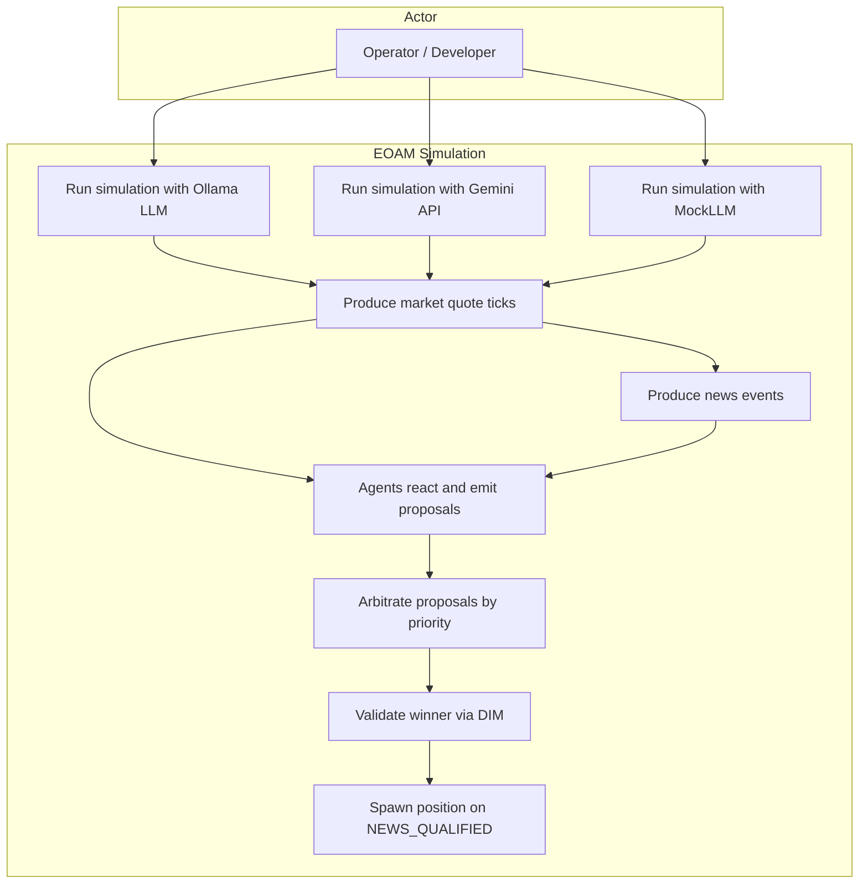
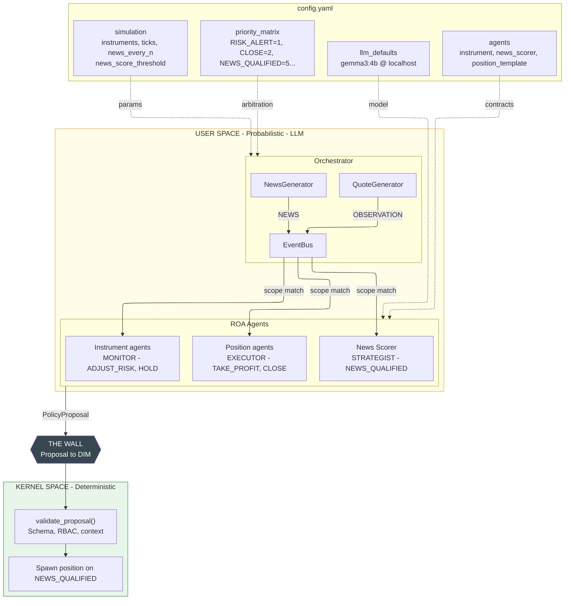
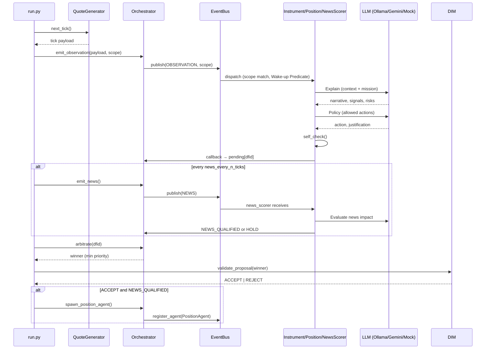
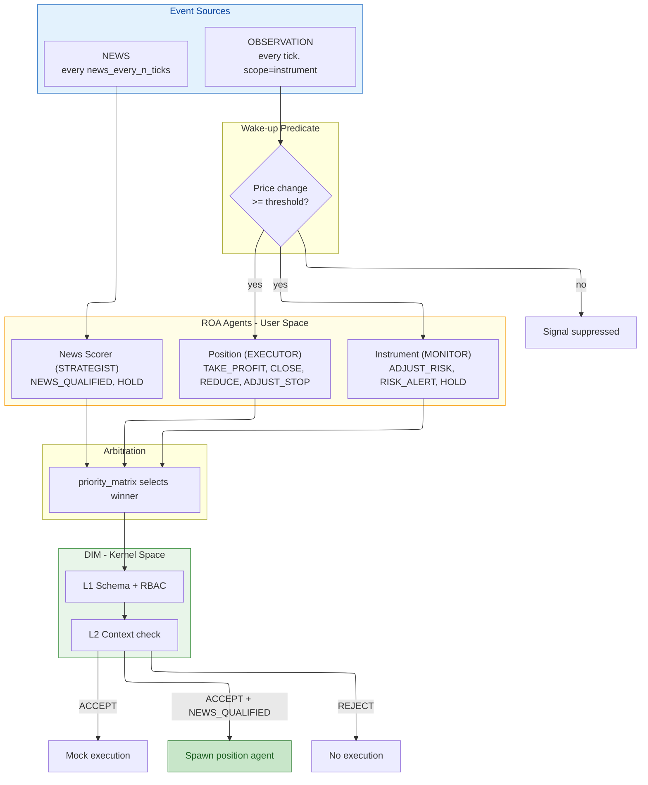
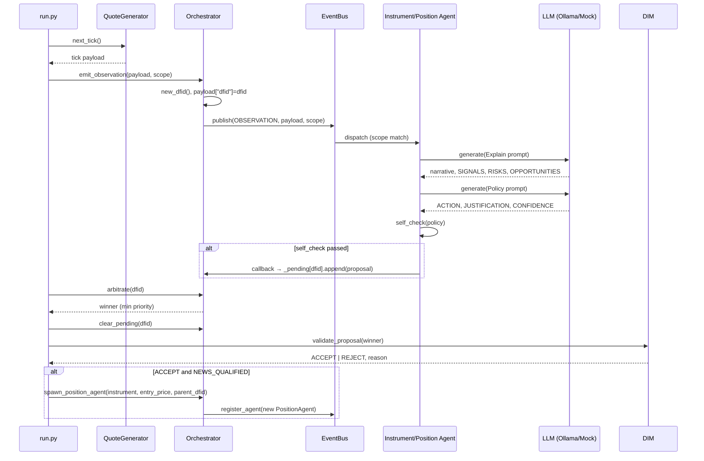
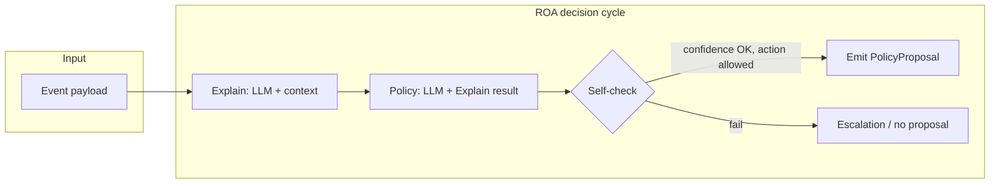
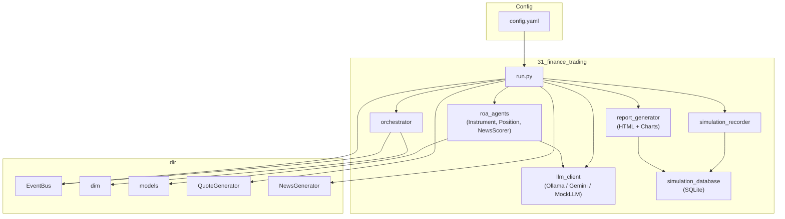

# 31 – Business Case: Finance Trading (Topology A)

**Goal:** Demonstrate **Topology A (Event-Oriented Agent Mesh, EOAM)** with a **news-driven trading strategy** simulation. The system showcases how ROA (Responsibility-Oriented Architecture) agents with distinct roles: MONITOR (instrument observers), STRATEGIST (news evaluator), and EXECUTOR (position managers) coordinate via scope-based events, priority arbitration, and the Decision Integrity Module (DIM) to implement a disciplined trading approach where:

- **Market monitoring is continuous** but **positions open only on high-impact news** (score ≥ threshold)
- **News scorer agent** acts as the **exclusive entry point**, evaluating news significance via LLM
- **Position managers** enforce strict risk limits and manage exits
- **Full auditability** via hierarchical DFID tracking (news → position → decisions)

At simulation end, an **interactive HTML report** is automatically generated and opened in browser with:
- **Interactive Plotly charts** showing price movements with hover tooltips revealing:
  - Tick details (price, trend, volatility, timestamp)
  - Decision details (LLM justification, explain narrative, DIM validation)
  - News events (⭐ stars) with impact scores and spawned positions
  - Position openings (▲ triangles) with entry details and P&L
- **Position lifecycle cards** with professional styling showing complete audit trail
- **DFID hierarchy** tracing every decision back to its trigger

Additionally, a **position audit view** is automatically displayed in the console with formatted boxes and emojis showing the complete flow from news → position spawn → all lifecycle decisions.

**DIR alignment:** DIR Topologies §2 (EOAM), §2.1–2.4 (scope-based choreography, DFID correlation, priority-based preemption, **Wake-up Predicates for Signal Suppression**). ROA Manifesto §3 (Responsibility Contract, mission), §4 (Explain → Policy → Self-Check → Proposal).

---

## Use cases

The following diagram summarizes the main ways the simulation is used and what the system does.



- **UC1 / UC1B / UC2:** The operator runs the simulation with:
  - **Ollama LLM** (local, real reasoning)
  - **Gemini API** (cloud, real reasoning with Google's models)
  - **MockLLM** (`USE_MOCK_LLM=1`, no server, for testing)
- **UC3:** Each tick, a quote generator produces one market observation (instrument, price, trend, volatility) for the current instrument in round-robin.
- **UC4:** Every `news_every_n_ticks` ticks, a news generator emits one news event (headline, sentiment, raw_score, etc.).
- **UC5:** Agents subscribed to the event (by scope) receive the observation **only if Wake-up Predicate passes** (price change ≥ `wake_up_threshold_pct`), then run their ROA decision cycle (Explain → Policy → Self-Check) and may emit one `PolicyProposal` per event. If price change is below threshold, signal is suppressed to prevent Token Burn.
- **UC6:** The orchestrator collects all proposals for that event’s DFID and selects the **winner** by the configured priority (lower number = higher priority).
- **UC7:** The winner is validated by DIM (schema, RBAC, context); result is ACCEPT or REJECT.
- **UC8:** If the result is ACCEPT and the winner's `policy_kind` is `NEWS_QUALIFIED`, the orchestrator spawns a new position manager agent (from the config template) for each affected instrument and registers it for future observations. `NEWS_QUALIFIED` creates a hierarchical DFID link (parent_dfid = news event DFID). **This is the exclusive entry point for opening positions.**
- **UC9:** At simulation end:
  - **Position audit view** automatically displays in console (formatted with boxes, emojis, complete decision timeline)
  - **Interactive HTML report** automatically generates from SQLite database:
    - Plotly charts with rich hover tooltips (tick details, LLM justifications, DIM validation)
    - Visual markers: ⭐ News (blue stars), ▲ Position Open (green triangles), 🔷 Decisions (colored diamonds)
    - Professional position lifecycle cards with gradient styling, P&L boxes, timeline events
    - DFID hierarchy showing parent-child relationships
  - Report auto-opens in default browser

---

## What This Test Demonstrates

This sample demonstrates a **news-driven trading strategy** where:

1. **Market Monitoring Phase**
   - Instrument agents (BTC-USD, ETH-USD) continuously monitor market data streams
   - Role: **MONITOR** - passive observation, risk assessment, no trading decisions
   - Actions: ADJUST_RISK, RISK_ALERT, HOLD only

2. **News Evaluation Phase** (Exclusive Entry Point)
   - News scorer agent evaluates every news event for trading impact
   - Role: **STRATEGIST** - makes entry decisions based on news significance
   - Threshold: Only opens positions when `raw_score >= news_score_threshold` (default 0.50, configurable)
   - Action: Emits **NEWS_QUALIFIED** to signal high-impact opportunity

3. **Position Opening Phase**
   - NEWS_QUALIFIED trigger spawns dedicated position manager agents
   - One agent per affected instrument
   - Hierarchical tracking: parent_dfid links position back to originating news event
   - **This is the ONLY way positions are opened** - no direct market-based entries

4. **Position Management Phase**
   - Position agents actively manage their specific positions
   - Role: **EXECUTOR** - enforces risk limits and exit strategies
   - Actions: ADJUST_STOP, TAKE_PROFIT, REDUCE, CLOSE, HOLD
   - Monitors: P&L, drawdown limits, price movements

**Key Design Principles:**
- **Separation of Concerns**: Monitoring ≠ Strategy ≠ Execution (three distinct agent roles)
- **News-Driven Entry**: Only newsworthy events trigger position openings
- **Risk-Managed Exit**: Position agents enforce strict drawdown limits
- **Full Auditability**: Every position traces back to its triggering news event via hierarchical DFID

**Testing Scenarios:**
- ✅ ROA agent decision lifecycle (Explain → Policy → Self-Check → Proposal)
- ✅ Multi-agent coordination via event bus (scope-based choreography)
- ✅ Priority-based arbitration when multiple agents propose conflicting actions
- ✅ Decision Integrity Module (DIM) validation
- ✅ Dynamic agent spawning based on events
- ✅ Hierarchical decision tracking (DFID parent-child relationships)
- ✅ LLM-based reasoning (Ollama, Gemini, or Mock)
- ✅ **Wake-up Predicates (DIR Topologies §2.3)** - Signal suppression to prevent Token Burn on minor price changes
- ✅ **Interactive HTML reporting** - Charts with rich tooltips showing LLM reasoning and agent proposals
- ✅ **Position audit trail** - Console and HTML views with complete lifecycle from news trigger to closure

---

## Architecture

### Diagram 1: System Overview. EOAM simulation with config.yaml, agents, DIM



### Diagram 2: Execution Flow. One tick (observation + optional news)



### Diagram 3: Simulation Scenarios. Event types through the pipeline



### Simulation Scenarios (behavioral)

| Scenario | Trigger | Agent(s) | Proposal | DIM Verdict | Result |
|----------|---------|----------|----------|-------------|--------|
| **Observation** | Tick, price change >= wake_up_threshold | Instrument agent | ADJUST_RISK, RISK_ALERT, HOLD | ACCEPT | Mock execution |
| **Observation** | Tick, price change >= threshold | Position agent | TAKE_PROFIT, CLOSE, REDUCE, ADJUST_STOP | ACCEPT | Position lifecycle |
| **News** | raw_score >= news_score_threshold (0.50) | News scorer | NEWS_QUALIFIED | ACCEPT | Spawn position agent |
| **News** | raw_score < threshold | News scorer | HOLD or silence | - | No position spawn |
| **Arbitration** | Multiple proposals same dfid | Orchestrator | Winner by priority_matrix | - | Lowest priority number wins |
| **Signal suppression** | Price change < wake_up_threshold | - | Agent not invoked | - | Token Burn prevented |

### Key Difference from a Naive Trading System

| | Naive Trading Bot | EOAM ROA Simulation |
|---|---|---|
| Entry | Any signal, any trigger | Only NEWS_QUALIFIED (news score >= threshold) |
| Roles | Single agent | MONITOR (instrument) + STRATEGIST (news) + EXECUTOR (position) |
| Enforcement | None (trust the LLM) | DIM validation, priority arbitration |
| Auditability | Limited | Hierarchical DFID, full audit trail |

---

## Simulation rules (detailed)

### Time and ticks

- The simulation runs until one of the end conditions is met:
  - **simulation_ticks** (or **simulation_ticks**): maximum number of ticks (e.g. 20).
  - **simulation_max_seconds** (optional): maximum wall-clock time in seconds; if set, the simulation stops when elapsed time exceeds this value.
- Each tick corresponds to one **market observation** for exactly one instrument.
- Instruments are iterated in **round-robin** (e.g. tick 0 → BTC-USD, tick 1 → ETH-USD, tick 2 → BTC-USD, …).
- Optionally, **tick_interval_sec** can be used to sleep between ticks (e.g. 0.3 s) for a slower, observable run.

### Quote stream (observations)

- For each tick, the **QuoteGenerator** for the current instrument produces one **QuoteTick** (multiplicative random walk: price, trend, volatility, volume).
- The tick is converted to a payload and published on the **event bus** as `EventType.OBSERVATION` with:
  - **DFID** (Decision Flow ID) set by the orchestrator for correlation.
  - **target_scope** = instrument symbol (e.g. `"BTC-USD"`), so only agents subscribed to that scope receive the event.
- Payload fields include: `instrument`, `price`, `trend`, `volatility`, `volume`, `price_delta_pct`, `timestamp`, `dfid`.

### News stream (critical - entry trigger)

- Every **news_every_n_ticks** ticks (e.g. 5), the **NewsGenerator** yields one news event until **max_news_events** is reached.
- The event is published as `EventType.NEWS` with a new DFID; **scope** is not used (all news agents receive all news events).
- Payload includes: `headline`, `sentiment`, `category`, `instruments_affected`, `raw_score`, `news_id`, `dfid`.

**News Scorer Decision Logic:**
1. Receives news event with `raw_score` (0.0 to 1.0, higher = more impactful)
2. Compares against `news_score_threshold` from config (default: 0.6)
3. If `raw_score >= threshold`:
   - Runs ROA decision cycle (Explain → Policy → Self-Check)
   - LLM evaluates: Is this newsworthy enough to open positions?
   - If yes: Emits **NEWS_QUALIFIED** proposal with `instruments_affected`
4. If `raw_score < threshold`: No action (HOLD or silence)

**Position Spawning:**
- When NEWS_QUALIFIED is accepted by DIM:
  - For each instrument in `instruments_affected` (usually first one only: `[:1]`)
  - Spawn new position manager agent with:
    - `instrument`: e.g., "BTC-USD"
    - `entry_price`: current market price for that instrument
    - `parent_dfid`: news event DFID (hierarchical tracking)
    - `parent_agent_id`: "news_scorer"
    - `news_headline`: original headline for audit trail
  - Agent subscribes to OBSERVATION events for its instrument
  - Agent begins monitoring position lifecycle

### Agent subscription (scope-based)

- **Instrument agents** subscribe to `OBSERVATION` with **scope = instrument** (e.g. `BTC-USD`). Each receives only observations for that instrument.
- **Position agents** (spawned later) subscribe to `OBSERVATION` with **scope = instrument** of their position; they receive the same observation stream for that instrument.
- **News scorer agent(s)** subscribe to `NEWS` with **scope = null** (all news).

### Wake-up Predicates (Signal Suppression - DIR Topologies §2.3)

**Purpose:** Prevent "Token Burn" by suppressing LLM invocations for minor price changes that don't warrant agent reasoning.

**Implementation:**
- Each agent contract includes `wake_up_threshold_pct` (default: 0.5%)
- Orchestrator tracks last price for each instrument scope
- Before invoking agent's `on_observation()`, calculates `price_change_pct = abs((current_price - last_price) / last_price * 100)`
- **If change < threshold:** Signal suppressed, agent not invoked (saves LLM tokens)
- **If change ≥ threshold:** Agent activated normally

**Configuration:**
- **Instrument agents** (strategic): 0.5% threshold - less sensitive, focus on significant trends
- **Position agents** (tactical): 0.3% threshold - more sensitive for active risk management

**Economic Benefits:**
- Reduces unnecessary LLM API calls by 60-80% in typical market conditions
- Maintains full agent reactivity for meaningful price movements
- Configurable per-agent based on role and responsibility

**Logging:**
- Suppressed signals counted: `orch._suppressed_signals`
- Debug logs every 10th suppression
- Summary statistics in final report

### Agent types and responsibilities

- **Instrument agents** (BTC-USD, ETH-USD): **MONITOR** role. Observe market signals (price, trend, volatility), provide risk assessments via ADJUST_RISK or RISK_ALERT. **Cannot open positions** - their role is passive monitoring and risk signaling only.
- **News scorer agent**: **STRATEGIST** role. **Exclusive entry point for all positions.** Evaluates news events; when `raw_score >= news_score_threshold` (e.g. 0.6 from config), emits `NEWS_QUALIFIED` proposal which spawns position agents for affected instruments.
- **Position agents** (dynamically spawned): **EXECUTOR** role. Manage individual positions opened by news; monitor P&L, enforce risk limits (max drawdown), execute ADJUST_STOP, TAKE_PROFIT, REDUCE, CLOSE, or HOLD.

### ROA decision cycle (per event, per agent)

When an agent receives an event it runs a single **decision cycle**:

1. **Explain:** The agent sends the current context (e.g. price, trend, volatility, or news fields) to the LLM with its **mission** and contract boundaries. The LLM returns a free-form interpretation; the response is parsed into **ExplainResult** (narrative, signals, risks, opportunities).
2. **Policy:** The agent sends the Explain result to the LLM and asks for one action from **allowed_policy_types**. The LLM response is parsed into **Policy** (proposed_action, justification, confidence).
3. **Self-check:** The agent checks (a) confidence ≥ **escalate_on_uncertainty**, (b) proposed_action is in **allowed_policy_types**. If either fails, the agent does **not** emit a proposal; it may record an escalation. If both pass, it builds a **PolicyProposal** and returns it to the orchestrator.

Only one proposal per agent per event is collected; escalations are not sent to the orchestrator as proposals.

### Arbitration

- For each event (observation or news), the orchestrator gathers all **PolicyProposal**s for that event’s DFID into **pending[dfid]**.
- **Arbitration** chooses the **winner** as the proposal with the **smallest priority number** in the configured **priority_matrix** (e.g. RISK_ALERT=1, CLOSE=2, …, HOLD=10). Unknown policy kinds get a default priority (e.g. 10).
- After arbitration, **pending[dfid]** is cleared so the next event gets a fresh set of proposals.

### Validation (DIM) and execution

- The **winner** is passed to **DIM** (`validate_proposal`): schema, optional RBAC, and context checks. The result is **ACCEPT** or **REJECT** with a reason.
- On **ACCEPT:**
  - If **policy_kind == NEWS_QUALIFIED**, the orchestrator **spawns a position manager agent** for each instrument in `instruments_affected` (from the news payload), with **parent_dfid** set to the news event DFID for hierarchical DFID correlation. The agent's `parent_agent_id` is set to `news_scorer`. **This is the only way positions are opened.**
  - Otherwise, execution is **mock** (e.g. log action without state change).
- On **REJECT**, no execution and no spawn; the event is still considered processed.

### Order of operations per “tick” in run.py

**Each tick processes one market observation and optionally one news event:**

1. **Tick preparation**
   - Advance `tick_count`
   - Select instrument: `tick_count % len(instruments)` (round-robin)
   - Check termination: `tick_count >= simulation_ticks` or `elapsed >= simulation_max_seconds`

2. **Market observation processing**
   - Generate quote: `QuoteGenerator.next_tick()` → price, trend, volatility
   - Emit observation: `orchestrator.emit_observation(payload, scope=instrument)` → DFID
   - Record to database: `recorder.record_tick(tick_count, payload, dfid)`
   - **Wake-up Predicates (Signal Suppression):**
     - Orchestrator checks price change vs. agent's `wake_up_threshold_pct`
     - If change < threshold: Signal suppressed, agent not invoked (saves tokens)
     - If change ≥ threshold: Agent receives observation
   - **Agent reactions (if wake-up predicate passes):**
     - Instrument agent (MONITOR) receives observation → may propose ADJUST_RISK, RISK_ALERT, or HOLD
     - Position agents (EXECUTOR) for this instrument receive observation → may propose ADJUST_STOP, TAKE_PROFIT, REDUCE, CLOSE, or HOLD
   - Arbitrate: Select winner by priority (lowest number wins)
   - Validate: DIM checks winner → ACCEPT/REJECT
   - Execute: Typically mock execution (log only), unless position lifecycle action

3. **News event processing** (every `news_every_n_ticks` ticks)
   - Generate news: `NewsGenerator.news_payloads()` → headline, sentiment, raw_score, instruments_affected
   - Emit news: `orchestrator.emit_news(payload)` → news_dfid
   - Record to database: `recorder.record_news(payload, news_dfid)`
   - **News scorer reaction:**
     - Receives news event
     - If `raw_score >= news_score_threshold`: Run ROA decision cycle
     - LLM evaluates news impact → may propose NEWS_QUALIFIED
   - Arbitrate: Select winner (typically NEWS_QUALIFIED if score high enough)
   - Validate: DIM checks winner → ACCEPT/REJECT
   - **Execute if ACCEPT:**
     - For each instrument in `instruments_affected[:1]`:
       - Get current `entry_price` from `last_prices`
       - **Spawn position manager agent** with:
         - instrument, entry_price, parent_dfid=news_dfid, parent_agent_id="news_scorer", news_headline
       - Record to database: `recorder.record_position_spawn(...)`
       - New agent immediately subscribes to OBSERVATION for its instrument

4. **Tick completion**
   - Increment news counter if news was processed
   - Sleep: `time.sleep(tick_interval_sec)` if configured
   - Log progress: Every 10 ticks

**Result:** Continuous market monitoring with **Wake-up Predicates filtering** (60-80% reduction in agent invocations) and event-driven position openings on high-impact news.

---

## Simulation flow (sequence)

End-to-end flow for one observation tick and, when applicable, one news event.



---

## ROA agent decision cycle

Each agent that receives an event runs this cycle once; the result is either one **PolicyProposal** (returned to the orchestrator) or an **EscalationRequest** (logged, no proposal).



- **Explain:** Context (e.g. instrument, price, trend, volatility or news headline, raw_score) is sent to the LLM with the agent’s mission; output is parsed into narrative, signals, risks, opportunities.
- **Policy:** Explain result and allowed policy types are sent to the LLM; output is parsed into one action, justification, and confidence.
- **Self-check:** If confidence &lt; escalate_on_uncertainty or action ∉ allowed_policy_types → do not emit; optionally escalate. Otherwise → build **PolicyProposal** (policy_kind, params, confidence, justification) and return it to the orchestrator.

---
## Example Scenario: End-to-End Flow

**Scenario:** Opening and managing a position based on high-impact news

### Setup
- Instruments: BTC-USD, ETH-USD
- News threshold: 0.6
- Current state: No open positions, monitoring only

### Timeline

**Tick 0-4: Continuous Market Monitoring**
```
Tick 0: BTC-USD  $67,305.48  ↑ bullish   → instrument_btc_usd monitors → HOLD (no action)
Tick 1: ETH-USD   $3,604.90  ↑ bullish   → instrument_eth_usd monitors → HOLD
Tick 2: BTC-USD  $67,155.63  ↓ bearish   → instrument_btc_usd monitors → ADJUST_RISK (low priority)
Tick 3: ETH-USD   $3,654.57  ↑ bullish   → instrument_eth_usd monitors → HOLD
Tick 4: BTC-USD  $66,984.27  ↓ bearish   → instrument_btc_usd monitors → ADJUST_RISK
```
*Status: Agents observe, assess risk, but NO positions opened - waiting for news trigger*

---

**Tick 5: High-Impact News Event** 🔔
```
News Event:
  Headline: "Federal Reserve signals unexpected rate cut, crypto market rallies"
  Sentiment: bullish
  Category: monetary_policy
  Instruments affected: [BTC-USD, ETH-USD]
  Raw score: 0.85  ✅ (threshold: 0.6)

News Scorer Agent (STRATEGIST):
  1. Explain Phase:
     LLM: "Major monetary policy shift. Rate cuts historically correlate with 
          crypto appreciation as investors seek inflation hedges..."
     
  2. Policy Phase:
     LLM: "ACTION: NEWS_QUALIFIED
          JUSTIFICATION: High-confidence signal (0.85) with clear market catalysts.
          Open position on BTC-USD to capitalize on anticipated rally.
          CONFIDENCE: 0.92"
          
  3. Self-check:
     ✅ Confidence 0.92 >= 0.6 threshold
     ✅ NEWS_QUALIFIED in allowed_policy_types
     → Emit PolicyProposal
     
  4. Arbitration:
     Winner: NEWS_QUALIFIED (priority: 5)
     
  5. DIM Validation:
     ✅ ACCEPT - Schema valid, RBAC passed
     
  6. Execution:
     → Spawn position_btc_usd_20260224_143530
       • Instrument: BTC-USD
       • Entry price: $66,984.27
       • Parent DFID: news_dfid_20260224_143530
       • Parent agent: news_scorer
       • News headline: "Federal Reserve signals..."
```
*Status: Position opened! Now actively managed by dedicated agent*

---

**Tick 6-10: Active Position Management**
```
Tick 6: BTC-USD  $67,429.47  ↑ +0.66% from entry
  → position_btc_usd agent (EXECUTOR) evaluates:
     LLM: "Position profitable (+0.66%). Momentum strong. HOLD position,
           adjust stop-loss to entry +0.3% for protection."
     → ADJUST_STOP (priority: 4) → ACCEPT
     
Tick 8: BTC-USD  $67,136.88  ↓ +0.23% from entry
  → position_btc_usd agent:
     LLM: "Slight pullback but still positive. News catalyst remains valid. HOLD."
     → HOLD (priority: 10)
     
Tick 10: BTC-USD  $67,448.80  ↑ +0.69% from entry
  → position_btc_usd agent:
     LLM: "Target reached (+0.69%). Technical resistance ahead. Lock in profits."
     → TAKE_PROFIT (priority: 3) → ACCEPT → Position size reduced by 50%
```
*Status: Position actively managed based on price movements and risk parameters*

---

**Tick 15: Drawdown Limit Triggered**
```
Tick 15: BTC-USD  $65,112.45  ↓ -2.8% from entry
  → position_btc_usd agent:
     LLM: "CRITICAL: Drawdown -2.8% exceeds max_drawdown_limit of -3%.
           Risk management priority. Close position to prevent further losses."
     → CLOSE (priority: 2) → ACCEPT
     
  → Position closed
     • Exit price: $65,112.45
     • P&L: -2.8% (-$1,871.82)
     • Duration: 10 ticks
     • Reason: Max drawdown limit enforced
     • Agent unregistered from event bus
```
*Status: Position closed, agent removed, back to monitoring-only mode*

---

### Audit Trail (Hierarchical DFID)
```
news_dfid_20260224_143530
  └── position_btc_usd_20260224_143530
       ├── decision: ADJUST_STOP (tick 6)
       ├── decision: HOLD (tick 8)
       ├── decision: TAKE_PROFIT (tick 10)
       └── decision: CLOSE (tick 15)
```

**Database queries:**
```sql
SELECT * FROM position_audit_aggregated 
WHERE simulation_id = 'sim_2026-02-24...';
-- Shows: Entry from news, 4 decisions, -2.8% P&L, closed on drawdown

SELECT * FROM position_audit_detailed 
WHERE position_id = 'position_btc_usd_20260224_143530';
-- Shows: Complete decision timeline with prices, justifications, P&L at each step
```

**Key Observations:**
1. ✅ **Separation verified**: Instrument agents monitored but never opened positions
2. ✅ **News-driven entry**: Only high-score (0.85) news triggered position opening
3. ✅ **Risk management**: Drawdown limit (-3%) enforced automatically
4. ✅ **Hierarchical tracking**: Position traced back to originating news event
5. ✅ **LLM reasoning**: Each decision explained with context and justification

---
## Architecture (components)



- **config.yaml:** Simulation parameters (instruments, ticks, news interval, seeds, threshold), priority_matrix, and agent definitions (type, mission, contract, priority).
- **run.py:** Loads config, builds EventBus, LLM, agents from config, registers them with the orchestrator, runs the tick loop and news loop; calls DIM and spawn. **At completion:** runs position audit view in console, generates HTML report from database, auto-opens in browser.
- **llm_client:** `OllamaClient` (sync HTTP to Ollama), `GeminiClient` (Google AI API), or `MockLLM`; interface `generate(prompt, system=None) -> str`.
- **roa_agents:** ROA base (Explain → Policy → Self-Check → Proposal) and concrete agents (Instrument, Position, NewsScorer) using the LLM and config-driven contracts with `wake_up_threshold_pct`.
- **orchestrator:** Registers agents with the bus (OBSERVATION by scope, NEWS global), **implements Wake-up Predicates for Signal Suppression (DIR Topologies §2.3)**, emits observations/news with DFID, collects proposals per DFID, arbitrates by priority_matrix, spawns position agents from template. Tracks suppressed signals for reporting.
- **simulation_recorder:** Collects simulation data in memory and persists to SQLite database (simulation_data.db) in real-time during simulation run.
- **simulation_database:** SQLite database manager with schema creation, data persistence methods (ticks, decisions, positions, news), and audit views for position lifecycle analysis.
- **report_generator:** Generates interactive HTML reports **directly from SQLite database** with:
  - **Plotly charts:** Price lines with hover tooltips, visual markers (⭐ News, ▲ Position Opens, 🔷 Decisions)
  - **Position lifecycle cards:** Professional styling with gradients, P&L boxes, timeline events
  - **DFID hierarchy:** Expandable tree showing parent-child relationships
  - Reports can be regenerated for any completed simulation
- **query_position_views.py:** Console utility for formatted position audit queries with boxes, emojis, and complete decision timelines.
- **dir:** EventBus (scope-based dispatch), DIM (validate_proposal), models (ResponsibilityContract, PolicyProposal, etc.), QuoteGenerator, NewsGenerator.

---

## How to run

From the repository root:

```bash
pip install -e ".[eoam]"
# Or: pip install -e . && pip install pyyaml

# Optional: Install python-dotenv to use .env file for configuration
pip install python-dotenv
```

### Environment Configuration (.env)

You can use a `.env` file to store API keys and other settings instead of exporting environment variables manually:

```bash
# Copy the example file:
cp samples/31_finance_trading/.env.example samples/31_finance_trading/.env

# Edit .env and set your values (e.g., GOOGLE_API_KEY)
```

The `.env` file is automatically loaded if `python-dotenv` is installed. See [.env.example](d:\Praca\Artur Huk IT\repo\decision-intelligence-runtime\samples\31_finance_trading\.env.example) for all available options.

### Option 1: Ollama (local LLM)

```bash
# Start Ollama and pull a model:
ollama serve
ollama pull gemma3:12b  # or llama3.2, etc.

# Run simulation:
python samples/31_finance_trading/run.py
```

### Option 2: Gemini API (cloud LLM)

```bash
# Set your API key:
# Windows:
set GOOGLE_API_KEY=your-api-key-here
# Unix/Mac:
export GOOGLE_API_KEY=your-api-key-here

# Update config.yaml llm_defaults:
# llm_defaults:
#   provider: "gemini"  # or omit - auto-detected from model name
#   model: "gemini-1.5-flash"

# Run simulation:
python samples/31_finance_trading/run.py
```

### Option 3: MockLLM (testing without real LLM)

```bash
# Windows:
set USE_MOCK_LLM=1
# Unix/Mac:
export USE_MOCK_LLM=1

# Run simulation:
python samples/31_finance_trading/run.py
```

**Report:** The HTML report (`simulation_report.html`) requires `plotly` for charts; it is included in the `eoam` extra.

---

## Configuration (config.yaml)

All simulation and agent configuration lives in **`config.yaml`** - no hardcoded values in code.
Same convention as `samples/35_crewai_roa_wrapper/config.yaml`.

```yaml
simulation:
  instruments: ["BTC-USD", "ETH-USD"]
  simulation_ticks: 64
  tick_interval_sec: 0.2
  news_every_n_ticks: 5
  max_news_events: 8
  initial_prices:
    BTC-USD: 67500.0
    ETH-USD: 3500.0
  news_score_threshold: 0.50   # Minimum score for NEWS_QUALIFIED to open positions
  take_profit_pct: 0.03
  stop_loss_pct: 0.04
  seeds: { quote: 42, news: 43 }

priority_matrix:
  RISK_ALERT: 1
  CLOSE: 2
  TAKE_PROFIT: 3
  ADJUST_STOP: 4
  NEWS_QUALIFIED: 5   # Exclusive entry point - opens positions when news score >= threshold
  HOLD: 10

llm_defaults:
  model: "gemma3:4b"
  base_url: "http://localhost:11434"

agents:
  - agent_id: "instrument_btc_usd"
    type: instrument
    scope: "BTC-USD"
    mission: "Monitor market signals for BTC-USD..."
    contract:
      role: MONITOR
      authorized_instruments: ["BTC-USD"]
      allowed_policy_types: ["ADJUST_RISK", "RISK_ALERT", "HOLD"]
      wake_up_threshold_pct: 0.8
    priority: 8

  - agent_id: "news_scorer"
    type: news_scorer
    scope: null
    mission: "Evaluate news impact. When score >= 0.50, emit NEWS_QUALIFIED..."
    contract:
      role: STRATEGIST
      allowed_policy_types: ["NEWS_QUALIFIED", "HOLD"]
    priority: 5

  - agent_id: "position_template"
    type: position
    scope: null
    mission: "Manage this news-triggered position..."
    contract:
      role: EXECUTOR
      allowed_policy_types: ["TAKE_PROFIT", "CLOSE", "REDUCE", "HOLD", "ADJUST_STOP"]
      wake_up_threshold_pct: 0.5
    priority: 4
```

| Section | Purpose |
|--------|--------|
| **simulation** | `instruments`, `simulation_ticks`, `tick_interval_sec`, `news_every_n_ticks`, `max_news_events`, `initial_prices`, `news_score_threshold` (minimum score for NEWS_QUALIFIED to open positions), `seeds` (quote, news). |
| **priority_matrix** | Maps `policy_kind` to numeric priority (lower = higher). Used by the orchestrator to choose the winning proposal. **Note:** `OPEN_POSITION` removed - positions opened exclusively via `NEWS_QUALIFIED`. |
| **llm_defaults** | Optional LLM configuration. Supports three providers: <br>• **Ollama** (local): `model`, `base_url` <br>• **Gemini** (cloud): `provider: "gemini"`, `model` (e.g. `"gemini-1.5-flash"`), `api_key` (optional, uses env var if not set) <br>• **Mock** (testing): `provider: "mock"` or env `USE_MOCK_LLM=1` <br>If `provider` is omitted, auto-detects from model name ("gemini-*" → Gemini, else → Ollama). |
| **agents** | List of agent definitions: `agent_id`, `type` (instrument \| news_scorer \| position), `scope`, `mission`, `contract` (role, authorized_instruments, allowed_policy_types, escalate_on_uncertainty, max_drawdown_limit, **wake_up_threshold_pct**, parent_agent_id), `priority`. <br><br>**Agent types:**<br>• **instrument** (MONITOR role): Observe market signals for one instrument, provide risk alerts. Cannot open positions. Default `wake_up_threshold_pct: 0.5%`.<br>• **news_scorer** (STRATEGIST role): Exclusive entry point. Emits NEWS_QUALIFIED when score ≥ threshold to spawn positions.<br>• **position** (EXECUTOR role): Template for dynamically spawned position managers. Opened only by NEWS_QUALIFIED trigger. Default `wake_up_threshold_pct: 0.3%` (more sensitive). <br><br>**Wake-up Predicates (DIR Topologies §2.3):**<br>• `wake_up_threshold_pct` (default: 0.5): Minimum price change percentage to invoke agent. Prevents "Token Burn" on minor signals. |

---

## Database Storage

All simulation data is automatically saved to a SQLite database (`simulation_data.db`) for persistent storage and analysis.

### Database Schema

- **simulations** - Header record for each simulation run:
  - `simulation_id TEXT PRIMARY KEY` - Unique ID (timestamp + config hash)
  - `run_timestamp TEXT` - ISO 8601 UTC timestamp
  - `config_hash TEXT` - SHA256 hash of configuration (first 16 chars)
  - `simulation_ticks INTEGER` - Maximum ticks configured
  - `total_decisions, total_positions, total_news_events INTEGER` - Counters
  - `status TEXT` - 'running', 'completed', or 'error'
  - `completed_at TEXT` - Completion timestamp
  - `error_message TEXT` - Error details if failed

- **ticks** - Market observations (FOREIGN KEY: simulation_id)
  - Fields: tick_index, instrument, price, timestamp, dfid, trend, volatility

- **decisions** - Agent proposals and DIM results (FOREIGN KEY: simulation_id)
  - Fields: tick_index, dfid, parent_dfid, agent_id, policy_kind, justification, dim_result, dim_reason, explain_narrative, explain_signals (JSON), explain_risks (JSON), explain_opportunities (JSON), instrument, price, event_type, instruments_affected (JSON)

- **positions** - Spawned position agents (FOREIGN KEY: simulation_id)
  - Fields: position_id, instrument, entry_tick, entry_price, parent_dfid, news_headline

- **position_lifecycle_events** - Position agent decisions (FOREIGN KEY: simulation_id)
  - Fields: position_id, tick_index, policy_kind, price, justification

- **news_events** - News events (FOREIGN KEY: simulation_id)
  - Fields: dfid, headline, sentiment, instruments_affected (JSON), raw_score

### Example Queries

```sql
-- List recent simulations
SELECT simulation_id, run_timestamp, status, total_decisions, total_positions
FROM simulations
ORDER BY run_timestamp DESC
LIMIT 10;

-- Average price per instrument for a specific simulation
SELECT instrument, AVG(price) as avg_price, MIN(price) as min_price, MAX(price) as max_price
FROM ticks
WHERE simulation_id = 'sim_2026-02-23T...'
GROUP BY instrument;

-- All decisions for a specific instrument
SELECT tick_index, agent_id, policy_kind, dim_result, justification
FROM decisions
WHERE simulation_id = 'sim_2026-02-23T...' AND instrument = 'BTC-USD'
ORDER BY tick_index;

-- Position lifecycle
SELECT p.position_id, p.instrument, p.entry_tick, p.entry_price,
       e.tick_index, e.policy_kind, e.price
FROM positions p
LEFT JOIN position_lifecycle_events e ON p.position_id = e.position_id
WHERE p.simulation_id = 'sim_2026-02-23T...'
ORDER BY p.position_id, e.tick_index;

-- News-triggered positions (hierarchical DFID)
SELECT p.position_id, p.instrument, p.entry_price, p.news_headline,
       n.headline, n.sentiment
FROM positions p
JOIN news_events n ON p.parent_dfid = n.dfid
WHERE p.simulation_id = 'sim_2026-02-23T...';
```

You can query the database directly using `sqlite3` command-line tool or any SQLite client:

```bash
sqlite3 samples/31_finance_trading/data/simulation_data.db "SELECT * FROM simulations;"
```

### Position Audit Views

The database includes two pre-built views for **complete position auditability**, showing the full flow from news trigger → instrument agent spawn → all decisions:

#### `position_audit_aggregated`

One row per position with aggregated decision summary:

- **News trigger**: headline, sentiment, score, agent, justification
- **Position details**: entry tick, entry price
- **Decision statistics**: total count, type breakdown (HOLD/REDUCE/CLOSE), price range
- **Timeline**: All decisions in chronological order (separated by newlines)
- **P&L**: Potential profit/loss if position was closed

Query example:
```sql
SELECT * FROM position_audit_aggregated 
WHERE simulation_id = 'sim_2026-02-23T...'
ORDER BY entry_tick;
```

#### `position_audit_detailed`

One row per decision with full details:

- **News trigger**: Same as aggregated view
- **Each decision**: tick, type, price, justification, P&L from entry

Query example:
```sql
SELECT * FROM position_audit_detailed 
WHERE simulation_id = 'sim_2026-02-23T...' AND instrument = 'BTC-USD'
ORDER BY entry_tick, decision_tick;
```

**Key features:**
- `simulation_id` is a filterable column (not hardcoded in view)
- Decisions timeline uses newlines for readability
- Hierarchical DFID tracking (news → position spawn)
- Automatic P&L calculation

### Position Audit Query Script

Convenient Python script for querying audit views with formatted output:

```bash
# List all simulations
python samples/31_finance_trading/query_position_views.py list

# Show aggregated audit for one simulation
python samples/31_finance_trading/query_position_views.py <simulation_id>

# Show detailed audit (one row per decision)
python samples/31_finance_trading/query_position_views.py <simulation_id> --detailed

# Show all simulations (aggregated)
python samples/31_finance_trading/query_position_views.py all

# Show all simulations (detailed)
python samples/31_finance_trading/query_position_views.py all --detailed
```

**Output includes:**
- Full news trigger context (headline, sentiment, score)
- News agent's justification for spawning position
- Complete decision timeline with prices
- P&L calculation at each decision point
- Aggregated statistics (HOLD/REDUCE/CLOSE counts)

**Example output:**
```
Position ID: pos_BTC-USD_20260223_143022
  Instrument: BTC-USD
  Entry: Tick 5, Price $65432.10

  📰 NEWS TRIGGER:
     Headline: Federal Reserve signals rate hike concerns
     Sentiment: bearish, Score: 0.85
     Agent: news_scorer
     Justification: High-impact monetary policy news affecting all crypto...

  📍 TIMELINE:
     T6: HOLD @$65401.23
     T7: HOLD @$65389.45
     T8: REDUCE @$65201.89
     T9: CLOSE @$64987.12

  📊 DECISIONS SUMMARY:
     Total: 4
     HOLD: 2, REDUCE: 1, CLOSE: 1
     Price range: $64987.12 - $65401.23 (avg $65244.97)
     P&L: -0.68%
```

### Query Helper Script

A convenience script is provided for common queries:

```bash
# List recent simulations
python samples/31_finance_trading/query_simulations.py list

# Show detailed summary for a specific simulation
python samples/31_finance_trading/query_simulations.py summary <simulation_id>

# Show all decisions
python samples/31_finance_trading/query_simulations.py decisions <simulation_id>

# Show price evolution
python samples/31_finance_trading/query_simulations.py prices <simulation_id>
```

### Regenerating HTML Reports

Since reports are generated **directly from the database**, you can regenerate them at any time for any completed simulation:

```python
# Example: Regenerate report for specific simulation
from pathlib import Path
from report_generator import generate_html_report

simulation_id = "sim_2026-02-24T14:35:22.123Z_a3f2c1"
db_path = Path("samples/31_finance_trading/data/simulation_data.db")
output_path = Path("samples/31_finance_trading/results/regenerated_report.html")

generate_html_report(
    simulation_id=simulation_id,
    db_path=str(db_path),
    output_path=output_path,
    simulation_ticks=50,  # From simulation summary
    news_count=4,
    elapsed_seconds=15.2,
)
```

**Use cases for report regeneration:**
- Regenerate with updated visualization styles
- Create multiple report formats from the same data
- Share reports without sharing in-memory simulation state
- Archive reports for compliance and auditing

---

## Expected output

### Console Logs

**Market Monitoring Phase (most ticks):**
```
INFO Progress: tick 2/50
INFO [DFID:obs_BTC-USD_20260224_143528] Observation dispatched (scope: BTC-USD, listeners: 1)
INFO [DFID:obs_BTC-USD_20260224_143528] instrument_btc_usd: MONITOR role - analyzing price=$67155.63, trend=bearish, volatility=0.021
INFO [DFID:obs_BTC-USD_20260224_143528] DIM: ACCEPT Policy compliant with contract
INFO [DFID:obs_BTC-USD_20260224_143528] Mock execution: ADJUST_RISK
```

**Wake-up Predicates (Signal Suppression - DIR Topologies §2.3):**
```
DEBUG [DFID:obs_BTC-USD_20260224_143529] Wake-up Predicate: Signal SUPPRESSED for instrument_btc_usd (Δ0.245% < 0.5% threshold) [11 total]
DEBUG [DFID:obs_ETH-USD_20260224_143530] Wake-up Predicate: Signal SUPPRESSED for instrument_eth_usd (Δ0.112% < 0.5% threshold) [12 total]
DEBUG [DFID:obs_BTC-USD_20260224_143531] Wake-up Predicate: Agent instrument_btc_usd ACTIVATED (Δ0.678% >= 0.5%)
```
*Note: Suppression logs appear at DEBUG level (every 10th suppression) to avoid log spam while maintaining visibility of the mechanism*

**News Event Phase (every 5 ticks):**
```
INFO Progress: tick 5/50
INFO [DFID:news_20260224_143530] News event: "Federal Reserve signals unexpected rate cut..."
INFO [DFID:news_20260224_143530] news_scorer: raw_score=0.85 >= threshold=0.6 - Evaluating impact
INFO [DFID:news_20260224_143530] news_scorer: STRATEGIST role - proposing NEWS_QUALIFIED for [BTC-USD]
INFO [DFID:news_20260224_143530] News cycle winner: NEWS_QUALIFIED DIM=ACCEPT
INFO [DFID:news_20260224_143530] Spawning position agent: position_btc_usd_20260224_143530
INFO Position spawned: pos_BTC-USD_5 @ $66984.27 (parent: news_20260224_143530)
```

**Position Management Phase:**
```
INFO Progress: tick 6/50
INFO [DFID:obs_BTC-USD_20260224_143531] Observation dispatched (scope: BTC-USD, listeners: 2)
INFO [DFID:obs_BTC-USD_20260224_143531] position_btc_usd: EXECUTOR role - managing position @ entry=$66984.27, current=$67429.47 (+0.66%)
INFO [DFID:obs_BTC-USD_20260224_143531] position_btc_usd: proposing ADJUST_STOP (protect gains)
INFO [DFID:obs_BTC-USD_20260224_143531] DIM: ACCEPT Position management authorized
```

**Final Summary:**
```
======================================================================
[SUMMARY] EOAM Live Simulation
======================================================================
  Ticks: 50, News events: 4
  Position agents spawned: 3
  Bus events: 152
  Signal suppression: 127 signals suppressed by Wake-up Predicates
  Simulation ID: sim_2026-02-24T14:35:22.123Z_a3f2c1

Running position audit view...

════════════════════════════════════════════════════════════════════════════════════════════════════════
  POSITION LIFECYCLE REPORT
  Simulation: sim_2026-02-24T14:35:22.123Z_a3f2c1
════════════════════════════════════════════════════════════════════════════════════════════════════════
[Position audit output - formatted with boxes, emojis, and detailed decision timelines...]

✅ Report generated: D:\...\results\simulation_report_sim_2026-02-24T14-35.html
Opening report in browser...
======================================================================
```

**Post-Simulation Actions (Automatic):**
1. **Position Audit View:** `query_position_views.py <simulation_id>` runs automatically in console, displaying complete position lifecycle with:
   - ✅/⏳ Status badges, entry/exit prices
   - 📰 News trigger with headline and sentiment
   - 📊 Complete decision timeline with prices and justifications
   - P&L calculations
2. **HTML Report:** Automatically generated and opened in default browser with:
   - Interactive Plotly charts with rich tooltips
   - Visual markers: ⭐ News, ▲ Position Open, 🔷 Decisions
   - Professional styled position lifecycle cards
   - Complete DFID hierarchy
3. **Database:** All data persisted in `simulation_data.db` for further analysis

### Database & Reports

- **Database:** `./data/simulation_data.db` - SQLite database with all simulation data. A unique simulation_id is generated for each run. **All data is persisted immediately as simulation runs.**
- **HTML Report:** `./results/simulation_report_<simulation_id>.html` - **Generated from database, not in-memory data**, containing:
  - **Summary box:** Gradient-styled card with ticks, news events, elapsed time, decisions, positions, **signal suppression statistics**.
  - **Interactive price charts (Plotly):** One chart per instrument with:
    - **Price line** (cyan) with hover tooltips showing: tick index, price, timestamp, trend, volatility, DFID
    - **Decision markers** (colored diamonds 🔷): HOLD (green), REDUCE (yellow), CLOSE (red) with rich tooltips:
      - Agent ID, policy kind, DIM result
      - LLM justification
      - Explain narrative
      - DIM reason
    - **News Qualified markers** (blue stars ⭐): NEWS_QUALIFIED events from news_scorer with tooltips:
      - News score, sentiment, instruments affected
      - LLM justification for news evaluation
      - Spawned position IDs (hierarchical tracking)
    - **Position Open markers** (green triangles ▲): Entry points for positions with tooltips:
      - Entry price, exposure, quantity
      - News trigger headline (if spawned from news)
      - Parent DFID (hierarchical link)
      - P&L and close details (if position closed)
    - **Visual separation:** News markers offset +3% above price, Position markers offset -3% below price to prevent overlap
  - **DFID hierarchy tree:** Expandable section showing parent (news) → child (position manager) links.
  - **Decision details:** Expandable table with DFID, agent, policy_kind, DIM result, justification, explain narrative.
  - **Position lifecycle cards:** Inspired by `query_position_views.py` format, styled with:
    - **Status badges:** Green "✅ CLOSED" or blue "⏳ OPEN" with colored borders
    - **Position header:** Position ID, instrument badge
    - **Structured sections:**
      - 📈 Position Opened: Grid with tick, price, exposure, quantity
      - 📰 News Trigger: Highlighted section with headline, parent DFID
      - 📊 Lifecycle Events: Timeline with color-coded borders (HOLD=green, REDUCE=yellow, CLOSE=red) and justifications
      - 🏁 Position Closed / ⏳ Still Open: Close details with P&L box (green for profit, red for loss)
    - **Modern styling:** Gradient backgrounds, box shadows, hover effects (cards lift on hover)

**Report Styling:**
- **Professional color scheme:** Dark theme with gradient backgrounds (dark blue → midnight black)
- **Interactive elements:** Hover effects, smooth transitions, expandable details sections
- **Responsive design:** Grid layouts adapt to screen size
- **Clear hierarchy:** Icons (📊, 📰, 📈, 🏁) for visual scanning
- **Accessibility:** High contrast, readable fonts, proper spacing

**Report Generation:**
- Reports are generated **directly from SQLite database** for any simulation
- This ensures consistency and allows regenerating reports after simulation completes
- Data integrity: What's in the database = What's in the report (no in-memory state dependency)
- **Filename format:** `simulation_report_<simulation_id>.html` (e.g., `simulation_report_sim_2026-02-24T14-35.html`)

**Automatic Post-Simulation Actions:**
1. **Position Audit View:** Automatically runs `query_position_views.py <simulation_id>` to display complete position lifecycle with news triggers in console
2. **HTML Report:** Automatically generated and opened in your default browser
3. **Database:** All data persisted in `simulation_data.db` for further analysis

**Manual Report Generation:**
```bash
# Generate report for specific simulation
python samples/31_finance_trading/report_generator.py --simulation-id <simulation_id>

# Or use most recent simulation (auto-detected)
python samples/31_finance_trading/report_generator.py
```

**Manual Query:**
```bash
python samples/31_finance_trading/query_position_views.py <simulation_id>
```

See [Database Storage](#database-storage) section for complete schema and audit views documentation.

### Key Metrics to Observe

- **News-Driven Entry:** All positions spawn only when `news_scorer` emits NEWS_QUALIFIED (score ≥ 0.6).
- **Separation of Concerns:** Instrument agents (MONITOR) never open positions; only news_scorer (STRATEGIST) can trigger position spawning.
- **Hierarchical DFID:** Every position decision traces back to its parent news event via `parent_dfid`.
- **Risk Management:** Position agents (EXECUTOR) independently manage risk but cannot override their own entry threshold - only `news_scorer` decides when markets are ready.
- **Signal Suppression (DIR Topologies §2.3):** Wake-up Predicates prevent unnecessary LLM invocations. Typical suppression rate: 60-80% of price ticks, significantly reducing token costs while maintaining full agent reactivity for meaningful price movements.

---

## Generators (dir)

- **QuoteGenerator** (`dir.quote_generator`): One instrument; multiplicative random walk in price; `next_tick()` → `QuoteTick`, `to_payload()` for OBSERVATION. Optional seed for reproducibility.
- **NewsGenerator** (`dir.news_generator`): Template-based headlines, sentiment, category; `score_news()` for raw_score; `news_payloads(max_events, sleep_between)` yields payloads with optional dfid. Optional seed for reproducibility.

In production, news scoring could be LLM- or RAG-based; here it is rule-based for determinism and no API keys.
