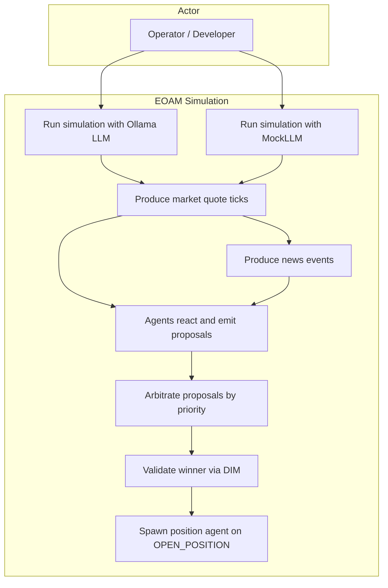
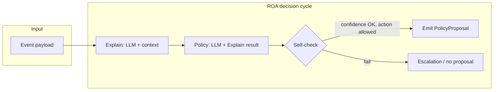
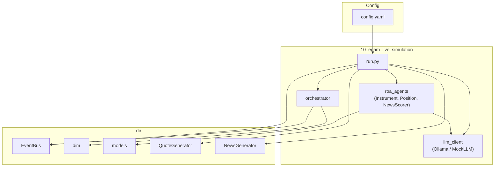

# 31 – Business Case: Finance Trading (Topology A)

**Goal:** Demonstrate **Topology A (Event-Oriented Agent Mesh, EOAM)** with a live-like simulation: a stream of market quotes, periodic news events, and ROA (Responsibility-Oriented Architecture) agents that interpret context via an LLM, propose policies, and are coordinated by scope-based events, priority arbitration, and the Decision Integrity Module (DIM). Position agents can be spawned dynamically when the runtime accepts an `OPEN_POSITION` proposal or when the **news agent** emits `NEWS_QUALIFIED` (hierarchical DFID: news → instrument manager). At the end of the simulation, an **HTML report** is generated with price charts, decision points, and full position lifecycle.

**DIR alignment:** DIR Topologies §2 (EOAM), §2.1–2.4 (scope-based choreography, DFID correlation, priority-based preemption). ROA Manifesto §3 (Responsibility Contract, mission), §4 (Explain → Policy → Self-Check → Proposal).

---

## Use cases

The following diagram summarizes the main ways the simulation is used and what the system does.



- **UC1 / UC2:** The operator runs the simulation either with a local Ollama LLM (real reasoning) or with `USE_MOCK_LLM=1` (MockLLM, no server).
- **UC3:** Each tick, a quote generator produces one market observation (instrument, price, trend, volatility) for the current instrument in round-robin.
- **UC4:** Every `news_every_n_ticks` ticks, a news generator emits one news event (headline, sentiment, raw_score, etc.).
- **UC5:** Agents subscribed to the event (by scope) run their ROA decision cycle (Explain → Policy → Self-Check) and may emit one `PolicyProposal` per event.
- **UC6:** The orchestrator collects all proposals for that event’s DFID and selects the **winner** by the configured priority (lower number = higher priority).
- **UC7:** The winner is validated by DIM (schema, RBAC, context); result is ACCEPT or REJECT.
- **UC8:** If the result is ACCEPT and the winner’s `policy_kind` is `OPEN_POSITION` or `NEWS_QUALIFIED`, the orchestrator spawns a new position/instrument manager agent (from the config template) and registers it for future observations on that instrument. `NEWS_QUALIFIED` creates a hierarchical DFID link (parent_dfid = news event DFID).
- **UC9:** At simulation end, an HTML report is generated (`simulation_report.html`) with price charts, decision points, DFID hierarchy, and position lifecycle.

---

## Simulation rules (detailed)

### Time and ticks

- The simulation runs until one of the end conditions is met:
  - **simulation_ticks** (or **simulation_ticks**): maximum number of ticks (e.g. 20).
  - **simulation_max_seconds** (optional): maximum wall-clock time in seconds; if set, the simulation stops when elapsed time exceeds this value.
- Each tick corresponds to one **market observation** for exactly one instrument.
- Instruments are iterated in **round-robin** (e.g. tick 0 → BTC-USD, tick 1 → ETH-USD, tick 2 → BTC-USD, …).
- Optionally, **tick_interval_sec** can be used to sleep between ticks (e.g. 0.3 s) for a slower, observable run.

### Quote stream (observations)

- For each tick, the **QuoteGenerator** for the current instrument produces one **QuoteTick** (multiplicative random walk: price, trend, volatility, volume).
- The tick is converted to a payload and published on the **event bus** as `EventType.OBSERVATION` with:
  - **DFID** (Decision Flow ID) set by the orchestrator for correlation.
  - **target_scope** = instrument symbol (e.g. `"BTC-USD"`), so only agents subscribed to that scope receive the event.
- Payload fields include: `instrument`, `price`, `trend`, `volatility`, `volume`, `price_delta_pct`, `timestamp`, `dfid`.

### News stream

- Every **news_every_n_ticks** ticks (e.g. 5), the **NewsGenerator** yields one news event until **max_news_events** is reached.
- The event is published as `EventType.NEWS` with a new DFID; **scope** is not used (all news agents receive all news events).
- Payload includes: `headline`, `sentiment`, `category`, `instruments_affected`, `raw_score`, `news_id`, `dfid`.
- **News scorer agent** only runs its decision cycle when **raw_score ≥ news_score_threshold** (e.g. 0.6); otherwise it does not emit a proposal.

### Agent subscription (scope-based)

- **Instrument agents** subscribe to `OBSERVATION` with **scope = instrument** (e.g. `BTC-USD`). Each receives only observations for that instrument.
- **Position agents** (spawned later) subscribe to `OBSERVATION` with **scope = instrument** of their position; they receive the same observation stream for that instrument.
- **News scorer agent(s)** subscribe to `NEWS` with **scope = null** (all news).

### ROA decision cycle (per event, per agent)

When an agent receives an event it runs a single **decision cycle**:

1. **Explain:** The agent sends the current context (e.g. price, trend, volatility, or news fields) to the LLM with its **mission** and contract boundaries. The LLM returns a free-form interpretation; the response is parsed into **ExplainResult** (narrative, signals, risks, opportunities).
2. **Policy:** The agent sends the Explain result to the LLM and asks for one action from **allowed_policy_types**. The LLM response is parsed into **Policy** (proposed_action, justification, confidence).
3. **Self-check:** The agent checks (a) confidence ≥ **escalate_on_uncertainty**, (b) proposed_action is in **allowed_policy_types**. If either fails, the agent does **not** emit a proposal; it may record an escalation. If both pass, it builds a **PolicyProposal** and returns it to the orchestrator.

Only one proposal per agent per event is collected; escalations are not sent to the orchestrator as proposals.

### Arbitration

- For each event (observation or news), the orchestrator gathers all **PolicyProposal**s for that event’s DFID into **pending[dfid]**.
- **Arbitration** chooses the **winner** as the proposal with the **smallest priority number** in the configured **priority_matrix** (e.g. RISK_ALERT=1, CLOSE=2, …, HOLD=10). Unknown policy kinds get a default priority (e.g. 10).
- After arbitration, **pending[dfid]** is cleared so the next event gets a fresh set of proposals.

### Validation (DIM) and execution

- The **winner** is passed to **DIM** (`validate_proposal`): schema, optional RBAC, and context checks. The result is **ACCEPT** or **REJECT** with a reason.
- On **ACCEPT:**
  - If **policy_kind == OPEN_POSITION**, the orchestrator **spawns a new position agent** from the **position template** in config (mission, contract, with instrument and entry_price set), and registers it for OBSERVATION on that instrument.
  - If **policy_kind == NEWS_QUALIFIED**, the orchestrator **spawns an instrument manager agent** for each instrument in `instruments_affected` (from the news payload), with **parent_dfid** set to the news event DFID for hierarchical DFID correlation. The agent's `parent_agent_id` is set to `news_scorer`.
  - Otherwise, execution is **mock** (e.g. log “Mock execution: CLOSE”).
- On **REJECT**, no execution and no spawn; the event is still considered processed.

### Order of operations per “tick” in run.py

1. Advance tick counter; select instrument by `tick_count % len(instruments)`.
2. Generate one quote tick for that instrument; **emit_observation** (payload, scope=instrument) → DFID.
3. **Arbitrate(DFID)** → winner; **clear_pending(DFID)**.
4. If winner: **validate_proposal(winner)** → (result, reason). If ACCEPT: if OPEN_POSITION then **spawn_position_agent** else mock execution.
5. If `tick_count % news_every_n_ticks == 0` and under max_news_events: **emit_news** → news_dfid; **arbitrate(news_dfid)**; clear_pending; optionally log/news DIM.
6. Sleep **tick_interval_sec** if configured.

---

## Simulation flow (sequence)

End-to-end flow for one observation tick and, when applicable, one news event.


---

## ROA agent decision cycle

Each agent that receives an event runs this cycle once; the result is either one **PolicyProposal** (returned to the orchestrator) or an **EscalationRequest** (logged, no proposal).



- **Explain:** Context (e.g. instrument, price, trend, volatility or news headline, raw_score) is sent to the LLM with the agent’s mission; output is parsed into narrative, signals, risks, opportunities.
- **Policy:** Explain result and allowed policy types are sent to the LLM; output is parsed into one action, justification, and confidence.
- **Self-check:** If confidence &lt; escalate_on_uncertainty or action ∉ allowed_policy_types → do not emit; optionally escalate. Otherwise → build **PolicyProposal** (policy_kind, params, confidence, justification) and return it to the orchestrator.

---

## Architecture (components)



- **config.yaml:** Simulation parameters (instruments, ticks, news interval, seeds, threshold), priority_matrix, and agent definitions (type, mission, contract, priority).
- **run.py:** Loads config, builds EventBus, LLM, agents from config, registers them with the orchestrator, runs the tick loop and news loop; calls DIM and spawn.
- **llm_client:** `OllamaClient` (sync HTTP to Ollama) or `MockLLM`; interface `generate(prompt, system=None) -> str`.
- **roa_agents:** ROA base (Explain → Policy → Self-Check → Proposal) and concrete agents (Instrument, Position, NewsScorer) using the LLM and config-driven contracts.
- **orchestrator:** Registers agents with the bus (OBSERVATION by scope, NEWS global), emits observations/news with DFID, collects proposals per DFID, arbitrates by priority_matrix, spawns position agents from template.
- **dir:** EventBus (scope-based dispatch), DIM (validate_proposal), models (ResponsibilityContract, PolicyProposal, etc.), QuoteGenerator, NewsGenerator.

---

## How to run

From the repository root:

```bash
pip install -e ".[eoam]"
# Or: pip install -e . && pip install pyyaml

# With Ollama running locally (ollama serve, ollama pull <model>):
python samples/31_finance_trading/run.py

# Without Ollama (MockLLM, no server required):
# Windows: set USE_MOCK_LLM=1
# Unix:    export USE_MOCK_LLM=1
python samples/31_finance_trading/run.py
```

**Ollama:** Run `ollama serve` and `ollama pull <model>` (e.g. `llama3.2` or `gemma3:12b` as in config) for real LLM-backed agents. Otherwise set `USE_MOCK_LLM=1` to use MockLLM.

**Report:** The HTML report (`simulation_report.html`) requires `plotly` for charts; it is included in the `eoam` extra.

---

## Configuration (config.yaml)

| Section | Purpose |
|--------|--------|
| **simulation** | `instruments`, `simulation_ticks` / `simulation_ticks`, `simulation_max_seconds` (optional), `tick_interval_sec`, `news_every_n_ticks`, `max_news_events`, `initial_prices`, `news_score_threshold`, `seeds` (quote, news). |
| **priority_matrix** | Maps `policy_kind` to numeric priority (lower = higher). Used by the orchestrator to choose the winning proposal. |
| **llm_defaults** | Optional `model`, `base_url` for Ollama. |
| **agents** | List of agent definitions: `agent_id`, `type` (instrument \| news_scorer \| position), `scope` (for instrument), `mission`, `contract` (role, authorized_instruments, allowed_policy_types, escalate_on_uncertainty, max_drawdown_limit, parent_agent_id), `priority`. The **position** entry is a template for spawned position agents. |

---

## Expected output

- **Per tick:** Logs for observation dispatch (DFID, scope, listener count), each agent’s decision cycle (Explain, Policy, Self-Check, proposal or escalation), arbitration (number of proposals, winner, policy_kind), DIM result (ACCEPT/REJECT, reason), and mock execution or position spawn.
- **Per news event:** Same pattern for the news DFID.
- **Summary:** Total ticks, news events, number of position agents spawned, total bus event count.
- **Report:** `simulation_report.html` in the sample directory, containing:
  - **Summary:** Ticks, news events, elapsed time, decisions, positions.
  - **Price charts:** One chart per instrument (Plotly), with decision points marked (HOLD, REDUCE, CLOSE, NEWS_QUALIFIED).
  - **DFID hierarchy tree:** Parent (news) → child (instrument manager) links.
  - **Decision details:** Table with DFID, agent, policy_kind, DIM result, justification, explain narrative.
  - **Position lifecycle:** For each position: entry tick/price, trigger (news headline or OPEN_POSITION), lifecycle events (HOLD/REDUCE/CLOSE).

---

## Generators (dir)

- **QuoteGenerator** (`dir.quote_generator`): One instrument; multiplicative random walk in price; `next_tick()` → `QuoteTick`, `to_payload()` for OBSERVATION. Optional seed for reproducibility.
- **NewsGenerator** (`dir.news_generator`): Template-based headlines, sentiment, category; `score_news()` for raw_score; `news_payloads(max_events, sleep_between)` yields payloads with optional dfid. Optional seed for reproducibility.

In production, news scoring could be LLM- or RAG-based; here it is rule-based for determinism and no API keys.
