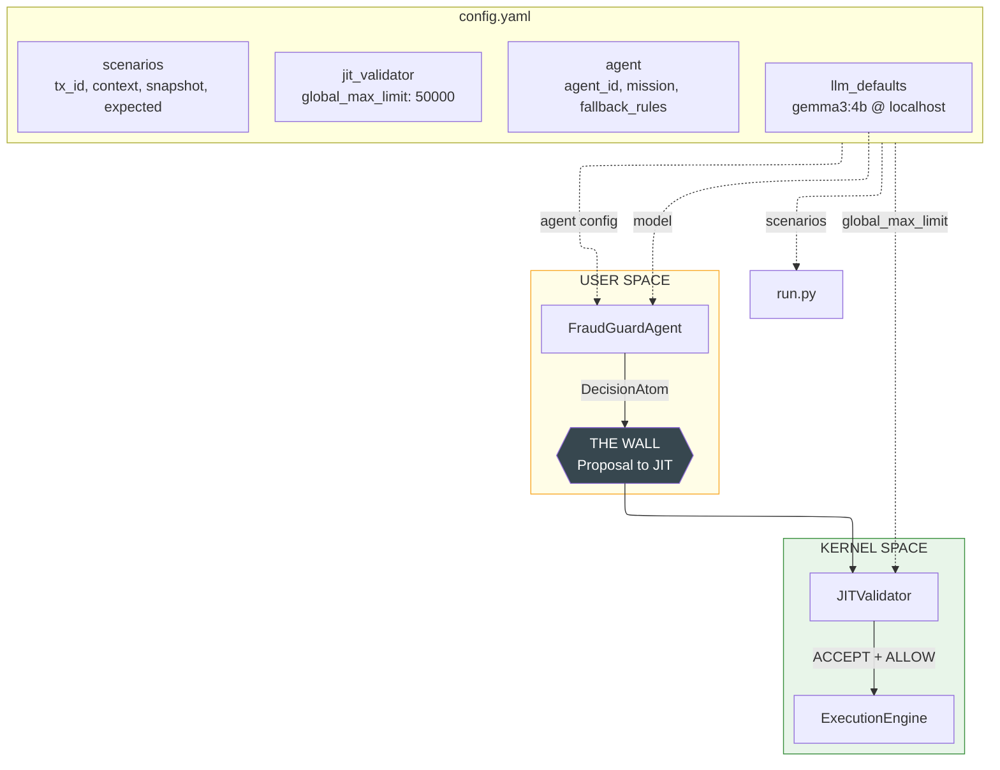
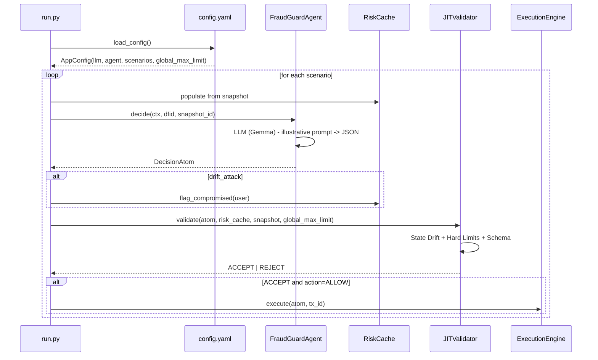

# 32 - Real-Time Fraud Gate (Topology B SDS)

**Goal:** Demonstrate the **Sovereign Decision Stream (SDS)** pattern for high-velocity, structure-first fraud decisions. Uses **Constrained Decoding** (Straightjacket Grammar via Pydantic), **JIT State Drift** validation, and a **drift-attack** scenario where the agent proposes ALLOW but the Runtime rejects with `STATE_DRIFT_ERROR`.

**DIR alignment:** [DIR Topologies §3](../../docs/03-topologies/DIR_Topologies.md) - suited to real-time fraud gating where the LLM can only output valid JSON, and the Runtime must catch state changes between snapshot and execution.

**LLM:** Uses **real Gemma** (Ollama) by default, like samples 31, 34, 35. Illustrative prompts describe each transaction; the LLM returns structured JSON (action, reason_code, risk_score). Set `USE_MOCK_LLM=1` for tests without a server.

**Configuration:** All LLM, agent (including `mission` and `fallback_rules`), JIT validator, and scenario data lives in `config.yaml`. No hardcoded thresholds. Same convention as `samples/31_finance_trading` and `samples/35_crewai_roa_wrapper`.

---

## Architecture

### Diagram 1: System Overview. config.yaml, agent, JIT validator



### Diagram 2: Execution Flow. One transaction



### Scenarios (from config.yaml)

| Scenario | Context | Agent output | JIT result |
|----------|---------|--------------|------------|
| **1. Legit** | $50, US, known device | ALLOW | ACCEPT - Executed |
| **2. Obvious Fraud** | $10k, Nigeria, unknown device | BLOCK | ACCEPT - No execution (blocked) |
| **3. Drift Attack** | $100, US, known device; user flagged as Compromised at T+50ms | ALLOW | REJECT - STATE_DRIFT_ERROR |

**Drift Attack (key demo):** At T=0 the snapshot shows the user as "clean". The agent reasons and proposes ALLOW. At T+50ms an external system flags the account as "Compromised". The JITValidator detects the state change and rejects - demonstrating why SDS needs the Runtime despite the Agent being "smart".

---

## Configuration (config.yaml)

All LLM, agent, JIT validator, and scenario configuration lives in **`config.yaml`**. No hardcoded values in code.
Same convention as `samples/35_crewai_roa_wrapper/config.yaml`.

```yaml
llm_defaults:
  model: "gemma3:4b"
  base_url: "http://localhost:11435"
  temperature: 0.2

agent:
  agent_id: "fraud_guard_v1"
  mission: >
    You are a fraud analyst for a payment gateway. Evaluate each transaction
    and output ONLY a JSON object with action, reason_code, risk_score.
  fallback_rules:
    block_amount_threshold: 5000
    block_high_risk_countries: [nigeria]
    allow_amount_max: 1000
    allow_velocity_max: 10
    allow_device_prefix: "dev_known_"

jit_validator:
  global_max_limit: 50000.0

scenarios:
  - label: "SCENARIO 1 - Legit"
    tx_id: "tx_001"
    context:
      user_id: "user_legit"
      amount: 50.0
      geo_country: "US"
      device_id: "dev_known_001"
      velocity_24h: 3
    snapshot:
      user_legit:
        status: "clean"
        risk_score: 0.05
    expected: ACCEPT

  - label: "SCENARIO 2 - Obvious Fraud"
    tx_id: "tx_002"
    context:
      user_id: "user_fraud"
      amount: 10000.0
      geo_country: "Nigeria"
      device_id: "dev_unknown_xyz"
      velocity_24h: 1
    snapshot:
      user_fraud:
        status: "clean"
        risk_score: 0.0
    expected: ACCEPT

  - label: "SCENARIO 3 - Drift Attack"
    tx_id: "tx_003"
    context:
      user_id: "user_drift"
      amount: 100.0
      geo_country: "US"
      device_id: "dev_known_002"
      velocity_24h: 2
    snapshot:
      user_drift:
        status: "clean"
        risk_score: 0.1
    drift_attack: true
    expected: REJECT
```

| Section | Purpose |
|---------|---------|
| **llm_defaults** | `model`, `base_url`, `temperature` - Ollama/Gemma (same as 31, 35). Set `provider: "mock"` or env `USE_MOCK_LLM=1` for tests without LLM. |
| **agent** | `agent_id`, `mission` (LLM system prompt), `fallback_rules` (thresholds for deterministic logic when LLM fails or MockLLM): `block_amount_threshold`, `block_high_risk_countries`, `allow_amount_max`, `allow_velocity_max`, `allow_device_prefix`. Same rules used by agent and MockLLM. |
| **jit_validator** | `global_max_limit` - Hard limit for amount (Risk Governor) |
| **scenarios** | List of test cases: `tx_id`, `context` (user_id, amount, geo_country, device_id, velocity_24h), `snapshot` (user state at T=0), `expected` (ACCEPT/REJECT), `drift_attack` (optional) |

---

## How to Run

From the repository root:

```bash
# 1. Install dependencies
pip install -e .
pip install pyyaml

# 2. Start Ollama and pull Gemma (for real LLM)
ollama serve
ollama pull gemma3:4b

# 3. Run
python samples/32_fraud_gate/run.py
```

**Without Ollama** (MockLLM for fast tests):

```bash
USE_MOCK_LLM=1 python samples/32_fraud_gate/run.py
```

**Ollama fallback:** If Ollama is not reachable or the model is not found, the run falls back to MockLLM automatically (with a warning). No need to set `USE_MOCK_LLM=1` manually.

Running `run.py` prints a banner at startup, loads `config.yaml`, and executes all 3 scenarios in sequence. Each scenario: [INPUT] -> [STEP 1] LLM -> [STEP 2] JIT -> [STEP 3] execute (if ALLOW).

---

## Schemas

### FraudDecisionSchema (Straightjacket Grammar)

```python
class FraudDecisionSchema(BaseModel):
    action: Literal["ALLOW", "BLOCK", "CHALLENGE"]
    reason_code: str
    risk_score: float = Field(ge=0.0, le=1.0)
```

### DecisionAtom

Extends the schema with `snapshot_id` for JIT drift verification.

---

## Expected Output

**Startup:**
- Banner: "What this example demonstrates" (3 points + Pipeline)
- `Using Ollama: model=gemma3:4b base_url=...` (or `Using MockLLM` when USE_MOCK_LLM=1)
- If Ollama not reachable: `Falling back to MockLLM (Ollama not available)`

**Per scenario:**
- `--- SCENARIO 1 - Legit ---` (scenario label)
- `[INPUT] tx_id=... user=... amount=$... country=... device=... velocity_24h=...`
- `[STEP 1] Agent (LLM) evaluates transaction...`
- `[MockLLM] Response: {...}` (when MockLLM is used)
- `[AGENT] action=... reason_code=... risk_score=...`
- `[STEP 2] JIT Validator: schema, hard_limit, state_drift...`
- `[JIT] ACCEPT: schema OK, amount<=$50,000, no state drift` or `[JIT] REJECT: ...`
- `[STEP 3] Execution...`
- `[RESULT] Transaction EXECUTED (ALLOW)` or `Transaction BLOCKED` or `Transaction NOT executed`

**Drift Attack (scenario 3):**
- `[SCENARIO] Agent sees snapshot: user=clean. Decides. Then T+50ms: external system flags account as COMPROMISED.`
- `[STEP 2] Simulating T+50ms: external system flags user=... as COMPROMISED`
- `[JIT] REJECT: STATE_DRIFT_ERROR: user ... was 'clean' in snapshot, now 'compromised' (Runtime detected change)`

**Summary:**
- `SUMMARY - what this example verified:` with 3 lines (Legit, Obvious Fraud, Drift Attack)

---

## Example Prompt (Illustrative)

The agent sends a readable prompt to the LLM for each transaction:

```
Evaluate this payment transaction for fraud risk.

**Transaction:**
- User: user_legit
- Amount: $50.00
- Country: US
- Device: dev_known_001
- Transactions in last 24h: 3

**User risk status (from snapshot):** clean

**Decision rules:**
- ALLOW: Low risk, known device, reasonable amount
- BLOCK: High risk (e.g. large amount + high-risk country, unknown device)
- CHALLENGE: Uncertain, needs additional verification

Respond with ONLY a valid JSON object, no other text. Example:
{"action": "ALLOW", "reason_code": "LOW_RISK_LEGIT", "risk_score": 0.1}
```

---

## Technical Notes

- **Real LLM (default):** Ollama + Gemma. Illustrative prompts; JSON extracted from response. Fallback to deterministic logic (using `fallback_rules` from config) if parse fails.
- **MockLLM:** Set `USE_MOCK_LLM=1` or `provider: "mock"` in config for tests without Ollama. Also used automatically when Ollama is not reachable. Uses same `fallback_rules` as agent for consistent behavior.
- **fallback_rules:** Shared by `agent._fallback_decision` and `MockLLM`; ensures identical deterministic logic when LLM is unavailable or returns invalid JSON.
- **Risk Cache:** In-memory dict (no Redis); simulates external risk service with controlled updates.
- **Zero API keys:** Uses local Ollama; no cloud API keys required.
- **Banner:** Printed at startup; describes what the example demonstrates (LLM, JIT, Drift Attack, Pipeline).
