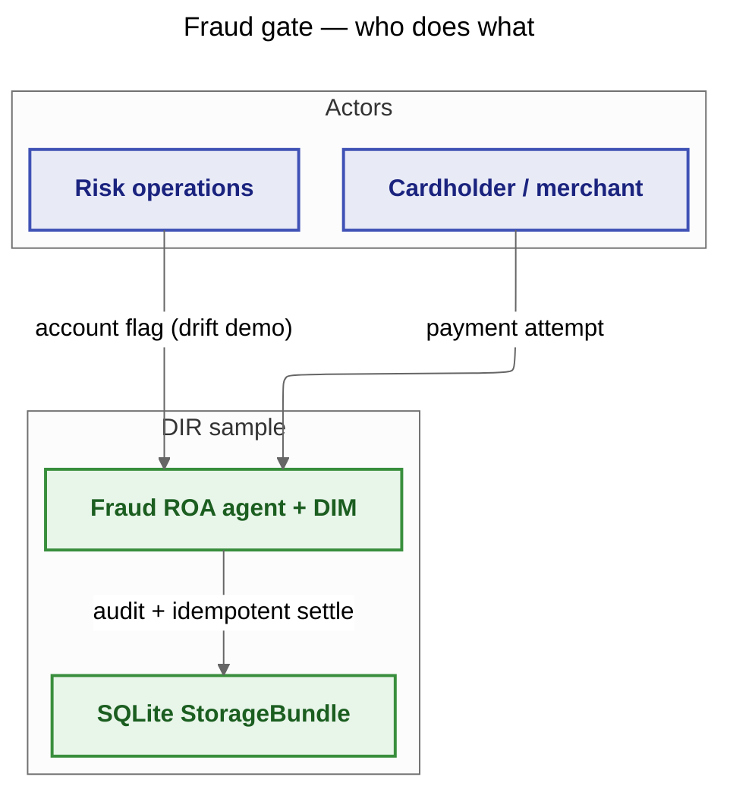
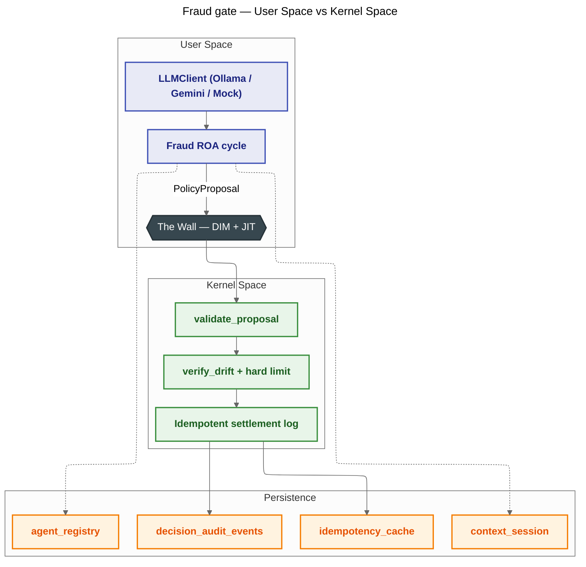
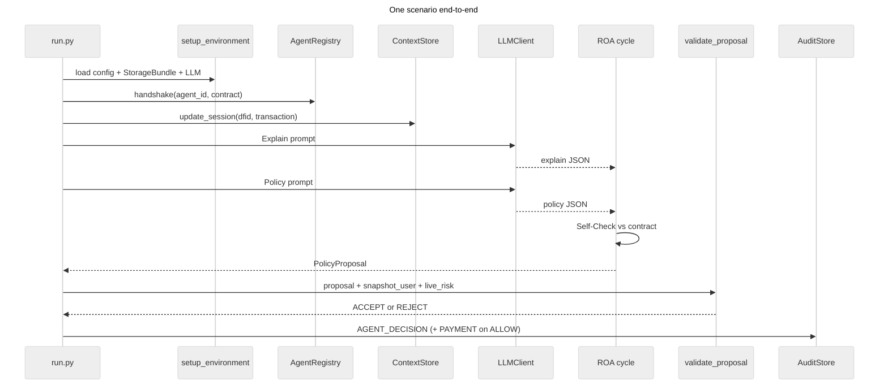

# 32 — Fraud Gate (YAML scenarios)

**Goal:** This reference sample shows a **classic** DIR gate where each payment scenario is driven from `scenarios.yaml`, the fraud analyst follows the full **ROA** lifecycle (Explain, Policy, deterministic Self-Check, `PolicyProposal`), and the **DIM** (`validate_proposal`) authorizes or blocks execution—including a **JIT snapshot vs live** check using `verify_drift` from `dir_core` so a post-decision risk flag (TOCTOU) cannot settle an outdated **ALLOW**. **AgentRegistry** handshake, **ContextStore**, **StorageBundle** audit, and **idempotent** mock settlement are wired through `shared.bootstrap.setup_environment` exactly as the Sample Development Guide requires.

**Mechanisms:** `AgentRegistry`, `ContextStore`, ROA, `validate_proposal`, custom DIM validators (`verify_drift`, hard limit), `AuditStore` idempotency cache, `decision_audit_events`, `context_session`.

---

## Repository layout (what lives where)

| Layer | Location | Role |
|--------|----------|------|
| **DIR kernel** | `src/dir_core/` (installed as `dir-runtime`) | `new_dfid`, `validate_proposal`, `verify_drift`, `PolicyProposal`, `AgentRegistry`, `ContextStore`, storage protocols |
| **Sample adapters** | `samples/shared/` | `setup_environment`, `load_yaml_config`, LLM clients, `StorageBundle` wiring |
| **Business logic (this sample)** | `agent.py`, `dim.py`, `schemas.py` | ROA cycle, DIM custom validators, YAML types and `load_scenarios()` |
| **Where results go** | SQLite under `data/` (from `config.yaml`), via `telemetry.py` | Append-only `decision_audit_events`, `idempotency_cache`, `context_session`, `agent_registry` |
| **HTML audit report** | `report_generator.py`, `results/*.html` (gitignored) | Offline report from canonical telemetry (Sample Development Guide §17) |
| **Mocks (no production deps)** | `mocks/` | In-memory risk rows, deterministic LLM strategy, fake PSP settlement — see `mocks/README.md` |

---

## Use cases



---

## Architecture



---

## Execution flow



---

## How to run

From the repository root (after `pip install -e .` and `pip install pyyaml`; add `psycopg2-binary` only if you switch the sample to PostgreSQL):

**Ollama (local)**

```bash
ollama serve
ollama pull gemma3:4b
python samples/32_fraud_gate/run.py
```

**Gemini (cloud)**

Set `GOOGLE_API_KEY` or `GEMINI_API_KEY`, then set in `config.yaml` under `llm_defaults` a `gemini-…` model and `provider: gemini` (see `samples/31_finance_trading/config.yaml` for the pattern).

**Mock (no API keys, no network)**

```bash
USE_MOCK_LLM=1 python samples/32_fraud_gate/run.py
```

If Ollama or Gemini is selected but unreachable or misconfigured, `run.py` rebuilds the LLM with `force_mock=True` so the scenario sweep still finishes deterministically.

---

## Configuration

Annotated excerpts (full files are `config.yaml` and `scenarios.yaml` next to `run.py`).

- **`database`** — `provider: sqlite` and `db_path` anchored to this folder via `config_path` (see `samples/shared/bootstrap.py`).
- **`simulation.run_id`** — becomes `simulation_id` on every audit row so runs are groupable in SQL.
- **`llm_defaults`** — Ollama or Gemini defaults; mock is driven by `USE_MOCK_LLM=1` or `provider: mock`.
- **`contracts.provider: yaml`** — contracts load from the same `config.yaml` (`agents` list).
- **`agents[].contract`** — canonical Responsibility Contract: `authority.allowed_policy_types: [ALLOW, BLOCK, CHALLENGE]`, identity/role in `subject`, wake-up in `execution_conditions`, and Self-Check threshold in `responsibility.escalation.confidence_below`.
- **`jit_validator.global_max_limit`** — hard cap passed into DIM as `global_max_limit` in the validation context.
- **`fraud_gate.fallback_rules`** — shared thresholds for deterministic fallback parsing and for `mocks/llm_mock_strategy.py` (`make_mock_strategy`) when the mock client is active.

---

## Database storage

| Canonical table | Written by | Content |
|-----------------|------------|---------|
| `agent_registry` | `AgentRegistry.handshake` | Contract JSON, priority, session token |
| `context_session` | `ContextStore.update_session` | DFID-scoped transaction + scenario label |
| `decision_audit_events` | `bundle.decision_audit` via `AuditStore` | `SIMULATION_START`, `SIMULATION_END`, `AGENT_DECISION`, `PAYMENT_GATEWAY_ALLOW` |
| `idempotency_cache` | `AuditStore.save_idempotent_result` | SHA-256 key for mock settlement replay |

**SQLite — filter one run**

```sql
SELECT dfid, event, detail_json
FROM decision_audit_events
WHERE json_extract(detail_json, '$.simulation_id') = 'fraud_gate_demo'
ORDER BY id;
```

**PostgreSQL — same filter**

```sql
SELECT dfid, event, detail_json
FROM decision_audit_events
WHERE detail_json->>'simulation_id' = 'fraud_gate_demo'
ORDER BY id;
```

---

## Expected output

With `USE_MOCK_LLM=1` you should see, for each scenario, DFID-prefixed lines from `log_with_dfid`: two LLM round-trips (Explain then Policy), then `DIM: ACCEPT …` or `DIM: REJECT …`, then either `PaymentGateway (mock): ALLOW … cached=False` on a successful idempotent first settlement, `PaymentGateway (mock): BLOCK …` when the policy is not `ALLOW`, or `No payment execution` when DIM rejects (drift scenario). The run ends with `SUMMARY: finished 3 scenarios (simulation_id=fraud_gate_demo)` and a `Report: …/results/report_<UTC>_<slug>.html` line.

---

## Regenerating the HTML report

Each run appends audit rows to the SQLite file configured in `config.yaml`. `run.py` generates a self-contained dark-theme HTML report under `results/` (Sample Development Guide §17) using only canonical telemetry plus registry and context snapshots. The generator isolates the **latest** `SIMULATION_START` … `SIMULATION_END` window for the chosen `simulation_id`, so reruns with the same `simulation.run_id` do not mix older scenarios into the report.

Regenerate without executing the sample:

```bash
python samples/32_fraud_gate/report_generator.py --simulation-id fraud_gate_demo
```

Omit `--simulation-id` to use the most recent `SIMULATION_START` in the database. Optional: `--output-path path/to/report.html` and `--config path/to/config.yaml`.
