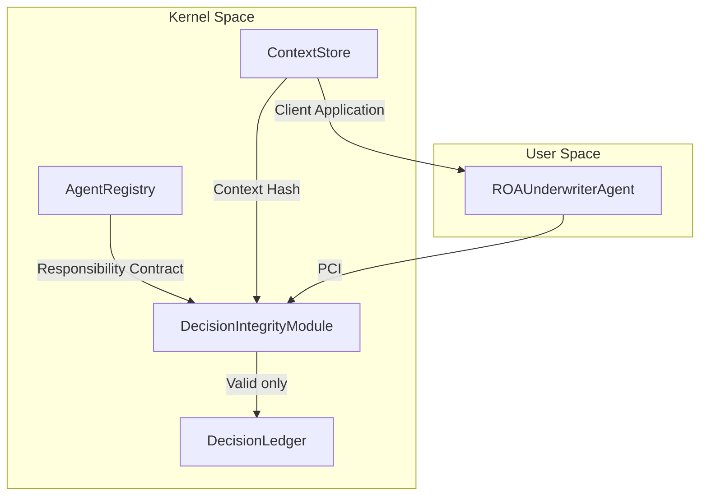

# 32 – Business Case: Insurance Underwriting (Topology C)

**Goal:** Demonstrate the **Digital Underwriter** use case with a **full ROA agent** (Explain → Policy → Self-Check) backed by LLM. Config-driven via `config.yaml` (similar to 10_eoam_live_simulation). The system commits to the Decision Ledger only when the agent provides a valid cryptographic **Evidence Hash** proving compliance with the Responsibility Contract.

**Day Two prevention:** Unverified agent decisions (hallucinations, rule violations, forged proofs) never become binding contracts. The DIM (Proof Checker) recalculates the Evidence Hash using authoritative sources and rejects any mismatch (Zero Trust).

**ROA/DIR:** DIR Topologies C — suited to compliance-heavy operations, high-value transfers, and formal verification where every decision must be cryptographically provable.

---

## How to run

From the repository root:

```bash
pip install -e .
pip install pyyaml
python samples/32_insurance_underwriting/run.py
```

**Without Ollama (MockLLM):**

```bash
USE_MOCK_LLM=1 python samples/32_insurance_underwriting/run.py
```

**With Ollama (real LLM):**

```bash
# Start Ollama: ollama serve && ollama pull gemma3:12b
python samples/32_insurance_underwriting/run.py
```

---

## Configuration (config.yaml)

| Section | Purpose |
|---------|---------|
| `underwriting` | max_limit, prohibited_industries |
| `llm_defaults` | model, base_url (Ollama) |
| `agents` | agent_id, mission, contract, **audit fields** |
| `scenarios` | Test cases: name, business_type, revenue, industry, expect |

### Audit fields (agent policy)

| Field | Description |
|-------|-------------|
| `version` | Policy version (SemVer, e.g. 1.0.0) |
| `created_by` | Who created/approved the policy (e.g. compliance@example.com) |
| `created_at` | When the policy was created (ISO 8601) |

---

## Architecture: Kernel vs User Space



---

## Components

### Kernel Space

| Component | Purpose |
|-----------|---------|
| **AgentRegistry** | Stores the Underwriting Policy (Responsibility Contract): max limit $2M, prohibited industries: Fireworks, CryptoMining |
| **ContextStore** | Holds the Client Application state (business_type, revenue, industry) |
| **DecisionLedger** | Append-only list storing only verified decisions |
| **DecisionIntegrityModule (DIM)** | Proof Checker: recalculates Evidence Hash, rejects on mismatch (Zero Trust) |

### User Space

| Component | Purpose |
|-----------|---------|
| **ROAUnderwriterAgent** | Full ROA agent: Explain(LLM) → Policy(LLM) → Self-Check → PCI with evidence_hash |

---

## ROA Lifecycle (Explain → Policy → Self-Check)

1. **Explain:** LLM interprets client application (narrative, signals, risks, opportunities)
2. **Policy:** LLM proposes COVERAGE_LIMIT, PREMIUM, INDUSTRY (structured output)
3. **Self-Check:** Deterministic check (prohibited industry, max limit) — agent may still emit; DIM enforces
4. **PCI:** Build ProofCarryingIntent with evidence_hash, submit to DIM

---

## Evidence Hash Formula

```
Evidence_Hash = SHA256(DFID || Context_Hash || Contract_Hash || Proposal_Params)
```

- **Context_Hash** = SHA256(canonical JSON of ClientApplication)
- **Contract_Hash** = SHA256(canonical JSON of UnderwritingContract)
- **Proposal_Params** = canonical JSON of policy_proposal (coverage_limit, premium, industry)

The DIM **recalculates** this using authoritative Registry and ContextStore data. It never trusts the agent's claimed hash.

---

## Scenarios (from config.yaml)

| Scenario | Input | Expected outcome |
|----------|-------|------------------|
| **Retail** | business_type=Retail, revenue=500k, industry=Retail | Policy Bound |
| **Fireworks** | business_type=Fireworks Factory, industry=Fireworks | Prohibited Industry (LLM may still propose; DIM rejects) |
| **Forged hash** | Same as Fireworks + forge_evidence_hash=true | Evidence Invalid |

---

## HTML Report

After processing, `report.html` is generated in the project directory (and opened in the browser). The report is in English and contains:

1. **Input data** – what the agent received (business_type, revenue, industry)
2. **Processing (Explain)** – narrative, signals, risks, opportunities
3. **Applied policy (Policy)** – proposal (coverage_limit, premium, industry) and **audit metadata** (version, created_by, created_at)
4. **Agent Self-Check** – result and reason
5. **DIR (DIM) verification** – Evidence Hash and business rules check
6. **Final outcome** – policy BOUND or REJECTED with reason

---

## File structure

```
samples/32_insurance_underwriting/
├── README.md              # This file
├── config.yaml             # Underwriting rules, LLM, agents, scenarios
├── run.py                  # Main simulation (config-driven)
├── report_generator.py     # HTML report generator
├── report.html              # Generated audit report (after run)
├── models.py               # Pydantic: UnderwritingContract, ClientApplication, PolicyProposal, ProofCarryingIntent
├── kernel.py               # AgentRegistry, ContextStore, DecisionLedger, DecisionIntegrityModule
├── llm_client.py           # OllamaClient, MockLLM
└── roa_underwriter_agent.py # ROA agent: Explain → Policy → Self-Check → PCI
```

---

## Example run

```
======================================================================
Digital Underwriter - Topology C (ROA + LLM, config-driven)
======================================================================

[Scenario] Retail
  Outcome: Policy Bound (OK)

[Scenario] Fireworks
  Outcome: Prohibited Industry (OK)

[Scenario] Forged hash
  Outcome: Evidence Invalid (OK)

======================================================================
Summary
======================================================================
  Ledger entries (verified only): 1
  Retail: Policy Bound
  Fireworks: Prohibited Industry
  Forged hash: Evidence Invalid

  Day Two prevention: Only verified decisions are bound.
```

---

## Summary

| Aspect | Description |
|--------|-------------|
| **Topology** | C (Decision Ledger & Proof-Carrying Intents) |
| **Use case** | Digital Underwriter — insurance policy proposals with cryptographic proof of compliance |
| **Agent** | Full ROA: Explain(LLM) → Policy(LLM) → Self-Check → PCI |
| **Config** | config.yaml (underwriting, llm_defaults, agents, scenarios) |
| **Input** | ClientApplication (business_type, revenue, industry) |
| **Output** | Policy Bound, or rejection: Evidence Invalid / Prohibited Industry / Coverage Limit Exceeded |
| **Logic** | Agent proposes PCI → DIM recalculates Evidence Hash (Zero Trust) → Business rules → Ledger append if valid |
| **Goal** | Prevent Day Two failures: unverified agent decisions never become binding contracts |
