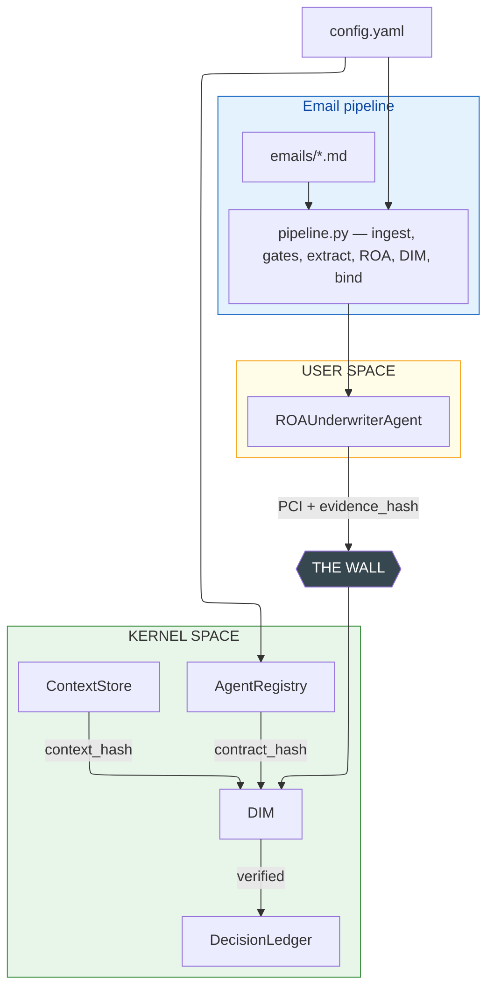
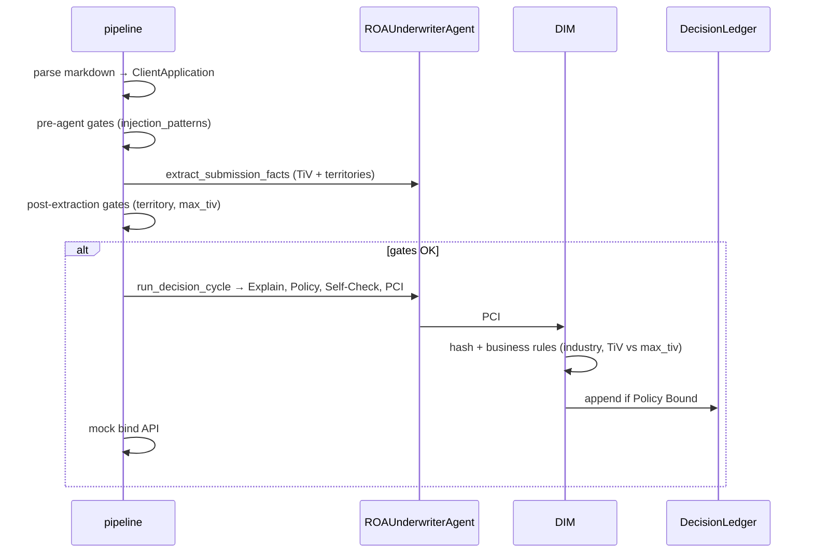

# 33 - Business Case: Insurance Underwriting (Topology C)

**Goal:** Demonstrate the **Digital Underwriter** use case with a **full ROA agent** (Explain → Policy → Self-Check) backed by LLM. Config-driven via `config.yaml` (same convention as samples 31, 32, 35). The system commits to the Decision Ledger only when the agent provides a valid cryptographic **Evidence Hash** proving compliance with the Responsibility Contract.

**Day Two prevention:** Unverified agent decisions (hallucinations, rule violations, forged proofs) never become binding contracts. The DIM (Proof Checker) recalculates the Evidence Hash using authoritative sources and rejects any mismatch (Zero Trust).

**ROA/DIR:** DIR Topologies §3 C (DL+PCI) - suited to compliance-heavy operations, high-value transfers, and formal verification where every decision must be cryptographically provable.

**Configuration:** Underwriting rules, LLM, agent contract, and **`email_processing`** (gates, paths, FX stub) live in **`config.yaml`**, same convention as `samples/31_finance_trading` and `samples/32_fraud_gate`.

**Bindable TiV ceiling (`max_tiv`):** `run.py` and `pipeline.py` build `UnderwritingContract` with `max_tiv` from **`agents[0].contract.max_tiv`**, then **`underwriting.max_tiv`**, then code default **`2_000_000`**. The committed sample uses **3,000,000** on the agent contract (see `config.yaml`).

**What `run.py` does:** loads every matching `*.md` under `emails/`, runs the pipeline (audit SQLite + HTML report under `results/`), and opens the new report in the browser.

---

## Email pipeline: flow and what is tested

Each markdown fixture is one **DecisionFlow** with its own **DFID**, from ingest through optional **mock policy bind**.

**Order of steps**

1. **Ingest** — `email_fixture_ingest` loads the markdown and builds a coarse `ClientApplication` (subject, body, industry hints, revenue proxy from table TiV × FX). Broker **TiV for authority** is **not** taken from these table regexes; the kernel waits for LLM extraction (`requested_tiv_usd` is filled after extraction).
2. **Pre-agent gates** — Only configurable **`injection_patterns`** on the raw email body (default config: empty). The audit/timeline event **`KERNEL_GATES_PASSED`** means this step only; territory and `max_tiv` are **not** evaluated until after extraction (step 4).
3. **Submission extraction (LLM)** — `BROKER_REQUESTED_TIV_USD` + `STATED_TERRITORIES`. With **MockLLM**, TiV is derived from the pipe-table row whose first cell is **Total Insurable Values** (`**Total: GBP …**` or a bold `**USD …**` amount in that row). Failure here ends as **`REJECTED` / `EXTRACTION_FAILED`**.
4. **Post-extraction gates (deterministic)** — On **agent-extracted** territory text vs `prohibited_territories`, then **TiV vs `contract.max_tiv`**:
   - **Both** territory and authority fail → **`CONTRACT_VIOLATION`** (`REJECTED`).
   - **Only** prohibited geography → **`PROHIBITED_TERRITORY`** (`REJECTED`).
   - **Only** TiV above `max_tiv` → **`AUTHORITY_CEILING`** (**`ESCALATED`**, not bound).
5. If gates pass → **Explain → Policy → Self-Check → PCI** → **DIM** → **ledger** → **mock bind** → **`BOUND` / `POLICY_BOUND`**.

Structured JSON log lines use `dfid`, `event`, `timestamp` (DIR-minified LG-2). Audit DB default: `data/underwriting_audit.sqlite`.

### London Market–style fixtures (included, **fictional** names & URLs)

| File (under `emails/`) | What it exercises | Typical final status | `reason_code` |
|------------------------|-------------------|----------------------|---------------|
| `(EXT) Beaconmere Advisory Ltd - Standard Renewal.md` | TiV under `max_tiv`, UK-only wording | **BOUND** | `POLICY_BOUND` |
| `(EXT) Cryowest Distribution Ltd - High Limit Facility.md` | TiV far above `max_tiv`, allowed geographies | **ESCALATED** | `AUTHORITY_CEILING` |
| `(EXT) Nexora Commodities FZE - MENA Property Enquiry.md` | Syria/Damascus in extraction + TiV above delegated `max_tiv` | **REJECTED** | `CONTRACT_VIOLATION` (combined message) |
| `(EXT) Crimson Lane Retail Ltd - Renewal Broker Notes.md` | Misleading “UK-only” workflow note; **embedded prompt-injection** (MIME/TNEF-style junk) asking to bypass rules; factual schedule still shows **Damascus, Syria** + TiV above `max_tiv` | **REJECTED** | `CONTRACT_VIOLATION` |

*Exact LLM wording can vary with a real model; with **MockLLM** the outcomes above are stable. Fixtures are processed in **alphabetical** order by filename.*

---

## How to Run

From the repository root:

```bash
# 1. Install dependencies (includes PyYAML + markdown for formatted HTML report)
pip install -e ".[samples]"

# 2. Email pipeline (default) — MockLLM, no Ollama
USE_MOCK_LLM=1 python samples/33_insurance_underwriting/run.py
```

If you install without extras, add `pip install markdown` so the report renders broker tables and body as HTML instead of a plain `<pre>` fallback.

**With Ollama (real LLM):**

```bash
ollama serve
ollama pull gemma3:4b
python samples/33_insurance_underwriting/run.py
```

**Audit database path** (optional):

```bash
set UNDERWRITING_AUDIT_DB=D:\tmp\uw_audit.sqlite
python samples/33_insurance_underwriting/run.py
```

Each run appends DFID-tagged rows to SQLite, prints a per-email timeline to the console, and writes a **new** report under **`results/simulation_report_YYYY-MM-DD_HHMM.html`** (UTC).

---

## Configuration (config.yaml)

All underwriting rules, LLM, agent, and **`email_processing`** live in **`config.yaml`**. The block below matches the sample layout (comments may differ slightly in the repo file).

```yaml
underwriting:
  max_tiv: 2000000   # fallback if agent.contract.max_tiv omitted
  prohibited_industries: ["Fireworks", "CryptoMining"]

llm_defaults:
  model: "gemma3:4b"
  base_url: "http://localhost:11434"

email_processing:
  emails_dir: "emails"
  audit_db: "data/underwriting_audit.sqlite"
  exclude_filename_substrings: ["HAILO"]
  currency_fx_to_usd: { GBP: 1.0, USD: 1.0, EUR: 1.0 }
  prohibited_territories: ["syrian arab republic", "syria", "damascus"]
  injection_patterns: []   # optional pre-LLM substring scan; default empty

agents:
  - agent_id: "underwriter_agent"
    version: "1.0.0"
    created_by: "compliance@example.com"
    created_at: "2025-02-17T10:00:00Z"
    mission: |
      You are an insurance underwriter...
    contract:
      role: EXECUTOR
      max_tiv: 3000000        # authoritative delegated ceiling in this sample
      prohibited_industries: ["Fireworks", "CryptoMining"]
      escalate_on_uncertainty: 0.65
```

| Section | Purpose |
|---------|---------|
| **underwriting** | `max_tiv`, `prohibited_industries` - defaults for contract |
| **llm_defaults** | `model`, `base_url` - Ollama (same as 31, 32). Set `USE_MOCK_LLM=1` for tests without Ollama. |
| **agents** | `agent_id`, `mission`, `contract`, **audit fields** (`version`, `created_by`, `created_at`) |
| **email_processing** | `emails_dir`, `audit_db`, `exclude_filename_substrings`, `currency_fx_to_usd`, `prohibited_territories`, `injection_patterns` |

### email_processing (default path)

| Key | Purpose |
|-----|---------|
| `emails_dir` | Subfolder of the sample with markdown email fixtures |
| `audit_db` | Path to SQLite file (relative to this sample folder), e.g. `data/underwriting_audit.sqlite`; append-only `decision_events` + idempotency keys for bind |
| `exclude_filename_substrings` | Skip fixtures (e.g. dummy `HAILO` renewal) |
| `currency_fx_to_usd` | Rates for **MockLLM** / helpers when turning table TiV into USD (demo uses `1.0` for GBP fixtures) |
| `prohibited_territories` | Case-insensitive substrings vs **agent-extracted** territories **after** extraction. If both territory and `max_tiv` fail, the kernel returns **`CONTRACT_VIOLATION`**; territory-only → **`PROHIBITED_TERRITORY`**. |
| `injection_patterns` | Optional substrings for **ABORTED** (`PROMPT_INJECTION`) before any LLM call; default config leaves this empty so injection is handled by extraction contract + kernel |

### When Explain / Policy / PCI appear (DIR)

1. **Submission-facts extraction** (broker TiV + stated territories) is a User Space LLM step; the kernel then applies **deterministic** post-extraction gates (`prohibited_territories`, `max_tiv`). **`injection_patterns`** run earlier, before the first LLM call.
2. **Explain → Policy → Self-Check → PCI** runs only if those gates pass. If the flow stops at a gate, there is no `PolicyProposal` / PCI yet—only extracted facts. The HTML report shows **Agent: submission facts extraction only** in that case.
3. **`PolicyProposal`** is the agent’s structured output, serialized as JSON in the PCI **`intent_payload`**. It includes **binding** fields (`total_insured_value`, `premium`, `industry`) and **observability** fields (`justification`, `confidence` per DIR-minified §3.9). In this sample, **Evidence_Hash** is computed from the binding subset only; justification and confidence are still stored in the PCI for audit and reporting.

---

## Architecture

### Diagram 1: System overview

**`emails/*.md`** is ingested by **`pipeline.py`** (contract and gates from **`config.yaml`**).



### Diagram 2: One email DecisionFlow (happy path)

If a post-extraction gate fails, the flow stops **before** Explain / Policy / PCI.



---

## Components

### Kernel Space

| Component | Purpose |
|-----------|---------|
| **AgentRegistry** | Stores the Underwriting Policy (Responsibility Contract): delegated **`max_tiv`** (from config; **3,000,000** in the committed sample), prohibited industries from contract |
| **ContextStore** | Holds the Client Application state (business_type, revenue, industry) |
| **DecisionLedger** | Append-only list storing only verified decisions |
| **DecisionIntegrityModule (DIM)** | Proof Checker: recalculates Evidence Hash, rejects on mismatch (Zero Trust) |

### User Space

| Component | Purpose |
|-----------|---------|
| **ROAUnderwriterAgent** | Full ROA agent: Explain(LLM) → Policy(LLM) → Self-Check → PCI with evidence_hash |

---

## ROA Lifecycle (Explain → Policy → Self-Check)

1. **Explain:** LLM interprets client application (narrative, signals, risks, opportunities)
2. **Policy:** LLM proposes TOTAL_INSURED_VALUE (TiV), PREMIUM, INDUSTRY (structured output)
3. **Self-Check:** Deterministic check (prohibited industry, TiV vs `max_tiv`): agent may still emit; DIM enforces
4. **PCI:** Build ProofCarryingIntent with evidence_hash, submit to DIM

---

## Evidence Hash Formula

```
Evidence_Hash = SHA256(DFID || Context_Hash || Contract_Hash || Proposal_Params)
```

- **Context_Hash** = SHA256(canonical JSON of ClientApplication)
- **Contract_Hash** = SHA256(canonical JSON of UnderwritingContract)
- **Proposal_Params** = canonical JSON of policy_proposal (total_insured_value, premium, industry)

The DIM **recalculates** this using authoritative Registry and ContextStore data. It never trusts the agent's claimed hash.

---

## HTML report

Each run writes **`results/simulation_report_YYYY-MM-DD_HHMM.html`** (UTC): per-email rendered markdown body, processing timeline (ingest → gates → extraction → ROA if any → DIM → bind), outcome and `reason_code`.

Install **`markdown`** (or `pip install -e ".[samples]"`) so pipe tables and bold render cleanly instead of a plain `<pre>` fallback.

---

## File Structure

```
samples/33_insurance_underwriting/
├── README.md               # This file
├── config.yaml             # Underwriting rules, LLM, agents, email_processing
├── run.py                  # Entry: email pipeline, console + HTML report
├── pipeline.py             # Orchestrator: DFID, gates, ROA, DIM, mock bind, audit
├── email_fixture_ingest.py # Load `.md` fixtures → coarse ClientApplication
├── gates.py                # Kernel hard gates (injection, territory, authority ceiling)
├── audit_store.py          # SQLite append-only decision_events + bind idempotency
├── policy_binding.py       # Mock bind API (post-ledger)
├── emails/                 # `*.md` fixtures (EXT … broker submissions)
├── data/                   # Runtime data (created on first run)
│   └── underwriting_audit.sqlite  # Generated audit DB (path overridable via env / config)
├── results/                # Generated HTML reports (one file per run)
│   └── simulation_report_*.html
├── report_generator.py     # HTML email audit report (`generate_email_report`)
├── models.py               # Pydantic: UnderwritingContract, ClientApplication, PolicyProposal, ProofCarryingIntent
├── kernel.py               # AgentRegistry, ContextStore, DecisionLedger, DecisionIntegrityModule
├── llm_client.py           # OllamaClient, MockLLM
└── roa_underwriter_agent.py # ROA agent: Explain → Policy → Self-Check → PCI
```

---

## Expected console output

- `Digital Underwriter - Email pipeline (Topology C + mock bind)`
- For each processed file: a **`[Email] …`** section with `DFID`, step timeline, then **`Final: BOUND (POLICY_BOUND)`** / **`ESCALATED (AUTHORITY_CEILING)`** / **`REJECTED (...)`**
- `Summary`: ledger count (verified binds only), audit DB path, path to **`results/simulation_report_*.html`**
- With `USE_MOCK_LLM=1`: `Using MockLLM (no Ollama required)` and `Contract loaded: ...`

The browser opens the generated HTML report automatically.

---

## Example runs

**Default (excerpt):**

```
======================================================================
Digital Underwriter - Email pipeline (Topology C + mock bind)
======================================================================

[Email] (EXT) Beaconmere Advisory Ltd - Standard Renewal.md
  DFID: ...
    -> ... -> BIND_SUCCEEDED: CLOSED - ...
  Final: BOUND (POLICY_BOUND)
  Policy ref: POL-...

======================================================================
Summary
======================================================================
  Ledger entries (verified only): 1
  ...
  HTML report: .../results/simulation_report_YYYY-MM-DD_HHMM.html
```

---

## Technical notes

- **Imports:** `run.py` prepends the repo `src/` directory to `sys.path` so `utils.config_loader` and `dir` resolve when you run `python samples/33_insurance_underwriting/run.py` without an editable install; `pip install -e ".[samples]"` is still recommended.
- **Real LLM:** Ollama + model from `llm_defaults` (e.g. Gemma). Set `USE_MOCK_LLM=1` for deterministic runs without Ollama.
- **Env (see `run.py` docstring):** `USE_MOCK_LLM`, `UNDERWRITING_AUDIT_DB`, `LOG_LEVEL` (e.g. `DEBUG`).
- **Zero API keys** when using local Ollama only.
- **Reports:** Each run creates a **new** timestamped file under **`results/`**.

---

## Summary

| Aspect | Description |
|--------|-------------|
| **Topology** | C (Decision Ledger & Proof-Carrying Intents) |
| **Use case** | Digital Underwriter: TiV-aware proposals with cryptographic proof of compliance |
| **Agent** | Full ROA: Explain(LLM) → Policy(LLM) → Self-Check → PCI |
| **Config** | `config.yaml`: `underwriting`, `llm_defaults`, `agents`, `email_processing` |
| **Input** | Markdown emails under `emails/` + contract / gates from config |
| **Output** | **BOUND** / **ESCALATED** / **REJECTED** with codes such as `POLICY_BOUND`, `AUTHORITY_CEILING`, `CONTRACT_VIOLATION`, `PROHIBITED_TERRITORY`, `EXTRACTION_FAILED`, or DIM strings (e.g. **TIV Exceeds Contract Max**, **Prohibited Industry**, **Evidence Invalid**) if the flow reaches DIM |
| **Logic** | `email_fixture_ingest` → optional pre-LLM `injection_patterns` scan → LLM extraction → post-extraction territory / `max_tiv` gates → optional full ROA → DIM → ledger → `policy_binding` mock bind |
| **Goal** | Day Two prevention: unverified decisions do not reach the ledger or bind API |
