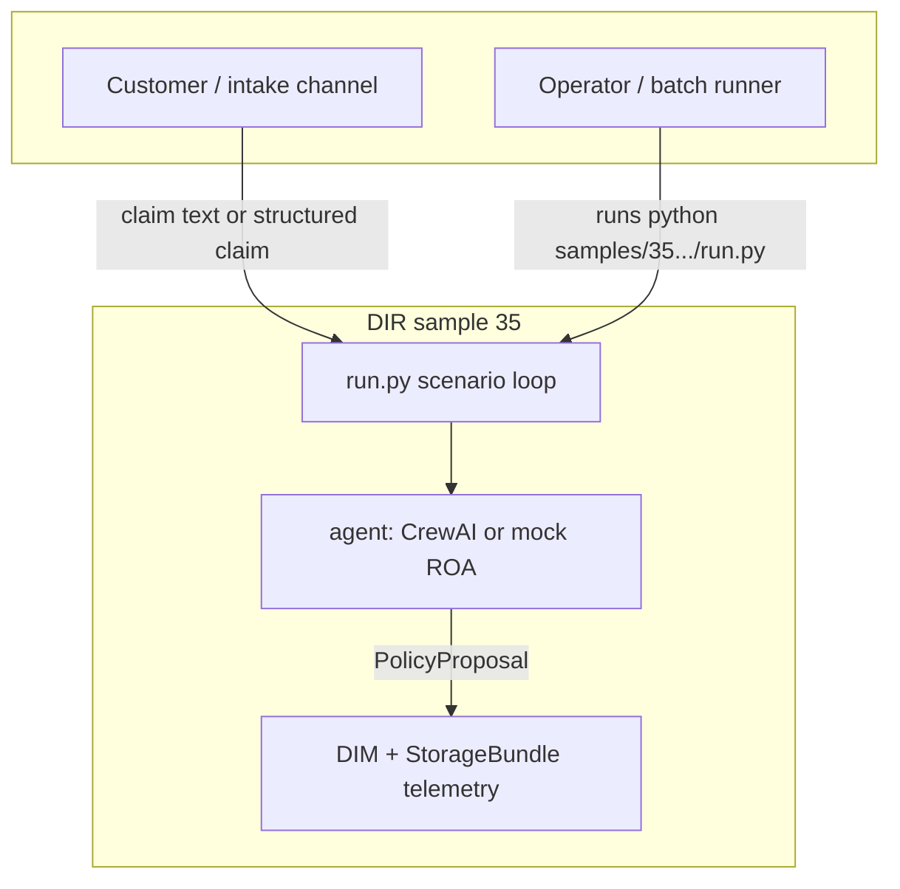
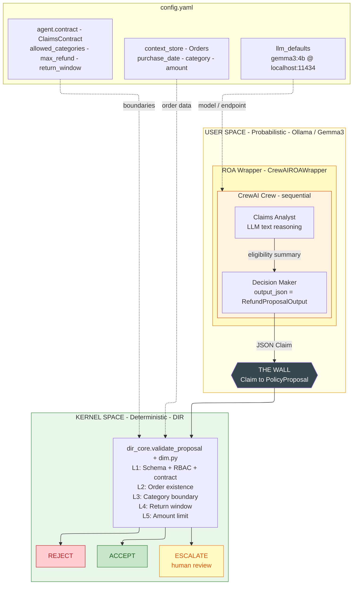
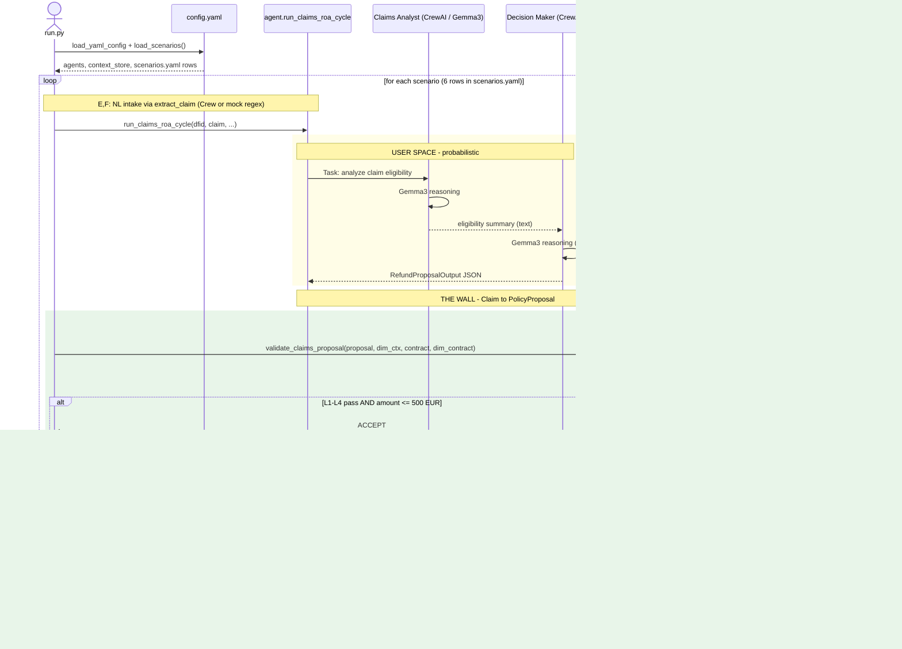
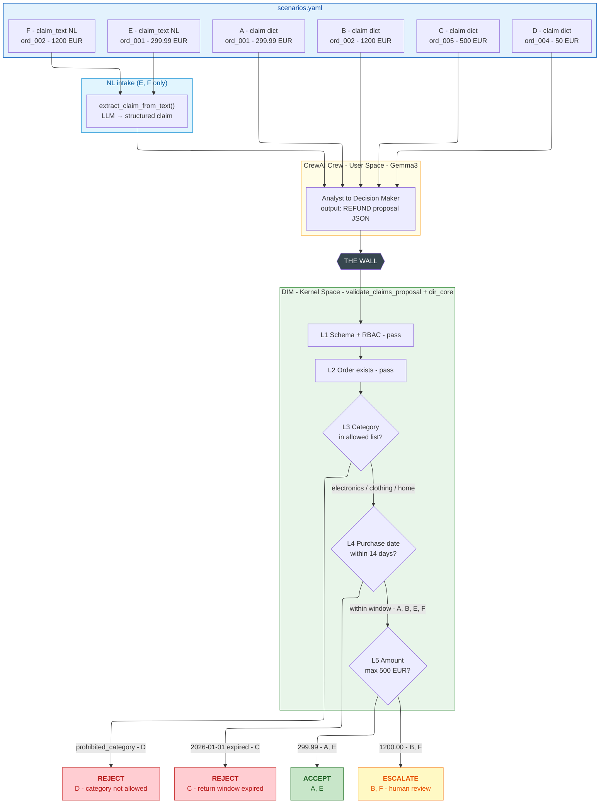

# 35 - CrewAI ROA Wrapper

**Goal:** Demonstrate that **Task-Oriented Agents (CrewAI) and Mission-Oriented Agents (ROA) can coexist**. Wrap a real CrewAI Crew in an ROA interface, producing structured JSON output (`output_json`) and converting it to DIR `PolicyProposal` (Claim) instead of direct execution (Fact). Prove the pattern with a **Customer Claims Agent** use case where the DIR Kernel rejects or escalates refund proposals based on return window, amount limits, and category boundaries.

**Topology:** classic (wrapper). **Mechanisms:** `AgentRegistry.handshake`, `ContextStore` sessions, `validate_proposal` from `dir_core` plus claims-specific rules in `dim.py`, `idempotency_key` on ACCEPT execution, `StorageBundle.decision_audit` via `telemetry.py`, scenario batch from `scenarios.yaml` (`schemas.load_scenarios`).

**DIR alignment:** ROA Manifesto §4–5 (Explain → Policy → Self-Check → Proposal; User Space vs. Kernel Space), §10 (Boxed Intelligence), DIR Architectural Pattern §6 (Decision Integrity Module).

## Use cases



---

## The Core Concept: Taming the Task-Oriented Crew

CrewAI Crews are **collaborative, task-driven agents** (e.g., Analyst + Decision Maker). They receive inputs, reason, call tools, and execute. They have no mission, no boundaries, no persistent responsibility. They are optimized for *"What can the crew do next?"*-not *"What is this crew responsible for?"* (ROA Manifesto §3).

This creates a fundamental mismatch. In production, Crews:

- Execute side effects directly (API calls, database writes)
- Lack authority boundaries (they may act outside their intended scope)
- Provide no deterministic safety guarantees

**The solution:** Wrap the Crew in an ROA shell. The Crew retains its reasoning power but is **forced** to output via structured JSON (`output_json` / `RefundProposalOutput`). That output does not execute. It passes intent over "The Wall" to the DIR Kernel Space.

The result: a mission-oriented Crew whose outputs are **Claims**, not **Facts**. A Claim becomes a Fact only after the Decision Integrity Module validates it and the Execution Engine runs it (DIR §6-7).

---

## Architecture

### Diagram 1 - System Overview: CrewAI wrapped by ROA, processed by DIR



## Execution flow

### Diagram 2 — end-to-end sequence for a single claim



### Diagram 3 - Test Scenarios: 6 claims through the DIM validation pipeline



### Key Difference from a Naive Crew

| | Naked CrewAI Crew | ROA-Wrapped Crew |
|---|---|---|
| Actions | Any tool, any API, any DB | Only structured JSON (`output_json`) |
| Enforcement | None (trust the LLM) | Deterministic DIM in Kernel Space |
| Output | Side effects (Facts) | Proposals (Claims) |
| Authority | Unbounded | `ClaimsContract` boundaries |

---

## The Claims Agent Scenario

### Analyst vs DIM - Who Validates What?

The **Claims Analyst** (LLM) analyzes only the **claim data** provided in the scenario - it has no access to Context Store. It can reason about boundaries (categories, limits) from the prompt text, but it may err (e.g., wrong return-window assessment). The **DIM** (Kernel Space) is the source of truth: it reads `purchase_date` and `category` from Context Store and enforces rules deterministically. If the Analyst says "OK" but the data contradicts - DIM rejects. This separation is intentional: User Space proposes, Kernel Space decides.

### Mission

Process customer claims fairly, within policy boundaries, without exceeding authority or escalating unnecessarily.

### Responsibility Contract (ClaimsContract)

| Field | Description |
|-------|-------------|
| `allowed_refund_categories` | Product categories agent may propose refunds for (e.g., electronics, clothing) |
| `max_refund_without_escalation` | EUR threshold-above requires human approval (ESCALATE) |
| `return_window_days` | Max days from purchase for automatic eligibility |

### Natural Language Intake (Scenarios E, F)

In production, customers write free-form text in English (e.g. *"I bought ord_001 for 299 EUR, defective product"*), not JSON. The LLM **extracts** structured claim data (`order_id`, `amount_eur`, `category`, `reason`) in a single call before the Crew processes it. This justifies the LLM: deterministic rules alone cannot parse natural language.

### Scenarios

| Scenario | Input | DIM Verdict | Reason |
|----------|-------|-------------|--------|
| **A** | Valid claim: within return window, amount ≤ 500 EUR | ACCEPT | All criteria met |
| **B** | Valid claim: amount > 500 EUR | ESCALATE | Human approval required |
| **C** | Claim outside return window (purchased 2026-01-01) | REJECT | Outside return_window_days |
| **D** | Claim for prohibited category | REJECT | Category not in allowed_refund_categories |
| **E** | NL text: valid claim (ord_001, 299.99 EUR) | ACCEPT | LLM extracts → DIM validates |
| **F** | NL text: amount > 500 EUR (ord_002, 1200 EUR) | ESCALATE | LLM extracts → DIM escalates |

---

## Layout (Sample Guide §3)

| File | Role |
|------|------|
| `run.py` | Bootstrap, handshake, `ContextStore`, scenario loop, DIM, telemetry, idempotent execution |
| `config.yaml` | `database`, `llm_defaults`, `simulation`, `agents[]`, `context_store` |
| `scenarios.yaml` | Scenario rows with `context.claim` or `context.claim_text` and `expected` |
| `schemas.py` | `load_scenarios`, `parse_llm_json`, `CrewConfig`, contract payload helper |
| `contracts.py` | `ClaimsContract` built from YAML + `ResponsibilityContract` |
| `agent.py` | CrewAI Explain→Policy path, mock deterministic path, Self-Check, `PolicyProposal` |
| `dim.py` | `validate_claims_proposal` (wraps `dir_core.validate_proposal` + claims rules) |
| `telemetry.py` | `SIMULATION_*`, `AGENT_DECISION`, `CLAIM_REFUND_EXECUTED`, self-check failures |
| `mocks/llm_mock_strategy.py` | `make_mock_strategy` for `setup_environment` when mock is selected |

## Configuration

Runtime settings are split between **`config.yaml`** (persistence, LLM defaults, agents, authoritative `context_store`) and **`scenarios.yaml`** (batch inputs and expected DIM verdicts). `context_store.orders[*].purchase_date` must fall within `claims_bounds.return_window_days` of the wall-clock date you run against, or ACCEPT scenarios will see REJECT from the return-window rule.

```yaml
database:
  provider: sqlite
  db_path: "data/crewai_roa.db"

llm_defaults:
  model: "gemma3:4b"
  base_url: "http://localhost:11434"
  temperature: 0.2

simulation:
  run_id: "crewai_claims_batch_001"

agents:
  - agent_id: "claims_agent_v1"
    contract:
      role: EXECUTOR
      authorized_instruments: [electronics, clothing, home]
      allowed_policy_types: [REFUND, REPLACE, ESCALATE]
      escalate_on_uncertainty: 0.7
      max_drawdown_limit: 0.05
      wake_up_threshold_pct: 0.5
      parent_agent_id: null
    claims_bounds:
      max_refund_without_escalation: 500.0
      return_window_days: 14

context_store:
  orders:
    ord_001: { purchase_date: "...", category: electronics, amount: 299.99 }
```

| Section | Purpose |
|---------|---------|
| `database` | SQLite path anchored next to `config.yaml` via `setup_environment` |
| `llm_defaults` | Default Ollama endpoint; overridden by `OLLAMA_*` env vars when set |
| `simulation.run_id` | `simulation_id` in every telemetry `details` payload |
| `agents[].contract` | Canonical `ResponsibilityContract` fields for `YamlContractProvider` |
| `agents[].claims_bounds` | Claims-only limits read into `ClaimsContract` |
| `context_store` | Authoritative orders for DIM (not injected into the Crew prompt) |

## How to run

### Mock (no network, no Ollama, no CrewAI LLM calls)

Deterministic claim→proposal path and regex NL extraction for scenarios E–F.

```bash
pip install -e .
$env:PYTHONPATH="src;samples"; $env:USE_MOCK_LLM="1"   # PowerShell
python samples/35_crewai_roa_wrapper/run.py
```

### Ollama + CrewAI (full User Space)

```bash
pip install -e ".[crewai]"
ollama serve
ollama pull gemma3:4b
$env:PYTHONPATH="src;samples"
python samples/35_crewai_roa_wrapper/run.py
```

Unset `USE_MOCK_LLM` (or set it to `0`) so `configured_live_llm_is_reachable` can succeed; otherwise the sample stays on the mock path.

### Gemini

This sample wires **CrewAI** to the OpenAI-compatible **Ollama** endpoint. Gemini is not configured here; use mock or Ollama as above.

**Env var overrides** (Ollama):

```powershell
$env:OLLAMA_BASE_URL = "http://localhost:11434"
$env:OLLAMA_MODEL    = "gemma3:4b"
```

## Database storage

Events are written only through `bundle.decision_audit` (see `telemetry.py`). Typical `event` values for this sample: `SIMULATION_START`, `SIMULATION_END`, `AGENT_DECISION`, `CLAIM_REFUND_EXECUTED`, `CLAIMS_SELF_CHECK_FAILED`.

Group a run by `simulation_id` stored inside JSON `details` (Sample Guide §9.4):

```sql
-- SQLite
SELECT dfid, event, detail_json
FROM decision_audit_events
WHERE json_extract(detail_json, '$.simulation_id') = 'crewai_claims_batch_001'
ORDER BY id;
```

```sql
-- PostgreSQL
SELECT dfid, event, detail_json
FROM decision_audit_events
WHERE detail_json->>'simulation_id' = 'crewai_claims_batch_001'
ORDER BY id;
```

**Why `provider="openai"`?**
CrewAI's LLM class routes `provider="openai"` to the native OpenAI Python SDK.
Ollama exposes an OpenAI-compatible API at `/v1`, so no LiteLLM or extra dependencies needed:
```python
LLM(model="gemma3:4b", provider="openai",
    base_url="http://localhost:11434/v1", api_key="ollama")
```

---

## How the Interception Works (output_json instead of tool-calling)

Gemma3 (and most local Ollama models) **do not support OpenAI-style function calling**.
The original `Submit_Policy_Proposal` tool approach requires the model to call functions - Ollama returns HTTP 400 for such requests.

**Solution: `output_json` on the Decision Maker's Task.**

CrewAI's `output_json` parameter instructs the LLM to format its entire response as JSON matching a Pydantic schema, then validates and parses it automatically:

```python
class RefundProposalOutput(BaseModel):
    action: str       # always "REFUND"
    order_id: str
    amount_eur: float
    category: str
    reason: str

decide_task = Task(
    description="Based on the analyst's findings, produce a refund proposal...",
    output_json=RefundProposalOutput,  # ← no tool-calling needed
    agent=decision_maker,              # ← no tools=[] on the agent
)

result = crew.kickoff()
data = result.json_dict  # parsed + validated dict
proposal = PolicyProposal(..., params=data)
```

**Architecturally equivalent**: the LLM still produces a **Claim** (JSON proposal), which crosses "The Wall" to the DIM for deterministic validation before any **Fact** (execution) occurs. The boundary holds.

---

## Key Components

| Component | Purpose |
|-----------|---------|
| `ClaimsContract` | Defines authority boundaries (categories, amount limit, return window) |
| `extract_claim_from_text()` | **NL intake:** extracts structured claim from customer text (single LLM call) |
| `ClaimExtractionOutput` | Pydantic schema for NL extraction output |
| `RefundProposalOutput` | Pydantic schema for `output_json` - structured proposal from Decision Maker |
| `_extract_proposal_from_text()` | Fallback: parses JSON from raw LLM output when `output_json` parse fails |
| `agent.CrewAIROAWrapper` | Builds Crew per call, runs `kickoff()`, returns policy dict for Self-Check |
| `agent.run_claims_roa_cycle` | Mock or Crew path, Self-Check, emits `PolicyProposal` |
| `dim.validate_claims_proposal` | `dir_core.validate_proposal` then order, category, window, amount |
| `report_generator.py` | Dark-theme HTML audit report (Sample Guide §17) from `decision_audit` only |
| Context Store | Authoritative order data (source of truth for DIM, not for the agent) |

---

## HTML report

After a successful batch run, `run.py` writes
`results/report_<UTC>_<N>scenarios.html` and opens it in the default browser. The report
is self-contained (embedded CSS), uses only `bundle.decision_audit.all_events_chronological()`
plus registry and context snapshots, and follows §17 section order (summary, authored prose,
empty-state Section 3 charts, trace table, ROA blocks, authoritative orders table, kernel artefacts).

Regenerate without re-running the simulation:

```bash
$env:PYTHONPATH="src;samples"
python samples/35_crewai_roa_wrapper/report_generator.py
python samples/35_crewai_roa_wrapper/report_generator.py --simulation-id crewai_claims_batch_001
python samples/35_crewai_roa_wrapper/report_generator.py --output-path samples/35_crewai_roa_wrapper/results/custom.html
```

---

## Expected Output

```
======================================================================
35_crewai_roa_wrapper  -  CrewAI + Ollama + DIR Kernel
======================================================================
  Config : config.yaml
  LLM    : gemma3:4b @ http://localhost:11434
  Agent  : claims_agent_v1
  Crew   : Claims Analyst → Decision Maker (sequential, output_json)
  DIM    : 5-layer validation (RBAC, order, window, category, amount)
  Scenarios: 6

[SCENARIO A - Valid: within window & limit]
----------------------------------------------------------------------
  Claim:  order=ord_001  amount=299.99 EUR  cat=electronics
  Crew:   thinking... done.
  Proposal:   REFUND ord_001 299.99 EUR
  DIM Verdict: ACCEPT
  Reason:      Validation passed

[SCENARIO B - Amount > 500 EUR (human approval required)]
----------------------------------------------------------------------
  Claim:  order=ord_002  amount=1200.0 EUR  cat=electronics
  Crew:   thinking... done.
  Proposal:   REFUND ord_002 1200.0 EUR
  DIM Verdict: ESCALATE
  Reason:      Amount 1200.0 EUR exceeds max_refund_without_escalation (500.0 EUR)...

[SCENARIO C - Outside return window (purchased 2026-01-01)]
----------------------------------------------------------------------
  Claim:  order=ord_005  amount=500.0 EUR  cat=electronics
  Crew:   thinking... done.
  Proposal:   REFUND ord_005 500.0 EUR
  DIM Verdict: REJECT
  Reason:      Order ord_005 outside return window...

[SCENARIO D - Prohibited category]
----------------------------------------------------------------------
  Claim:  order=ord_004  amount=50.0 EUR  cat=prohibited_category
  Crew:   thinking... done.
  Proposal:   REFUND ord_004 50.0 EUR
  DIM Verdict: REJECT
  Reason:      Category 'prohibited_category' not in allowed_refund_categories...

[SCENARIO E - NL intake: valid claim (ord_001)]
----------------------------------------------------------------------
  Input (NL): I bought electronics order ord_001 for 299.99 EUR on 20 February 2026...
  Extracted: order=ord_001  amount=299.99 EUR  cat=electronics
  Crew:   thinking... done.
  Proposal:   REFUND ord_001 299.99 EUR
  DIM Verdict: ACCEPT
  Reason:      Validation passed

[SCENARIO F - NL intake: amount > 500 EUR (ord_002)]
----------------------------------------------------------------------
  Input (NL): Order ord_002 - laptop for 1200 EUR, 25 February 2026...
  Extracted: order=ord_002  amount=1200.0 EUR  cat=electronics
  Crew:   thinking... done.
  Proposal:   REFUND ord_002 1200.0 EUR
  DIM Verdict: ESCALATE
  Reason:      Amount 1200.0 EUR exceeds max_refund_without_escalation (500.0 EUR)...

======================================================================
[SUMMARY]
======================================================================
  ✓ ACCEPT      SCENARIO A - Valid: within window & limit
  ✓ ESCALATE    SCENARIO B - Amount > 500 EUR (human approval required)
  ✓ REJECT      SCENARIO C - Outside return window (purchased 2026-01-01)
  ✓ REJECT      SCENARIO D - Prohibited category
  ✓ ACCEPT      SCENARIO E - NL intake: valid claim (ord_001)
  ✓ ESCALATE    SCENARIO F - NL intake: amount > 500 EUR (ord_002)
```

---

## References

- [ROA Manifesto](../../docs/01-roa-manifesto/ROA_Manifesto.md) §3 (Responsibility Contract), §4-5 (Explain → Policy → Proposal), §10 (Boxed Intelligence)
- [DIR Architectural Pattern](../../docs/02-decision-runtime/DIR_Architectural_Pattern.md) §6 (Decision Integrity Module), §5 (Policies as Contracts)
- [Sample 34 - LangChain ROA Wrapper](../34_langchain_roa_wrapper/README.md) (same pattern, different framework)
