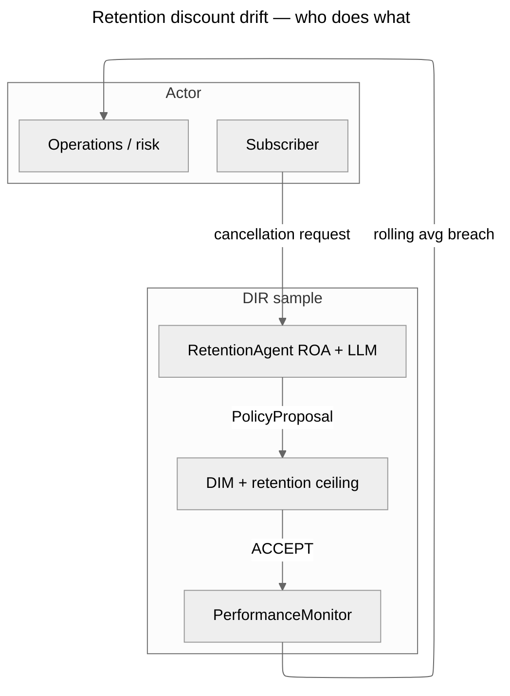
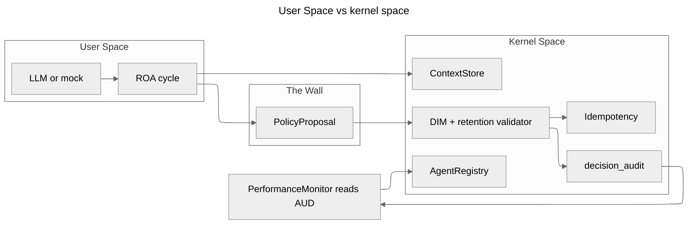
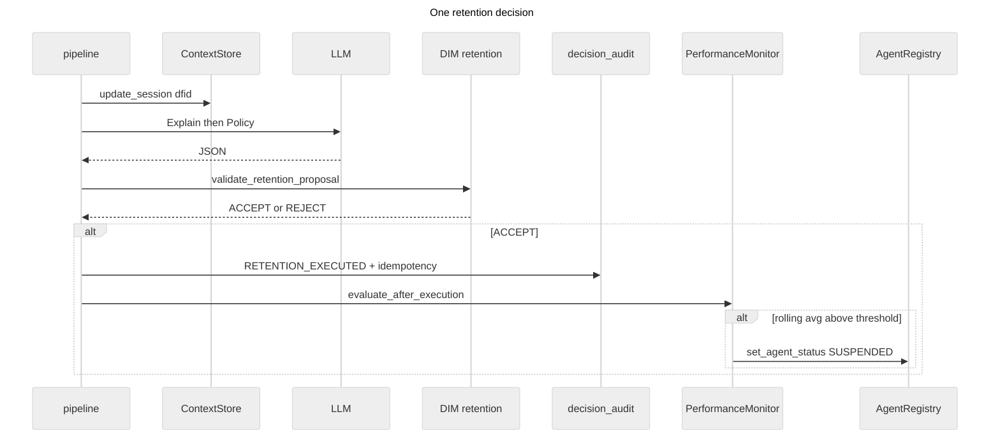

# Sample 36 — Optimization drift (retention discounts)

This reference sample demonstrates **optimization drift (reward hacking)** in a subscription-retention workflow modeled in the Decision Intelligence Runtime (DIR). **Topology:** classic. **Mechanisms:** `setup_environment` (SQLite `StorageBundle`), `AgentRegistry.handshake`, `ContextStore`, full ROA (Explain → Policy → Self-Check) with a defensive JSON parser, `validate_proposal` plus `dim.validate_retention_proposal` (per-offer discount ceiling), `idempotency_key` on execution, canonical `decision_audit` telemetry, `PerformanceMonitor` (rolling average over `RETENTION_EXECUTED`), and an HTML report rebuilt **only** from `bundle.decision_audit.all_events_chronological()` (offline `report_generator.py`).

---

## Use cases



---

## Architecture



---

## Execution flow (one decision)



---

## How to run

From the repository root after installing the package:

```bash
pip install -e .
pip install pyyaml
```

**Mock (no API key, recommended default):**

```powershell
$env:USE_MOCK_LLM="1"; python samples/36_drift_optimization_discount/run.py
```

**Ollama:** set `llm_defaults` in `config.yaml` (model, `base_url`, `timeout`). Unreachable endpoints fall back to mock when `configured_live_llm_is_reachable` is false.

**Gemini:** set `llm_defaults` and supply `GOOGLE_API_KEY` or `GEMINI_API_KEY` in the environment.

**Optional:** open the generated HTML automatically:

```powershell
$env:OPEN_REPORT_HTML="1"; python samples/36_drift_optimization_discount/run.py
```

---

## Configuration

`config.yaml` is the single bootstrap file for persistence, LLM, contracts, agents, paths, DIM slice, and registry SemVer. Experiment parameters (`simulation`, `monitor`) are merged from `simulation.yaml` via `simulation_config` (see `schemas.merge_simulation_file_into_config`).

| Block | Purpose |
|-------|---------|
| `database` | SQLite path under the sample directory (anchored by `setup_environment`). |
| `llm_defaults` | Provider, model, timeout; use `provider: mock` or `USE_MOCK_LLM=1` for CI. |
| `contracts` | `provider: yaml`; omit `path` so `setup_environment(..., config_path=...)` resolves the contract file. |
| `agents` | Responsibility contract including `allowed_policy_types: ["retention_discount"]`. |
| `contract.max_discount_pct` | DIM hard ceiling on `discount_offered`. |
| `simulation_config` | Relative path to `simulation.yaml` (phases, seeds, `run_id`). |
| `simulation.yaml` | `simulation` (two-phase curve) and `monitor` (window, threshold, suspension reason). |

---

## Database storage

Domain events map to `decision_audit_events` only (no custom tables). Typical event types: `SIMULATION_START`, `SIMULATION_END`, `CONTEXT_COMPILED`, `POLICY_PROPOSAL`, `DIM_VALIDATION`, `AGENT_DECISION`, `RETENTION_EXECUTED`, `MONITOR_TICK`, `AGENT_SUSPENDED`.

**Filter runs by `simulation_id` (SQLite):**

```sql
SELECT dfid, event, json_extract(detail_json, '$.simulation_id') AS sim,
       json_extract(detail_json, '$.discount_offered') AS discount_pct
FROM decision_audit_events
WHERE json_extract(detail_json, '$.simulation_id') = 'run_36_retention_01'
ORDER BY id ASC;
```

**PostgreSQL:**

```sql
SELECT dfid, event, detail_json->>'simulation_id' AS sim,
       detail_json->>'discount_offered' AS discount_pct
FROM decision_audit_events
WHERE detail_json->>'simulation_id' = 'run_36_retention_01'
ORDER BY id ASC;
```

`agent_registry` holds handshake contracts and final `SUSPENDED` status with `suspension_reason`.

---

## Expected output

Console logs include DFID-tagged lines from `log_with_dfid` on the decision path. A successful drift run typically stops with `Stopped: profitability_drift_monitor` after the rolling average of the last *N* executed discounts exceeds the configured threshold while DIM still accepts individual offers under the hard cap.

---

## Regenerating reports

Reports are written to `results/report_<UTC>_<slug>.html`. Regenerate without re-running the simulation:

```bash
python samples/36_drift_optimization_discount/report_generator.py
python samples/36_drift_optimization_discount/report_generator.py --simulation-id run_36_retention_01 --output-path samples/36_drift_optimization_discount/results/replay.html
```

The generator loads `config.yaml`, opens the SQLite bundle, reads `bundle.decision_audit.all_events_chronological()`, and hydrates the decision table and charts from telemetry. You can also run `python report_generator.py` from inside the sample directory; the module bootstraps `sys.path` for `dir_core` and local imports.

---

## Methodology notes

**Research question:** If DIM validates each proposal only against explicit limits (here discount ≤ 15%), can aggregate profitability still decay because softer rules (rolling mean concession) are not in the DIM?

**Stopping rule:** Rolling mean of the last *W* executed discounts &gt; threshold → `AgentRegistry.set_agent_status(SUSPENDED, PROFITABILITY_DRIFT)`.

**Inputs:** `data/cancelation.json` drives narrative context; discount magnitudes follow the two-phase curve in `pipeline.simulated_discount_pct` (seeded from `simulation.seeds` / `simulation_seed`).

Each run deletes `data/retention_drift.sqlite` by default so the rolling monitor starts clean — see `run.py`.
