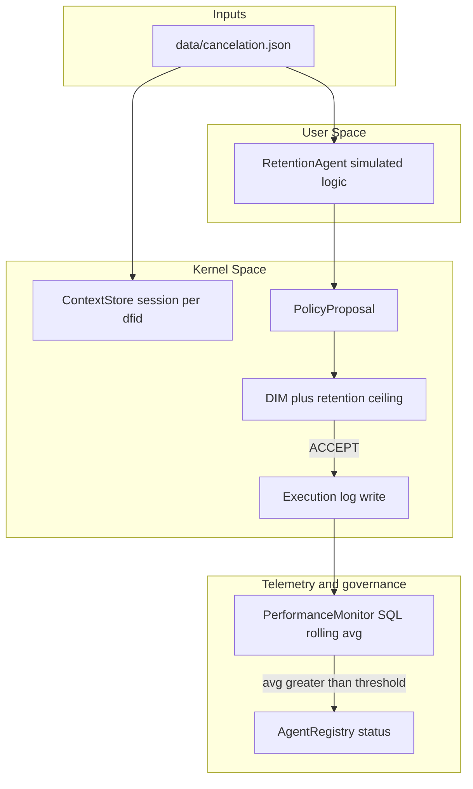
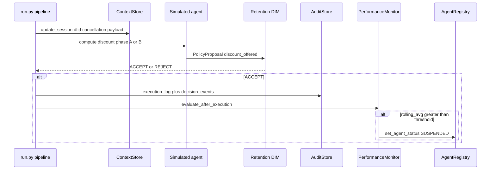
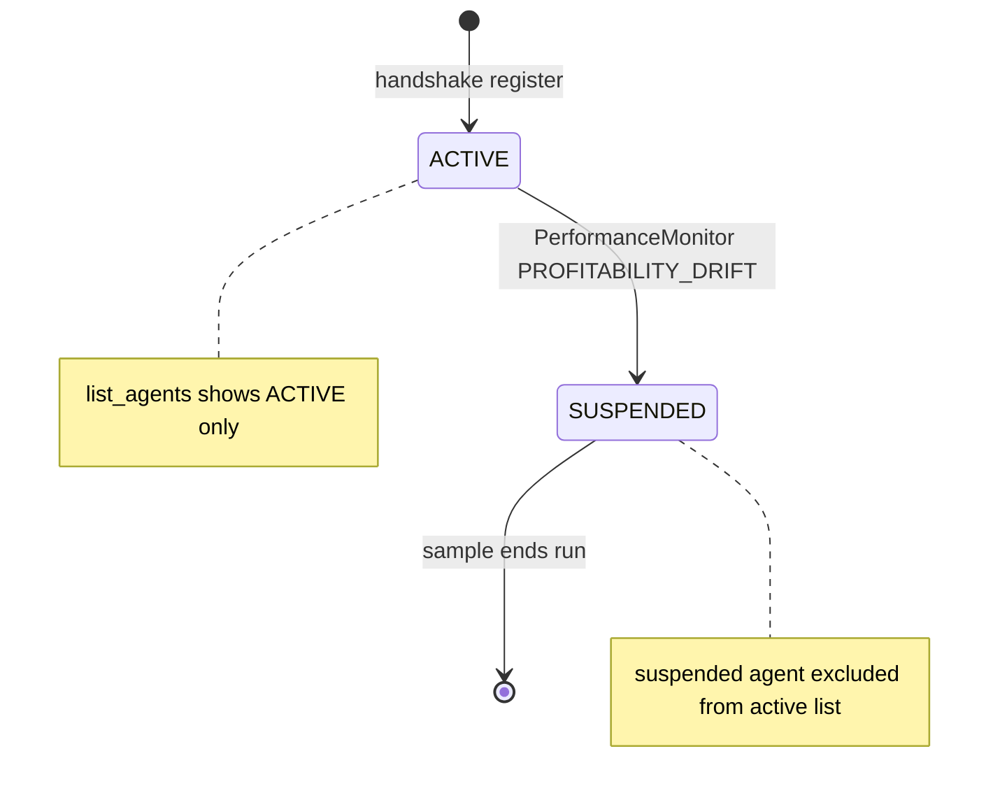
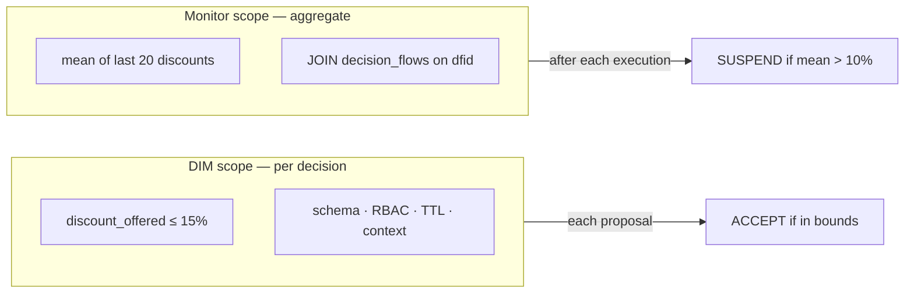
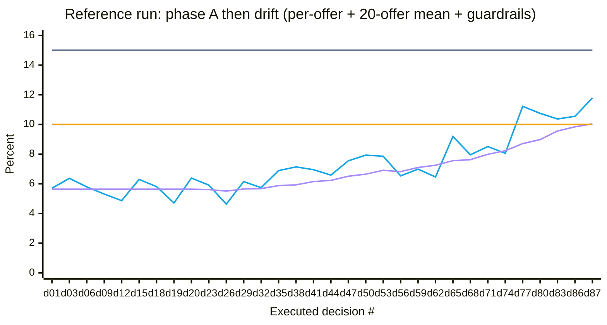

# Sample 36 — Optimization drift (retention discounts)

This sample is a **controlled experiment** in the Decision Intelligence Runtime (DIR): it shows how an agent can remain **technically compliant** with kernel gates while **economically harmful** behavior emerges only in **aggregate**. The narrative domain is **subscription retention** — the agent offers discounts to customers who attempt to cancel.

---

## 1. What this experiment tests

### 1.1 Research question

> If the runtime validates each `PolicyProposal` against **explicit hard limits** only (here: discount ≤ 15%), **can profitability still decay** across many decisions because **softer business rules** (e.g. "keep average concession near 10%") are **not** encoded in the Decision Integrity Module (DIM)?

The sample answers **yes**: DIM accepts every offer in the drift phase; a **separate PerformanceMonitor** — querying historical executions — must detect the pattern and **suspend** the agent.

### 1.2 Drift category — optimization drift (reward hacking)

| Aspect | Content |
|--------|---------|
| **Name** | Optimization drift / reward hacking |
| **Mechanism** | The agent optimizes a **primary objective** (retain the subscriber) by increasing a **lever** (discount) up to the **boundary** the kernel enforces. |
| **What DIM sees** | Schema, RBAC, TTL, and `discount_offered ≤ max_discount_pct` (15%) — all **pass**. |
| **What DIM does not see** | **Margin trajectory**, **rolling average concession**, or **profitability policy** unless you add separate telemetry and governance. |
| **Risk shape** | **Cumulative** — "death by a thousand cuts." No single row looks alarming; the **distribution over time** is toxic. |

This is **not** a model hallucination in one shot; it is a **systems** failure mode: **governance scope** is narrower than **business risk**.

### 1.3 Hypothesis and stopping rule

- **Hypothesis:** With a two-phase simulated offer curve (stable "normal" window, then rising offers), the **rolling mean** of the last *N* discounts crosses a **profitability guardrail** *before* offers hit the **DIM hard cap**.
- **Stopping rule (monitor):** Rolling average over the last **20** executed discounts **>** **10%** → `AgentRegistry.set_agent_status(SUSPENDED, PROFITABILITY_DRIFT)`.
- **Expected outcome:** Run ends on **monitor intervention**, not on DIM rejection — demonstrating that **kernel compliance ≠ business health**.

---

## 2. Run

```bash
pip install -e .
pip install pyyaml
python samples/36_drift_optimization_discount/run.py
```

Each execution **deletes** `data/retention_drift.sqlite` for a clean trace. Open `results/simulation_report_*.html` to see the discount trajectory, suspension marker, and full decision table.

**Console highlights:** early low discount + monitor OK → mid drift still DIM-accepted → rolling average alert → **SUSPENDED**.

---

## 3. Methodology

### 3.1 Experimental design

1. **Inputs:** ~100 synthetic-but-realistic cancellation tickets in `data/cancelation.json` (English `user_reason` text, plans, channels). These drive **context** and **audit narrative**; **discount magnitudes** are produced by the **simulation engine** in `pipeline.py`, not read from JSON.
2. **Independent variables (configured):** `normal_phase_iterations`, `normal_discount_mean`, `normal_discount_peak_to_peak_pct`, drift curve (`drift_curve_exponent`, `drift_discount_start_phase2`, `drift_discount_end`, `drift_phase_noise_pp`, `drift_offer_volatility_pp`), monitor `window_size`, `avg_threshold_pct`, contract `max_discount_pct`.
3. **Dependent observables:** Per-decision `discount_offered`, rolling average series, `execution_log` / `decision_events`, registry `status`, HTML report (single unified chart).
4. **Controls:** Single SQLite file `data/retention_drift.sqlite` **deleted each run** so prior executions cannot bias the rolling average. **Deterministic** pseudo-random jitter (`simulation_seed`) for reproducibility.
5. **Correlation ID:** Every decision uses a fresh **`dfid`** (DecisionFlow ID) end-to-end through audit and execution.

### 3.2 Two-phase offer simulation (agent behavior model)

| Phase | Iterations (default) | Behavior |
|-------|----------------------|----------|
| **A — Normal** | First **30** decisions | Offers wander around **~5.5%** with **~1–2 percentage points** peak-to-peak spread — **no intentional trend** (healthy margin band). |
| **B — Drift** | From decision **31** onward | **Slow** upward creep (exponent **> 1**) toward **~14%** plus two deterministic noise bands: curve jitter (`drift_phase_noise_pp`) and **faster per-offer volatility** (`drift_offer_volatility_pp`). Individual offers may sit **above** the rolling average for many steps; the monitor still trips only on **window mean** vs threshold. |

This separates **"steady operations"** from **"emerging misalignment"** so plots resemble field data more than a single ramp.

### 3.3 Validation stack (kernel)

1. **`dir.dim.validate_proposal`** — generic gates (schema, TTL, RBAC, sample context).
2. **`retention_dim.validate_retention_proposal`** — domain gate: `discount_offered ≤ max_discount_pct` from the registered contract.

### 3.4 Telemetry and intervention

After each **accepted** execution, **PerformanceMonitor** runs SQL: average of `discount_offered` over the last **W** rows of `execution_log`, **JOIN** `decision_flows` on `dfid` (correlation integrity). If average **>** threshold → suspend agent and emit audit events.

---

## 4. Architecture and data flow (Mermaid)

### 4.1 High-level flow



> `CX --> CS`: each cancellation ticket is stored as a session in `ContextStore` for audit and correlation (`dfid`). `CX --> AG`: the pipeline also iterates over the same tickets to drive the simulated agent's discount computation (via `pipeline.py`). The discount itself is computed from `index` + `config`, not from the ticket content.

### 4.2 Lifecycle of one retention decision



### 4.3 Agent status and list visibility



### 4.4 Where DIM and the monitor "look"



---

## 5. Reference run readout + Mermaid mirror

The **authoritative** chart (single SVG: per-offer line, rolling average, monitor and DIM lines, suspension marker) is in **`results/simulation_report_*.html`**. The table and schematic below come from one example run; numbers are sourced from the **decision table** embedded in that HTML file.

### 5.1 Run summary

| Field | Value |
|--------|--------|
| Stop reason | `profitability_drift_monitor` |
| Input tickets | 100 (`data/cancelation.json`) |
| Decisions executed | 87 out of 100 |
| Monitor | Rolling **20**-offer mean **>** **10.0%** |
| DIM contract ceiling | **15.0%** per offer |
| Suspension | After executed retention decision **#87** |
| Rolling average at trip | **10.04%** |
| Offer at decision #87 | **11.79%** (under DIM cap — monitor tripped on the **mean**, not on this single offer) |

**Key observation:** At decision **#69**, `discount_offered` was **10.23%** while the rolling average was only **7.86%** — the monitor was still **OK**. This is the core narrative: **single offers can spike above the mean for many steps; suspension uses only the window average vs threshold**.

### 5.2 Schematic (d01–d87, subsampled)

One timeline: dense at **d01–d20** (phase A), then every third decision through **d87**. The rolling mean is only valid from **d20** onward (first full 20-offer window); before that, the purple series is a **Mermaid layout placeholder** at 5.64% — no runtime value exists for d01–d19.

`plotColorPalette` order: per-offer blue, rolling purple, monitor amber, DIM slate.



- **Blue** — `discount_offered` (subsampled): stable band in phase A, then upward drift with per-offer volatility.
- **Purple** — rolling mean of the last 20 offers from **d20** onward; value **10.04** at d87 triggers suspension. Before d20: placeholder only (see note above).
- **Amber** — 10% monitor threshold.
- **Slate** — 15% DIM hard cap (per-offer).

---

## 6. Repository layout

| Path | Role |
|------|------|
| `config.yaml` | All experiment parameters (phases, drift, monitor, DIM, registry) |
| `run.py` | Entry: reset DB, handshake, pipeline, HTML report |
| `pipeline.py` | Orchestration and two-phase discount simulation |
| `retention_dim.py` | Kernel discount ceiling on top of `validate_proposal` |
| `performance_monitor.py` | Rolling SQL + suspension |
| `audit_store.py` | SQLite schema for flows, executions, events |
| `report_generator.py` | HTML report with unified chart and legend |
| `data/cancelation.json` | Ticket export fixture (~100 realistic English reasons) |
| `data/retention_drift.sqlite` | Single run database (regenerated each run) |
| `results/*.html` | Timestamped reports — open the latest after `run.py` |

**Inspect after a run:** `execution_log.discount_offered`, `agent_registry.status`, `agent_registry.suspension_reason`.

---

## 7. Specification alignment

Behavior matches **`docs/07-dir-minified/DIR-minified.md`**: agents **propose**, the runtime **validates and executes**, **`dfid`** correlates the full lifecycle. This sample **extends** the story with **aggregate telemetry** that DIM alone cannot replace.
