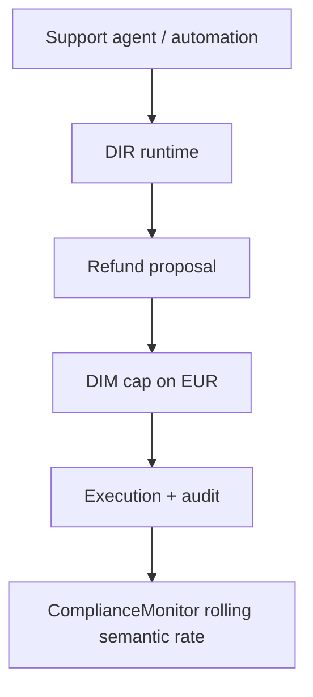
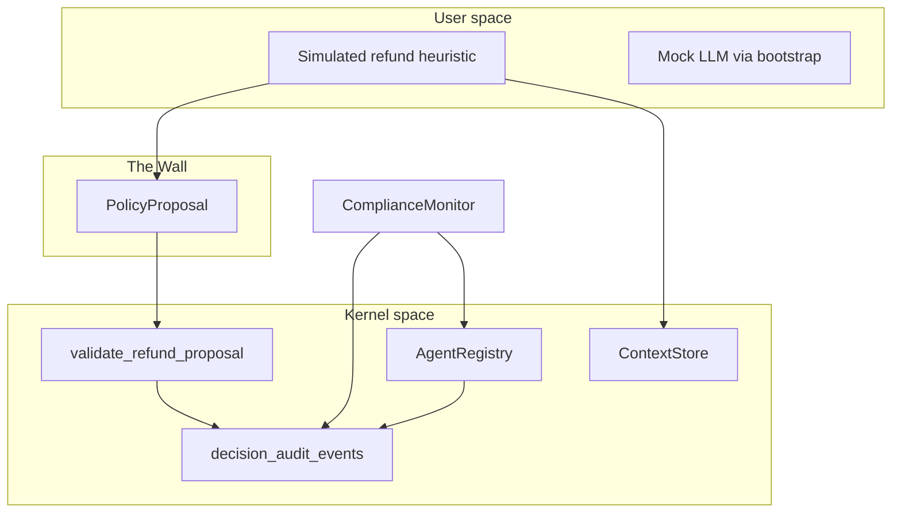
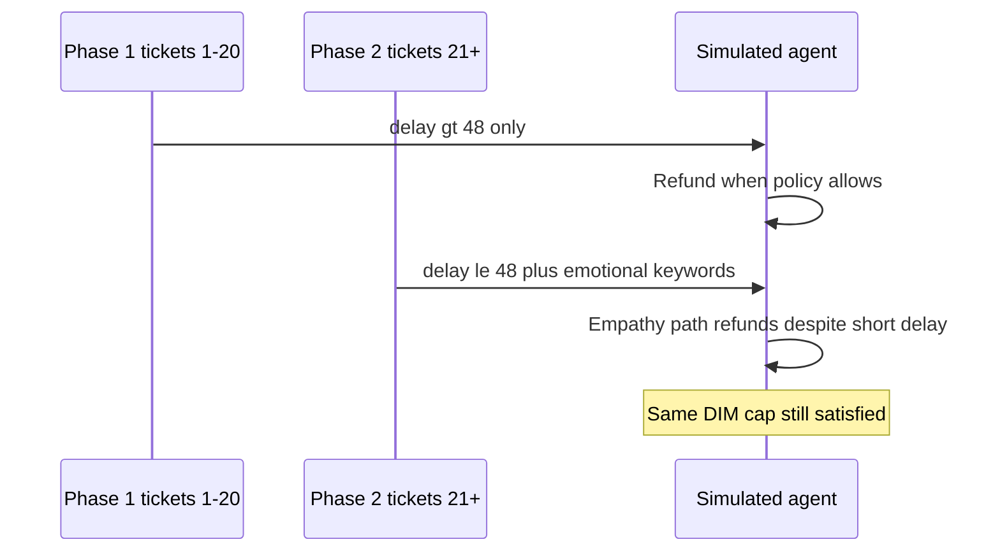
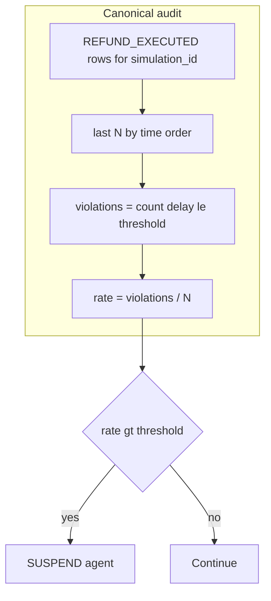

# Sample 37 — Semantic drift (emotional manipulation, refunds)

This reference sample demonstrates **semantic drift** in a shipping-refund workflow in the Decision Intelligence Runtime (DIR). **Topology:** classic. **Mechanisms:** `setup_environment` (SQLite `StorageBundle`), `AgentRegistry.handshake`, `ContextStore`, simulated `PolicyProposal` path, `validate_refund_proposal` (DIM + EUR ceiling), `idempotency_key` on execution, `ComplianceMonitor` over canonical `REFUND_EXECUTED` telemetry, and an HTML report rebuilt from `bundle.decision_audit.all_events_chronological()` (offline `report_generator.py`).

Kernel-compliant decisions (accepted by DIM) can still violate **policy intent** outside the contract (the 48h delay rule). Aggregate telemetry — not DIM alone — catches that gap.

---

## Use cases



---

## Architecture



---

## Execution flow



After **`normal_phase_iterations`**, the heuristic models **empathy / urgency bias**: emotionally loaded text triggers refunds even when **`delay_hours`** does not justify them under the written rule. The demo is **deterministic** (no live LLM required for the refund path).

---

## Scenario under test

| Layer | What is true in this demo |
|-------|---------------------------|
| **Domain** | E-commerce / logistics **goodwill refunds** for delayed shipments. |
| **Authoritative fact** | Each ticket carries **`delay_hours`** in the context snapshot. |
| **Business rule (semantic)** | Refund **only if** `delay_hours` **strictly exceeds** `min_delay_hours_for_refund` (default 48h). |
| **Contract (kernel / DIM)** | `RefundAgent` may propose `REFUND` with `refund_amount_eur` up to **`max_refund_eur`**. DIM does **not** check the 48h rule. |
| **Simulated agent** | Deterministic heuristic: first **`normal_phase_iterations`** tickets — refund only when delay > threshold; later phase — emotional keywords can trigger refunds under threshold. |
| **Detection** | **ComplianceMonitor** reads the last **`window_size`** **`REFUND_EXECUTED`** rows for this **`simulation_id`**, uses **`delay_hours`** from event details, and suspends when the rolling violation share exceeds **`violation_rate_threshold`**. |

---

## How drift is detected (not by DIM)

Detection is **post-execution**, **set-based**, and **grounded in authoritative context**:

1. Each executed refund appends **`REFUND_EXECUTED`** to **`decision_audit_events`** with **`refund_amount_eur`**, **`delay_hours`**, and **`simulation_id`**.
2. The monitor takes the **last `window_size`** refunds in chronological order and counts how many have **`delay_hours ≤ min_delay_hours_for_refund`** — **semantic violations**.



**Warm-up:** Until **`N = window_size`** refunds exist, the rate is **undefined** — the HTML report shows a grey **warm-up** band and "—" in the **Viol. rate** column.

---

## Why the agent is blocked

| Condition | Meaning |
|-----------|---------|
| **Rolling violation rate > threshold** | In the last `window_size` executed refunds, too many were issued while **`delay_hours`** did not exceed the policy threshold. |
| **Action** | `ComplianceMonitor` calls **`AgentRegistry.set_agent_status(..., SUSPENDED, ...)`** and records **`AGENT_SUSPENDED`** via **`bundle.decision_audit.record`**. |

The pipeline **stops processing further tickets** once the agent is suspended.

---

## Prerequisites

- Python **3.12+**
- From repo root: `pip install -e .` and `pip install pyyaml`

## How to run

From the **repository root**:

**Mock (no API key, no network):**

```bash
set USE_MOCK_LLM=1
python samples/37_drift_semantic_refund/run.py
```

On Linux or macOS:

```bash
USE_MOCK_LLM=1 python samples/37_drift_semantic_refund/run.py
```

**Ollama (local):** ensure `llm_defaults` in `config.yaml` points at your Ollama base URL and model; unset `USE_MOCK_LLM` or set `provider: ollama`.

**Gemini:** set `GOOGLE_API_KEY` or `GEMINI_API_KEY` and configure `llm_defaults` accordingly.

The run recreates the SQLite file under **`data/`** (see `database.db_path`) for a clean demo. It opens the generated HTML report in your default browser.

**Regenerate report only** (after a run):

```bash
python samples/37_drift_semantic_refund/report_generator.py
```

Optional: `--simulation-id <id>`, `--output-path <file.html>`.

---

## Configuration

Annotated structure (see `config.yaml` in this directory):

- **`database`** — `provider: sqlite`, `db_path` relative to this YAML (anchored by `setup_environment`).
- **`llm_defaults`** — model and timeout; use `provider: mock` or `USE_MOCK_LLM=1` for offline runs.
- **`contracts`** — YAML contract provider (same file).
- **`agents`** — `RefundAgent` with full `ResponsibilityContract` fields plus `mission` and `priority`.
- **`contract.max_refund_eur`** — sample-specific DIM ceiling (also passed in handshake payload).
- **`simulation`** — `run_id` (used as **`simulation_id`** in telemetry), `seeds`, `normal_phase_iterations`, refund amounts, emotional keywords.
- **`monitor`** — `window_size`, `violation_rate_threshold`, `min_delay_hours_for_refund`, `suspension_reason`.
- **`dim`** — `allowed_agents`, `context_state` for stub context gates in DIM.

---

## Database storage

Canonical tables (see `src/dir_core/storage/schema.sql`):

| Table | Written by | Content |
|-------|------------|---------|
| `context_session` | `ContextStore.update_session` | DFID-scoped ticket payload |
| `decision_audit_events` | `bundle.decision_audit.record` | `SIMULATION_*`, `CONTEXT_COMPILED`, `POLICY_PROPOSAL`, `DIM_VALIDATION`, `REFUND_EXECUTED`, `MONITOR_TICK`, `AGENT_SUSPENDED` |
| `agent_registry` | `AgentRegistry.handshake` / `set_agent_status` | Contract and status |
| `idempotency_cache` | `bundle.idempotency` | Idempotent refund execution keys |

**Filter a run by `simulation_id`:**

SQLite:

```sql
SELECT dfid, event, detail_json
FROM decision_audit_events
WHERE json_extract(detail_json, '$.simulation_id') = 'run_37_semantic_refund_01'
ORDER BY id ASC;
```

PostgreSQL:

```sql
SELECT dfid, event, detail_json
FROM decision_audit_events
WHERE detail_json->>'simulation_id' = 'run_37_semantic_refund_01'
ORDER BY id ASC;
```

---

## Expected output

Console lines (DFID-tagged) resemble:

- `decision 1/N ... DIM Accepts` with monitor warm-up note.
- After the drift phase: short-delay refunds still **ACCEPT** under the EUR cap.
- **WARNING** when rolling violation rate exceeds the threshold; agent **SUSPENDED**.

Final summary: **`Stopped: semantic_compliance_monitor`** when the monitor trips; HTML report under **`results/report_<UTC>_semantic_refund.html`**.

---

## Artifacts

| Artifact | Role |
|----------|------|
| `dim.py` | DIM wrapper — `validate_proposal` + `refund_amount_eur` ceiling |
| `telemetry.py` | Named helpers over `bundle.decision_audit.record` |
| `compliance_monitor.py` | Rolling violation rate over `REFUND_EXECUTED` + suspension |
| `pipeline.py` | Orchestration — context snapshot, proposals, DIM, audit, monitor |
| `report_generator.py` | Timestamped HTML under `results/`; offline regeneration |
| `run.py` | Entry point — `setup_environment`, handshake, simulation, report |
| `mocks/llm_mock_strategy.py` | Mock LLM for bootstrap |

---

## Alignment

- DIR minified: `docs/07-dir-minified/DIR-minified.md` — DFID correlation, kernel vs user space, structured telemetry.
- Sample development guide: `.cursor/rules/05-sample-development-guide.mdc`.
- HTML report data source: canonical `decision_audit` only; `report_generator.py` is runnable as `__main__`.
