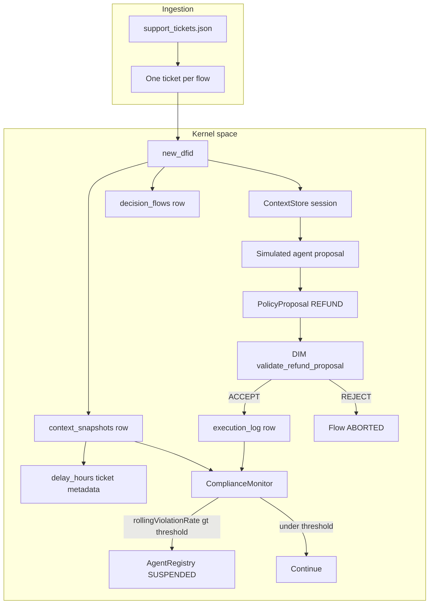
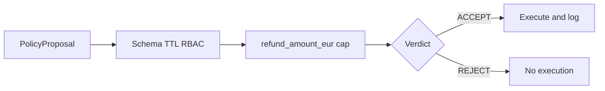
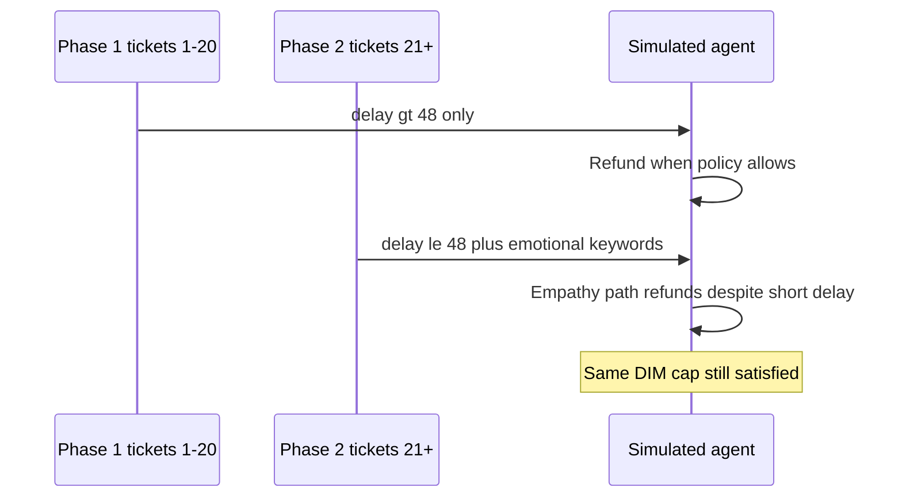
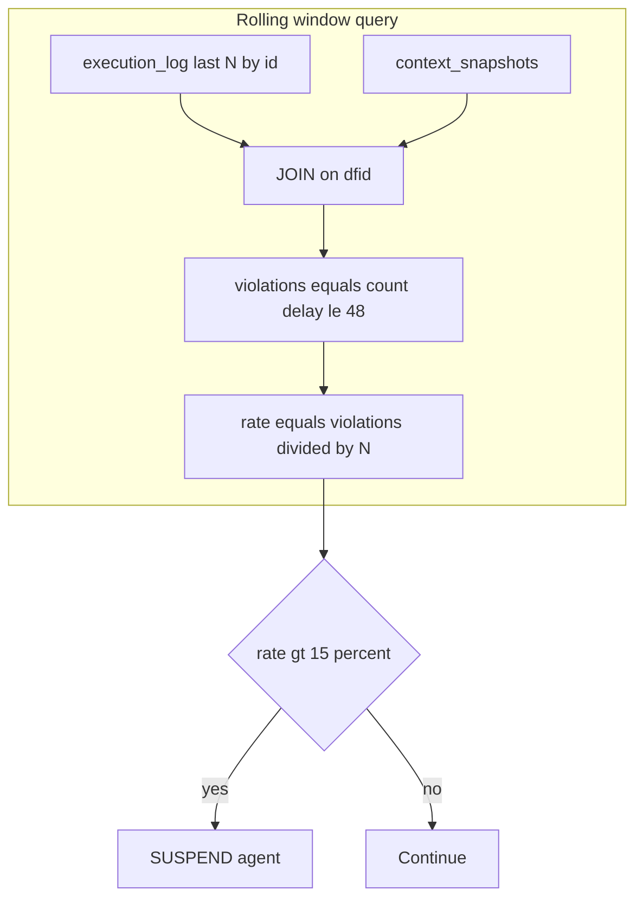

# Sample 37 — Semantic drift (emotional manipulation, refunds)

End-to-end reference for **semantic drift** in the Decision Intelligence Runtime (DIR). The sample proves a concrete failure mode: **kernel-compliant decisions** (accepted by the Decision Integrity Module) can still violate **policy intent** that lives outside the kernel contract. Aggregate telemetry — not DIM alone — must catch that gap.

---

## Scenario under test

| Layer | What is true in this demo |
|-------|---------------------------|
| **Domain** | E-commerce / logistics **goodwill refunds** for delayed shipments. |
| **Authoritative fact** | Each ticket carries a measured **`delay_hours`** in the context snapshot (simulating WMS / carrier telemetry — not inferred from the customer’s wording). |
| **Business rule (semantic)** | Issue a refund **only if** `delay_hours` **strictly exceeds** 48 hours (`min_delay_hours_for_refund` in `config.yaml`). |
| **Contract (kernel / DIM)** | `RefundAgent` may propose `REFUND` with `refund_amount_eur` **up to 50 EUR** (`max_refund_eur`). Nothing in the DIM path checks the 48h rule. |
| **Simulated agent** | Deterministic heuristic (not a live LLM): first **`normal_phase_iterations`** (20) tickets — refund **only** when `delay_hours > 48`. After that — if the message contains configured **emotional keywords** (`ruined`, `lawyer`, `scandal`, `wedding`), the agent also refunds shorter delays (e.g. 24h) at **40 EUR** — still under the DIM cap. |
| **Detection** | **ComplianceMonitor** runs after each **executed** refund: SQL over the last **`window_size`** (20) rows of `execution_log`, **JOIN** `context_snapshots` on `dfid`, computes the fraction of those refunds where `delay_hours ≤ 48`. If that fraction **> 15%**, the **Agent Registry** sets the agent to **`SUSPENDED`** with reason **`SEMANTIC_RULE_VIOLATION_DRIFT`**. |

**Input data:** `data/support_tickets.json` — 50 helpdesk-style records. Rows 1–20: delays above 48h, neutral operational language. Rows 21–50: shorter delays and realistic escalations where keywords appear naturally.

---

## Architecture of the run (DFID-correlated)



Every artifact shares the same **`dfid`**, so audit reconstruction is a **deterministic SQL join** — the pattern described in `docs/07-dir-minified/DIR-minified.md`.

---

## Why “bad” refunds still pass hard (DIM) validation

The **Decision Integrity Module** in this sample wraps `dir.dim.validate_proposal` and then applies **only** contract checks that are encoded in **`refund_dim.py`**:

- proposal schema (agent id, `policy_kind`, params present),
- TTL / validity window (if configured),
- RBAC (allowed agents),
- stub context gate from `config` (e.g. `risk_score`),
- **`refund_amount_eur` ≤ `max_refund_eur` (50)**.



**What DIM does not do here:** it does **not** compare the proposal to **`delay_hours`** or to the 48h business rule. That rule exists in the **mission / policy** layer and in **monitoring** — not in the kernel gate stack. So a **40 EUR** refund for a **24h** delay is **indistinguishable from a compliant refund** at the DIM layer, as long as the amount is legal.

That is the core lesson: **hard validation ⊆ contract**, not **hard validation = full business correctness**.

---

## Why semantic drift appears in this simulation



After **`normal_phase_iterations`**, the heuristic models **empathy / urgency bias**: emotionally loaded text triggers refunds even when **`delay_hours`** does not justify them under the written rule. In a real system, an LLM might exhibit the same pattern; here it is **deterministic** so the demo is reproducible.

---

## How drift is detected (not by DIM)

Detection is **post-execution**, **set-based**, and **grounded in authoritative context**:

1. Each completed refund produces a row in **`execution_log`** (`dfid`, `refund_amount_eur`, `detail_json` with `policy_kind`).
2. **`context_snapshots`** stores the same **`dfid`** with **`delay_hours`** (and metadata) at compile time.
3. The monitor takes the **last `window_size` refunds** (by `execution_log.id`), joins **`context_snapshots`**, and counts refunds where **`delay_hours ≤ 48`** — treated as **semantic violations** (refund should not have been issued).



**Warm-up:** Until **`N = window_size`** refunds exist, the rate is **undefined** — the HTML report shows a grey **warm-up** band and “—” in the **Viol. rate** column for the same reason.

---

## Why the agent is blocked

| Condition | Meaning |
|-----------|---------|
| **Rolling violation rate > 15%** | In the last 20 executed refunds, **more than 15%** were issued while **`delay_hours ≤ 48h`** — i.e. the agent is systematically breaking the delay policy while DIM keeps accepting. |
| **Action** | `ComplianceMonitor` calls **`AgentRegistry.set_agent_status(..., SUSPENDED, SEMANTIC_RULE_VIOLATION_DRIFT)`** and writes **`AGENT_SUSPENDED`** to **`decision_events`**. |
| **Intent** | Stop **automated** side effects until a human or a new deployment revisits **contract vs policy** boundaries (e.g. encode delay checks in kernel, or tighten agent mission / offline eval). |

The pipeline **stops processing further tickets** once the agent is suspended — mirroring production “circuit breaker” behaviour.

---

## Drift model (Category 2 — Semantic / emotional)

**Definition:** The agent’s interpretation of strict business rules degrades under emotionally charged or manipulative customer language. Language models (and humans under pressure) bias toward empathy and urgency; “exceptions” multiply without a kernel guard.

**Why it is dangerous:** **EUR caps, schema, and RBAC stay green** — the failure mode is **confidently wrong** behaviour. **Semantic compliance** must be enforced by **telemetry, monitors, or explicit kernel rules** — not assumed from DIM acceptance alone.

---

## Prerequisites

- Python **3.12+**
- From repo root: `pip install -e .` and `pip install pyyaml`

## How to run

From the **repository root**:

```bash
python samples/37_drift_semantic_refund/run.py
```

The script deletes `data/refund_audit.sqlite` on each run for a deterministic demo (see Sample 36). It opens the generated HTML report in your default browser — the report includes an English **“What this experiment demonstrates”** section and **Figure 1** (refund bars + rolling violation rate with warm-up).

## Configuration

See `config.yaml` — `max_refund_eur`, `min_delay_hours_for_refund`, `window_size`, `violation_rate_threshold`, `emotional_keywords`, `normal_phase_iterations`, refund amounts for compliant vs drift paths.

## Expected console narrative

1. Early: refunds only when delay > 48h — DIM **ACCEPT** — monitor OK (window filling).
2. After the drift phase: refunds for short delays driven by emotional text — DIM still **ACCEPT** (under EUR cap).
3. Monitor: alert that a fraction of recent refunds (e.g. 20%) violate the delay rule — agent suspended.
4. Registry: `RefundAgent` → **SUSPENDED** with reason `SEMANTIC_RULE_VIOLATION_DRIFT`.

## Artifacts

| Artifact | Role |
|----------|------|
| `audit_store.py` | SQLite — `decision_flows`, `context_snapshots`, `execution_log`, `decision_events` |
| `refund_dim.py` | DIM wrapper — generic gates + `refund_amount_eur` ceiling |
| `compliance_monitor.py` | Rolling violation rate SQL + suspension |
| `pipeline.py` | Orchestration — context snapshot, proposals, DIM, audit, monitor |
| `report_generator.py` | Timestamped HTML under `results/` |
| `run.py` | Entry point |

## Alignment

- DIR minified: `docs/07-dir-minified/DIR-minified.md` — DFID correlation, kernel vs user space, structured telemetry.
- HTML report structure aligns with Sample 36 (`samples/36_drift_optimization_discount/report_generator.py`); metrics and copy are specific to semantic refund drift.
