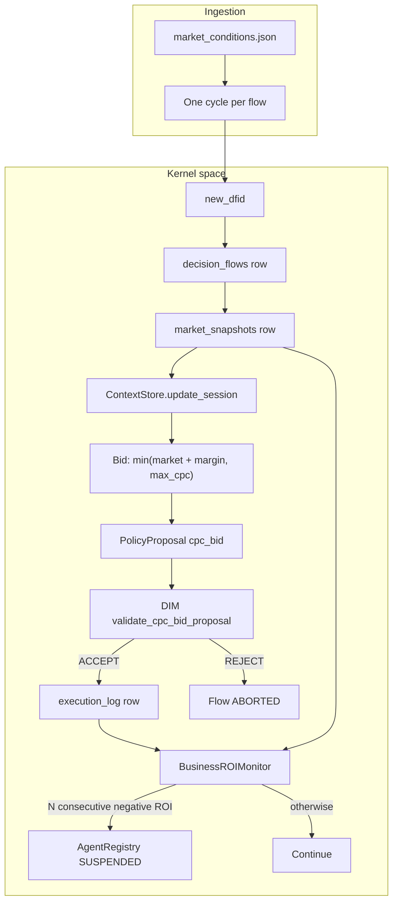
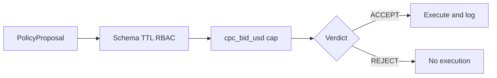

# Sample 38 — Environmental drift (ad bidding)

**Topology:** DIR kernel + DIM + post-hoc business monitor  
**Drift category:** Environmental / state drift (Category 3)  
**Domain:** Marketing / AdTech — search CPC bidding under a contract cap

This README is **test documentation** for the sample: what the scenario proves, how to run it, and **what the drift looks like** in the primary chart.

---

## Environmental drift — what the chart shows

**Figure 1** is generated by **`run.py`** and embedded in the HTML report under `results/`. Run the script once to produce it — no static asset is pre-generated here.

The chart has two stacked panels sharing a common horizontal axis (execution index):

- **Blue (Panel A):** executed **CPC bid** per acceptance, in time order. The series rises as the fixture pushes **`market_cpc_to_win`** up; every point stays **under** the grey dashed **DIM ceiling** (`max_cpc_usd`) — kernel compliance holds throughout.
- **Amber dashed:** **LTV** (`ltv_usd`). DIM does **not** use this line; it is a **business** threshold for the monitor only.
- **Grey band (Panel B):** **warm-up** — fewer than **`window_size`** executions, so no rolling average yet (same as "—" in the report table for Avg CPC / ROI).
- **Purple (Panel B):** rolling average of the last **`window_size`** bids. When it climbs **above** LTV, estimated **ROI** (**LTV − avg CPC**) is **negative** even though each bid still passed DIM.
- **Red line and dot:** the monitor has tripped; the run stops and the agent moves to **`SUSPENDED`** (`NEGATIVE_ROI_ENVIRONMENTAL_DRIFT`).

---

## What this sample shows

An agent (`BiddingAgent`) keeps ads in the **top three** by bidding **`min(market_cpc_to_win + bid_margin_above_market, max_cpc_usd)`** on each cycle (deterministic — no LLM). **DIM** checks schema, RBAC, TTL, stub context, and the **CPC cap**. **LTV** is applied only **after** execution by **`BusinessROIMonitor`**, which uses **`AuditStore.rolling_cpc_stats(window)`** (join **`execution_log`** ↔ **`market_snapshots`** on **`dfid`**) and counts **consecutive** evaluations with **negative ROI** before calling the registry.

---

## Architecture of the run (DFID-correlated)



**`market_cpc_to_win`** is written to **`market_snapshots`** at compile time (kernel fact on **`dfid`**), not inferred from agent output.

---

## Why kernel-compliant bids can still be "toxic"



DIM does **not** compare bids to **LTV** or compute **ROI**; the monitor does that after logging.

---

## How drift is detected (implementation)

1. **`execution_log`** stores each **`cpc_bid_usd`** after **ACCEPT**.
2. **`rolling_cpc_stats(window_size)`** averages **`cpc_bid_usd`** and **`market_cpc_to_win`** over the last **`window`** rows (by `id DESC`, join on **`dfid`**).
3. **`roi_estimate = ltv_usd - avg_cpc_bid_usd`**. Negative streak increments or resets to zero on non-negative ROI.
4. **`negative_roi_consecutive_cycles`** reached → **`SUSPENDED`**; remaining JSON cycles are **not** run.

**`MONITOR_TICK`** details include **`avg_cpc_bid_usd`**, **`avg_market_cpc_to_win_usd`**, **`bid_market_spread_usd`**, **`ltv_usd`**, **`roi_estimate`**, **`window_size`** (and **`consecutive_negative_roi_cycles`** on **ALERT**).

---

## HTML report

Each **`run.py`** writes **`results/simulation_report_<UTC>.html`** with **Figure 1** (interactive SVG), an experiment narrative, agent / suspension panels, monitor-event tail, and a full cycle trace table.

---

## Prerequisites

- Python **3.12+**
- From repository root: `pip install -e .` and `pip install pyyaml`

## How to run

```bash
python samples/38_drift_environmental_bidding/run.py
```

The script deletes **`data/bidding_audit.sqlite`**, runs the simulation, writes **`results/simulation_report_*.html`**, prints a short console summary, and opens the report in the default browser.

## Expected console output

- Early: DIM accepts; monitor may say **window not full** until **`window_size`** executions.
- After the window fills: **LTV** greater than rolling avg bid — monitor OK.
- When rolling avg bid exceeds **LTV**: **`ROI negative for k consecutive cycles (avg bid: ..., avg market floor: ..., LTV: ...)`**.
- Suspension alert, then **`BiddingAgent -> SUSPENDED (NEGATIVE_ROI_ENVIRONMENTAL_DRIFT)`**.

## Configuration

**`config.yaml`** (via **`models.py`**): **`paths`**, **`agent`**, **`contract.max_cpc_usd`**, **`simulation`** (fixture generation metadata: phase length, market band, noise, seed, and **`bid_margin_above_market`**), **`dim`**, **`monitor`** (**`window_size`**, **`ltv_usd`**, **`negative_roi_consecutive_cycles`**, **`suspension_reason`**), **`registry`**.

## Input data

**`data/market_conditions.json`** — array of cycles (**`cycle_id`**, **`search_term`**, **`market_cpc_to_win`**, **`impressions_available`**, **`channel`**, **`campaign_id`**). Early rows keep the market floor lower; later rows escalate toward the high end so rolling average CPC can cross **LTV** while every bid stays **<= max_cpc_usd**.
