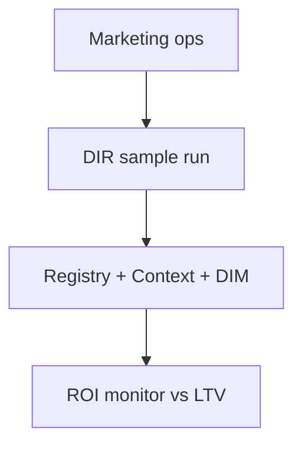
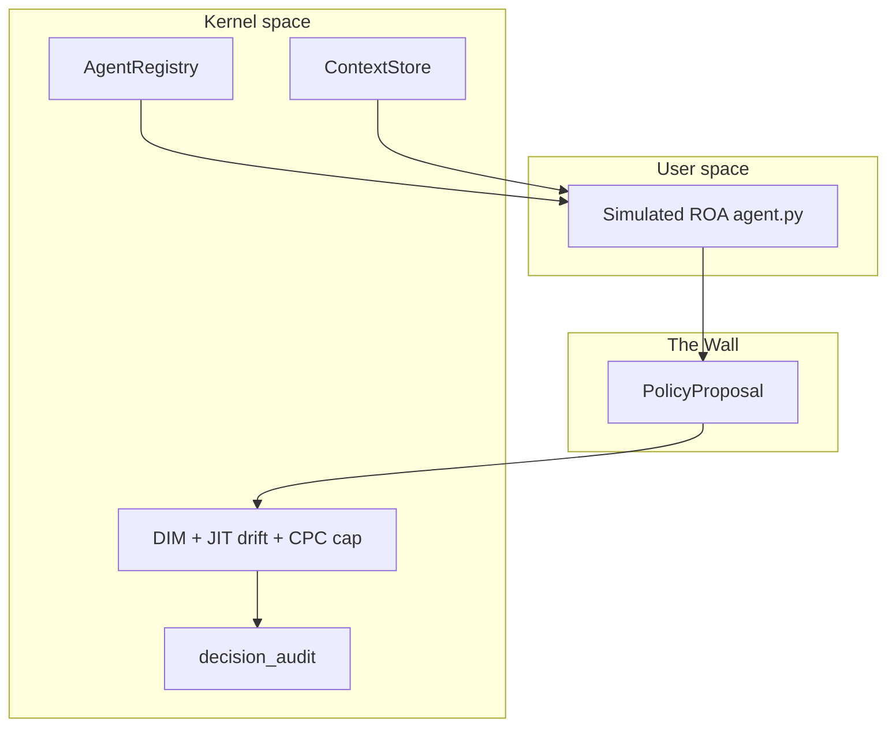
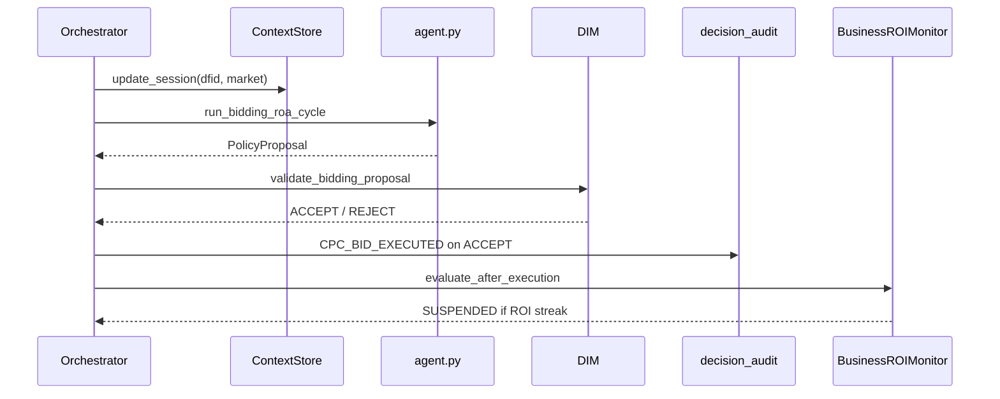

# Sample 38 — Environmental drift (ad bidding)

This reference sample demonstrates **Topology B (SDS)** — snapshot-bound decision flows with a deterministic **JIT market drift** check (`verify_drift`) layered on top of the generic DIM stack — plus **AgentRegistry**, **ContextStore**, **idempotency_key** on executed bids, and **append-only telemetry** on the canonical `StorageBundle` (`decision_audit_events`). The **BusinessROIMonitor** applies **LTV** only after kernel-approved execution; it does not run inside DIM.

---

## Use cases



---

## Architecture



---

## Execution flow



---

## How to run

From the repository root:

```bash
pip install -e .
pip install pyyaml
```

**Ollama** (optional — this sample does not call the LLM in the main path; mock is sufficient):

```bash
python samples/38_drift_environmental_bidding/run.py
```

**Gemini** (same — LLM is wired via `setup_environment` but unused for the bidding heuristic):

```bash
set GOOGLE_API_KEY=your_key
python samples/38_drift_environmental_bidding/run.py
```

**Mock** (no network, no API key):

```bash
set USE_MOCK_LLM=1
set OPEN_REPORT=0
python samples/38_drift_environmental_bidding/run.py
```

Set `OPEN_REPORT=0` to skip opening the HTML report in a browser.

---

## Configuration

Annotated excerpt — full file is `config.yaml`.

| Block | Role |
|-------|------|
| `database` | `provider: sqlite` and `db_path` relative to this file (anchored by `setup_environment`). |
| `llm_defaults` | `provider: mock` for deterministic runs without a live model. |
| `contracts` | YAML contract provider (same file). |
| `simulation.run_id` | Base label; at runtime each execution run appends `__` plus a new DFID so repeated runs on the same SQLite file do not mix executions for the ROI monitor. |
| `simulation.seeds` | All randomness for fixture generation must be seeded (metadata for `market_conditions.json`). |
| `dim` | RBAC list (`allowed_agents`) and stub `context_state` for the generic DIM context checks. |
| `monitor` | Rolling window, LTV, consecutive negative ROI threshold, suspension reason. |
| `registry.supported_versions` | SemVer constraint for handshake. |
| `agents[].contract` | Canonical Responsibility Contract: subject, mission, policy scope, execution conditions, escalation, and typed limits. `authority.limits.max_drawdown_limit.value` retains the sample's existing CPC-ceiling interpretation. |

---

## Database storage

All writes go through **`StorageBundle`** protocols — no ad-hoc SQL in the orchestration path.

| Domain meaning | Canonical storage |
|----------------|-------------------|
| Agent handshake | `agent_registry` via `AgentRegistry.handshake` |
| Working context per DFID | `context_session` via `ContextStore.update_session` |
| Bids, DIM, monitor, run lifecycle | `decision_audit_events` via `bundle.decision_audit.record` |

**SQLite** — filter a run by `simulation_id`:

```sql
SELECT dfid, event, detail_json
FROM decision_audit_events
WHERE json_extract(detail_json, '$.simulation_id') LIKE 'bidding_drift_38%'
ORDER BY id ASC;
```

**PostgreSQL**:

```sql
SELECT dfid, event, detail_json
FROM decision_audit_events
WHERE detail_json->>'simulation_id' LIKE 'bidding_drift_38%'
ORDER BY id ASC;
```

---

## Expected output

- DFID-tagged log lines from `log_with_dfid`, for example: `DIM: ACCEPT VALIDATION_PASSED`.
- When the rolling average CPC stays above LTV for **N** consecutive monitor evaluations, **`Agent status: ... SUSPENDED`** and stop reason **`roi_environmental_monitor`**.
- **`results/report_<UTC>_bidding_drift.html`** (UTC timestamp, slug `bidding_drift`).

---

## Regenerating reports

After a run, regenerate HTML from the same SQLite file without re-running the simulation:

```bash
python samples/38_drift_environmental_bidding/report_generator.py
```

Omit `--simulation-id` to pick the latest `SIMULATION_START` event in the database.

---

## Environmental drift — what the chart shows

**Figure 1** is generated by **`run.py`** and written under `results/`.

- **Blue (Panel A):** executed **CPC bid** per acceptance, in time order. Points stay under the canonical contract CPC ceiling (`authority.limits.max_drawdown_limit.value`).
- **Amber dashed:** **LTV** — business threshold for the monitor only.
- **Grey band (Panel B):** warm-up until **`window_size`** executions exist.
- **Purple (Panel B):** rolling average CPC over the last **`window_size`** bids.
- **Red line:** suspension point when the registry moves the agent to **SUSPENDED**.

---

## Why kernel-compliant bids can still be unprofitable

DIM enforces schema, RBAC, TTL, context stub, **JIT drift** between snapshot and live market facts, and the CPC ceiling. It does **not** compare bids to **LTV**; **BusinessROIMonitor** does that after execution using **`CPC_BID_EXECUTED`** rows joined by **`simulation_id`**.
