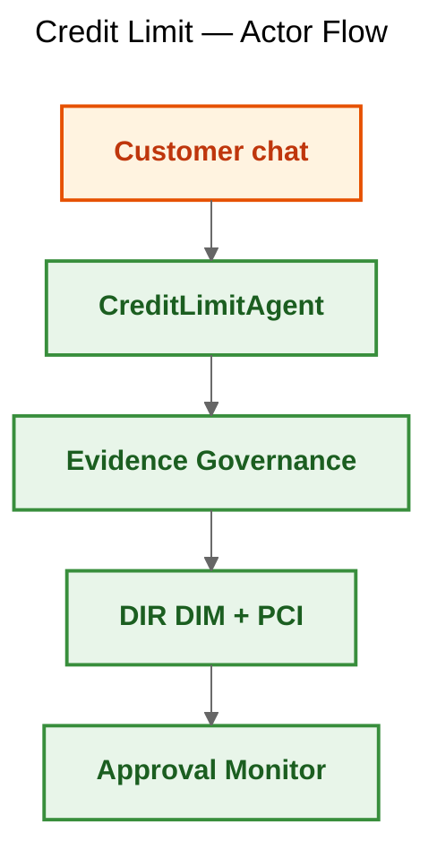
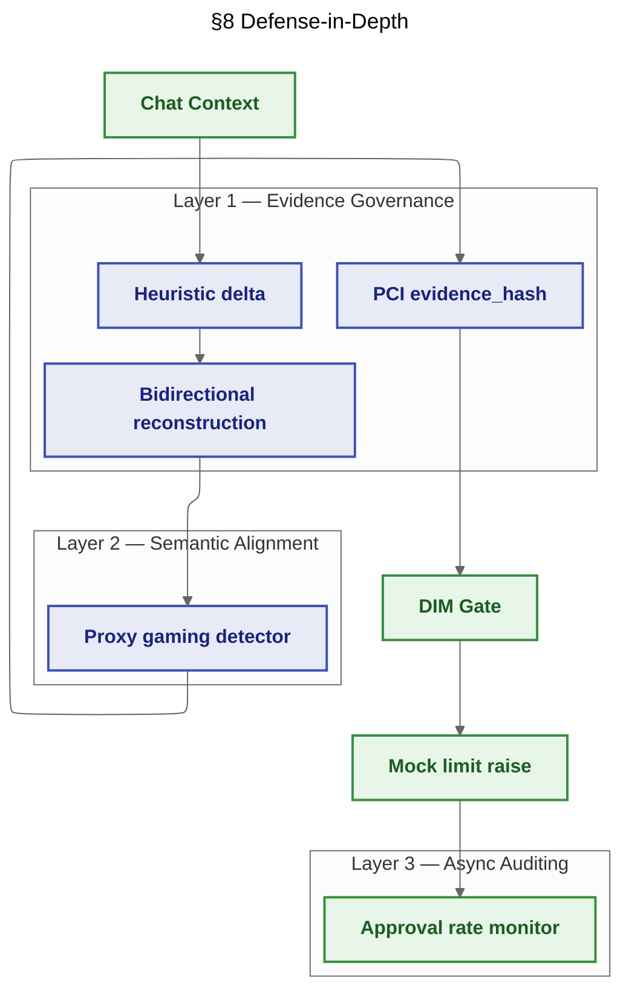
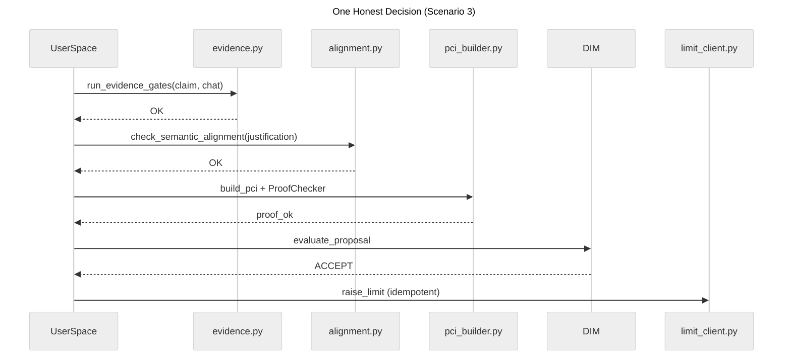

# 39 — Business Case: Fintech Credit Limit (Full §8 Semantic Defense)

**Goal:** Demonstrate the complete **defense-in-depth** posture from DIR Topologies §8.4 for automated credit-limit chat decisions. An agent may raise card limits up to 10 000 PLN when income supports the request — but a **Compliant Lie** (structurally valid, semantically wrong), **proxy gaming** (churn-driven justification), and **approval-rate drift** (social-engineering batch) are caught at three complementary layers.

**Topology:** C — DL+PCI (`ProofCarryingIntent`, `compute_evidence_hash`, `ProofChecker`, `DecisionLedger`).

**Mechanisms:** `DecisionRuntime`, Evidence Governance (Heuristic + Reconstructed + Cryptographic), Semantic Alignment Check (audit + strict), DIM hard gate, `ApprovalMonitor`, canonical `StorageBundle` telemetry.

---

## Use cases



---

## Architecture



---

## Execution flow



---

## How to run

From the repository root:

```bash
pip install -e .

# Mock (default — no API key)
USE_MOCK_LLM=1 python samples/39_fintech_evidence_governance/run.py

# Ollama
python samples/39_fintech_evidence_governance/run.py

# Gemini
GOOGLE_API_KEY=... python samples/39_fintech_evidence_governance/run.py
```

---

## Configuration

Key blocks in `config.yaml`:

| Block | Purpose |
|-------|---------|
| `credit_limit_gate.max_limit_pln` | DIM hard ceiling (Compliant Lie stays under this) |
| `credit_limit_gate.min_income_to_limit_ratio` | High-risk threshold for approval monitor |
| `evidence_governance` | Income extraction patterns for Tier 1 |
| `semantic_alignment` | Proxy-gaming phrases; `strict_blocking` default |
| `approval_monitor` | Rolling window size and drift threshold |
| `drift_batch` | Phase 1 (low risk) vs phase 2 (high risk) iterations |

---

## Database storage

Domain events map to `decision_audit_events` (no custom tables).

| Event | Meaning |
|-------|---------|
| `EVIDENCE_ABORT` | Tier 1/2 blocked Compliant Lie |
| `SEMANTIC_ALIGNMENT_FLAG` | Audit-mode NEEDS_REVIEW |
| `SEMANTIC_ALIGNMENT_ABORT` | Strict-mode block |
| `PCI_VERIFICATION` | ProofChecker result |
| `CREDIT_DECISION` | DIM verdict |
| `CREDIT_LIMIT_RAISED` | Mock execution (`high_risk` flag) |
| `MONITOR_TICK` | Rolling approval-rate sample |
| `AGENT_SUSPENDED` | Drift threshold breached |

```sql
-- SQLite
SELECT event, json_extract(detail_json, '$.high_risk') AS high_risk
FROM decision_audit_events
WHERE json_extract(detail_json, '$.simulation_id') = 'run_39_evidence_governance_01'
  AND event = 'CREDIT_LIMIT_RAISED';

-- PostgreSQL
SELECT event, detail_json->>'high_risk' AS high_risk
FROM decision_audit_events
WHERE detail_json->>'simulation_id' = 'run_39_evidence_governance_01'
  AND event = 'AGENT_SUSPENDED';
```

---

## Expected output

```
INFO === Phase A: YAML defense scenarios ===
[SUMMARY] scenario=0_baseline_no_evidence status=ACCEPT executed=True ...
[SUMMARY] scenario=1_heuristic_compliant_lie status=EVIDENCE_ABORT executed=False reason=HEURISTIC_DELTA: ...
[SUMMARY] scenario=2_reconstruction_compliant_lie status=EVIDENCE_ABORT executed=False ...
[SUMMARY] scenario=3_honest_pci status=ACCEPT executed=True proof_ok=True ...
[SUMMARY] scenario=4_tampered_pci status=PCI_REJECT executed=False proof_ok=False ...
[SUMMARY] scenario=5_proxy_gaming_audit status=ACCEPT executed=True alignment_flag=NEEDS_REVIEW ...
[SUMMARY] scenario=6_proxy_gaming_strict status=ALIGNMENT_ABORT executed=False ...

INFO === Phase B: Drift batch (async semantic auditing) ===
[SUMMARY] drift_batch=SUSPENDED at iteration=15 high_risk_rate=0.5
```

---

## Regenerating reports

HTML reports are written to `results/evidence_governance_<timestamp>.html` and are rebuilt from `bundle.decision_audit.all_events_chronological()` for the latest `simulation.run_id`.

Each report opens with a collapsible **“How to read this report”** legend that explains Layer vs. Tier vs. Phase A/B vs. drift-batch phases, with links to [DIR Topologies §8](../../docs/03-topologies/DIR_Topologies.md) and this sample’s README.
