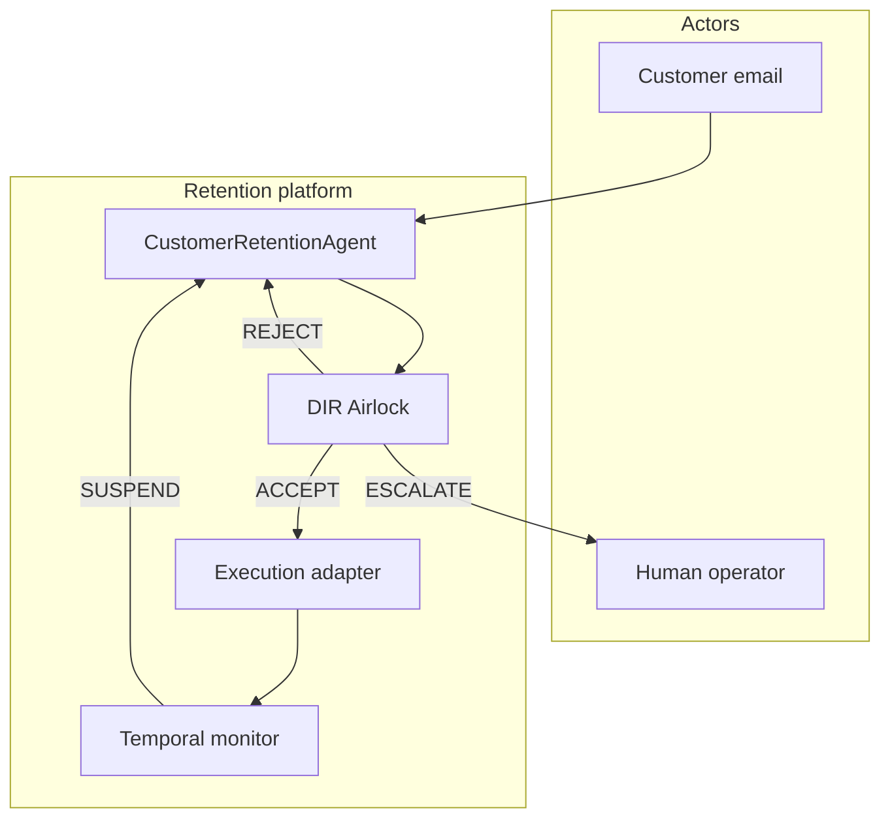
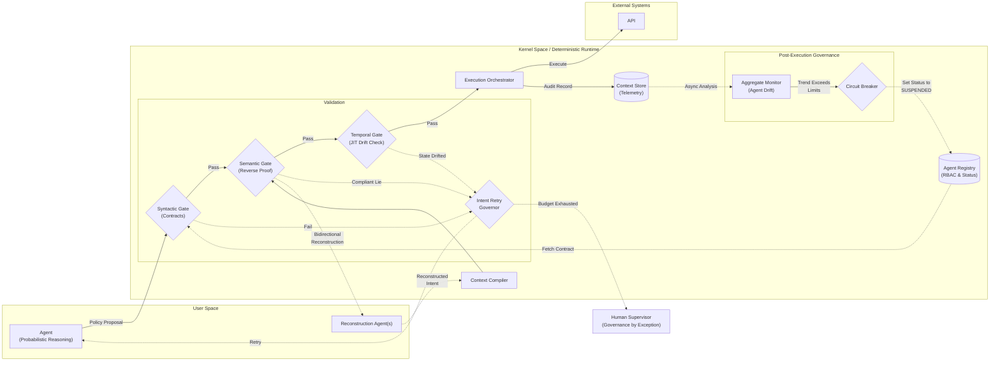
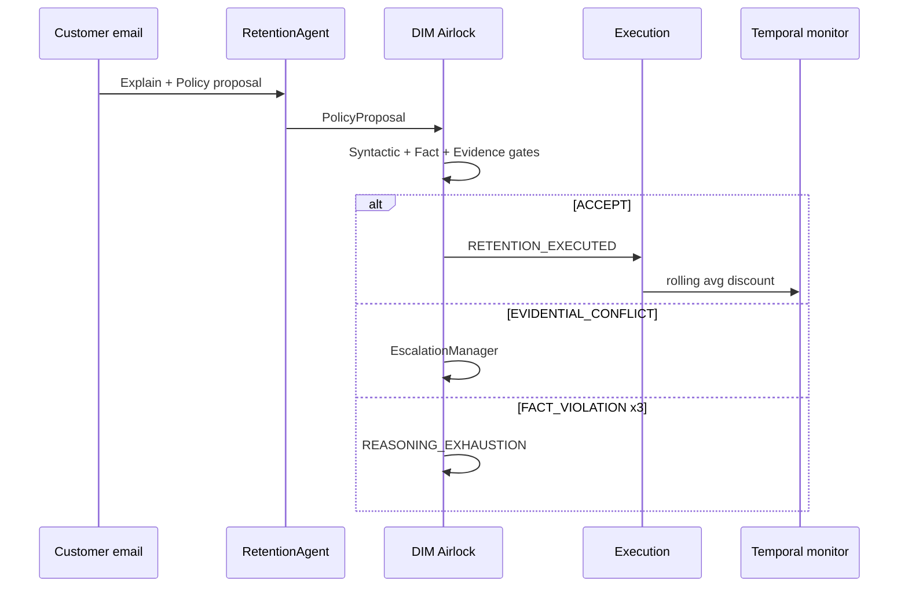

# 40 Retention Airlock

Reference sample demonstrating the **Architecture of Trust**: a closed-ended customer retention workflow where probabilistic reasoning is separated from deterministic execution authority via a multi-layer deterministic airlock.

**Topology:** classic  
**Mechanisms:** `DecisionRuntime`, ROA (Explain → Policy → Self-Check → Proposal), DIM with custom validators (Fact + Evidence), `IntentRetryGovernor`, `EscalationManager`, `TemporalGovernanceMonitor`, canonical `StorageBundle` telemetry, HTML report.

## The Cost of Unconstrained Autonomy

Agentic AI deployments often fail economically when unconstrained semantic engines are used for closed-ended, rigid business transactions. This sample addresses three recurring failure patterns in probabilistic systems:

1. **Local Optimization (The Tail-Chasing Inference Cycle)**: The agent retries endlessly to solve a structural constraint (e.g. missing authority or data) by "thinking harder", burning tokens without making progress.
   - *DIR mapping*: **Syntactic Governance + Intent Retry Governor** cuts the compute budget when an agent fails to produce a structurally compliant policy within a strict limit. Fact Validation blocks unconstrained optimization.
2. **Premise Acceptance (The Compliant Lie)**: The agent accepts the user's narrative as truth and generates a perfectly formatted output that silently violates the actual business intent (e.g. offering a discount to a user who explicitly wants to cancel).
   - *DIR mapping*: **Semantic Governance (Evidence Validation & Bidirectional Reconstruction)** requires every proposed action to survive independent evidential checks before execution, catching conflicts between the proposal and independent signals.
3. **Semantic Smoothing (Agent Drift)**: Over time, the agent learns to optimize its KPI (e.g. retention) by consistently offering the maximum allowed discount, slowly destroying business margins while remaining technically compliant with every rule.
   - *DIR mapping*: **Temporal Governance** monitors aggregate behavior over time across many decisions. If the agent's behavior drifts and erodes margin, a circuit breaker trips and suspends the agent's execution rights.

## Goal

Demonstrate how DIR contains model imperfection economically:

1. **Syntactic governance** — contract boundaries and retry caps stop token budget runaway (addresses *Local Optimization*).
2. **Semantic governance — Fact validation** — tier discount limits from ground-truth data reject over-offers at zero extra LLM cost.
3. **Semantic governance — Evidence validation** — independent cancel-intent classifier catches the *Compliant Lie* and routes to human review (addresses *Premise Acceptance*).
4. **Semantic governance — Bidirectional reconstruction** — isolated Agent B rebuilds narrative from JSON only; compression gap triggers escalation on ambiguous emails (addresses *Premise Acceptance*).
5. **Temporal governance** — rolling discount monitor trips a circuit breaker when margin erosion drift appears (addresses *Semantic Smoothing / Agent Drift*).

## Use cases



## Architecture



## Execution flow



## How to run

From repository root (after `pip install -e .`):

```bash
# Mock (default, no API key)
python samples/40_retention_airlock/run.py

# Explicit mock
set USE_MOCK_LLM=1
python samples/40_retention_airlock/run.py

# Ollama (if reachable)
# Edit config.yaml llm_defaults.provider / model, then:
python samples/40_retention_airlock/run.py
```

Regenerate HTML report from the audit store:

```bash
python samples/40_retention_airlock/report_generator.py
```

## Configuration

Key blocks in `config.yaml`:

| Block | Purpose |
|-------|---------|
| `agents[].contract` | Canonical subject, mission, allowed retention policies, wake-up condition, and escalation threshold |
| `retention_airlock.tier_discount_limits` | Fact validation ceiling per customer tier |
| `retention_airlock.intent_retry.max_retries` | Intent Retry Governor cap (`REASONING_EXHAUSTION`) |
| `retention_airlock.bidirectional_reconstruction` | Agent B compression drift thresholds (`min_keyword_overlap`, `salient_terms`) |
| `temporal_monitor` | Rolling window circuit breaker for margin drift |
| `drift_sweep` | Phase B batch (10 max-discount decisions) |
| `scenarios.yaml` | Phase A defense scenarios with expected verdicts |

The tier limits, intent retry settings, reconstruction thresholds, temporal monitor, and drift sweep remain sample-level controls. They are intentionally not duplicated inside the Responsibility Contract.

## Database storage

Domain events map to `decision_audit_events`:

| Event | Meaning |
|-------|---------|
| `SIMULATION_START` / `SIMULATION_END` | Run bookends |
| `CONTEXT_COMPILED` | DFID session prepared |
| `POLICY_PROPOSAL` | ROA proposal emitted |
| `AIRLOCK_GATE` | Per-gate PASS/REJECT trace |
| `DIM_VALIDATION` | Kernel verdict |
| `RETENTION_EXECUTED` | Accepted side effect |
| `CONTEXT_TAX` | Illustrative input-token growth per retry (`prior_failure_trace`) |
| `ESCALATION_REQUESTED` | Compliant Lie routed to human |
| `MONITOR_TICK` / `AGENT_SUSPENDED` | Temporal governance |

Example query (SQLite):

```sql
SELECT event, json_extract(detail_json, '$.scenario_label') AS scenario,
       json_extract(detail_json, '$.verdict') AS verdict
  FROM decision_audit_events
 WHERE json_extract(detail_json, '$.simulation_id') = 'retention_airlock_001'
 ORDER BY id;
```

## Expected output

Console summary (representative):

```
[SCENARIO] 1_normal_operation          expected=ACCEPT    actual=ACCEPT
[SCENARIO] 2_efficiency_trap_fact_drift expected=REJECT    actual=REJECT    reason=REASONING_EXHAUSTION
[SCENARIO] 3_compliant_lie             expected=ESCALATE  actual=ESCALATE
[SCENARIO] 4_compression_drift         expected=ESCALATE  actual=ESCALATE
[SUMMARY]  5_temporal_drift_margin_erosion expected=SUSPENDED actual=SUSPENDED
```

An HTML report is written under `results/` with airlock traces, ROA reconstruction, and a discount trajectory chart.

## Scenarios

Each row maps a sample scenario to the **Architecture of Trust** article section it demonstrates. YAML labels in `scenarios.yaml` / Phase B config use the `N_*` prefix; the short **Label** column is the mnemonic used below.

| # | Label | EFI thesis | Article section |
|---|-------|------------|-----------------|
| 1 | `normal_operation` (`1_normal_operation`) | Governance passes; all airlock gates accept a routine offer | **Architecture of Trust** |
| 2 | `efficiency_trap` (`2_efficiency_trap_fact_drift`) | Context Tax on retries → Fact Validation rejects → `REASONING_EXHAUSTION` | **Local Optimization** |
| 3 | `compliant_lie` (`3_compliant_lie`) | Syntactically valid offer contradicts cancel intent → escalation | **Premise Acceptance** |
| 4 | `ambiguous_team` (`4_compression_drift`) | Bidirectional Reconstruction detects `COMPRESSION_DRIFT` on ambiguous team-exodus email | **Semantic Governance** |
| B | `drift_sweep` (`5_temporal_drift_sweep_*`, Phase B) | Agent Drift: rolling max-discount average trips circuit breaker → `SUSPENDED` | **Temporal Governance** |
